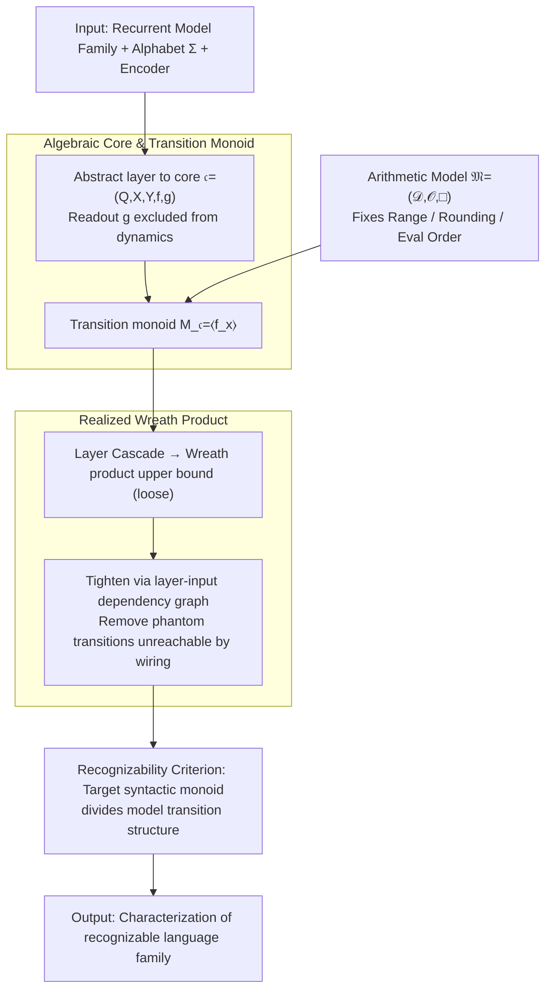

# An Algebraic View of the Expressivity of Recurrent Language Models

**Conference**: ICML2026  
**arXiv**: [2606.01765](https://arxiv.org/abs/2606.01765)  
**Code**: None  
**Area**: LLM/NLP  
**Keywords**: Recurrent Language Models, Formal Languages, Transition Monoids, Finite Precision, State Space Models  

## TL;DR
This paper unifies the formal language expressivity of RNNs/SSMs as an algebraic problem: once numerical semantics are fixed, the languages a model can recognize are determined by its hierarchical transition monoids and their wreath products. Furthermore, the same architecture yields entirely different counting capabilities under floating-point versus unsigned integer semantics.

## Background & Motivation
**Background**: In recent years, analyzing the expressivity of language models has often involved treating architectures like RNNs, SSMs, and Transformers as formal language recognizers. The goal is to determine whether they can perform classical computational tasks such as Dyck language recognition, modulo counting, or finite-state automata simulation. Theoretical results in this direction often translate into architectural insights, such as whether linear RNNs or Mamba-like state-space models can preserve counting information over long sequences.

**Limitations of Prior Work**: Conclusions in existing literature are inconsistent. Some works prove that RNNs possess strong computational power—even reaching Turing completeness—under exact real-number or rational arithmetic. Others show that under finite-precision or resource-constrained assumptions, they can only simulate finite-state automata. The issue is not that one side is "wrong," but that they assume different arithmetic models, rounding rules, overflow semantics, and evaluation orders.

**Key Challenge**: Neural network formulas appear to be continuous real-number operations, but real-world deployment occurs on discrete, finite numerical systems with rounding. If a theoretical proof relies on associativity in the real field, infinite precision, or reorderable algebraic identities, it may not transfer to floating-point implementations. Conversely, merely stating "finite precision" without specifying numerical semantics prevents reproducible conclusions regarding expressivity.

**Goal**: The authors aim to provide a unified framework that decomposes the expressivity of recurrent language models into three swappable components: the state transition structure of the architecture, the combination of inter-layer wiring, and the underlying arithmetic semantics. This allows researchers to precisely pinpoint whether conflicts in conclusions arise from the architecture itself or from numerical semantics.

**Key Insight**: Starting from monoid theory in automata, the paper treats each recurrent core as a finite transition system and the hierarchical composition of deep RNNs as a wreath product of transformation monoids. Recognizing a formal language is no longer about directly constructing network parameters, but rather determining whether the syntactic monoid of the target language divides the monoid structure realizable by the model.

**Core Idea**: Replace vague real-valued network formulas with "transition monoids under fixed arithmetic semantics," thereby reducing RNN/SSM expressivity to a divisibility problem in finite algebra.

## Method

### Overall Architecture
Instead of proposing a new training algorithm, this paper establishes an algebraic lens for recurrent language models: a single recurrent layer is abstracted as an algebraic core, multi-layer networks as a cascade of cores, and all possible hierarchical transitions are derived using wreath products. The "realized input set" is used to tighten the analysis to transitions reachable by actual wiring. Finally, "recognizing a formal language" is reduced to a checkable algebraic criterion: whether the target language's syntactic monoid divides the model's transition structure. The input consists of a class of recurrent models, a finite alphabet, a fixed encoder, and numerical semantics; the output is a structured characterization of the recognizable language family. The reduction pipeline is shown below: arithmetic semantics fix single-step operations, determining the transition monoid induced by each core, followed by hierarchical composition via wreath products and tightening.

### Key Designs

**1. Algebraic Core and Transition Monoid: Abstracting RNN Layers as Pure State Transformers**

Conflicting conclusions in literature often arise from conflating the expressivity of the decoder with recurrent dynamics. Thus, the paper abstracts each recurrent layer into a core $\mathfrak{c}=(Q,X,Y,f,g)$—consisting of state set $Q$, input set $X$, output set $Y$, transition $f:Q\times X\to Q$, and readout $g:Q\times X\to Y$—preserving only the core structure of input-driven state changes. A key step is that each input $x\in X$ induces a self-map $f_x:Q\to Q$, and the set of all such maps generates the transition monoid $M_{\mathfrak{c}}=\langle f_x\mid x\in X\rangle$ under function composition. The readout $g$ is intentionally excluded from this monoid as it determines how states are observed, not how they evolve. This decouples "what dynamic information is stored" from "how the answer is read," preventing decoder computational power from being misattributed to the recurrence.

**2. Realized Wreath Product: Counting Only Transitions Reachable by Wiring**

Deep RNNs are not simple direct products of parallel layers but cascade systems where the state of a lower layer modifies the input of the upper layer at the current time step. Thus, the ambient upper bound is the iterated wreath product of each layer's transition monoid. However, this bound is too loose as it allows the upper layer to receive any input in $X_n$, including those the encoder and wiring never produce. The paper defines a layer-input dependency map $\varphi_n^T$ to collect only reachable inputs transmitted to the $n$-th layer starting from the first layer's input set $T$. These generate a tightened $M_n^T$, resulting in the realized wreath product $\mathbb{W}_{\mathcal{R}}^T=(M_1^T,Q_1)\wr\cdots\wr(M_N^T,Q_N)$. This tightening eliminates "phantom" expressivity—capabilities permitted by the architecture's form but never triggered by wiring—supporting precise unrecognizability proofs and allowing local updates to the analysis when encoders or input distributions change.

**3. Embedding Arithmetic Semantics into Model Definitions: Explaining Conflicting Conclusions**

The same RNN/SSM may be Turing-complete in one paper and equivalent only to a finite automaton in another because of different default arithmetic models. The paper explicitly defines the arithmetic model as $\mathfrak{M}=(\mathcal{D},\mathcal{O},\square)$: $\mathcal{D}$ is the representable range, $\mathcal{O}$ the set of operations, and $\square$ the rounding/truncation map. Furthermore, it enforces a fixed evaluation tree for every expression, requiring recurrent updates to satisfy recurrence-consistent evaluation. Such granularity is necessary because floating-point addition and multiplication are non-associative; compiler or hardware reordering changes the single-step recurrence itself. Without fixing these semantics, the question "can it recognize language L" is not well-defined.

### Loss & Training
This work investigates expressivity rather than learnability and does not involve training losses or optimization strategies. Given an architecture family and numerical semantics, it asks whether there **exists** a parameterized instance capable of recognizing a target formal language. The authors state that the framework does not guarantee these parameters can be found via gradient descent.

## Key Experimental Results

### Main Results
The "main experiments" are theoretical results and case studies rather than dataset benchmarks. The core result compares expressivity differences across different arithmetic models within a unified algebraic table.

| Object | Criterion / Result | Conclusion | Impact |
|------|-------------|------|------|
| Single-layer algebraic core | $M_{\mathfrak{c}}=\langle f_x\rangle$ | Intra-layer dynamics determined by transition monoid | Maps architecture power to monoid problems |
| Deep algebraic RNN | $M_{\mathcal{R}}^T\leq W_{\mathcal{R}}^T$ | Global transition embeds in realized wreath product | Allows hierarchical analysis via wreath products |
| Language acceptor | $M(\mathcal{L})\prec M_{\mathcal{R}^+}^{e(\Sigma)}\leq W_{\mathcal{R}^+}^{e(\Sigma)}$ | Target syntactic monoid must divide model structure | Unified entry for unrecognizability and construction |
| Non-negative diagonal SSM + Float | core monoid is aperiodic | Cannot implement modulo counting requiring non-trivial groups | Corrects overstatements about SSM counting |
| Diagonal SSM + Unsigned Int Quantization | Can contain $\mathbb{Z}/2^k\mathbb{Z}$ | Supports structures like even-modulo counting | Numerical semantics change expressivity |

### Ablation Study
The following table serves as an ablation of arithmetic semantics: keeping the diagonal SSM form identical while varying the recurrence multiplier and numerical model to observe group structures in the core monoid.

| Configuration | Key Metric | Description |
|------|---------|------|
| Non-negative recurrence + Float | Only trivial subgroups; monoid is aperiodic | Non-negative float affine updates are order-preserving on finite chains; no non-trivial cycles |
| Signed multiplier + Float | $\mathbb{Z}/2\mathbb{Z}$ can appear; subgroups are at most elementary abelian 2-groups | Negative multipliers introduce order-reversing maps, allowing at most 2nd-order flip structures |
| Non-negative recurrence + Unsigned Int $\mathrm{int}^p$ | Can implement $\mathbb{Z}/2^k\mathbb{Z}$, $k\leq p$ | Wraparound addition $q\mapsto q+1\bmod 2^p$ directly provides cyclic counters |
| Unfixed evaluation order | Expressivity statements are no longer well-defined | Reordered non-associative float ops may result in the recurrence becoming a different function |

### Key Findings
- The primary contribution is isolating "architecture," "wiring," and "arithmetic semantics," allowing previously conflicting conclusions to be compared in a unified coordinate system.
- For finite-precision models, all induced transition monoids are finite; thus, recognizable languages are at most regular. To discuss non-regular capabilities, one must explicitly introduce precision, depth, or external resources that grow with sequence length.
- The diagonal SSM case study is highly insightful: the same formal recurrence cannot perform even-modulo counting under non-negative floating-point semantics but can construct counters under unsigned integer wraparound semantics.

## Highlights & Insights
- The paper argues convincingly that "numerical semantics are part of the model." While many expressivity proofs assume real-number identities, the rounding, overflow, and non-associativity of real-world floating-point systems change the transition functions, which is critical in long-sequence recurrence.
- The realized wreath product is a clean abstraction. It preserves the hierarchical "lower-layer-controls-upper-layer" structure of deep RNNs while avoiding the inclusion of phantom monoids from unreachable inputs, aiding precise unrecognizability proofs.
- Designing the acceptor to treat the decoder as a layer in the cascade rather than an external post-processor allows language recognition to link strictly to syntactic monoids.
- Architectural implication: If a task relies on stable counting or group structures, a continuous formula that "looks like recurrence" is insufficient; one must verify if the deployment numerical types actually support the corresponding algebraic cycles.

## Limitations & Future Work
- The analysis focuses on existential expressivity, not learnability. Algebraic expressivity does not imply that SGD will find the corresponding parameters.
- The framework primarily covers finite-precision semantics and thus falls within the realm of regular languages; extensions to infinite monoids or resource-sensitive versions are needed for models with dynamic depth or memory.
- The paper focuses on explicit recurrent architectures (RNNs, diagonal SSMs). Incorporating Transformers requires formalizing them as recurrent computations, which is not straightforward for all-attention models.
- Case studies focus on re-analyzing known controversies in diagonal SSMs. Future work could apply this template to modern sequence models like RWKV, RetNet, or chunked SSM implementations.

## Related Work & Insights
- **vs. Siegelmann & Sontag (Turing Completeness)**: Those results rely on exact reals or infinite precision. This paper emphasizes that such assumptions do not automatically transfer to finite-precision deployment, yielding more conservative but reproducible conclusions.
- **vs. Merrill et al. (Finite-Precision Analysis)**: While related work notes that finite precision limits expressivity, this paper requires explicitizing the arithmetic model, evaluation order, and transition monoid to turn limits into checkable algebraic divisibility conditions.
- **vs. Sarrof et al. (SSM Counting)**: The paper reproduces and refines limits of non-negative diagonal SSMs while showing that the same family can perform counting under different semantics, proving the controversy lies in numerical semantics rather than the "SSM" architecture itself.
- **Insight**: Theoretical research on language models should report implementation semantics—numerical domain, rounding, overflow, NaN handling, evaluation order—as they are as important as the architecture itself. Without them, expressivity conclusions may only hold for "pen-and-paper" formulas.

## Rating
- Novelty: ⭐⭐⭐⭐⭐ Unified RNN expressivity controversies via monoid divisibility and wreath products.
- Experimental Thoroughness: ⭐⭐⭐⭐☆ Case studies support claims effectively, though more modern architectures could be instantiated.
- Writing Quality: ⭐⭐⭐⭐☆ Rigorous and complete; requires a background in formal languages/algebra.
- Value: ⭐⭐⭐⭐⭐ Long-term reference value for RNN/SSM expressivity, finite-precision theory, and reproducible architectural analysis.

<!-- RELATED:START -->

## Related Papers

- [\[ACL 2026\] Why Steering Works: Toward a Unified View of Language Model Parameter Dynamics](../../ACL2026/model_compression/why_steering_works_toward_a_unified_view_of_language_model_parameter_dynamics.md)
- [\[CVPR 2026\] Cross-View Distillation and Adaptive Masking for Incomplete Multi-View Multi-Label Classification](../../CVPR2026/model_compression/cross-view_distillation_and_adaptive_masking_for_incomplete_multi-view_multi-lab.md)
- [\[ICML 2026\] Procedural Pretraining: Warming Up Language Models with Abstract Data](procedural_pretraining_warming_up_language_models_with_abstract_data.md)
- [\[CVPR 2026\] Neural Differentiation in Deep Networks: A Theoretical Framework for Expressivity and Representational Diversity](../../CVPR2026/model_compression/neural_differentiation_in_deep_networks_a_theoretical_framework_for_expressivity.md)
- [\[ICML 2026\] WinQ: Accelerating Quantization-Aware Training of Language Models Around Saddle Points](winq_accelerating_quantization-aware_training_of_language_models_around_saddle_p.md)

<!-- RELATED:END -->
