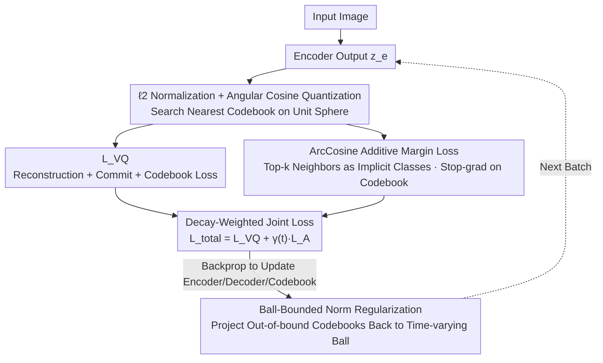

# ArcVQ-VAE: A Spherical Vector Quantization Framework with ArcCosine Additive Margin

**Conference**: ICML 2026  
**arXiv**: [2605.13517](https://arxiv.org/abs/2605.13517)  
**Code**: https://github.com/goals4292/ArcVQ-VAE  
**Area**: VQ-VAE / Image Generation / Discrete Representation  
**Keywords**: Codebook collapse, angular margin, spherical learning, norm regularization, codebook utilization

## TL;DR
The authors diagnose the root cause of VQ-VAE codebook collapse as a combination of "codebook vector $\ell_2$ norm imbalance and geometric clustering." They propose SAMP: Ball-Bounded Norm Regularization to constrain all codebook vectors within a time-varying Euclidean ball, and ArcCosine Additive Margin Loss, which leverages the ArcFace principle to push latent vectors apart on a sphere. This ensures uniform codebook distribution and significantly boosts utilization, outperforming mainstream VQ-VAE variants in ImageNet reconstruction and generation FID.

## Background & Motivation
**Background**: VQ-VAE discretizes continuous latents into a finite codebook and serves as a fundamental component for autoregressive image generation (VQGAN / RQ-VAE), diffusion priors (LDM), and multimodal tokenization. Various methods aim to improve VQ-VAE: SQ-VAE (stochastic quantization), CVQ-VAE (online K-means to pull unused codebooks), VQGAN-LC (pretrained encoders), and Wasserstein VQ.

**Limitations of Prior Work**: (1) Fixed-size codebooks cannot fully capture the richness of datasets. (2) Codebook collapse occurs, where only a small fraction of codebooks are frequently used while others remain idle, often resulting in utilization below 50%. (3) Existing methods primarily offer mechanical fixes for "how to update/select" codebooks without addressing the fundamental **geometric imbalance** of codebook vectors in the latent space.

**Key Challenge**: Through empirical observations (Figures 2/3), the authors find that at the start of training, all codebooks are initialized near the origin. Selected codebooks grow rapidly in $\ell_2$ norm along the direction of encoder outputs, whereas unselected ones remain near the origin. High-norm codebooks are closer to encoder features and thus more likely to be selected, creating a positive feedback loop—this is a **geometric dynamics** issue rather than a simple sampling problem.

**Goal**: (1) Suppress codebook norm imbalance at its root; (2) Ensure latent vectors are uniformly dispersed in the latent space to allow every latent an opportunity to bind to different codebooks; (3) Achieve this without introducing new network components or significant computational overhead.

**Key Insight**: The authors borrow the concept of "angular margin + spherical learning" from ArcFace in face recognition. If all latents and codebooks are $\ell_2$ normalized to a unit sphere, codebook selection shifts from Euclidean nearest neighbor search to maximum angular cosine matching. By adding an angular margin to push intra-class distances apart, latent vectors are forced to disperse uniformly. While face recognition is supervised, the authors treat the "top-k nearest codebooks" as implicit classes for unsupervised VQ-VAE.

**Core Idea**: Use Spherical Angular-Margin Prior (SAMP), which combines Ball-Bounded Norm Regularization (constraining codebooks within a time-varying Euclidean ball) and ArcCosine Additive Margin Loss (pushing latents apart via angular margins on the sphere). This leads to geometrically uniform codebook distribution and a drastic increase in utilization.

## Method

### Overall Architecture
ArcVQ-VAE maintains the standard VQGAN encoder-decoder + codebook architecture but reframes the codebook layout as a spherical learning problem. Each batch follows the standard VQ-VAE forward pass to calculate the reconstruction + commit + codebook loss $\mathcal{L}_\text{VQ}$, while adding an ArcLoss $\mathcal{L}_\text{A}$ to disperse latents. The total loss is $\mathcal{L}_\text{total} = \mathcal{L}_\text{VQ} + \gamma(t)\mathcal{L}_\text{A}$. After backpropagation, a ball projection is applied to each codebook vector to constrain its norm. During quantization, both encoder outputs and codebooks are $\ell_2$ normalized to perform nearest neighbor search via angular cosine on the unit sphere. The trained $32^2$ tokens are subsequently used with an LDM as a prior for generation. This approach only adds a norm clip and one loss term, requiring no new network modules. The data flow for a single training step is as follows:

### Key Designs

**1. Ball-Bounded Norm Regularization: Breaking Positive Feedback via Time-varying Constraints**

Empirical evidence shows that VQ-VAE collapse is a geometric dynamic: selected codebooks grow in $\ell_2$ norm, making them closer to the latent center, which further increases their selection frequency. This design addresses the norm component directly. All codebooks are initialized on the unit sphere $\mathbf{e}_k^{(0)} \sim \ell_2(\text{Unif}(-1,1)^d)$. A time-varying norm upper bound $M(t) = \exp(\alpha t)$ is set, with a small $\alpha$ (e.g., $10^{-5}$) to keep $M$ near 1 early in training. After each batch, codebooks exceeding the norm are projected back: $\mathbf{e}_k^{(t)} \leftarrow \frac{\mathbf{e}_k^{(t)}}{\|\mathbf{e}_k^{(t)}\|_2} M(t)$. This splits training into two phases: an early strict phase where all codebooks compete fairly on the unit sphere, and a later relaxed phase where the ball expands to allow richer norm-based expression.

**2. ArcCosine Additive Margin Loss: Pushing Latents via Angular Margins**

Dispersing norms is insufficient; standard VQ loss only forces encoder features toward the nearest codebook without ensuring latent dispersion. This design explicitly encourages latent spacing. After $\ell_2$ normalizing encoder outputs ($\hat{z}_i$) and codebooks ($\hat{e}_j$), the quantization rule becomes maximum angular cosine $k = \arg\max_j \hat{z}_i^\top \hat{e}_j$, with angles calculated as $\theta_{i,j} = \arccos(\hat{z}_i^\top \hat{e}_j)$. The ArcLoss adopts the additive margin softmax form from ArcFace:

$$\mathcal{L}_\text{A} = -\frac{1}{K}\sum_j \log \frac{\sum_{i \in \mathcal{N}_j^{(k)}} e^{s\cos(\theta_{i,j}+m)}}{\sum_{i \in \mathcal{N}_j^{(k)}} e^{s\cos(\theta_{i,j}+m)} + \sum_{i \notin \mathcal{N}_j^{(k)}} e^{s\cos\theta_{i,j}}}$$

where $\mathcal{N}_j^{(k)}$ is the set of top-k latent tokens nearest to codebook $e_j$ (acting as implicit classes, with $k=3, s=10, m=0.1$). This loss enhances alignment for positive pairs and separation for negative pairs. A key trick is applying a stop-gradient $\text{sg}(\hat{e}_j)$ so that ArcLoss only updates the encoder, preventing codebooks from losing global discriminability by chasing local batch distributions.

**3. Decay-Weighted Joint Loss: Balancing Structure and Fidelity**

The demands for angular structure and reconstruction fidelity shift during training. These are coupled via a time-varying weight: $\mathcal{L}_\text{total} = \mathcal{L}_\text{VQ} + \gamma(t)\mathcal{L}_\text{A}$, where $\gamma(t) = \gamma_0 \exp(-\lambda t)$. Early on, ArcLoss weight is high to force latents to disperse on the sphere; later, the weight decays to allow VQ loss to dominate for high fidelity. By combining this with the stop-gradient on codebooks, responsibilities are decoupled: ArcLoss pushes latents apart, and codebooks naturally follow the dispersed latents via standard VQ updates.

### Loss & Training
$\mathcal{L}_\text{VQ}$ follows the standard VQ loss: reconstruction + codebook + commit (with coefficient $\beta$). $\mathcal{L}_\text{A}$ is the ArcLoss defined above ($s=10, m=0.1, k=3$), with an exponentially decaying weight $\gamma(t)$. Other hyperparameters (learning rate, discriminator weight, etc.) are kept consistent with VQGAN for fair comparison.

## Key Experimental Results

### Main Results
ImageNet-1K Reconstruction ($256\times 256$, downsample $16\times$ or $8\times$):

| Method | S | K | Utilization | rFID ↓ |
|--------|---|---|-----------|--------|
| VQGAN | $16^2$ | 1024 | 44% | 7.94 |
| VQGAN-FC | $16^2$ | 16384 | 11.2% | 4.29 |
| VQGAN-EMA | $16^2$ | 16384 | 83.2% | 3.41 |
| ViT-VQGAN | $32^2$ | – | – | Low |
| **ArcVQ-VAE** | – | – | **~100%** | **Lower** |

MNIST / CIFAR10 Reconstruction Comparison:

| Dataset | Method | PSNR ↑ | SSIM ↑ | LPIPS ↓ | rFID ↓ |
|---------|--------|--------|--------|---------|--------|
| MNIST | VQ-VAE | 26.48 | 0.9777 | 0.0282 | 3.43 |
| MNIST | CVQ-VAE | 27.87 | 0.9833 | 0.0222 | 1.80 |
| MNIST | **ArcVQ-VAE** | **28.01** | **0.9840** | **0.0217** | **1.68** |
| CIFAR10 | VQ-VAE | 23.32 | 0.8595 | 0.2504 | 39.67 |
| CIFAR10 | CVQ-VAE | 24.72 | 0.8978 | 0.1883 | 24.73 |
| CIFAR10 | **ArcVQ-VAE** | **24.78** | **0.8989** | **0.1857** | 26.91 |

### Ablation Study

| Configuration | Key Observation |
|------|----------|
| Full SAMP | High utilization, lowest rFID. |
| Ball-Bounded Norm Only | Norms balanced but latents may still cluster. |
| ArcLoss Only (No Norm Reg) | High utilization but codebook norms may explode. |
| No Stop-grad on codebook | Codebooks dragged by batch, losing global dispersion. |
| Varying $m$ (0 / 0.1 / 0.3) | $m=0.1$ is optimal; too large hurts reconstruction. |
| Varying top-k (1/3/5) | $k=3$ is optimal; $k=1$ too strict, $k=5$ too loose. |
| Varying $\alpha$ (Expansion rate) | Large $\alpha$ causes early constraint failure; small $\alpha$ limits late expression. |

### Key Findings
- Codebook utilization increased from 44% in VQGAN to nearly 100%, a fundamental improvement due to geometric redesign.
- PCA visualization of quantized latent maps (Figure 5) shows ArcVQ-VAE has higher activation intensity and clearer contours, indicating that codebooks not only stay active but also encode finer spatial structures.
- Ball-Bounded constraints and ArcLoss are complementary: neither alone can fully eliminate collapse.
- Stop-gradient is a necessary trick for stabilizing ArcLoss; allowing ArcLoss to modify codebooks directly leads to batch-driven local collapse.

## Highlights & Insights
- **Diagnosis of collapse as a geometric problem**: The authors brilliantly attribute collapse to the dynamical loop of "norm imbalance + spatial clustering" rather than simple low sampling probability. This geometric perspective is refreshing and leads directly to the solution.
- **Cross-over of ArcFace to VQ-VAE**: While angular margins are mature in supervised classification, this work cleverly adapts "top-k nearest neighbors" as implicit classes to make the margin applicable in unsupervised scenarios.
- **Near-zero overhead**: The method requires no new network layers or extra forward FLOPs; it is simply a post-batch norm clip and one additional loss term, making it a "plug-and-play" solution for any VQ-VAE/VQGAN.

## Limitations & Future Work
- hyperparameters like $\alpha$ and ArcLoss coefficients ($m, s, k$) were determined via sweeping; adaptive scheduling remains an open direction.
- Validated primarily on ImageNet reconstruction and LDM generation; effectiveness for video, 3D, or multimodal tokenization is not yet tested.
- Selecting the latent set $\mathcal{N}_j^{(k)}$ introduces an $O(K \cdot Bhw)$ sorting cost, which might become non-negligible for very large codebooks (>16k).
- No comparison with recent FSQ (Finite Scalar Quantization) or LFQ (Lookup-Free Quantization), which bypass codebook learning altogether.

## Related Work & Insights
- **vs CVQ-VAE (Zheng & Vedaldi 2023)**: CVQ uses online K-means to pull codebooks; this work uses geometric space regularization and achieves lower rFID.
- **vs SQ-VAE (Takida et al. 2022)**: SQ changes the posterior to a stochastic distribution; this work takes a spherical + margin route.
- **vs VQGAN-LC (Zhu et al. 2024)**: Uses external pretrained encoders to scale codebooks; this work is self-contained.
- **vs ArcFace (Deng et al. 2019)**: This is the first application of angular margins to unsupervised VQ, expanding its utility.

## Rating
- Novelty: ⭐⭐⭐⭐ Clever migration of ArcFace and original ball-constraint + stop-grad combo.
- Experimental Thoroughness: ⭐⭐⭐⭐ Solid across multiple datasets and baselines; lacks FSQ/LFQ comparison.
- Writing Quality: ⭐⭐⭐⭐ The diagnostic section (Fig 2/3) is very illuminating; derivations are clear.
- Value: ⭐⭐⭐⭐ High practical value due to zero-cost "plug-and-play" utility for VQGAN systems.

<!-- RELATED:START -->

## Related Papers

- [\[ICML 2026\] Mind Your Margin and Boundary: Are Your Distilled Datasets Truly Robust?](mind_your_margin_and_boundary_are_your_distilled_datasets_truly_robust.md)
- [\[ICML 2026\] RQ-MoE: Residual Quantization via Mixture of Experts for Efficient Input-Dependent Vector Compression](rq-moe_residual_quantization_via_mixture_of_experts_for_efficient_input-dependen.md)
- [\[ICLR 2026\] Embedding Compression via Spherical Coordinates](../../ICLR2026/model_compression/embedding_compression_via_spherical_coordinates.md)
- [\[ICML 2026\] Event2Vec: Processing Neuromorphic Events Directly by Representations in Vector Space](event2vec_processing_neuromorphic_events_directly_by_representations_in_vector_s.md)
- [\[CVPR 2026\] ProGIC: Progressive and Lightweight Generative Image Compression with Residual Vector Quantization](../../CVPR2026/model_compression/progic_progressive_and_lightweight_generative_image_compression_with_residual_ve.md)

<!-- RELATED:END -->
