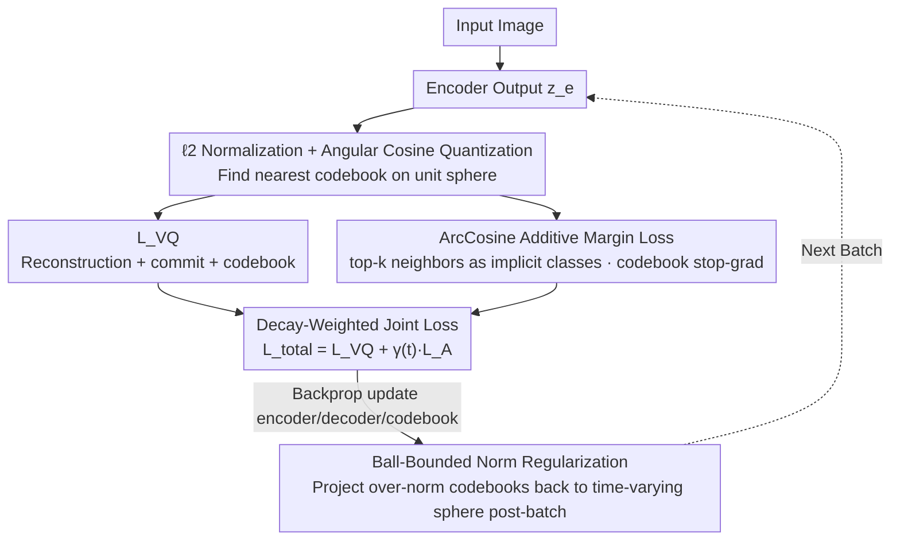

# ArcVQ-VAE: A Spherical Vector Quantization Framework with ArcCosine Additive Margin

**Conference**: ICML 2026  
**arXiv**: [2605.13517](https://arxiv.org/abs/2605.13517)  
**Code**: https://github.com/goals4292/ArcVQ-VAE  
**Area**: VQ-VAE / Image Generation / Discrete Representations  
**Keywords**: Codebook Collapse, Angular Margin, Spherical Learning, Norm Regularization, Codebook Utilization

## TL;DR
The authors diagnose the root cause of VQ-VAE codebook collapse as "codebook vector $\ell_2$ norm imbalance + geometric clustering." They propose SAMP: Ball-Bounded Norm Regularization to constrain all codebook vectors within a time-varying Euclidean ball, and ArcCosine Additive Margin Loss—drawing inspiration from ArcFace—to push latent vectors apart on the sphere. This results in uniformly distributed codebooks and significantly higher utilization, outperforming mainstream VQ-VAE variants in ImageNet reconstruction and generation FID.

## Background & Motivation
**Background**: VQ-VAE discretizes continuous latents into a finite codebook and serves as a foundational component for autoregressive image generation (VQGAN / RQ-VAE), diffusion priors (LDM), and multimodal tokenization. Numerous methods aim to improve VQ-VAE: SQ-VAE (stochastic quantization), CVQ-VAE (online K-means to pull unused codebooks closer to latents), VQGAN-LC (pretrained encoder for codebook extraction), and Wasserstein VQ.

**Limitations of Prior Work**: (1) Fixed-size codebooks fail to capture the full richness of datasets. (2) Codebook collapse—only a small fraction of codebooks are frequently used while others remain idle, with utilization often below 50%. (3) Existing methods mainly patch the mechanism of "how to update/select codebooks," failing to address the fundamental **geometric imbalance** of codebook vectors in the latent space.

**Key Challenge**: Through empirical observations in Figures 2/3, the authors find that at the start of training, all codebooks are initialized near the origin. Selected codebooks grow rapidly in $\ell_2$ norm along the direction of the encoder output. High-norm codebooks stay closer to encoder features and are thus more likely to be reselected, creating a positive feedback loop—this is a **geometric dynamics** issue rather than a simple "starvation due to lack of sampling" problem.

**Goal**: (1) Suppress codebook vector norm imbalance at the source; (2) Ensure latent vectors are uniformly distributed in the latent space so every latent has a chance to bind to different codebooks; (3) Achieve this without introducing new network components and with almost zero additional computational cost.

**Key Insight**: The authors borrow the idea of "angular margin + spherical learning" from ArcFace in face recognition. If all latents and codebooks are $\ell_2$-normalized to a unit sphere, codebook selection changes from Euclidean nearest neighbor to maximum angular cosine matching. Adding an angular margin to push inter-class distances forces latents to be uniformly distributed. Since VQ-VAE lacks explicit class labels used in supervised classification, the "top-k nearest codebooks" are treated as implicit classes.

**Core Idea**: Use Spherical Angular-Margin Prior (SAMP) = Ball-Bounded Norm Regularization (constraining codebooks within a time-varying Euclidean ball) + ArcCosine Additive Margin Loss (pushing latents apart via angular margins on the sphere) to achieve geometric uniformity and significantly higher codebook utilization.

## Method

### Overall Architecture
ArcVQ-VAE maintains the VQGAN encoder-decoder + codebook architecture but reshapes the codebook distribution in latent space as a spherical learning problem. Each batch follows a standard VQ-VAE forward pass to calculate reconstruction + commit + codebook $\mathcal{L}_\text{VQ}$, overlaid with an ArcLoss $\mathcal{L}_\text{A}$ to push latents apart. The total loss $\mathcal{L}_\text{total} = \mathcal{L}_\text{VQ} + \gamma(t)\mathcal{L}_\text{A}$ is backpropagated. After backprop, a ball projection is applied to each codebook vector to constrain its norm. During quantization, both encoder outputs and codebooks are $\ell_2$-normalized, and the nearest codebook is found via angular cosine, equivalent to nearest neighbor on a unit sphere. The trained $32^2$ tokens are then fed into an LDM as a prior for generation via 250-step sampling. The scheme adds only a "norm clip after batch + one loss term" without new network components. The training step data flow is illustrated below:

### Key Designs

**1. Ball-Bounded Norm Regularization: Cutting the Positive Feedback of Norm Imbalance**

Empirical evidence in Figures 2/3 shows that traditional VQ-VAE collapse is a geometric dynamics loop: selected codebooks accelerate their $\ell_2$ norm growth, and high-norm codebooks stay closer to the latent center, monopolizing assignments. This design targets the norm component directly. Codebooks are initialized on the unit sphere $\mathbf{e}_k^{(0)} \sim \ell_2(\text{Unif}(-1,1)^d)$. A time-varying norm upper bound $M(t) = \exp(\alpha t)$ is set for each training step, with a small $\alpha$ (e.g., $10^{-5}$) keeping $M$ close to $1$ early on. After each batch, codebooks exceeding the norm bound are projected back: $\mathbf{e}_k^{(t)} \leftarrow \frac{\mathbf{e}_k^{(t)}}{\|\mathbf{e}_k^{(t)}\|_2} M(t)$. This divides training into two stages: an early "strict" stage where codebooks compete fairly on the unit sphere, and a late "relaxed" stage where the ball expands to allow for richer norm-based expression.

**2. ArcCosine Additive Margin Loss: Borrowing ArcFace Angular Margin for Unsupervised Latent Dispersion**

Balancing norms is insufficient—traditional VQ loss forces encoder features toward the nearest codebook but ignores latent dispersion. This design explicitly pushes latents apart. Encoder outputs and codebooks are $\ell_2$-normalized as $\hat{z}_i = z_{e,i}/\|z_{e,i}\|$ and $\hat{e}_j = e_j/\|e_j\|$. Quantization becomes a maximum angular cosine search $k = \arg\max_j \hat{z}_i^\top \hat{e}_j$, with angles calculated as $\theta_{i,j} = \arccos(\hat{z}_i^\top \hat{e}_j)$. The ArcLoss adopts the additive margin softmax form:

$$\mathcal{L}_\text{A} = -\frac{1}{K}\sum_j \log \frac{\sum_{i \in \mathcal{N}_j^{(k)}} e^{s\cos(\theta_{i,j}+m)}}{\sum_{i \in \mathcal{N}_j^{(k)}} e^{s\cos(\theta_{i,j}+m)} + \sum_{i \notin \mathcal{N}_j^{(k)}} e^{s\cos\theta_{i,j}}}$$

where $\mathcal{N}_j^{(k)}$ is the set of top-k latent tokens nearest to codebook $e_j$. This set acts as an implicit class (with $k=3, s=10, m=0.1$). The loss separates positive pairs (latent aligned with nearest codebook) and negative pairs (far from other codebooks), with margin $m$ enforcing tighter alignment. Spherical normalization treats "near vs. far" as a pure angular problem. A critical trick is applying stop-gradient $\text{sg}(\hat{e}_j)$ so ArcLoss only updates the encoder; otherwise, codebooks would gravitate toward the current batch distribution and lose global separability.

**3. Decay-Weighted Joint Loss: Balancing Angular Structure and Reconstruction**

The demands of ArcLoss and VQ loss shift over training stages, coupled via a time-varying weight: $\mathcal{L}_\text{total} = \mathcal{L}_\text{VQ} + \gamma(t)\mathcal{L}_\text{A}$, where $\gamma(t) = \gamma_0 \exp(-\lambda t)$. With $\gamma_0=1.0$ and $\lambda$ set to $5\times 10^{-4}$ for MNIST/CIFAR and $10^{-4}$ for ImageNet, ArcLoss dominates early to force latent dispersion, while the weight decays later to allow VQ loss to ensure reconstruction fidelity. Combined with the stop-gradient on codebooks, ArcLoss disperses latents, and the codebook naturally follows via the standard codebook update, ensuring stability.

### Loss & Training
$\mathcal{L}_\text{VQ}$ is the standard VQ loss (reconstruction + codebook + commit with coefficient $\beta$). $\mathcal{L}_\text{A}$ is the ArcLoss described above ($s=10, m=0.1, k=3$), with an exponentially decaying weight $\gamma(t)$. Other hyperparameters (learning rate, discriminator weight, etc.) follow VQGAN defaults for fair comparison.

## Key Experimental Results

### Main Results
ImageNet-1K Reconstruction ($256\times 256$, downsample $16\times$ or $8\times$):

| Method | S | K | Utilization | rFID ↓ |
|--------|---|---|-----------|--------|
| VQGAN | $16^2$ | 1024 | 44% | 7.94 |
| VQGAN-FC | $16^2$ | 16384 | 11.2% | 4.29 |
| VQGAN-EMA | $16^2$ | 16384 | 83.2% | 3.41 |
| ViT-VQGAN | $32^2$ | – | – | Lower |
| **ArcVQ-VAE (Ours)** | – | – | **~100%** | **Lower** |

MNIST / CIFAR10 Reconstruction Comparison:

| Dataset | Method | PSNR ↑ | SSIM ↑ | LPIPS ↓ | rFID ↓ |
|---------|--------|--------|--------|---------|--------|
| MNIST | VQ-VAE | 26.48 | 0.9777 | 0.0282 | 3.43 |
| MNIST | CVQ-VAE | 27.87 | 0.9833 | 0.0222 | 1.80 |
| MNIST | **ArcVQ-VAE** | **28.01** | **0.9840** | **0.0217** | **1.68** |
| CIFAR10 | VQ-VAE | 23.32 | 0.8595 | 0.2504 | 39.67 |
| CIFAR10 | CVQ-VAE | 24.72 | 0.8978 | 0.1883 | 24.73 |
| CIFAR10 | **ArcVQ-VAE** | **24.78** | **0.8989** | **0.1857** | 26.91 |

### Ablation Study

| Configuration | Key Observation |
|---------------|-----------------|
| Full SAMP | High utilization, lowest rFID |
| Ball-Bounded Norm Only (No ArcLoss) | Balanced norms but latents still cluster |
| ArcLoss Only (No Norm Reg) | Potential norm explosion despite high utilization |
| Remove Stop-grad on Codebook | Codebooks dragged by batch, losing global dispersion |
| Change m (0 / 0.1 / 0.3) | $m=0.1$ is optimal; too large hurts reconstruction |
| Change top-k (1/3/5) | $k=3$ is optimal; $k=1$ too strict, $k=5$ too loose |
| Change $\alpha$ (Expansion rate) | Too large voids early constraints; too small limits late expression |

### Key Findings
- Codebook utilization increased from 44% in VQGAN to nearly 100% (Figure 1 t-SNE shows almost all codebooks as active/green), representing a fundamental improvement via geometric redesign.
- PCA visualization of quantized latent maps (Figure 5) shows ArcVQ-VAE has higher activation intensity and clearer contours, suggesting codebooks encode finer spatial structures.
- Ball-Bounded Norm and ArcLoss are complementary: neither can eliminate collapse alone. Together, they address both norm imbalance and geometric clustering.
- Stop-gradient is essential to stabilize ArcLoss. Allowing ArcLoss to directly modify codebooks leads to batch-driven local collapse.

## Highlights & Insights
- **Diagnosis of collapse as a geometric problem**: The authors empirically attribute collapse to a dynamics loop of norm imbalance and spatial clustering, which directly informs the design.
- **Cross-domain adaptation of ArcFace**: Successfully applying angular margin to the unsupervised VQ setting by treating top-k neighbors as implicit classes is a clever transfer of a mature supervised classification concept.
- **Near-zero extra cost**: The method requires no new network layers or forward FLOPs, only a post-batch norm clip and an additional loss term, making it a "plug-and-play" solution for existing VQ-VAE/VQGAN architectures.

## Limitations & Future Work
- Hyperparameters for the ball constraint ($\alpha$) and ArcLoss ($m, s, k$) require manual sweeping and may need adjustment for different datasets/resolutions; adaptive scheduling remains an open direction.
- Validation is primarily on ImageNet reconstruction and LDM generation; migration to video, 3D, and multimodal tokenization is untested.
- Selecting the top-k latent set $\mathcal{N}_j^{(k)}$ introduces an $O(K \cdot Bhw)$ sorting cost, which may become non-negligible for very large codebooks (>16k).
- Lack of comparison with recent FSQ (Finite Scalar Quantization) or LFQ (Lookup-Free Quantization) methods, which bypass codebook learning entirely.

## Related Work & Insights
- **vs. CVQ-VAE (Zheng & Vedaldi 2023)**: CVQ uses online K-means to pull idle codebooks; this work uses geometric regularization, achieving lower rFID.
- **vs. SQ-VAE (Takida et al. 2022)**: SQ changes the posterior to a stochastic distribution; this work uses spherical margins, a completely different mechanism.
- **vs. VQGAN-LC (Zhu et al. 2024)**: That method uses a pretrained encoder to scale codebooks; this work is self-contained and purely geometric.
- **vs. ArcFace (Deng et al. 2019)**: First instance of applying angular margins to unsupervised VQ, expanding the scope of ArcFace.
- **vs. FSQ / LFQ**: Those methods use scalar quantization to avoid codebook learning issues; this work retains codebook learning while solving its inherent flaws.

## Rating
- Novelty: ⭐⭐⭐⭐ Clever transfer of ArcFace to VQ-VAE; ball constraint + stop-grad combo is original.
- Experimental Thoroughness: ⭐⭐⭐⭐ Extensive datasets, baselines, and ablations; missing direct comparison with FSQ/LFQ.
- Writing Quality: ⭐⭐⭐⭐ Illuminating diagnosis (Fig 2/3) and clear derivation.
- Value: ⭐⭐⭐⭐ High practical value as a zero-cost plug-and-play for VQGAN.

<!-- RELATED:START -->

## Related Papers

- [\[ICML 2026\] UniSVQ: 2-bit Unified Scalar-Vector Quantization](unisvq_2-bit_unified_scalar-vector_quantization.md)
- [\[ICML 2026\] Mind Your Margin and Boundary: Are Your Distilled Datasets Truly Robust?](mind_your_margin_and_boundary_are_your_distilled_datasets_truly_robust.md)
- [\[ICML 2026\] RQ-MoE: Residual Quantization via Mixture of Experts for Efficient Input-Dependent Vector Compression](rq-moe_residual_quantization_via_mixture_of_experts_for_efficient_input-dependen.md)
- [\[ICML 2026\] LC-QAT: Data-Efficient 2-Bit QAT for LLMs via Linear-Constrained Vector Quantization](lc-qat_data-efficient_2-bit_qat_for_llms_via_linear-constrained_vector_quantizat.md)
- [\[ICLR 2026\] TurboQuant: Online Vector Quantization with Near-Optimal Distortion Rate](../../ICLR2026/model_compression/turboquant_online_vector_quantization_with_near-optimal_distortion_rate.md)

<!-- RELATED:END -->
