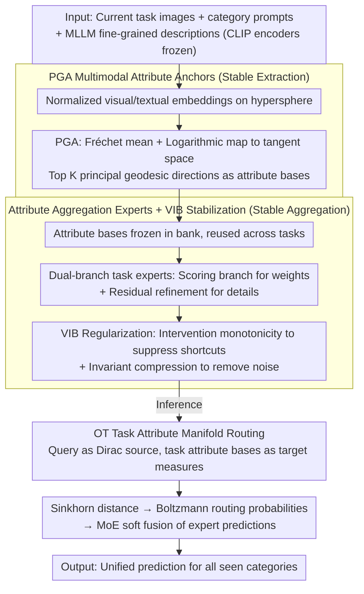

# AREA: Attribute Extraction and Aggregation for CLIP-Based Class-Incremental Learning

**Conference**: ICML 2026  
**arXiv**: [2605.28809](https://arxiv.org/abs/2605.28809)  
**Code**: https://github.com/LAMDA-CL/ICML2026-AREA  
**Area**: Model Compression / Continual Learning  
**Keywords**: CLIP, Class-Incremental Learning, Attribute Anchors, Principal Geodesic Analysis, Optimal Transport Routing  

## TL;DR
This paper decomposes forgetting in CLIP-based class-incremental learning into "attribute extraction drift" and "attribute aggregation drift." It proposes Area, which utilizes Principal Geodesic Analysis (PGA) to fix visual/textual attribute anchors on the hypersphere, combined with lightweight task experts, Variational Information Bottleneck (VIB) regularization, and Optimal Transport (OT) routing to stabilize attribute aggregation. This approach significantly improves average and final accuracy across nine CLIP-CIL benchmarks.

## Background & Motivation
**Background**: Class-incremental learning (CIL) requires models to learn new categories sequentially while maintaining recognition of old ones. Vision-language models like CLIP provide a powerful shared image-text embedding space. Consequently, many CIL methods choose to freeze the CLIP backbone and only train prompts, adapters, LoRAs, or a few task-specific modules to mitigate catastrophic forgetting.

**Limitations of Prior Work**: CLIP classification is typically formulated as the cosine similarity between image and category text embeddings. However, this similarity essentially mixes two components: which attributes the model extracts from the image/text and how it weights these attributes for the final decision. When training solely on current task data, new categories pull both attribute extraction and weighting; attributes related to old classes are diluted or recombined, eventually leading to forgetting.

**Key Challenge**: Freezing the CLIP backbone reduces parameter drift but does not guarantee stability at the attribute level. When new tasks arrive, the model still needs to introduce new attributes (e.g., wheels, windows, colors, shapes) for new classes and update their combinations. Without constraints from old data, such updates bias toward the current task, causing an imbalance in attribute evidence for old categories.

**Goal**: The authors aim to explicitly decompose the prediction mechanism of CLIP-CIL into attribute extraction and attribute aggregation, designing stability mechanisms for each. For extraction, class-level visual/textual attributes are fixed using geometric anchors. For aggregation, task experts and information bottlenecks are used to reduce task shortcuts. During inference, distributed task routing is employed to avoid incorrect expert selection.

**Key Insight**: CLIP embeddings are naturally normalized to a unit hypersphere, so using Euclidean PCA to extract attribute directions ignores the underlying spherical geometry. Area uses Principal Geodesic Analysis (PGA) in the tangent space of the hypersphere to extract class-level attribute bases and uses these as anchors reusable for subsequent tasks.

**Core Idea**: Anchor the visual and textual evidence for each category as a set of spherical attribute directions, and then let lightweight experts learn to stably aggregate these anchors across tasks rather than repeatedly modifying the CLIP backbone or old category representations.

## Method
The Area framework is organized around "extraction stabilization" and "aggregation stabilization." Extraction stabilization addresses the drift of old category attribute directions as new tasks appear; aggregation stabilization prevents task experts from learning shortcuts on current data that would erroneously weight attributes.

### Overall Architecture
When the $b$-th task arrives, the model only accesses the current task data $\mathcal{D}^b$ without re-accessing old task samples. The CLIP vision encoder $g_v$ and text encoder $g_t$ are frozen throughout. For each new category, Area first obtains normalized visual embeddings from images and combines category prompts with fine-grained descriptions generated by an MLLM to obtain text embeddings.

Subsequently, the model uses PGA on both visual and textual sides to construct category prototypes and attribute bases. Once generated, the attribute bases for each category are frozen to serve as an attribute bank for later tasks. During training, Area introduces lightweight experts for each task, consisting of an attribute scoring branch and a residual refinement branch to combine fixed attribute bases into task-relevant but drift-resistant discriminative representations.

During inference, which may involve inputs from any learned task, Area does not rely on simple point-to-point cosine similarity for task identification. Instead, it treats the input embedding as a Dirac source distribution and the collection of attribute anchors for each task as a target distribution. The task routing probabilities are derived via Sinkhorn optimal transport distance, followed by a soft fusion of task expert predictions.

### Key Designs
1. **PGA Multimodal Attribute Anchors**:
	- **Function**: Establishes fixed attribute subspaces for each category on both visual and textual sides to suppress attribute extraction drift.
	- **Mechanism**: For normalized CLIP features of category $c$, the Fréchet mean $\mu_c$ is calculated on the unit hypersphere. Samples are then mapped to the tangent space via the logarithmic map to compute the covariance and extract the top $K$ principal directions as attribute bases. The process is repeated for the textual side using category prompts fused with MLLM captions.
	- **Design Motivation**: CLIP cosine embeddings naturally reside on a hypersphere. PGA respects the geometric structure better than Euclidean SVD. By freezing these directions, fine-grained evidence for old categories is preserved and not re-extracted during subsequent training.

2. **Attribute Aggregation Experts and VIB Stabilization**:
	- **Function**: Enables each task to learn attribute weighting while preventing experts from relying on accidental shortcuts within the current task.
	- **Mechanism**: The score branch outputs sample-level attribute weights, while the residual refinement branch supplements detail corrections. Training objectives include two VIB surrogates alongside the standard contrastive loss: intervention monotonicity (evidence should not abnormally increase upon occlusion) and invariant compression (attribute evidence under different augmented views should converge to the view mean).
	- **Design Motivation**: Forgetting in CIL arises not only from representation drift but also from aggregation weights biasing toward new tasks. Information bottleneck constraints encourage experts to retain category-relevant attributes while compressing view noise and task shortcuts.

3. **Optimal Transport-based Task Attribute Manifold Routing**:
	- **Function**: Selects or blends the most relevant task experts during inference to reduce mis-routing caused by cross-task semantic overlap.
	- **Mechanism**: The input embedding forms a source measure, while the attribute bases of each task form empirical target measures. The model calculates the entropic OT/Sinkhorn distance using a cosine cost, which is converted to task probabilities via a Boltzmann distribution for a weighted sum of expert predictions.
	- **Design Motivation**: Point-to-point similarity is susceptible to local feature drift. OT compares distribution matches between the input and the entire task attribute manifold, making it more suitable for task selection in long-sequence incremental learning.

### Loss & Training
The training target includes the standard CLIP-style contrastive loss and stabilization regularization. VIB is implemented by minimizing $-I(\mathcal{Z};Y)+\beta I(\mathcal{Z};X)$, which is approximated during optimization by intervention and compression losses. 

The total stabilization objective is $\mathcal{L}_{stab}=\lambda_{int}\mathcal{L}_{int}+\lambda_{comp}\mathcal{L}_{comp}+\mathcal{L}_{cont}$. In experiments, CLIP ViT-B/16 is used as the frozen backbone. The trainable parameter count for Area is approximately 0.52M, which is on the same scale as other prompt or adapter-based methods.

## Key Experimental Results

### Main Results
The paper evaluates the method on nine datasets: CIFAR100, CUB200, ObjectNet, ImageNet-R, Aircraft, Cars, Food101, SUN397, and UCF101. Metrics include average accuracy $\bar{\mathcal{A}}$ over the incremental process and final stage accuracy $\mathcal{A}_B$.

| Dataset / Setting | Metric | Area | Strong Baseline Results | Gain / Description |
|--------|------|------|----------|------|
| Aircraft B0 Inc10 | $\bar{\mathcal{A}}$ / $\mathcal{A}_B$ | 71.03 / 61.78 | RAPF 50.38 / 23.61 | Significantly reduces forgetting in fine-grained aircraft classification |
| Cars B0 Inc10 | $\bar{\mathcal{A}}$ / $\mathcal{A}_B$ | 97.77 / 96.17 | MG-CLIP 88.21 / 79.73 | Attribute anchors are highly effective for fine-grained differences |
| CIFAR B0 Inc10 | $\bar{\mathcal{A}}$ / $\mathcal{A}_B$ | 89.24 / 83.69 | MG-CLIP 89.74 / 82.78 | Average accuracy comparable to SOTA; final accuracy is higher |
| CUB B0 Inc20 | $\bar{\mathcal{A}}$ / $\mathcal{A}_B$ | 87.69 / 82.14 | RAPF 79.09 / 62.77 | Clear advantage in final accuracy for fine-grained bird tasks |
| ObjectNet B0 Inc20 | $\bar{\mathcal{A}}$ / $\mathcal{A}_B$ | 61.02 / 49.20 | RAPF 53.78 / 34.97 | More robust against strong domain shifts |
| UCF101 B0 Inc10 | $\bar{\mathcal{A}}$ / $\mathcal{A}_B$ | 95.54 / 88.71 | RAPF 92.28 / 80.33 | Retains benefits in image-based video action settings |

### Ablation Study
The paper validates Area's design through component ablation, caption sources, annotation coverage, and routing efficiency. Two representative analyses are listed below.

| Configuration / Analysis | Key Metric | Description |
|------|---------|------|
| Baseline ZS-CLIP | CIFAR B0 Inc10 significant drop over tasks | Zero-shot CLIP alone struggles against task distribution shifts |
| w/ Attribute | Substantial improvement over baseline | Fixed attribute anchors provide stable references for old classes |
| w/ VIB Loss | Further gain atop Attribute | Information bottleneck reduces task shortcuts and view noise |
| w/ OT | Best overall performance | Distributed routing reduces task expert mis-selection |
| OT vs cosine routing | +3.39% final 100-class accuracy, +2.9 ms/sample overhead | OT provides a favorable accuracy-efficiency trade-off |

| Caption Setup | Aircraft $\bar{\mathcal{A}}$ / $\mathcal{A}_B$ | CIFAR $\bar{\mathcal{A}}$ / $\mathcal{A}_B$ | CUB $\bar{\mathcal{A}}$ / $\mathcal{A}_B$ |
|------|---------|---------|---------|
| Area + GPT5 captions | 71.03 / 61.78 | 89.24 / 83.69 | 87.69 / 82.14 |
| Area + LLaVA captions | 70.89 / 60.95 | 88.98 / 83.24 | 86.86 / 81.22 |
| RAPF + GPT5 captions | 50.38 / 23.61 | 86.14 / 78.04 | 79.09 / 62.77 |
| ZS-CLIP + GPT5 captions | 26.66 / 17.22 | 81.81 / 71.38 | 74.38 / 63.06 |

### Key Findings
- Area improves both average and final accuracy across most datasets, particularly in fine-grained or domain-shifted datasets like Aircraft, Cars, CUB, and ObjectNet, indicating that attribute anchors protect fine-grained knowledge.
- The method is not fragile regarding caption sources. While GPT5 captions are strongest, performance only drops slightly with LLaVA-v1.6-34B or LLaVA-7B. Using LLaVA-7B to annotate only 20% of samples still yields competitive final accuracy.
- PGA anchors are abstract directions in CLIP space rather than strictly human-interpretable attributes. Proximity to text tokens shows coarse semantic correlations (e.g., "envelope" associated with "red" or "inscription"), suggesting "attributes" should not be misunderstood as purely symbolic.
- Efficiency overhead is manageable. Inference latency increases from 16.4 ms/sample for 100 classes to 18.2 ms/sample for 300 classes, as routing occurs over task-level attribute manifolds rather than exhaustive class-level matching.

## Highlights & Insights
- The most compelling aspect is decomposing CLIP similarity into "what to extract" and "how to aggregate." This suggests that catastrophic forgetting is not just a parameter drift problem but a collective drift of attribute geometry and evidence weighting.
- The use of PGA aligns well with CLIP. Since CLIP features reside on a hypersphere, principal geodesic directions in the tangent space are more natural than Euclidean PCA and better explain how anchors maintain intra-class structures.
- The implementation of VIB via two surrogates is practical. The one-sided constraint on intervention (occlusion should not increase evidence) suppresses shortcuts, while view invariance ensures attribute evidence is independent of accidental data augmentations.
- OT routing is a highly transferable trick for continual learning. Unlike methods that compare a single query to a prototype, Area treats tasks as attribute distributions, which is suitable for long sequences with overlapping task boundaries and similar semantics.

## Limitations & Future Work
- The research is limited to CLIP-based CIL with frozen vision-language encoders. Stability may need re-verification if backbones are substantially updated or if generative multi-modal models are used.
- The approach relies on MLLM captions for textual attribute enhancement. Although experiments show robustness to caption coverage and quality, the cost and quality of captions remain potential bottlenecks in privacy-sensitive or low-resource domains.
- The semantic interpretation of attribute anchors is coarse. They function more as representation directions than as explicitly named human attributes; future work could focus on stronger attribute alignment or manual verification.
- While current OT routing overhead is small, further compression (e.g., Sparse Sinkhorn or task pre-screening) might be necessary for higher task counts or mobile deployment.

## Related Work & Insights
- **vs prompt-based CIL**: Prompt methods primarily adapt the textual side; Area decomposes evidence into visuo-textual attribute anchors and aggregation experts, addressing attribute drift more directly.
- **vs adapter / LoRA CIL**: These methods balance stability and plasticity through sparse updates but may still shift attribute weights. Area explicitly constrains both extraction and aggregation.
- **vs replay-based CIL**: Replay provides real constraints using old samples but faces privacy and storage issues. Area is an exemplar-free approach, relying on attribute anchors for old class information.
- **vs MG-CLIP / RAPF**: While these methods also leverage vision-language priors, Area differs by using hyperspherical PGA to construct a fixed attribute bank and utilizing OT for distributed routing across task manifolds.

## Rating
- Novelty: ⭐⭐⭐⭐⭐ Decomposing CLIP-CIL forgetting into dual drifts and combining PGA, VIB, and OT is a novel and complete conceptual framework.
- Experimental Thoroughness: ⭐⭐⭐⭐ Solid results across nine datasets; more comprehensive tables for all component ablations would be welcomed.
- Writing Quality: ⭐⭐⭐⭐ Clear structure with intuitive examples; however, the "attribute" concept requires the author's later contextualization to avoid over-interpretation as symbolic labels.
- Value: ⭐⭐⭐⭐⭐ Highly valuable for CIL involving frozen VLMs, especially in fine-grained recognition and exemplar-free scenarios.

<!-- RELATED:START -->

## Related Papers

- [\[CVPR 2026\] QKD: Quantum-Gated Task-interaction Knowledge Distillation for Class-Incremental Learning](../../CVPR2026/model_compression/qkd_quantum_gated_incremental_learning.md)
- [\[CVPR 2025\] Adapter Merging with Centroid Prototype Mapping for Scalable Class-Incremental Learning](../../CVPR2025/model_compression/adapter_merging_with_centroid_prototype_mapping_for_scalable_class-incremental_l.md)
- [\[AAAI 2026\] Compensating Distribution Drifts in Class-incremental Learning of Pre-trained Vision Transformers](../../AAAI2026/model_compression/compensating_distribution_drifts_in_class-incremental_learning_of_pre-trained_vi.md)
- [\[ICCV 2025\] Integrating Task-Specific and Universal Adapters for Pre-Trained Model-based Class-Incremental Learning](../../ICCV2025/model_compression/integrating_task-specific_and_universal_adapters_for_pre-trained_model-based_cla.md)
- [\[ICCV 2025\] Achieving More with Less: Additive Prompt Tuning for Rehearsal-Free Class-Incremental Learning](../../ICCV2025/model_compression/achieving_more_with_less_additive_prompt_tuning_for_rehearsal-free_class-increme.md)

<!-- RELATED:END -->
