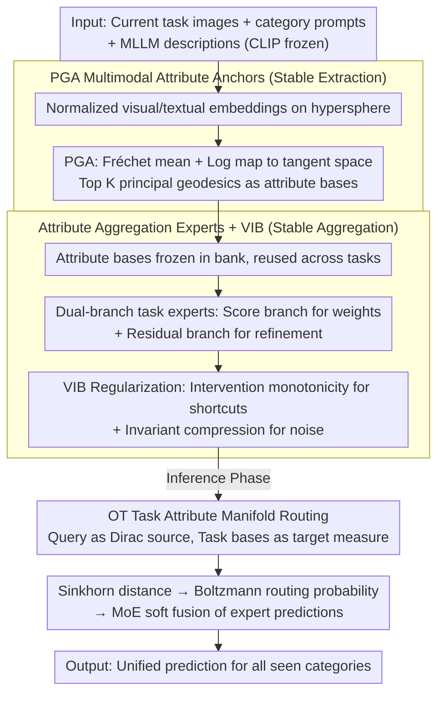

# AREA: Attribute Extraction and Aggregation for CLIP-Based Class-Incremental Learning

**Conference**: ICML 2026  
**arXiv**: [2605.28809](https://arxiv.org/abs/2605.28809)  
**Code**: https://github.com/LAMDA-CL/ICML2026-AREA  
**Area**: Model Compression / Continual Learning  
**Keywords**: CLIP, Class-Incremental Learning, Attribute Anchors, Principal Geodesic Analysis, Optimal Transport Routing  

## TL;DR
This paper decomposes forgetting in CLIP-based class-incremental learning into "attribute extraction drift" and "attribute aggregation drift." It proposes Area, which uses Principal Geodesic Analysis (PGA) to fix visual/textual attribute anchors on the hypersphere, while employing lightweight task experts, Variational Information Bottleneck (VIB) regularization, and Optimal Transport (OT) routing to stabilize attribute aggregation. This approach significantly improves average and final accuracy across nine CLIP-CIL benchmarks.

## Background & Motivation
**Background**: Class-incremental learning (CIL) requires models to learn new categories sequentially while maintaining recognition of old ones. Vision-language models like CLIP provide a powerful shared embedding space. Consequently, many CIL methods choose to freeze the CLIP backbone and only train prompts, adapters, LoRA, or few task-specific modules to reduce catastrophic forgetting.

**Limitations of Prior Work**: CLIP classification is typically formulated as cosine similarity between image and category text embeddings. However, this similarity mixes two things: which attributes the model extracts and how it weights these attributes for final discrimination. When training only on current task data, new categories pull both attribute extraction and weighting. Old task-related attributes are diluted or recombined, leading to forgetting.

**Key Challenge**: Freezing the CLIP backbone reduces parameter drift but does not guarantee stability at the attribute level. When a new task arrives, the model still needs to introduce new attributes (e.g., wheels, windows, colors, shapes) for new classes and update how these attributes are combined; without old data constraints, this update biases toward the current task, causing an imbalance in evidence for old categories.

**Goal**: The authors aim to explicitly decompose the CLIP-CIL prediction mechanism into attribute extraction and attribute aggregation. They design stabilization mechanisms for each: the extraction side uses geometric anchors to fix class-level visual/textual attributes, while the aggregation side uses task experts and information bottlenecks to reduce task shortcuts. During inference, a distributed task routing is used to avoid choosing the wrong expert.

**Key Insight**: CLIP embeddings are naturally normalized to a unit hypersphere. Therefore, using standard Euclidean PCA to extract attribute directions ignores the spherical geometry. Area utilizes Principal Geodesic Analysis (PGA) to extract class-level attribute bases in the tangent space of the hypersphere, using these bases as reusable anchors for subsequent tasks.

**Core Idea**: Anchor the visual and textual evidence for each category as a set of spherical attribute directions. Lightweight experts are then trained to learn how to stably aggregate these anchors across tasks rather than repeatedly modifying the CLIP backbone or old category representations.

## Method
The Area framework is built around two pillars: "extraction stability" and "aggregation stability." Extraction stability addresses the drift of attribute directions for old classes, while aggregation stability prevents task experts from learning shortcuts on current data that lead to incorrect attribute weighting.

### Overall Architecture
When the $b$-th task arrives, the model only accesses current task data $\mathcal{D}^b$ and cannot revisit old samples. The CLIP vision encoder $g_v$ and text encoder $g_t$ are frozen throughout. For each new category, Area obtains normalized visual embeddings from images and generates textual embeddings by combining category prompts with fine-grained descriptions from MLLMs.

Subsequently, the model uses PGA to construct class prototypes and attribute bases for both vision and text modalities. Once generated, the attribute bases for each category are frozen to serve as a reusable attribute bank. For training, Area adds lightweight experts for each task, comprising an attribute scoring branch and a residual refinement branch to combine fixed attribute bases into discriminative representations.

During inference, inputs may come from any learned task. Instead of using simple point-to-point cosine similarity to identify tasks, Area treats the input embedding as a Dirac source distribution and the set of attribute anchors for each task as the target distribution. Routing probabilities are derived using the Sinkhorn distance for Optimal Transport, followed by soft fusion of expert predictions.

### Key Designs
1.  **PGA Multimodal Attribute Anchors**:
    *   **Function**: Establish fixed attribute subspaces for each category in both vision and text modalities to suppress extraction drift.
    *   **Mechanism**: For normalized CLIP features of class $c$, the Fréchet mean $\mu_c$ is computed on the unit hypersphere. The logarithmic map projects samples into the tangent space where the covariance is calculated, and the top $K$ principal directions are taken as attribute bases.
    *   **Design Motivation**: CLIP embeddings naturally reside on a hypersphere. PGA respects this geometric structure better than Euclidean SVD. Freezing these directions prevents the re-extraction of fine-grained evidence for old classes during subsequent training.

2.  **Attribute Aggregation Expert and VIB Stabilization**:
    *   **Function**: Enables tasks to learn attribute weighting while preventing experts from relying on accidental shortcuts in the current task.
    *   **Mechanism**: The score branch outputs sample-level attribute weights, while the residual refinement branch provides detail corrections. Training targets include contrastive loss and two VIB surrogates: intervention monotonicity (occlusions should not abnormally increase evidence) and invariant compression (attribute evidence across augmented views should stay near the mean).
    *   **Design Motivation**: Forgetting stems not only from representation drift but also from weighting bias. Information bottleneck constraints force experts to retain class-relevant attributes while compressing task noise and shortcuts.

3.  **Optimal Transport (OT) Task Attribute Manifold Routing**:
    *   **Function**: Selects or mixes matching task experts during inference to reduce mis-routing caused by cross-task semantic overlap.
    *   **Mechanism**: Input embeddings form the source measure, while the attribute bases of each task form the empirical target measures. An entropic OT/Sinkhorn distance is calculated using a cosine cost, then converted to task probabilities via a Boltzmann distribution.
    *   **Design Motivation**: Point-to-point similarity is susceptible to local feature drift. OT compares the distribution match between input and the entire task attribute manifold, making it more suitable for task selection in long-sequence incremental learning.

### Loss & Training
The training objective includes standard CLIP-style contrastive loss and stabilization regularization. The VIB formulation minimizes $-I(\mathcal{Z};Y)+\beta I(\mathcal{Z};X)$, optimized via intervention and compression losses. 

The overall objective is: $\mathcal{L}_{stab}=\lambda_{int}\mathcal{L}_{int}+\lambda_{comp}\mathcal{L}_{comp}+\mathcal{L}_{cont}$. Area uses a frozen CLIP ViT-B/16 as the backbone with approx. 0.52M trainable parameters, comparable to prompt/adapter methods.

## Key Experimental Results

### Main Results
Evaluation was conducted on nine benchmarks: CIFAR100, CUB200, ObjectNet, ImageNet-R, Aircraft, Cars, Food101, SUN397, and UCF101. Metrics include average accuracy $\bar{\mathcal{A}}$ and final accuracy $\mathcal{A}_B$.

| Dataset / Setting | Metric | Area | Strong Baseline | Gain / Notes |
| :--- | :--- | :--- | :--- | :--- |
| Aircraft B0 Inc10 | $\bar{\mathcal{A}}$ / $\mathcal{A}_B$ | 71.03 / 61.78 | RAPF 50.38 / 23.61 | Large reduction in forgetting for fine-grained aircraft |
| Cars B0 Inc10 | $\bar{\mathcal{A}}$ / $\mathcal{A}_B$ | 97.77 / 96.17 | MG-CLIP 88.21 / 79.73 | Anchors are highly effective for fine-grained vision |
| CIFAR B0 Inc10 | $\bar{\mathcal{A}}$ / $\mathcal{A}_B$ | 89.24 / 83.69 | MG-CLIP 89.74 / 82.78 | Near-optimal avg., higher final accuracy |
| CUB B0 Inc20 | $\bar{\mathcal{A}}$ / $\mathcal{A}_B$ | 87.69 / 82.14 | RAPF 79.09 / 62.77 | Significant final accuracy advantage for birds |
| ObjectNet B0 Inc20 | $\bar{\mathcal{A}}$ / $\mathcal{A}_B$ | 61.02 / 49.20 | RAPF 53.78 / 34.97 | More robust to strong domain shifts |
| UCF101 B0 Inc10 | $\bar{\mathcal{A}}$ / $\mathcal{A}_B$ | 95.54 / 88.71 | RAPF 92.28 / 80.33 | Gains persist in imaged action categories |

### Ablation Study
Ablations verify components, caption sources, and routing efficiency.

| Configuration / Analysis | Key Metric | Notes |
| :--- | :--- | :--- |
| Baseline ZS-CLIP | CIFAR B0 Inc10 declines significantly | ZS-CLIP struggles against task distribution shifts |
| w/ Attribute | Substantial improvement over baseline | Fixed anchors provide stable references for old classes |
| w/ VIB Loss | Further gain over Attribute | Bottleneck reduces task shortcuts and noise |
| w/ OT | Best overall final performance | Distributed routing reduces task expert mis-selection |
| OT vs cosine routing | +3.39% final 100-class Acc | OT offers a superior accuracy-efficiency trade-off |

| Caption Setting | Aircraft $\bar{\mathcal{A}}$ / $\mathcal{A}_B$ | CIFAR $\bar{\mathcal{A}}$ / $\mathcal{A}_B$ | CUB $\bar{\mathcal{A}}$ / $\mathcal{A}_B$ |
| :--- | :--- | :--- | :--- |
| Area + GPT5 captions | 71.03 / 61.78 | 89.24 / 83.69 | 87.69 / 82.14 |
| Area + LLaVA captions | 70.89 / 60.95 | 88.98 / 83.24 | 86.86 / 81.22 |
| RAPF + GPT5 captions | 50.38 / 23.61 | 86.14 / 78.04 | 79.09 / 62.77 |

### Key Findings
- Area improves both average and final accuracy, particularly for fine-grained or domain-shifted datasets, showing attribute anchors protect fine-grained knowledge.
- Performance is not strictly dependent on a single caption source. Using LLaVA-v1.6-34B or LLaVA-7B results in only minor drops; 20% caption coverage still yields high accuracy.
- PGA anchors are abstract directions in CLIP space rather than human-interpretable linguistic attributes. Nearest textual tokens show coarse semantic links (e.g., "envelope" linked to "red", "inscription").
- Efficiency is manageable. Inference latency increases slightly from 16.4 ms/sample for 100 classes to 18.2 ms/sample for 300 classes, as routing occurs at the task-level manifold.

## Highlights & Insights
- The decomposition of CLIP similarity into "what to extract" and "how to aggregate" identifies forgetting as a joint drift of attribute geometry and evidence weighting.
- The use of PGA aligns perfectly with CLIP's hyperspherical nature. Principal geodesics in tangent space preserve intra-class structures better than Euclidean PCA.
- The VIB surrogates are practical: a unilateral constraint prevents occlusions from boosting evidence (shortcut suppression), while view-invariant scores ensure evidence stability.
- OT routing is a transferable trick. Rather than comparing a query to a single prototype, comparing a query to a distribution (manifold) is more robust to task overlap.

## Limitations & Future Work
- The research is limited to frozen CLIP-based CIL. Stability might need re-verification if updating VLM backbones or using generative models.
- Dependency on MLLM captions can be a factor. While coverage sensitivity is low, caption cost and quality remain concerns in low-resource or professional domains.
- Attribute anchors lack strict human interpretability; they are representation directions. Aligning them with symbolic attributes is a direction for future work.
- While current OT overhead is small, further compression (e.g., Sparse Sinkhorn) might be needed for mobile deployment or extremely high task counts.

## Related Work & Insights
- **vs prompt-based CIL**: Prompting focuses on the text side; Area decomposes evidence into multimodal anchors and aggregation experts, addressing drift more directly.
- **vs adapter / LoRA CIL**: These methods balance stability and plasticity through parameter updates but may still shift aggregation weights. Area provides explicit constraints.
- **vs replay-based CIL**: Replay stores real samples for constraints. Area is exemplar-free, relying instead on reusable attribute banks.
- **vs MG-CLIP / RAPF**: Area differentiates itself by using hyperspherical PGA for attribute bank construction and OT for distributed routing over task manifolds.

## Rating
- Novelty: ⭐⭐⭐⭐⭐ Decomposition into extraction/aggregation drift is a novel perspective for CLIP-CIL.
- Experimental Thoroughness: ⭐⭐⭐⭐ Solid results across nine datasets; detailed ablation studies.
- Writing Quality: ⭐⭐⭐⭐ Clear structure and intuitive explanations of geometric concepts.
- Value: ⭐⭐⭐⭐⭐ Highly relevant for frozen VLM-based continual learning, especially in exemplar-free and fine-grained scenarios.

<!-- RELATED:START -->

## Related Papers

- [\[CVPR 2025\] Adapter Merging with Centroid Prototype Mapping for Scalable Class-Incremental Learning](../../CVPR2025/model_compression/adapter_merging_with_centroid_prototype_mapping_for_scalable_class-incremental_l.md)
- [\[AAAI 2026\] Compensating Distribution Drifts in Class-incremental Learning of Pre-trained Vision Transformers](../../AAAI2026/model_compression/compensating_distribution_drifts_in_class-incremental_learning_of_pre-trained_vi.md)
- [\[ICCV 2025\] Integrating Task-Specific and Universal Adapters for Pre-Trained Model-based Class-Incremental Learning](../../ICCV2025/model_compression/integrating_task-specific_and_universal_adapters_for_pre-trained_model-based_cla.md)
- [\[ICCV 2025\] Achieving More with Less: Additive Prompt Tuning for Rehearsal-Free Class-Incremental Learning](../../ICCV2025/model_compression/achieving_more_with_less_additive_prompt_tuning_for_rehearsal-free_class-increme.md)
- [\[NeurIPS 2025\] Mixture of Noise for Pre-Trained Model-Based Class-Incremental Learning](../../NeurIPS2025/model_compression/mixture_of_noise_for_pre-trained_model-based_class-incremental_learning.md)

<!-- RELATED:END -->
