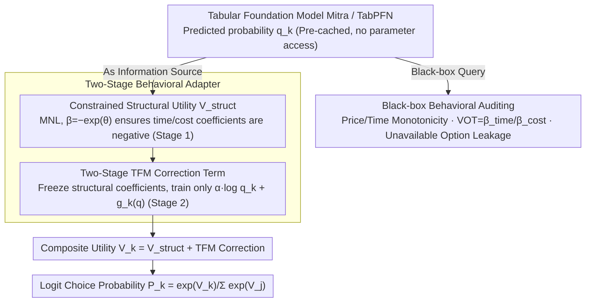

# Auditing and Fixing Economic Validity in Tabular Foundation Models for Discrete Choice

**Conference**: ICML2026  
**arXiv**: [2605.26559](https://arxiv.org/abs/2605.26559)  
**Code**: Not disclosed  
**Area**: Others / Tabular Foundation Models and Discrete Choice  
**Keywords**: Tabular foundation models, discrete choice, economic validity, behavioral constraints, policy evaluation  

## TL;DR
This paper discovers that tabular foundation models (TFMs) such as TabPFN and Mitra exhibit high accuracy in discrete choice tasks but violate price-demand monotonicity and produce untrustworthy value-of-time (VOT) estimates. Consequently, it proposes a two-stage behavioral adapter that embeds TFM predictions into a utility model constrained by economic theory, achieving 100% behavioral validity while recovering most accuracy gains.

## Background & Motivation
**Background**: Problems such as transportation mode choice, medical schemes, insurance plans, and commodity selection can all be formalized as discrete choices. Multinomial Logit (MNL) models and their extensions are commonly used in traditional economics and transportation fields to predict choice probabilities, as they originate from utility maximization and naturally provide interpretable quantities such as price sensitivity, value of time, and policy counterfactual analysis.

**Limitations of Prior Work**: Machine learning models, especially pre-trained tabular foundation models, often exceed MNL in classification accuracy. However, policy scenarios focus not only on "prediction accuracy" but also on whether the model shifts in the directions required by economic theory when variables such as price and time are intervened. If a model predicts an increase in demand after a price hike or derives a negative value of time, it will mislead fare setting and infrastructure investment despite high test set accuracy.

**Key Challenge**: TFMs excel at judging "who chooses what" based on tabular correlations, whereas economic models excel at answering "how choice probabilities should change if price or time changes." The former offers an accuracy advantage, while the latter provides structural guarantees. Direct distillation of a TFM leads to a loss of non-linear information, while imposing constraints directly on TFMs is difficult for in-context models like TabPFN and fails to produce interpretable economic coefficients.

**Goal**: The authors aim to add an auditable, interpretable shell to tabular foundation models suitable for policy intervention, enabling the model to simultaneously possess high predictive precision, price-demand monotonicity, reasonable value-of-time estimates, and zero-probability constraints for unavailable options.

**Key Insight**: Instead of attempting to retrain or modify the TFM itself, the paper treats the category probabilities output by the TFM as additional information provided to a utility function constrained by economic theory. A structural utility term first independently learns economic parameters; after these are frozen, a TFM correction term is used to explain the remaining prediction errors of the MNL.

**Core Idea**: Assign the economic model to handle the direction of counterfactual responses and the TFM to handle observation-level non-linear discriminative power, using a two-stage training approach to prevent the TFM from polluting core economic coefficients such as time and cost.

## Method
This work does not aim to propose a stronger classifier but rather redefines the role of tabular foundation models in policy choice tasks: the TFM no longer directly outputs final choice probabilities but instead serves as an observation-level information source providing correction signals for a utility model constrained by economic theory. The entire process is divided into two steps—first auditing whether the TFM satisfies behavioral validity via black-box queries, and then safely integrating its accuracy advantages using a two-stage behavioral adapter.

### Overall Architecture
For each sample $x_i$ and alternative $k$, the model constructs a utility $V_k(x_i)$ composed of two parts: one is a standard discrete choice model $V_k^{struct}(x_i)$, containing alternative-specific constants, time coefficients, cost coefficients, and demographic interaction terms; the other comes from the TFM predicted probability $q_k(x_i)$, including a scalar weight term $\alpha\log q_k(x_i)$ and a small network $g_k(\mathbf{q}(x_i))$. The final choice probability still follows the Logit formula $P_k=\exp(V_k)/\sum_j\exp(V_j)$. Experiments were conducted on the Swissmetro and LPMC transportation mode choice datasets: predictions from Mitra or TabPFN v2 were first cached for each sample and then passed to the adapter; the auditing and adapter training never touch the internal parameters of the TFM, making the method applicable to black-box or near-black-box tabular foundation models.

### Key Designs

**1. Black-box Behavioral Auditing: Exposing Economic Failures of TFM via Perturbation rather than Accuracy**

Policy models cannot merely look at test set accuracy; they must respond in the directions required by economic theory when inputs are intervened. A model predicting "increased demand after a price rise" or deriving a negative value of time will mislead pricing and investment decisions regardless of its accuracy. The authors use a set of minimally invasive black-box queries to force out such issues: monotonicity tests increase the cost or time of a certain alternative by $1\%$ of the observation range to check if the predicted probability decreases; VOT tests use coefficient ratios or finite difference methods to estimate $VOT=\beta_{time}/\beta_{cost}$; and availability tests record the average probability assigned by the model to unavailable alternatives (leakage). These perturbations directly highlight the TFM's tendency to mistake correlation for causality, such as confounding high costs with the preferences of high-income groups, thereby predicting that price increases boost demand.

**2. Constrained Structural Utility: Embedding Directional Constraints into Parameterization rather than Post-hoc Penalties**

To ensure that "increases in price or time necessarily reduce the corresponding utility" is a hard guarantee, the authors build constraints directly into the mathematical construction rather than relying on penalty terms. The structural utility term adopts an MNL specification, but time and cost coefficients are written as $\beta=-\exp(\theta)$—no matter how the optimizer updates the unconstrained variable $\theta$, the coefficient remains negative. Thus, a price increase must reduce utility, and the $VOT$ can be analytically calculated from the structural coefficients. For unavailable options, $V_k=-\infty$ is set to achieve zero probability. This is more reliable than penalty terms: penalties can only reduce the probability of violations but cannot guarantee monotonicity under arbitrary interventions, whereas negative exponential parameterization provides a hard constraint that always holds.

**3. Two-stage TFM Correction: Locking Economic Meaning before Pursuing Precision**

The difficulty lies in absorbing the accuracy advantages of the TFM without allowing it to pollute core economic coefficients like time and cost. If trained end-to-end, the optimizer would quickly push signals into the TFM correction branch, causing structural coefficients to shrink toward zero and $VOT$ to become a ratio of two near-zero numbers, leading to a collapse of economic meaning. The authors resolve this conflict by splitting the process into two stages: Stage 1 fixes the correction term at zero and trains only the structural utility, equivalent to a standard MNL; Stage 2 freezes the structural parameters and trains only the scalar $\alpha$ and the small network $g_k$, allowing TFM probabilities to explain non-linear residuals not captured by the MNL. Since policy response is entirely determined by the frozen time and cost coefficients, the TFM correction term can only add an intercept-style shift at the sample level and cannot reverse the direction of price response.

### Loss & Training
The training objective used in both stages is the negative log-likelihood of discrete choice. Stage 1 only optimizes structural utility parameters, ensuring negative time and cost coefficients through negative exponential parameterization; Stage 2 optimizes only the TFM correction terms after the structural parameters are frozen, where $\alpha$ measures the overall credibility of the TFM probabilities and $g_k$ learns alternative-level residuals from the full probability vector. In experiments, TFM probabilities are pre-calculated and fixed across training, validation, and test splits—this aligns with policy analysis practice: when intervening in price or time, other observed information of the individual remains constant, and the "other information" in the adapter includes the TFM's overall judgment of that observation, thus leaving counterfactual responses entirely controlled by the structural utility term.

## Key Experimental Results

### Main Results
The core results come from the Swissmetro and LPMC transportation mode choice datasets. While raw TFM accuracy is highest, behavioral validity is clearly unreliable; the adapter sacrifices minimal accuracy to regain full monotonicity and interpretable VOT.

| Dataset | Model | Acc ↑ | Mono ↑ | VOT | Leak ↓ |
|--------|------|------|--------|-----|--------|
| Swissmetro | MNL | 63.7 | 100 | 79.7 CHF/hr | <0.001 |
| Swissmetro | Mitra | 77.7 | 90.3 | 0.30 CHF/hr | 0.208 |
| Swissmetro | TabPFN | 78.0 | Not Audited | Not Audited | Not Audited |
| Swissmetro | Adapter+Mitra | 76.6 | 100 | 79.7 CHF/hr | <0.001 |
| Swissmetro | Adapter+TabPFN | 76.6 | 100 | 79.7 CHF/hr | <0.001 |
| LPMC | MNL | 69.8 | 100 | PT 1.76 / Drive 18.3 GBP/hr | N/A |
| LPMC | Mitra | 74.2 | 50.8 | PT 7.47 / Drive -5.7 GBP/hr | N/A |
| LPMC | TabPFN | 74.4 | Not Audited | Not Audited | N/A |
| LPMC | Adapter+Mitra | 71.8 | 100 | PT 1.76 / Drive 18.3 GBP/hr | N/A |
| LPMC | Adapter+TabPFN | 72.1 | 100 | PT 1.76 / Drive 18.3 GBP/hr | N/A |

### Ablation Study
The paper focuses on comparing the roles of structural models, raw TFMs, distillation-style approaches, and behavioral adapters. The following table summarizes key comparisons reported in the text as ablation at the methodological level.

| Configuration | Key Metrics | Description |
|------|---------|------|
| MNL Structural Only | Swissmetro 63.7%, LPMC 69.8%, Mono 100 | Complete economic logic, but accuracy lags behind TFM |
| raw Mitra | Swissmetro 77.7%, LPMC 74.2% | High accuracy, but Swissmetro VOT is only 0.30 CHF/hr; LPMC monotonicity only 50.8% |
| Distilled MNL | Swissmetro 57.3%, LPMC 70.0% | After training MNL with TFM soft labels, Swissmetro is lower than standard MNL, suggesting student model capacity is a bottleneck |
| Adapter+Mitra | Swissmetro 76.6%, LPMC 71.8%, Mono 100 | Recovers ~13 percentage points of accuracy in Swissmetro while maintaining MNL economic coefficients |
| Adapter+TabPFN | Swissmetro 76.6%, LPMC 72.1%, Mono 100 | Independent of specific TFM, showing portability of the adapter mechanism |
| LPMC 10x Subsampling | +2.2±0.5 points, Mono 100 | Positive gain across all runs, 95% CI: [+1.2, +3.3] |

### Key Findings
- The errors of raw TFMs are not minor noise but structural behavioral failures. In LPMC, nearly half of the samples for Mitra violate the "price increase reduces demand" rule, and the median driving VOT is negative, with 65% of driving VOT estimates being negative.
- While Mitra achieves 90.3% monotonicity in Swissmetro, its VOT is only 0.30 CHF/hr—far below the 50-100 CHF/hr range found in literature—which would cause policy models to severely underestimate the value of time savings.
- The adapter does not exceed raw TFM accuracy; its role is to transfer TFM accuracy advantages into a constrained model as much as possible. The authors explicitly state it "recovers gains" rather than creating them from nothing.
- The contribution of the correction term varies by dataset. In Swissmetro, $\alpha$ exceeds 1.0, indicating the TFM is the primary source of accuracy; in LPMC, $\alpha$ is approximately 0.41-0.44, suggesting the MNL already explains more structure.

## Highlights & Insights
- The paper articulates the problem of "high accuracy but policy untrustworthiness" very specifically: it avoids vague discussions of interpretability and instead audits models using three actionable indicators: monotonicity, VOT, and unavailable option leakage.
- The two-stage training design is simple but critical. It acknowledges that TFMs and economic models have different strengths, avoiding blending them into an end-to-end classifier that is difficult to interpret.
- The method's requirements for the TFM itself are very low, requiring only predicted probabilities, making it compatible with in-context models and AutoML-wrapped models. This is important for actual policy agencies which often cannot alter base model training processes.
- This work also serves as a reminder that the evaluation of tabular foundation models cannot rely solely on classification accuracy. Whenever downstream tasks involve intervention, pricing, or resource allocation, behavioral auditing under domain theory constraints must be included.

## Limitations & Future Work
- The experiments only cover two transportation mode choice datasets and two TFMs. while the problems are representative, they are not yet sufficient to prove that all tabular foundation models exhibit similar failures in all economic choice tasks.
- The transportation sector has clear economic constraints; when transferring the method to medical, energy packages, or education choices, reasonable behavioral audit indicators for those fields must first be defined.
- Adapter gains depend on TFM quality. If TFM predictions are inherently poor, Stage 2 will at most degrade to the level of the MNL and cannot automatically generate additional information.
- Behavioral auditing for TabPFN was omitted due to the high cost of in-context re-inference, leaving the behavioral difference between raw TabPFN and the adapter not fully quantified.
- Future work could extend structural terms from MNL to mixed logit, nested logit, or neural embedded choice models to handle preference heterogeneity, correlated alternatives, and non-linear utility while retaining the idea of two-stage logic for locking economic meaning.

## Related Work & Insights
- **vs MNL / Discrete Choice Models**: MNL provides price, time, and availability constraints but has limited expressive power. Ours retains the structural interpretation of MNL while allowing the TFM to correct observation-level non-linear residuals.
- **vs raw TabPFN / Mitra**: TFMs are powerful for small-sample tabular classification but learn historical correlations and do not guarantee correct intervention directions. The adapter demotes the TFM from a final decision-maker to an information source within a constrained utility model.
- **vs Knowledge Distillation**: Distillation compresses TFM knowledge into an MNL student model; results showed Swissmetro accuracy at only 57.3%, suggesting linear utility cannot carry the TFM's non-linear information. Ours does not compress the TFM but uses its probabilities as additional explanatory variables.
- **vs Monotonic Neural Networks / Constrained Networks**: Constrained networks often require architecture redesign for each application and may not yield economic coefficients. This work provides hard constraints and analytical VOT through a structural utility term, making it closer to policy analysis workflows in practice.

## Rating
- Novelty: ⭐⭐⭐⭐ The idea of embedding TFM predictions into a constrained discrete choice model is clean and effective. Innovation lies primarily in problem definition and training workflow.
- Experimental Thoroughness: ⭐⭐⭐⭐ Two real-world transportation datasets and multiple TFM comparisons are sufficient to support the claims, though data domains and model quantities remain limited.
- Writing Quality: ⭐⭐⭐⭐⭐ Motivation is clear, metric explanations are specific, and experimental tables directly expose the conflict between accuracy and economic validity.
- Value: ⭐⭐⭐⭐⭐ This work is significant as a warning for the entry of tabular foundation models into policy, pricing, and public decision-making scenarios and provides a practical repair path.

<!-- RELATED:START -->

## Related Papers

- [\[ICML 2026\] End-to-End Compression for Tabular Foundation Models](end-to-end_compression_for_tabular_foundation_models.md)
- [\[ICML 2026\] Quantifying the Uncertainty of Foundation Models with Singular Value Ensembles](quantifying_the_uncertainty_of_foundation_models_with_singular_value_ensembles.md)
- [\[ICML 2026\] BioArc: Discovering Optimal Neural Architectures for Biological Foundation Models](bioarc_discovering_optimal_neural_architectures_for_biological_foundation_models.md)
- [\[ICML 2026\] Active Tabular Augmentation via Policy-Guided Diffusion Inpainting](active_tabular_augmentation_via_policy-guided_diffusion_inpainting.md)
- [\[ICML 2026\] PRISM: Synergizing Vision Foundation Models via Self-Organized Expert Specialization](prism_synergizing_vision_foundation_models_via_self-organized_expert_specializat.md)

<!-- RELATED:END -->
