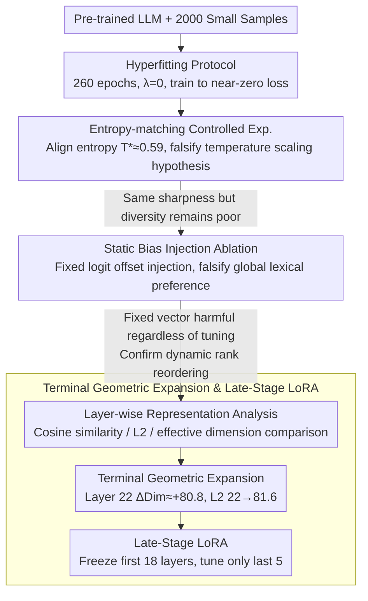

# Beyond Temperature: Hyperfitting as a Late-Stage Geometric Expansion

**Conference**: ICML 2026  
**arXiv**: [2605.22579](https://arxiv.org/abs/2605.22579)  
**Code**: None  
**Area**: Model Compression / Parameter-Efficient Fine-Tuning  
**Keywords**: Hyperfitting, Rank Reordering, Terminal Geometric Expansion, Late-Stage LoRA, Greedy Decoding Degradation  

## TL;DR
This paper demonstrates through controlled experiments that the essence of Hyperfitting (training an LLM to near-zero loss on a small dataset) is not temperature-scaling-style distribution sharpening, but a dynamic, context-dependent token Rank Reordering mechanism. This mechanism is concentrated in the "Terminal Geometric Expansion" ($\Delta \text{Dim} \approx +80.8$) of the final layer of the Transformer. Based on this, it proposes Late-Stage LoRA, which fine-tunes only the last 5 layers, maintaining generation diversity while reducing trainable parameters by approximately 80%.

## Background & Motivation

**Background**: Large Language Models often degenerate into repetitive loops when using greedy or beam search in open-ended text generation. While stochastic sampling methods (e.g., top-k, nucleus sampling) alleviate repetition, they sacrifice consistency and text quality. Recently, Carlsson et al. (2025) discovered a counter-intuitive phenomenon—"Hyperfitting": training a model for 260 epochs on only 2000 samples until near-zero loss significantly improves the generation quality and Type-Token Ratio (TTR) of greedy decoding.

**Limitations of Prior Work**: Although Hyperfitting is effective, its underlying mechanism remains unclear. Since hyperfitted models output extremely low-entropy distributions ($H \approx 1.5$ nats), a natural hypothesis is whether it is merely equivalent to simple temperature scaling ($T < 1$). If so, it would be a trivial probability distribution sharpening operation rather than a new learning dynamic.

**Key Challenge**: Temperature scaling is rank-preserving, meaning $\text{argsort}(\mathbf{z}) \equiv \text{argsort}(\mathbf{z}/T)$. It cannot alter the relative ranking between tokens. If Hyperfitting were equivalent to temperature scaling, repetitive tokens would remain the winners in greedy decoding, and diversity would not increase.

**Goal**: (1) Rigorously falsify the temperature scaling hypothesis; (2) reveal the true mechanism of Hyperfitting; (3) locate the position of this mechanism within the network; (4) design parameter-efficient alternatives based on these insights.

**Key Insight**: This study progresses through three stages—entropy-matching controlled experiments, static bias injection ablation, and layer-wise representation analysis—to fully dissect the Hyperfitting mechanism from "what it is not" to "what it is" and "where it occurs."

**Core Idea**: The essence of Hyperfitting is the geometric expansion of the final Transformer layer—significantly expanding the effective dimension of hidden states to accommodate the context-dependent promotion of tokens in the deep tail. Consequently, fine-tuning only the last few layers can replicate the effects of full-network fine-tuning.

## Method

### Overall Architecture
This paper does not propose a new model but performs a "forensic" dissection of the counter-intuitive Hyperfitting phenomenon. It first falsifies the trivial hypothesis that it is just temperature scaling, then locates the mechanism's position layer by layer, and finally translates these findings into a parameter-efficient fine-tuning strategy. The narrative moves from "what it is not" to "what it is" and finally to "where it is and how to use it." The input consists of a pre-trained LLM (TinyLlama-1.1B, Qwen2.5-1.5B, etc.) and 2,000 small dataset samples. After training to near-zero loss using the Hyperfitting protocol (260 epochs, no regularization, $\lambda=0$), the truth is approached through three sets of controlled experiments, eventually resulting in Late-Stage LoRA.

### Key Designs

**1. Entropy-matching Controlled Experiment: Investigating where diversity originates under the same "sharp" distribution**

Hyperfitted models output extremely low entropy ($H_{\text{hyper}} \approx 0.862$ nats). The simplest explanation is that "it merely sharpened the distribution," equivalent to temperature scaling with $T<1$. To debunk this, the authors eliminate the confounding factor by numerically solving for a scalar $T^* \approx 0.59$ for the original model such that the resulting entropy exactly matches $H_{\text{hyper}}$. With "sharpness" aligned, only the ranking could differ. If the temperature hypothesis were correct, the generation diversity should be identical; however, the entropy-matched model's TTR is only 0.397, while the Hyperfitted model reaches 0.684 (+71%), with bigram repetition at 0.604 vs 0.140. The key is that temperature scaling is rank-preserving ($\text{argsort}(\mathbf{z}) \equiv \text{argsort}(\mathbf{z}/T)$). Since diversity improves, Hyperfitting must be rewriting the relative ranking of tokens rather than just compressing probability towards the head.

**2. Static Bias Injection Ablation: Testing whether rank reordering is a fixed preference or context-dependent**

Having excluded the temperature hypothesis, the next suspect is "global lexical preference"—perhaps Hyperfitting only learns a set of context-independent fixed logit offsets. The authors design a falsifiable experiment: they take the $K=500$ tokens with the largest rank increase in the Hyperfitted model, calculate their average logit offset $\boldsymbol{\delta} \in \mathbb{R}^{|V|}$, and statically inject it into the original model $\mathbf{z}_{\text{synth}} = \mathbf{z}_{\text{orig}} + \alpha \cdot \boldsymbol{\delta}$, scanning $\alpha \in [0.01, 0.5]$. The result is a complete failure: even $\alpha=0.01$ causes the repetition rate to rise (0.588→0.609), and at $\alpha=0.5$, TTR crashes to 0.215 (mode collapse). The Spearman correlation between injection intensity and quality is $\rho=-0.94$, proving it is monotonically harmful. Since a fixed vector addition cannot fix the issue, it proves that Hyperfitting's rank reordering is dynamic, context-dependent, and originates from changes in internal representations.

**3. Terminal Geometric Expansion and Late-Stage LoRA: Translating localization into parameter-efficient fine-tuning**

Since the changes come from internal representations, they should be detectable in specific layers. The authors compare the original and Hyperfitted models layer by layer using cosine similarity, $L_2$ distance, and effective dimension (Participation Ratio). A clear three-stage curve emerges: the first 10 layers remain almost unchanged (cosine similarity $>0.86$), acting as "linguistic anchors." Layers 11–21 show slight compression, with effective dimensions actually decreasing. The dramatic change is concentrated in the final layer—Layer 22 $L_2$ distance jumps from 22.0 to 81.6 (about 4x), and the effective dimension increases by $\Delta\text{Dim} \approx +80.8$. This is termed "Terminal Geometric Expansion": the model expands its hidden space at the exit to accommodate new directions that lift tokens which were previously in the long tail but should win in the current context. This localization provides a recipe for parameter efficiency—freeze the first 18 layers and apply LoRA adapters only to the last 5. On TinyLlama, the Top-1 Agreement of 0.517 is close to Full LoRA's 0.523. On the deeper Qwen2.5-1.5B, it even outperforms Full LoRA (TTR 0.591 vs 0.575) while using ~80% fewer trainable parameters, as freezing early layers acts as a structural stabilizer.

## Key Experimental Results

### Main Results: Hyperfitting vs Temperature scaling vs Static Bias

| Method | TTR ↑ | Bigram Rep. ↓ | Trigram Rep. ↓ | Top-1 Agreement ↓ | Predicted Entropy (nats) |
|------|-------|---------------|----------------|--------------------|---------------|
| Original (T=1.0) | 0.400 | 0.592 | 0.536 | 1.000 | 2.083 |
| Original (T=0.59, matched) | 0.397 | 0.604 | 0.548 | 0.997 | 0.875 |
| Static Injection (α=0.01) | 0.409 | 0.609 | — | — | — |
| Static Injection (α=0.50) | 0.215 | 0.706 | — | — | — |
| **Hyperfitted** | **0.684** | **0.140** | **0.069** | **0.570** | **0.862** |

### Ablation Study: Late-Stage LoRA

| Model / Config | TTR ↑ | Bigram Rep. ↓ | Top-1 Agree ↓ | Params Reduction |
|-------------|-------|---------------|---------------|----------|
| TinyLlama Original | 0.400 | 0.592 | 1.000 | — |
| TinyLlama Full LoRA | 0.508 | 0.331 | 0.523 | — |
| TinyLlama Late-Stage LoRA (L18-22) | 0.469 | 0.345 | 0.517 | ~78.3% |
| Qwen2.5-1.5B Original | 0.315 | 0.662 | 1.000 | — |
| Qwen2.5-1.5B Full LoRA | 0.575 | 0.248 | 0.469 | — |
| **Qwen2.5-1.5B Late-Stage LoRA (L24-28)** | **0.591** | **0.213** | **0.459** | **~82.7%** |

### Key Findings
- **Entropy-Quality Paradox**: At identical predicted entropy, temperature scaling yields a TTR of only 0.397, while Hyperfitting reaches 0.684, proving diversity gains do not come from distribution sharpening.
- **Deep-Tail Promotion**: In approximately 39.1% of greedy decoding decisions, the Hyperfitted model overrides the original Top-1 token; 12.9% of these come from the deep tail (rank > 10), with some tokens promoted from rank > 200 to Top-1.
- **Late-Stage LoRA Outperforms Full LoRA on Deep Models**: On Qwen2.5-1.5B, Late-Stage LoRA is not only more parameter-efficient but also superior in terms of TTR (+0.016) and Bigram Repetition (-0.035), as freezing early layers provides structural regularization.
- **Cross-Domain Robustness**: High TTR and MAUVE scores are maintained across Fiction-Stories, WritingPrompts, and AG News, showing the effect is independent of the fine-tuning data's inherent entropy.
- **LLM-as-Judge Evaluation**: Late-Stage LoRA beat Full LoRA in 200 pairwise comparisons with a 57.3% win rate ($p=0.02$), primarily due to better coherence (+16.1 percentage points).

## Highlights & Insights
- **Step-wise Falsification Paradigm**: The progression through "Entropy Matching → Static Bias Injection → Layer-wise Representation" provides a robust framework for excluding simple hypotheses to reveal true mechanisms.
- **Terminal Expansion Localization**: The discovery that Transformer final layers undergo significant effective dimension expansion ($\Delta \text{Dim} \approx +80.8$) while early layers remain static suggests that LLM generation diversity bottlenecks are highly localized. This insight can be transferred to other PEFT scenarios—prioritizing the last few layers may be more efficient than uniform adapter distribution.
- **"Freezing as Regularization"**: The fact that Late-Stage LoRA outperforms Full LoRA on deeper Qwen models suggests that freezing early layers prevents the disruption of pre-trained feature hierarchies, acting as an effective regularization method.

## Limitations & Future Work
- The mechanism analysis only covers models up to 8B parameters; the behavior for 70B+ scales remains unverified, and it is unclear if the terminal expansion phenomenon persists in ultra-large models.
- Evaluation metrics (TTR, bigram repetition) primarily capture lexical diversity and do not fully assess semantic coherence or factual accuracy.
- Hyperfitting still requires long training times (260 epochs). While diversity effects appear as early as 20 epochs, an automated early-stopping criterion is missing.
- Late-Stage LoRA slightly underperforms Full LoRA on TinyLlama (a shallower model), indicating that the effectiveness of "only tuning the last few layers" is correlated with model depth.

## Related Work & Insights
- **Original Hyperfitting Discovery**: Carlsson et al. (2025) first reported at ICLR 2025 that overfitting can improve generation quality; this paper provides the mechanical explanation.
- **Decoding Strategies**: Min-p sampling and GUARD methods improve diversity at inference time but are stochastic. Hyperfitting achieves high diversity (TTR 0.67-0.69, MAUVE 0.82-0.91) under deterministic greedy decoding; the two are orthogonal and combinable.
- **Parameter-Efficient Fine-Tuning**: LoRA is typically applied uniformly across all layers. This paper's terminal localization finding provides a theoretical basis for "non-uniform LoRA," inspiring more refined hierarchical allocation strategies.

<!-- RELATED:START -->

## Related Papers

- [\[ICML 2026\] The Shape of Addition: Geometric Structures of Arithmetic in Large Language Models](the_shape_of_addition_geometric_structures_of_arithmetic_in_large_language_model.md)
- [\[AAAI 2026\] Condensed Data Expansion Using Model Inversion for Knowledge Distillation](../../AAAI2026/model_compression/condensed_data_expansion_using_model_inversion_for_knowledge_distillation.md)
- [\[ICML 2026\] Beyond Tokens: Enhancing RTL Quality Estimation via Structural Graph Learning](beyond_tokens_enhancing_rtl_quality_estimation_via_structural_graph_learning.md)
- [\[ACL 2026\] Two-Stage Regularization-Based Structured Pruning for LLMs](../../ACL2026/model_compression/two-stage_regularization-based_structured_pruning_for_llms.md)
- [\[NeurIPS 2025\] Geometric Data Valuation via Leverage Scores](../../NeurIPS2025/model_compression/geometric_data_valuation_via_leverage_scores.md)

<!-- RELATED:END -->
