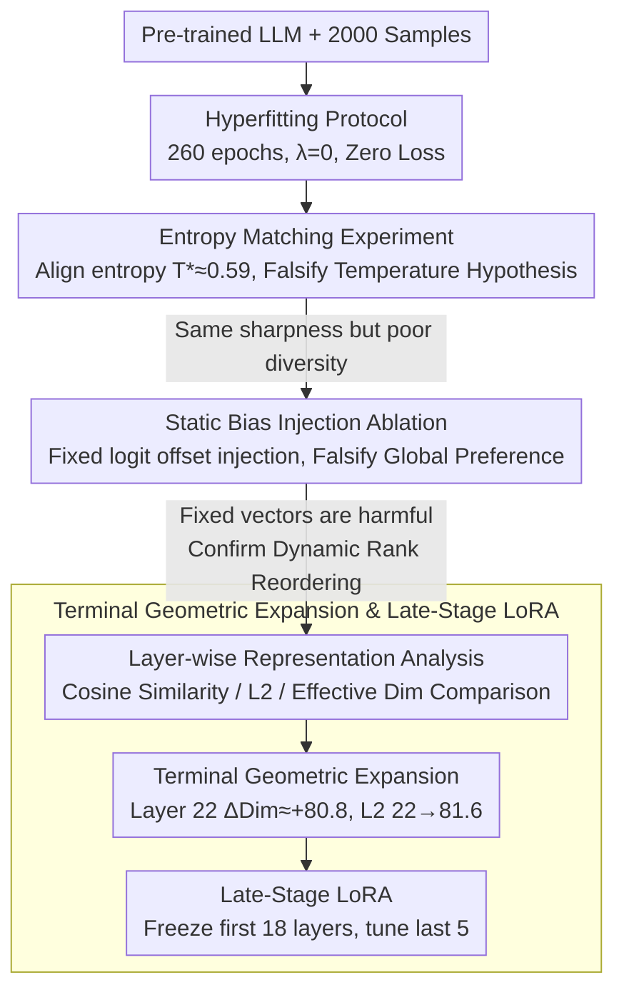

# Beyond Temperature: Hyperfitting as a Late-Stage Geometric Expansion

**Conference**: ICML 2026  
**arXiv**: [2605.22579](https://arxiv.org/abs/2605.22579)  
**Code**: None  
**Area**: Model Compression / Parameter-Efficient Fine-Tuning  
**Keywords**: Hyperfitting, Rank Reordering, Terminal Geometric Expansion, Late-Stage LoRA, Greedy Decoding Degradation  

## TL;DR
This paper demonstrates through controlled experiments that Hyperfitting (training LLMs to near-zero loss on small datasets) is not a temperature-scaling-style distribution sharpening, but a dynamic, context-dependent token Rank Reordering mechanism. This mechanism concentratedly occurs in the final layer of the Transformer as a "Terminal Geometric Expansion" ($\Delta \text{Dim} \approx +80.8$). Based on this, Late-Stage LoRA is proposed—fine-tuning only the last 5 layers—maintaining generation diversity while reducing trainable parameters by approximately 80%.

## Background & Motivation

**Background**: Large language models often degrade into repetitive loops when using greedy/beam search in open-ended text generation. While stochastic sampling methods (e.g., top-k, nucleus sampling) mitigate repetition, they sacrifice consistency and text quality. Recently, Carlsson et al. (2025) discovered a counterintuitive phenomenon—"Hyperfitting": training a model for 260 epochs on only 2000 samples until near-zero loss significantly improves the generation quality and Type-Token Ratio (TTR) of greedy decoding.

**Limitations of Prior Work**: Although Hyperfitting is effective, its underlying mechanism remains unclear. Since hyperfitted models output extremely low-entropy distributions ($H \approx 1.5$ nats), a natural hypothesis is whether it is merely equivalent to simple temperature scaling ($T < 1$). If so, it would be a trivial probability distribution sharpening operation rather than a new learning dynamic.

**Key Challenge**: Temperature scaling is a rank-preserving transformation, i.e., $\text{argsort}(\mathbf{z}) \equiv \text{argsort}(\mathbf{z}/T)$, and cannot change the relative ordering between tokens. If Hyperfitting were equivalent to temperature scaling, repetitive tokens would still be the winners in greedy decoding, and diversity would not improve.

**Goal**: (1) Rigorously falsify the temperature scaling hypothesis; (2) Uncover the true mechanism of Hyperfitting; (3) Locate where this mechanism occurs in the network; (4) Design a parameter-efficient alternative based on these mechanical insights.

**Key Insight**: Through a three-step progression comprising entropy-matching controlled experiments, static bias injection ablation, and layer-wise representation analysis, the Hyperfitting mechanism is fully dissected from "what it is not" to "what it is" and finally "where it is."

**Core Idea**: The essence of Hyperfitting is a geometric expansion in the final Transformer layer—drastically expanding the effective dimension of hidden states to accommodate context-dependent elevation of deep-tail tokens. Consequently, fine-tuning only the last few layers can replicate the effects of full-network fine-tuning.

## Method

### Overall Architecture
The paper does not propose a new model but performs a "forensic" dissection of the counterintuitive Hyperfitting phenomenon: first falsifying the trivial hypothesis of temperature scaling, then locating the mechanism layer-by-layer, and finally translating the localization results into a parameter-efficient fine-tuning strategy. The logic flows from "what it is not" to "what it is" and "where it is/how to use it." The input consists of pre-trained LLMs (TinyLlama-1.1B, Qwen2.5-1.5B, etc.) and small datasets of 2000 samples. After training to near-zero loss via the Hyperfitting protocol (260 epochs, no regularization, $\lambda=0$), the truth is approached through three sets of control experiments, culminating in Late-Stage LoRA.

### Key Designs

**1. Entropy Matching Experiment: Interrogating Diversity under Identical Sharpness**

Hyperfitted models output extremely low entropy ($H_{\text{hyper}} \approx 0.862$ nats). The simplest explanation is that it just "sharpens" the distribution, equivalent to $T<1$. To refute this, the authors eliminate the confounding factor: numerically solving for a scalar $T^* \approx 0.59$ for the original model such that the scaled entropy exactly equals $H_{\text{hyper}}$. With sharpness aligned, only the ranking could differ. If the temperature hypothesis held, diversity should be identical; however, the entropy-matched model's TTR is only 0.397 compared to the Hyperfitted model's 0.684 (+71%), with bigram repetition at 0.604 vs 0.140. Since temperature scaling is rank-preserving ($\text{argsort}(\mathbf{z}) \equiv \text{argsort}(\mathbf{z}/T)$), this proves Hyperfitting reorders relative token ranks rather than just compressing probability towards the head.

**2. Static Bias Injection Ablation: Testing if Rank Reordering is Fixed or Contextual**

Having excluded temperature, the next suspect is "global vocabulary preference"—perhaps Hyperfitting learns context-independent logit offsets. The authors test this by taking the top $K=500$ tokens with the largest rank increases in the Hyperfitted model, calculating their mean logit offset $\boldsymbol{\delta} \in \mathbb{R}^{|V|}$, and injecting it statically into the original model: $\mathbf{z}_{\text{synth}} = \mathbf{z}_{\text{orig}} + \alpha \cdot \boldsymbol{\delta}$, scanning $\alpha \in [0.01, 0.5]$. This failed completely: even $\alpha=0.01$ increased repetition (0.588→0.609), and at $\alpha=0.5$, TTR plummeted to 0.215 (mode collapse), with a Spearman correlation between injection strength and quality of $\rho=-0.94$. Since a fixed vector addition is monotonically harmful, it proves Hyperfitting's rank reordering is dynamic and context-dependent, originating from internal representation changes.

**3. Terminal Geometric Expansion and Late-Stage LoRA: Translating Localization into Efficiency**

Since changes stem from internal representations, they should be detectable layer-by-layer. The authors compared cosine similarity, $L_2$ distance, and effective dimension (Participation Ratio) between original and Hyperfitted models. The results show a clear three-stage curve: the first 10 layers remain unchanged (cosine $>0.86$), acting as "linguistic anchors." Layers 11–21 show slight compression. The drastic change occurs in the final layer—Layer 22 $L_2$ distance jumps from 22.0 to 81.6, and effective dimension spikes by $\Delta\text{Dim} \approx +80.8$. This "Terminal Geometric Expansion" suggests the model expands the hidden space at the exit to accommodate tokens previously buried in the long tail. This leads to Late-Stage LoRA: freezing the first 18 layers and applying LoRA only to the last 5. On TinyLlama, it achieves a Top-1 Agreement of 0.517 (close to Full LoRA's 0.523), and on Qwen2.5-1.5B, it outperforms Full LoRA (TTR 0.591 vs 0.575) with ~80% fewer trainable parameters.

## Key Experimental Results

### Main Results: Hyperfitting vs. Temperature Scaling vs. Static Bias

| Method | TTR ↑ | Bigram Rep. ↓ | Trigram Rep. ↓ | Top-1 Agreement ↓ | Pred. Entropy (nats) |
|------|-------|---------------|----------------|--------------------|---------------|
| Original (T=1.0) | 0.400 | 0.592 | 0.536 | 1.000 | 2.083 |
| Original (T=0.59, Entropy Match) | 0.397 | 0.604 | 0.548 | 0.997 | 0.875 |
| Static Injection (α=0.01) | 0.409 | 0.609 | — | — | — |
| Static Injection (α=0.50) | 0.215 | 0.706 | — | — | — |
| **Hyperfitted** | **0.684** | **0.140** | **0.069** | **0.570** | **0.862** |

### Ablation Study: Late-Stage LoRA

| Model / Config | TTR ↑ | Bigram Rep. ↓ | Top-1 Agree ↓ | Param. Reduction |
|-------------|-------|---------------|---------------|----------|
| TinyLlama Original | 0.400 | 0.592 | 1.000 | — |
| TinyLlama Full LoRA | 0.508 | 0.331 | 0.523 | — |
| TinyLlama Late-Stage LoRA (L18-22) | 0.469 | 0.345 | 0.517 | ~78.3% |
| Qwen2.5-1.5B Original | 0.315 | 0.662 | 1.000 | — |
| Qwen2.5-1.5B Full LoRA | 0.575 | 0.248 | 0.469 | — |
| **Qwen2.5-1.5B Late-Stage LoRA (L24-28)** | **0.591** | **0.213** | **0.459** | **~82.7%** |

### Key Findings
- **Entropy-Quality Paradox**: At identical prediction entropy, temperature scaling TTR is only 0.397 while Hyperfitting reaches 0.684, proving diversity gains do not come from distribution sharpening.
- **Deep-Tail Elevation**: In ~39.1% of greedy decoding decisions, the Hyperfitted model overrides the original Top-1 token, with 12.9% of these coming from the deep tail (rank > 10). Some tokens are elevated from rank > 200 to Top-1.
- **Late-Stage LoRA Outperforms Full LoRA on Deep Models**: On Qwen2.5-1.5B, Late-Stage LoRA is not only more efficient but also superior in TTR (+0.016) and Bigram Rep. (-0.035), as freezing early layers acts as a structural stabilizer.
- **Cross-Domain Robustness**: High TTR and MAUVE scores are maintained across Fiction-Stories, WritingPrompts, and AG News, regardless of the fine-tuning data's inherent entropy.
- **LLM-as-Judge Evaluation**: Late-Stage LoRA defeated Full LoRA with a 57.3% win rate in 200 pairwise comparisons ($p=0.02$), primarily due to improved coherence (+16.1 percentage points).

## Highlights & Insights
- **Falsification Analysis Paradigm**: The three-step progression (Entropy Match → Static Bias → Layer-wise Representation) excludes simple hypotheses before revealing the true mechanism, providing a robust analytical framework.
- **Terminal Expansion Localization**: The discovery that Transformer effective dimensions expand drastically ($\Delta \text{Dim} \approx +80.8$) in the final layer suggests the diversity bottleneck is highly localized. This insight implies that prioritizing the last few layers for adaptation is more efficient than uniform allocation.
- **"Freezing as Regularization"**: The superiority of Late-Stage LoRA on deeper models suggests that freezing early layers prevents the disruption of pre-trained feature hierarchies, serving as an effective form of regularization.

## Limitations & Future Work
- The mechanism analysis only covers models up to 8B parameters; whether Terminal Expansion holds in 70B+ models is unverified.
- Evaluation metrics (TTR, bigram repetition) primarily capture lexical diversity and do not fully assess semantic coherence or factual accuracy.
- Hyperfitting still requires long training (260 epochs). Although diversity effects appear by 20 epochs, a standardized automated early-stopping criterion is missing.
- Late-Stage LoRA slightly underperforms Full LoRA on TinyLlama (a shallower model), indicating that the "tune-only-last-layers" strategy's efficacy correlates with model depth.

## Related Work & Insights
- **Original Hyperfitting Discovery**: Carlsson et al. (2025) first reported that overfitting improves generation quality. This paper provides the mechanical explanation.
- **Decoding Strategies**: Min-p sampling and GUARD improve diversity at inference time but are stochastic. Hyperfitting achieves high diversity under deterministic greedy decoding (TTR 0.67-0.69, MAUVE 0.82-0.91).
- **Parameter-Efficient Fine-Tuning**: While LoRA is typically applied uniformly, the terminal localization found here provides a theoretical basis for "non-uniform LoRA" and more refined layer-wise allocation strategies.

<!-- RELATED:START -->

## Related Papers

- [\[ICML 2026\] The Shape of Addition: Geometric Structures of Arithmetic in Large Language Models](the_shape_of_addition_geometric_structures_of_arithmetic_in_large_language_model.md)
- [\[AAAI 2026\] Condensed Data Expansion Using Model Inversion for Knowledge Distillation](../../AAAI2026/model_compression/condensed_data_expansion_using_model_inversion_for_knowledge_distillation.md)
- [\[ICML 2026\] Beyond Tokens: Enhancing RTL Quality Estimation via Structural Graph Learning](beyond_tokens_enhancing_rtl_quality_estimation_via_structural_graph_learning.md)
- [\[NeurIPS 2025\] Geometric Data Valuation via Leverage Scores](../../NeurIPS2025/model_compression/geometric_data_valuation_via_leverage_scores.md)
- [\[ACL 2026\] Two-Stage Regularization-Based Structured Pruning for LLMs](../../ACL2026/model_compression/two-stage_regularization-based_structured_pruning_for_llms.md)

<!-- RELATED:END -->
