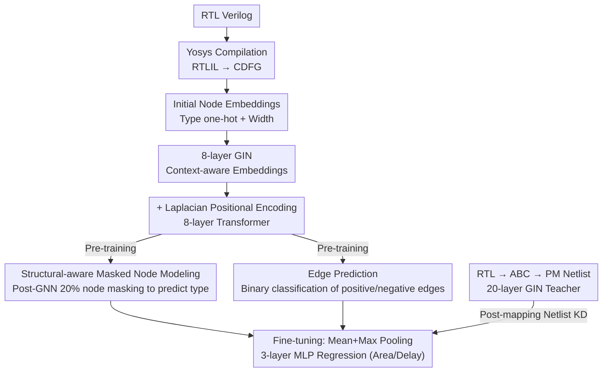

# Beyond Tokens: Enhancing RTL Quality Estimation via Structural Graph Learning

**Conference**: ICML 2026  
**arXiv**: [2508.18730](https://arxiv.org/abs/2508.18730)  
**Code**: https://github.com/cure-lab/StructRTL  
**Area**: Graph Learning / Self-Supervised Learning / EDA  
**Keywords**: RTL Quality Estimation, Graph Self-Supervised Learning, Control Data Flow Graph, Knowledge Distillation, Hardware Design Automation  

## TL;DR
StructRTL is proposed for structural-aware graph self-supervised pre-training (Masked Node Modeling + Edge Prediction) on Control Data Flow Graphs (CDFG) of RTL designs. Combined with knowledge distillation from post-mapping netlists to CDFGs, it significantly outperforms LLM-based and handcrafted feature methods in area and delay prediction tasks.

## Background & Motivation

**Background**: In modern hardware design flows, RTL (Register-Transfer Level) code must undergo logic synthesis to obtain quality metrics such as area and delay, but this process is time-consuming and computationally expensive. Consequently, fast quality estimation directly from the RTL stage has become a research hotspot in EDA.

**Limitations of Prior Work**: Early methods extracted handcrafted features from Data Flow Graphs (DFG) or Abstract Syntax Trees (AST) (e.g., node type frequency, longest combinational path length), which have limited representation capabilities. Recent works (e.g., VeriDistill) utilize Large Language Models (LLMs) to extract token-level embeddings from RTL code, achieving decent results. However, two fundamental issues persist: first, the pre-training objective of LLMs is code generation rather than quality estimation, limiting the transferability of learned representations; second, the token perspective only implicitly encodes the structural semantics of the design, which is less effective than an explicit graph perspective.

**Key Challenge**: DFGs only model data dependencies while ignoring control flow; ASTs focus on syntactic hierarchy and lack structural semantics; LLM token sequences lose topological information. RTL design quality (especially delay) is tightly coupled with structure, which existing representations fail to fully capture.

**Goal**: (1) Design a self-supervised pre-training framework that directly models the structural semantics of CDFGs; (2) Transfer low-level information from post-mapping netlists to the RTL-stage predictor through knowledge distillation.

**Key Insight**: CDFGs integrate both control flow and data flow dependencies, providing a more complete view of design structure than DFG/AST/tokens. The authors observed that directly applying node/edge masking to CDFGs introduces ambiguity (e.g., if an addition node is masked, subtraction or multiplication could be valid alternatives). Therefore, masking is performed at the level of context-aware embeddings generated by GNNs, preserving the integrity of the computation graph while allowing the model to utilize neighborhood context to recover masked information.

**Core Idea**: Use GNN + Transformer to perform structural-aware self-supervised pre-training on CDFGs to learn explicit structural representations, then enhance RTL-stage prediction using knowledge distillation from post-mapping netlists.

## Method

### Overall Architecture
StructRTL aims to predict area and delay directly from RTL code without running logic synthesis by switching from "observing tokens" to "observing structural graphs." The process is as follows: RTL Verilog is compiled into RTLIL intermediate representation via Yosys, then parsed into a CDFG (nodes are operations/storage elements, directed edges are data/control dependencies). Initial node embeddings are a concatenation of type one-hot and bit-width $\mathbf{h}_i^0 = \text{concat}(\text{one-hot}(\text{type}(v_i)), \text{width}(v_i))$. These are processed by 8 layers of GIN to obtain context-aware embeddings, which are then combined with Laplacian global positional encodings and fed into 8 layers of Transformer. During the pre-training stage, two self-supervised tasks (Masked Node Modeling + Edge Prediction) are used to learn the structure. In the fine-tuning stage, a graph-level representation is obtained via mean+max joint pooling, followed by a 3-layer MLP for quality metric regression, with additional knowledge distillation from a post-mapping netlist teacher.

### Key Designs

**1. Structural-aware Masked Node Modeling: Masking after GNN to avoid semantic ambiguity**

Mask-reconstruction is a standard paradigm in graph self-supervised learning, but CDFGs are computation graphs with strictly defined node semantics. If an addition node is masked directly in the raw graph, subtraction or multiplication could be topologically valid alternatives, leaving the model with no way to determine the correct operator; the reconstruction target itself is ambiguous. StructRTL moves the mask after the GIN—randomly selecting 20% of post-GIN embeddings to be replaced by a learnable [MASK] token, then tasking the Transformer with predicting the original node type (32-class classification). Since post-GIN embeddings already encode the neighborhood context, the connection and operator information around the masked node remains, transforming the task from "guessing an isolated node" to "restoring a deterministic answer via context." CDFGs naturally have imbalanced classes (operator nodes are much rarer than wires/registers), so a stratified masking strategy ensures at least $m$ nodes per class are selected. The loss uses a class-balanced focal loss instead of standard cross-entropy, with class weights $w_c = (1-\beta) / (1-\beta^{S_c})$ ($\beta=0.9999$ and focal $\gamma=2.0$) to prevent the model from only learning to predict high-frequency nodes.

**2. Edge Prediction: Recovering topology lost by Transformer flattening**

When post-GIN embeddings are flattened into a sequence for the Transformer, graph connectivity is entirely lost—equivalent to all edges being masked, where the Transformer only sees an unordered set of nodes. Edge prediction restores this topological supervision: in each iteration, 20% of existing edges are sampled as positive samples, and an equal number of non-existent edges are sampled as negative samples. Source and target node Transformer output embeddings are concatenated and passed through a 3-layer MLP for binary classification to determine if an edge exists. This complements masked node modeling—one forces the model to learn node semantics, while the other forces it to recover connection structures from embeddings. The tasks are combined into a pre-training loss $\mathcal{L}_{pre} = \alpha \mathcal{L}_{mnm} + (1-\alpha) \mathcal{L}_{ep}$ ($\alpha=0.5$).

**3. Post-mapping Netlist Knowledge Distillation: Bridging the abstraction gap with a netlist teacher**

RTL is several layers of abstraction away from final area/delay (separated by synthesis and mapping), creating an inherent gap for RTL-only prediction. In contrast, metrics in a post-mapping (PM) netlist can be read almost directly. StructRTL exploits the natural correspondence of the same design across different abstraction levels for cross-layer distillation: first, RTL is synthesized into a PM netlist via Yosys + ABC, and a 20-layer GIN teacher is trained to predict area/delay directly from the netlist (making the teacher inherently more accurate). After freezing the teacher, the CDFG student's last-layer activation is aligned with the PM teacher's last-layer activation. The distillation loss uses both cosine and MSE to constrain direction and magnitude: $\mathcal{L}_{kd} = \tau \cdot \mathcal{L}_{cos}(z_{CDFG}^{-1}, z_{PM}^{-1}) + (1-\tau) \cdot \mathcal{L}_{mse}(z_{CDFG}^{-1}, z_{PM}^{-1})$ ($\tau=0.7$). The total loss is $\mathcal{L}_{total} = \mu \mathcal{L}_{qe} + (1-\mu) \mathcal{L}_{kd}$ ($\mu=0.5$). The teacher is only used during training; the entire synthesis flow is unnecessary during inference, where only the CDFG predictor is retained.

### Loss & Training
- Quality regression uses the log-cosh loss (robust to outliers), with target values subjected to a log transformation before regression.
- Global positional encoding utilizes the first $k=16$ smallest eigenvectors of the symmetric normalized Laplacian matrix of the directed graph. Feature vector signs are randomly flipped during training to enhance generalization.

## Key Experimental Results

### Main Results (Without Knowledge Distillation)

| Method | Area $R^2$↑ | Area MAPE↓ | Delay $R^2$↑ | Delay MAPE↓ |
|------|------------|-----------|-------------|------------|
| Graph-XGBoost | 0.3987 | 0.19 | 0.3362 | 0.12 |
| Graph-GNN | 0.5857 | 0.09 | 0.6639 | 0.13 |
| CodeV-DS-6.7B | 0.4862 | 0.17 | 0.3905 | 0.12 |
| CodeV-CL-7B | 0.5755 | 0.15 | 0.5174 | 0.10 |
| CodeV-QW-7B | 0.6353 | 0.13 | 0.5277 | 0.09 |
| **StructRTL** | **0.7463** | **0.06** | **0.7630** | **0.10** |

### Ablation Study + Knowledge Distillation Effect

| Configuration | Area $R^2$↑ | Delay $R^2$↑ | Description |
|------|-----------|-------------|------|
| StructRTL (full, w/o KD) | 0.7463 | 0.7630 | Full model without distillation |
| w/o $\mathcal{L}_{mnm}$ (w/o KD) | 0.7249 | 0.7473 | $R^2$ decreases without masked node modeling |
| w/o $\mathcal{L}_{ep}$ (w/o KD) | 0.7018 | 0.7368 | $R^2$ decreases more without edge prediction |
| **StructRTL + KD** | **0.8676** | **0.8872** | Substantial gain with knowledge distillation |
| w/o $\mathcal{L}_{mnm}$ + KD | 0.8557 | 0.8796 | Consistent ablation trends under KD |
| w/o $\mathcal{L}_{ep}$ + KD | 0.8480 | 0.8654 | Edge prediction contributes slightly more than MNM |
| CodeV-QW-7B + KD | 0.8174 | 0.7687 | Strongest LLM baseline + KD |
| PM Teacher (Upper Bound) | 0.9334 | 0.9484 | Direct prediction from netlist |

### Key Findings
- Without KD, StructRTL outperforms the strongest LLM baseline (CodeV-QW-7B) by +0.11 (Area) and +0.24 (Delay) in $R^2$. The much higher advantage in delay prediction confirms that structural information is crucial for delay estimation.
- Knowledge distillation brings an $R^2$ improvement of +0.12 (Area) and +0.12 (Delay) to StructRTL.
- Using only 20% of the training data, StructRTL achieves performance competitive with the LLM baseline trained on the full dataset (Area 0.56 / Delay 0.60).
- Industrial Design Evaluation: On 51 pairs of real industrial designs, the ranking accuracy reaches 82.35% for area and 88.23% for delay.
- Inference Speed: Average of 0.096 seconds/design vs. 13.97 seconds/design for synthesis, representing a 145x speedup.

## Highlights & Insights
- **Post-GNN Masking instead of Raw Graph Masking**—This is the most ingenious design. Computation graphs differ from natural language or social networks in that node semantics are strictly constrained. Direct masking of raw nodes allows for multiple valid alternatives, whereas post-GNN masking preserves raw graph integrity while providing sufficient context. This can be transferred to computation graphs in other domains (e.g., compiler IR, circuit netlists).
- **CDFG vs. Token: The "Explicit vs. Implicit Structure" Debate**—Using a 7B LLM to observe code tokens is less effective than using a lightweight GNN+Transformer to observe graph structure, suggesting that task-aligned representations are more important than general large models. This insight can be transferred to other downstream tasks in code analysis.
- **Cross-Abstraction Distillation**—The teacher resides at the PM netlist level and the student at the RTL level. Exploiting the natural correspondence of a design across different abstraction levels for distillation is a strategy applicable to any engineering design problem with multi-level abstractions.

## Limitations & Future Work
- The dataset primarily consists of small-to-medium-sized open-source designs (13,200 samples). While 51 pairs of industrial designs were evaluated, scalability has not been verified on large-scale industrial SoC-level designs.
- CDFG construction depends on successful compilation by Yosys, making it unable to handle RTL code containing proprietary IPs or non-synthesizable constructs.
- Knowledge distillation requires performing synthesis to obtain PM netlist labels, which partially offsets the original intention of "skipping synthesis" (though only required during training).
- The authors note that technology-node migration remains an open problem, as the current model requires recalibration with labeled data for each technology node.
- Future Directions: Extending the method to more EDA quality metrics (Power, Timing Slack) and exploring pure self-supervised quality ranking without synthesis labels.

## Related Work & Insights
- **VeriDistill (Moravej et al., 2025)**: A pioneer in LLM-based RTL embedding + knowledge distillation. This paper switches the representation from tokens to CDFG graphs within a distillation framework.
- **GraphMAE (Hou et al., 2022) / MaskGAE (Li et al., 2023)**: General graph self-supervised learning methods for node feature mask reconstruction and edge mask recovery. This work provides key adaptations for computation graph semantics.
- **MasterRTL (Fang et al., 2023)**: Quality estimation based on handcrafted features of SOG, but SOG construction itself requires partial synthesis steps.

<!-- RELATED:START -->

## Related Papers

- [\[ICML 2026\] DAG-MoE: From Simple Mixture to Structural Aggregation in Mixture-of-Experts](dag-moe_from_simple_mixture_to_structural_aggregation_in_mixture-of-experts.md)
- [\[ACL 2025\] LLMSR@XLLM25: Less is More: Enhancing Structured Multi-Agent Reasoning via Quality-Guided Distillation](../../ACL2025/model_compression/llmsrxllm25_less_is_more_enhancing_structured_multi-agent_reasoning_via_quality-.md)
- [\[NeurIPS 2025\] Enhancing Semi-supervised Learning with Zero-shot Pseudolabels](../../NeurIPS2025/model_compression/enhancing_semi-supervised_learning_with_zero-shot_pseudolabels.md)
- [\[ICML 2025\] Toward Data-centric Directed Graph Learning: An Entropy-driven Approach](../../ICML2025/model_compression/toward_data-centric_directed_graph_learning_an_entropy-driven_approach.md)
- [\[ICML 2026\] Global Convergence of Adaptive Sensing for Principal Eigenvector Estimation](global_convergence_of_adaptive_sensing_for_principal_eigenvector_estimation.md)

<!-- RELATED:END -->
