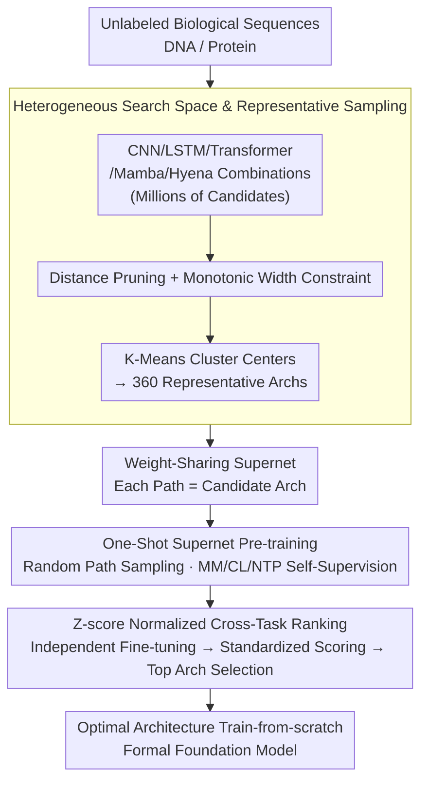

# BioArc: Discovering Optimal Neural Architectures for Biological Foundation Models

**Conference**: ICML 2026  
**arXiv**: [2512.00283](https://arxiv.org/abs/2512.00283)  
**Code**: None  
**Area**: Scientific Computing / Neural Architecture Search  
**Keywords**: Biological Foundation Models, Neural Architecture Search, Heterogeneous Search Space, DNA/Protein Modeling, Hybrid Architectures  

## TL;DR

BioArc proposes a heterogeneous neural architecture search framework for biological foundation models. By automatically discovering optimal hybrid architectures in a search space containing five basic modules (CNN/LSTM/Transformer/Mamba/Hyena), it outperforms existing SOTA biological foundation models with less than 1/25 of the parameters.

## Background & Motivation

**Background**: Current biological foundation models (e.g., ESM, Nucleotide Transformer, DNABERT-2) almost exclusively adopt the Transformer architecture. However, Transformers were originally designed for human language and are not naturally adapted to the unique "grammar" of biological sequences.

**Limitations of Prior Work**: Biological sequences face dual challenges: they require processing extremely long contexts (e.g., whole genomes), where the quadratic complexity of standard Transformers is too costly; and they need to accurately capture local structural motifs, which global attention mechanisms do not naturally prioritize. Crucially, the biological domain lacks a universally accepted optimal architecture paradigm like NLP, leaving architecture design heavily dependent on manual intuition.

**Key Challenge**: Biological information is generated by natural evolution, and its underlying physicochemical laws are not yet fully revealed. Thus, architecture design cannot be guided by prior linguistic understanding as in NLP. Furthermore, architecture tokens, tokenization strategies, and training objectives are deeply coupled and cannot be optimized in isolation.

**Goal**: (1) Automatically discover optimal biological sequence architectures in a heterogeneous search space; (2) Systematically decouple the interactive effects of architecture, tokenization, and training strategies; (3) Verify whether the discovered architectures can capture biological grammar hierarchically.

**Key Insight**: Existing NAS methods are limited to homogeneous spaces (e.g., adjusting CNN layers/channels) or hybrids of at most two module types. The authors expand the search space to open combinations of five heterogeneous modules, enabling data-driven discovery of optimal topologies.

**Core Idea**: Use heterogeneous NAS to search within a composite space of CNN, LSTM, Transformer, Mamba, and Hyena modules to automatically discover optimal hybrid architectures for DNA and protein modeling.

## Method

### Overall Architecture

BioArc addresses the question: moving beyond the inertia of "copying Transformers," what hybrid architecture truly fits biological sequences? It delegates this to data: first defining a search space of open combinations of CNN/LSTM/Transformer/Mamba/Hyena modules, then encoding all candidate architectures into a weight-sharing supernet (where each path is a candidate), and performing self-supervised pre-training using a one-shot strategy with random path sampling. After pre-training, sampled architectures are individually fine-tuned and ranked via cross-task normalization to select the optimal architecture for final training as a formal foundation model.

### Key Designs

**1. Heterogeneous Search Space and Representative Sampling: Combining five modules without combinatorial explosion**

Biological sequences require both long-context handling and local motif extraction; no single module excels at both. BioArc allows five types of modules to be combined freely. A candidate path is defined as $a = (l_1, l_2, \dots, l_d)$, which includes depth $d \in \mathcal{D}$, module type tuple $\mathbf{m}$, and hidden dimension tuple $\mathbf{h}$. To manage the uneven distribution of topological families, BioArc narrows the space to 360 representative architectures using three steps: distance-based filtering after log-transforming dimensions to exclude redundant paths; applying a monotonic width constraint (fixing the widest layers at the end) to increase sampling frequency for parameter-dense modules; and selecting cluster centers via K-Means. This preserves structural diversity while reducing the search space to a computable scale.

**2. One-Shot Supernet Pre-training: Evaluating all candidates in one pass**

Individually training 360 architectures is computationally prohibitive. BioArc embeds them into a weight-sharing supernet. During forward passes, a single path $a \sim \mathcal{A}$ is sampled uniformly at random, and only the weights corresponding to that path are updated to minimize the self-supervised loss $\min_W \mathbb{E}_{a \sim \mathcal{A}}[\mathcal{L}(\mathcal{A}(X; w(a)))]$. The supernet is compatible with three pre-training objectives—masked modeling (MM), contrastive learning (CL), and next token prediction (NTP)—allowing direct comparison of their effects on architecture preference. Random path sampling acts as a regularizer, forcing modules to specialize and preventing co-adaptation.

**3. Z-score Normalized Cross-Task Architecture Ranking: Equalizing task influence**

Candidate architectures are evaluated on heterogeneous downstream tasks with differing metric scales (e.g., Accuracy vs. RMSE). Simply summing raw scores would allow tasks with wider value distributions to dominate the ranking. BioArc standardizes raw performance $P_t(a)$ for each task $t$ using Z-score normalization: $\text{Score}(a) = \frac{1}{|\mathcal{T}|}\sum_{t \in \mathcal{T}} s_t \cdot \frac{P_t(a) - \mu_t}{\sigma_t}$, where $s_t \in \{1, -1\}$ aligns the optimization direction. This ensures each task contributes equally. During this stage, paths are fine-tuned independently rather than using the supernet weights to eliminate coupling interference.

## Key Experimental Results

### Main Results (DNA - GUE benchmark, 12 tasks)

| Method | Params | TFP-0 | TFP-1 | TFP-2 | TFP-3 | TFP-4 | CPD-all | CPD-notata | CPD-tata |
|------|--------|-------|-------|-------|-------|-------|---------|------------|----------|
| NT-2500M | 2500M | 66.31 | 68.30 | 58.70 | 49.08 | 67.59 | 67.39 | 67.46 | 69.66 |
| DNABERT-2 | 117M | 71.99 | 76.06 | 66.52 | 58.54 | 77.43 | 69.37 | 68.04 | 74.17 |
| VQDNA | 103M | 72.48 | 76.43 | 66.85 | 58.92 | 78.10 | 71.02 | 70.58 | 78.50 |
| **Ours (mask-ft)** | **4.89M** | **84.80** | **86.00** | **85.80** | **77.10** | **89.20** | **83.60** | **85.43** | **89.40** |
| **Ours (con-ft)** | **3.28M** | **84.80** | **86.10** | **86.50** | **77.50** | **89.30** | **83.53** | **84.66** | **90.05** |

BioArc outperforms all baselines across all DNA tasks. With only 1/24 to 1/36 of the parameters of DNABERT-2, performance gains reach 12-19 percentage points.

### Protein Experiment (PEER benchmark, controlled comparison)

| Method | Params | Solubility | HumanPPI | PPIAffinity↓ | Fold | Subcellular | Binary |
|------|--------|-----------|----------|-------------|------|-------------|--------|
| ESM-2 8M (Official) | 8M | 73.48 | 80.16 | 3.098 | 22.14 | 71.47 | 91.25 |
| ESM-2 8M (Reproduction) | 8M | 71.84 | 74.68 | 3.567 | 18.25 | 70.36 | 90.68 |
| **Ours 8M** | **8M** | **73.29** | **76.79** | **2.756** | **20.75** | **72.77** | **91.82** |

Under identical pre-training conditions (full UniRef50, 50K steps), BioArc 8M outperforms ESM-2 8M on all 6 protein tasks, demonstrating architectural advantages rather than mere reliance on training scale.

### Key Findings

| Finding | Details |
|------|------|
| Optimal DNA Architecture Pattern | Hyena (long-range) → Transformer (contextual) → CNN (local feature extraction) |
| Architecture Sharing | Similar tasks like TFP-3 and TFP-4 show 98.0% similarity in Top 10% architectures |
| Foundation Model Efficiency | BioArc-F exceeds DNABERT-2 with 1/20 params and 1/10 training steps |
| Tokenization-Architecture Coupling | Transformers prefer 6-mer, while CNNs prefer 1-mer; joint optimization is necessary |
| Pre-training Strategies | Masked modeling is generally best, though training from scratch is superior for specific tasks |
| Interpretability Validation | Hybrid architectures hierarchically capture promoter syntax: Hyena establishes global context → Transformer anchors TSS → CNN detects Inr+DPE coordination |

## Highlights & Insights

**Value**:
- Constructs the first NAS search space for biological sequences featuring five heterogeneous modules, breaking the previous limit of two-module hybrids.
- Discovered architectures significantly outperform baselines 100x their size with minimal parameters (3-8M), highlighting the importance of architectural inductive bias.
- Systematically decouples the interaction between architecture, tokenization, and training strategies, providing actionable principles for biological model design.
- Interpretability analysis shows that hybrid architectures spontaneously learn hierarchical representations corresponding to known biological mechanisms.

**Limitations & Future Work**:
- Validation is limited to DNA and protein modalities; generalizability to RNA and single-cell data remains unknown.
- The search space is fixed to 360 representative architectures, potentially missing some promising topological combinations.
- Absolute performance on protein structure prediction (e.g., Fold task) still lags behind large-scale pre-trained models like ESM-2, indicating that architectural advantages cannot fully substitute for data scale.

<!-- RELATED:START -->

## Related Papers

- [\[ICML 2026\] Quantifying the Uncertainty of Foundation Models with Singular Value Ensembles](quantifying_the_uncertainty_of_foundation_models_with_singular_value_ensembles.md)
- [\[ICML 2026\] End-to-End Compression for Tabular Foundation Models](end-to-end_compression_for_tabular_foundation_models.md)
- [\[ICML 2026\] PRISM: Synergizing Vision Foundation Models via Self-Organized Expert Specialization](prism_synergizing_vision_foundation_models_via_self-organized_expert_specializat.md)
- [\[ICML 2026\] Auditing and Fixing Economic Validity in Tabular Foundation Models for Discrete Choice](auditing_and_fixing_economic_validity_in_tabular_foundation_models_for_discrete_.md)
- [\[ICML 2026\] UB-SMoE: Universally Balanced Sparse Mixture-of-Experts for Resource-Adaptive Federated Fine-tuning of Foundation Models](ub-smoe_universally_balanced_sparse_mixture-of-experts_for_resource-adaptive_fed.md)

<!-- RELATED:END -->
