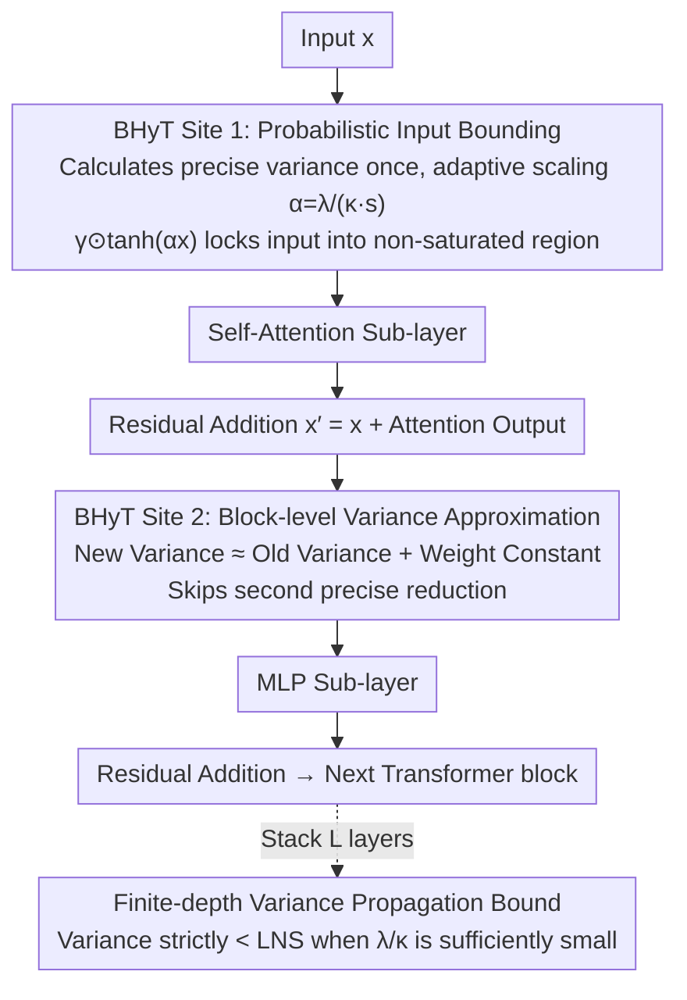

# Bounded Hyperbolic Tangent: A Stable and Efficient Alternative to Pre-Layer Normalization in Large Language Models

**Conference**: ICML 2026  
**arXiv**: [2601.09719](https://arxiv.org/abs/2601.09719)  
**Code**: https://github.com/MLAI-Yonsei/BHyT  
**Area**: LLM Efficiency  
**Keywords**: Normalization alternative, Transformer stability, Training efficiency, Variance propagation, Depth scaling

## TL;DR

Ours proposes Bounded Hyperbolic Tanh (BHyT), a data-driven input-bounded $\tanh$ transformation, as a plug-and-play alternative to Pre-Layer Normalization. It suppresses depth-wise activation growth while avoiding redundant variance calculations, achieving 1.6% faster training and a 1.77% increase in generation throughput compared to RMSNorm, with downstream performance consistently exceeding existing methods.

## Background & Motivation

**Background**: Pre-Layer Normalization (Pre-LN) is the standard architecture for modern LLMs, typically implemented via RMSNorm, which stabilizes training by normalizing inputs before self-attention and MLP sub-layers.

**Limitations of Prior Work**: Pre-LN suffers from two core issues. First, the **curse of depth**—the interaction between residual connections and Pre-LN causes the magnitude and variance of hidden states to explode as the layer count increases, making deep blocks degenerate into computationally expensive identity mappings. Second, **computational overhead**—each block requires redundant per-token statistics (mean/variance) at two Pre-LN sites, making these accumulated reduction operations a bottleneck for training and inference latency.

**Key Challenge**: Existing improvements offer either stability or efficiency, but rarely both. Stability-oriented methods like Peri-LN apply normalization both before and after sub-layers, which effectively suppresses variance growth but doubles the computational overhead. Efficiency-oriented normalization-free methods like Dynamic Tanh (DyT) replace normalization with $\tanh(\alpha x)$ using a learnable scalar $\alpha$; while this eliminates statistical calculations, the global scalar scaling cannot control depth-wise growth of the residual stream, causing large inputs to enter the $\tanh$ saturation region and trigger vanishing gradients.

**Goal**: To design a Pre-LN alternative that simultaneously addresses stability and efficiency—avoiding redundant statistical calculations like DyT while providing provable guarantees for depth-wise variance control.

**Key Insight**: The authors observe that the instability of DyT stems from its data-independent learnable global scalar, which fails to adaptively constrain inputs into the non-saturated region of $\tanh$. By bounding inputs in a data-driven manner, stability can be achieved while maintaining the efficiency of bounded transformations.

**Core Idea**: Replace DyT's global scaling with probabilistic input bounding based on Chebyshev’s inequality. This ensures that pre-$\tanh$ parameters fall into the predefined non-saturated interval $[-\lambda, \lambda]$ with high probability. Additionally, use block-level variance approximation to avoid redundant precise calculations.

## Method

### Overall Architecture

BHyT replaces the two Pre-LN sites (before Attention and MLP) in a Transformer block. It suppresses activation expansion without redundant statistics by swapping normalization with a bounded $\tanh$ transformation $\gamma \odot \tanh(\alpha x)$. The core lies in the algorithm for the scaling factor $\alpha$: the first site precisely calculates the input variance $s_x^2$ to constrain the input into the non-saturating zone; the second site skips precise reduction and instead recurses the variance using a constant dependent only on the weight matrix. Across $L$ layers, a finite-depth variance propagation bound is provided to theoretically guarantee the suppression of variance expansion.

### Key Designs

**1. Probabilistic Input Bounding: Data-driven scaling to lock inputs into the $\tanh$ non-saturated region**

The primary flaw of normalization-free schemes like DyT is the use of a data-independent learnable global scalar $\alpha_{\text{DyT}}$, which fails to prevent saturation and vanishing gradients in deep layers. BHyT utilizes Chebyshev’s inequality: for any distribution with finite variance, $|X - \mu| \leq \kappa s$ holds with probability $\geq 1 - \kappa^{-2}$. By setting the scaling factor $\alpha = \lambda / (\kappa s_x + |\mu_x|)$, $\text{BHyT}^*(x) = \gamma \odot \tanh(\alpha x)$ constrains inputs to $[-\lambda, \lambda]$ with high probability. In practice, a zero-mean approximation similar to RMSNorm simplifies this to $\alpha = \lambda / (\kappa s_x)$, with default $p=0.99$ ($\kappa=10$) and $\lambda=1$. Unlike DyT, this $\alpha$ adapts to the current input variance, preventing saturation even as distributions shift.

**2. Block-level Variance Approximation: Replacing precise reduction with recursive lookup at the second site**

Precise variance calculation requires a full reduction across the feature dimension, which is the main source of normalization latency. Since every block has two Pre-LN sites, BHyT only calculates $s_x^2$ precisely at the first site. For the second site $x' = x + h_{\text{Attn}}$, the variance is approximated as $\tilde{s}_{x'}^2 = s_x^2 + \tilde{s}_{h_{\text{Attn}}}^2$. The attention output variance is estimated via a model-level constant: $\tilde{s}_{h_{\text{Attn}}}^2 \approx \frac{1}{Td} \|W_V W_O\|_F^2 \cdot \lambda_{\text{Attn}}^2 / \kappa^2$. This constant depends only on weights and hyperparameters and can be pre-computed. This reduces the second site to a constant lookup, allowing parallel execution with the attention forward pass.

**3. Finite-depth Variance Propagation Bound: Provable guarantees for depth stability**

BHyT proves that if the hyperparameters satisfy $\lambda / \kappa < 1/\sqrt{L}$ (where $L$ is the number of layers), the output variance at each layer remains strictly smaller than LayerNorm Scaling (LNS). With defaults $\lambda=1, \kappa=10$, this condition holds for $L < 100$, covering most practical models. BHyT thus provides both efficiency and a theoretically grounded variance bound.

## Key Experimental Results

### Main Results (Pre-training)

| Model | Method | PT Eval PPL | Avg. 3-shot Acc. | Training Throughput |
|------|------|------------|-----------------|---------|
| Llama-374M | RMSNorm | 24.92 | 40.03 | baseline |
| Llama-374M | Peri-LN | 25.02 | 39.71 | — |
| Llama-374M | DyT | 27.09 | 39.12 | — |
| Llama-374M | **BHyT** | **24.71** | **40.31** | — |
| Llama-1B | RMSNorm | 17.75 | 41.94 | 81.7K tok/s |
| Llama-1B | Peri-LN | 17.89 | 42.31 | — |
| Llama-1B | LNS | 17.26 | 42.85 | — |
| Llama-1B | DyT | 18.07 | 42.71 | — |
| Llama-1B | **BHyT** | **16.47** | **43.42** | **83.0K tok/s (+1.6%)** |

### Ablation Study (Variance Approximation Effect)

| Config | PT Eval PPL | Avg. Acc. | Step/sec | Note |
|------|------------|----------|----------|------|
| RMSNorm (Precise) | 26.35 | 41.64 | 0.346 | Baseline |
| BHyT* (Precise) | 25.89 | **42.71** | 0.335 | Optimal performance but slower than RMSNorm |
| BHyT (Approx) | 25.87 | 42.53 | **0.381** | Minimal performance loss, highest speed |

### Key Findings
- BHyT achieves the lowest PPL and highest average downstream accuracy across Llama-374M, 1B, and 3B scales, with its advantage widening as the model size increases.
- In terms of generation throughput on Llama-1B, BHyT reaches 1199.9 tokens/s, which is 1.6% faster than RMSNorm and 18.0% faster than Peri-LN.
- Variance approximation incurs almost no performance loss (PPL difference of 0.02) while increasing speed from 0.335 to 0.381 steps/s, surpassing RMSNorm.
- Layer-wise analysis shows that while RMSNorm and DyT experience significant growth in activation magnitude/variance with depth, BHyT maintains stability across the entire network.

## Highlights & Insights
- **Data-driven vs. Learnable Scaling**: BHyT demonstrates that in bounded transformations, using adaptive scaling based on input statistics rather than learnable global scalars provides fundamentally better depth stability without adding parameters.
- **"Free Lunch" of Variance Approximation**: By utilizing the property that attention output variance depends primarily on weight matrices, BHyT reduces $O(d)$ reduction operations to constant lookups that can run in parallel with the attention forward pass. 
- **Practicality of Theoretical Guarantees**: The condition $\lambda/\kappa < 1/\sqrt{L}$ is easily satisfied for models with $L < 100$, making BHyT's stability guarantees applicable to nearly all mainstream LLM architectures.

## Limitations & Future Work
- The maximum experimental scale was Llama-3B with 20B tokens; performance at 7B+ scales or with trillions of tokens, as well as hyperparameter robustness, remains to be verified.
- Variance approximation relies on the assumption of uniform attention weights, which may require modification for sparse attention or MoE architectures.
- While BHyT is fast, DyT remains the throughput leader (approx. 12% faster); DyT may still be preferable for shallow models where extreme depth stability is not critical.
- Current validation is restricted to decoder-only LLMs; applicability to encoder-decoder or Vision Transformers is yet to be confirmed.

## Related Work & Insights
- **Peri-LN** (Kim et al., 2025): A stability scheme using double normalization per sub-layer; BHyT proves that a lighter-weight approach can achieve superior results.
- **Dynamic Tanh (DyT)** (Zhu et al., 2025): An efficiency scheme using $\tanh(\alpha x)$ to replace normalization; BHyT builds on this by adding data-driven input bounding to solve depth instability.
- **LayerNorm Scaling (LNS)** (Sun et al., 2026): Controls variance growth via layer index scaling; BHyT theoretically proves a tighter variance bound than LNS.

<!-- RELATED:START -->

## Related Papers

- [\[ICML 2026\] NanoQuant: Efficient Sub-1-Bit Quantization of Large Language Models](nanoquant_efficient_sub-1-bit_quantization_of_large_language_models.md)
- [\[ICML 2026\] Decouple Searching from Training: Scaling Data Mixing via Model Merging for Large Language Model Pre-training](decouple_searching_from_training_scaling_data_mixing_via_model_merging_for_large.md)
- [\[ICML 2026\] Model Merging Scaling Laws in Large Language Models](model_merging_scaling_laws_in_large_language_models.md)
- [\[ICML 2026\] GradPower: Powering Gradients for Faster Language Model Pre-Training](gradpower_powering_gradients_for_faster_language_model_pre-training.md)
- [\[ICML 2026\] The Shape of Addition: Geometric Structures of Arithmetic in Large Language Models](the_shape_of_addition_geometric_structures_of_arithmetic_in_large_language_model.md)

<!-- RELATED:END -->
