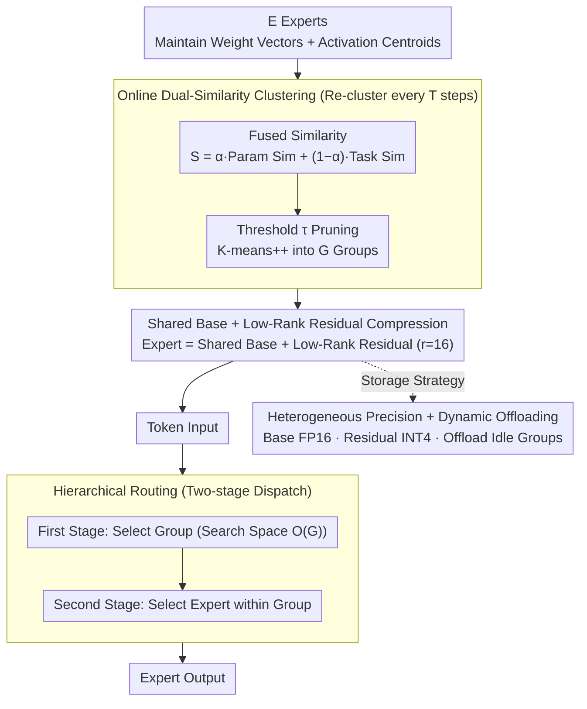

# Breaking the MoE LLM Trilemma: Dynamic Expert Clustering with Structured Compression

**Conference**: ICML 2026  
**arXiv**: [2510.02345](https://arxiv.org/abs/2510.02345)  
**Code**: https://github.com/szdtzpj/Breaking_the_moe_trilemma (Available)  
**Area**: Model Compression / MoE LLM / System Optimization  
**Keywords**: Mixture-of-Experts, Dynamic Expert Clustering, Low-rank Residuals, Hierarchical Routing, Heterogeneous Precision

## TL;DR
To address the "load imbalance – parameter redundancy – communication overhead" trilemma in MoE LLMs, this paper proposes a unified framework: using online clustering based on "parameter + activation" dual similarity to group experts. Within groups, structured compression (~5×) is applied via a "shared base matrix + low-rank residuals." This is combined with two-stage hierarchical routing ("select group then select expert"), FP16/INT4 heterogeneous precision, and offline offloading of idle groups. On GLUE/WikiText-103, Ours matches standard MoE performance with ~80% parameter reduction, 10–20% throughput gain, and a 3× reduction in expert load variance.

## Background & Motivation

**Background**: Mixture-of-Experts (MoE) has become the critical path for scaling LLMs (Switch, GShard, Mixtral, etc.)—theoretically increasing parameter capacity without significantly increasing FLOPs.

**Limitations of Prior Work**: Running MoE on A100/H100 clusters encounters an "optimization trilemma": (i) **Load Imbalance**—top-$k$ gating causes a few experts to be overloaded while most remain idle; (ii) **Parameter Redundancy**—the linear increase in parameters with expert count exhausts HBM capacity; (iii) **All-to-all Communication Overhead**—dispatching tokens to experts across different devices often becomes the dominant latency, especially for long sequences.

**Key Challenge**: Existing methods address these issues in isolation. Load balancing losses (Switch loss) are reactive and fail under distribution shifts; compression methods like MoE-Lite treat experts as independent entities, ignoring structural similarities; communication-aware routing (Tutel, SmILE) optimizes data paths on fixed architectures without addressing redundancy or imbalance. Worse, these three objectives often conflict—optimizing one variable frequently degrades another.

**Goal**: A single framework to simultaneously reduce total storage, compress per-token active parameters, maintain model quality, lower cross-device traffic, and keep re-clustering overhead controllable.

**Key Insight**: The core insight is that "experts activated by semantically similar inputs also exhibit redundancy in their parameters." This hypothesis enables the co-optimization of architecture (grouping) and systems (routing/storage/communication).

**Core Idea**: Use dynamic clustering to group functionally similar experts → compress parameters within groups using shared bases and low-rank residuals → route first to groups then to experts, reducing all-to-all communication to a hierarchical two-level process.

## Method

### Overall Architecture
This paper addresses the bottlenecks of load imbalance, parameter redundancy, and communication overhead using a "group structure" as a unified abstraction. The objective is formulated as $\min L_{\text{task}}+A_1 I_{\text{load}}+A_2 R_{\text{red}}+A_3 C_{\text{comm}}$ (Eq. 1). Beyond the task loss, the three terms penalize load imbalance, parameter redundancy, and communication volume. The grouping mechanism, compressed parameterization, and routing strategy are all designable variables. A forward pass proceeds as follows: $E$ experts are clustered online into $G$ groups (each with $K=E/G$ experts) based on "parameter + activation" dual similarity → weights are compressed using a "shared base matrix + low-rank residuals" → incoming tokens are routed to a group and then to specific experts within that group → parameters are stored using heterogeneous precision (FP16 base + INT4 residuals) with idle groups offloaded to CPU/NVMe.

### Key Designs

**1. Online Dual-Similarity Clustering: Aligning Appearance and Purpose**

If experts are grouped only by parameter similarity, they may "look similar" but not be activated by the same tokens. Conversely, grouping only by activation similarity might force experts with vastly different weights into the same group, making low-rank compression ineffective. Ours maintains weight vectors $\text{vec}(W_i)$ and activation centroids $\mu_i$ (updated via EMA: $\mu_i\leftarrow(1-\beta)\mu_i+\beta\bar{x}_i$, default $\beta=0.05$) for each expert $\mathcal{E}_i$. Cosine similarities yield parameter similarity $S_{\text{param}}$ and task similarity $S_{\text{task}}$, fused as $S=\alpha S_{\text{param}}+(1-\alpha)S_{\text{task}}$ (default $\alpha>0.5$). This ensures groups are both compressible and activated by similar tokens.

Re-clustering occurs every $T$ steps: a threshold $\tau$ (default 0.1) prunes low-similarity pairs to reduce the $O(E^2)$ comparison; K-means++ is run on distance $D=1-S$. Boundary experts are greedily moved to balance group sizes. To amortize costs, $S_{\text{param}}$ is cached for $m$ steps, and similarity is only recalculated for experts whose weights change by more than $\epsilon$.

**2. Shared Base + Low-Rank Residual Structured Compression**

Since group members are functionally similar, their "expertise" likely resides in a low-rank subspace. For each group $g$, the shared base is the mean weight $W_{\text{base}}^g=\frac{1}{|\mathcal{G}_g|}\sum_{i\in\mathcal{G}_g}W_i$. Each expert is represented by a low-rank residual:

$$\tilde W_i=W_{\text{base}}^g+A_i B_i^\top,\quad A_i\in\mathbb{R}^{d_{in}\times r},\; B_i\in\mathbb{R}^{d_{out}\times r},\; r\ll\min(d_{in},d_{out})$$

With $r=16$, the forward pass is $\tilde W_i x=W_{\text{base}}^g x+A_i(B_i^\top x)$, where the base computation is shared across all experts in a group for the same tokens. This achieves a compression ratio (CR) of ~6.6× for $d=4096, K=8, r=16$. Residuals are initialized via $\text{TSVD}(W_i-W_{\text{base}}^g)$ after each re-clustering.

**3. Hierarchical Routing: Two-Stage Dispatch**

This design leverages the group structure to optimize communication. Flat top-$k$ routing is replaced by two levels: the first selects the group (reducing search space from $O(E)$ to $O(G)$), and the second selects the expert within the group. All-to-all communication is performed at the group level, significantly reducing cross-device traffic. Group-level dispatch acts as a coarse load balancer, structurally suppressing load variance.

**4. Heterogeneous Precision + Dynamic Offloading**

To keep peak memory close to dense model levels, Ours employs heterogeneous precision: $W_{\text{base}}^g$ is stored in FP16 due to its sensitivity, while $A_i, B_i$ are quantized to INT4 since residual errors are easily absorbed. Furthermore, inactive groups are dynamically offloaded from GPU to CPU/NVMe. Both strategies benefit from the group granularity established by clustering.

### Loss & Training
Training optimizes Eq. 1, balancing task loss with the three regulatory terms $I_{\text{load}}, R_{\text{red}}, C_{\text{comm}}$ using hyperparameters $A_1, A_2, A_3$. Parameters such as clustering period $T$, cache life $m$, and rank $r$ are configurable.

## Key Experimental Results

### Main Results

| Metric | Standard MoE | Ours |
|---|---|---|
| Total Parameters (Relative) | 1.0× | ≈ 0.20× (~80% Reduction) |
| Inference Throughput | 1.0× | 1.10–1.20× |
| Expert Load Variance | 1.0× | < 0.33× (> 3× Reduction) |
| GLUE / WikiText-103 Quality | baseline | Comparable |
| Peak Memory | High (Linear with experts) | Near-dense level |

### Ablation Study

| Configuration | Observation |
|---|---|
| Low-rank residuals only (No grouping) | Shared base fails; high reconstruction error |
| Clustering only (No compression) | Communication and load variance improved; params unchanged |
| Hierarchical routing only | Lower traffic; parameter redundancy and load drift remain |
| Full Framework | All system metrics reach Pareto frontier |
| $r=4$ | High CR; reconstruction error > 1.5%; quality drop |
| $r\in\{16, 32\}$ | Error plateaus; $r=16$ is most cost-effective |

### Key Findings
- $r=16$ is the "sweet spot": higher ranks increase latency linearly with minimal error reduction; lower ranks lack capacity for residuals.
- Both similarity metrics are necessary: removing $S_{\text{param}}$ leads to poor compression; removing $S_{\text{task}}$ makes hierarchical routing behave like random partitioning.
- Using router logits as semantic embeddings provides an efficient, LLM-native signal for online functional clustering.

## Highlights & Insights
- Promotes grouping from a "post-hoc compression trick" to a "first-class architectural citizen"—a dynamic grouping mechanism that simultaneously drives compression, routing, and memory policies.
- The "Shared Base + Low-Rank Residual" approach follows the lineage of LoRA/MoLE but is applied internally to experts and maintained dynamically during training.
- Heterogeneous precision (FP16 base + INT4 residual) exploits the physical fact that residuals are small in magnitude, avoiding the performance cliff of uniform INT4 quantization.

## Limitations & Future Work
- Online clustering entails $O(E^2)$ overhead; although mitigated by pruning and caching, its impact on training throughput needs verification at scales like DeepSeek-MoE.
- Evaluation is limited to GLUE/WikiText-103, which is small compared to modern MoE LLM training scales.
- Re-clustering causes "spikes" in warm-started residuals; stable training on larger runs needs more investigation.
- Interaction between dynamic offloading and expert parallelism in multi-node setups remains unexplored.

## Related Work & Insights
- **vs MoE-Lite**: Treats experts independently; Ours uses clustering to discover inter-expert similarity for shared compression, achieving higher ratios.
- **vs Sub-MoE / Expert-Fusion**: These perform static/permanent merging, losing specialization; Ours uses dynamic clustering + residuals to preserve specialization.
- **vs Tutel / SmILE**: They focus on communication for fixed architectures; Ours restructures expert organization to provide better granularity for system optimization.

## Rating
- Novelty: ⭐⭐⭐⭐⭐ Dynamic clustering as a unified host for compression, routing, and memory is a rare "unified prescription."
- Experimental Thoroughness: ⭐⭐⭐ Datasets are small; lacks validation on massive MoE LLMs, though ablation studies are complete.
- Writing Quality: ⭐⭐⭐⭐ The trilemma narrative is clear, and Eq. 1 explicitly defines objectives.
- Value: ⭐⭐⭐⭐ ~80% parameter reduction with 10–20% throughput gain and 3× lower load variance is a highly attractive engineering direction for MoE deployment.

<!-- RELATED:START -->

## Related Papers

- [\[ICML 2026\] GEMQ: Global Expert-Level Mixed-Precision Quantization for MoE LLMs](gemq_global_expert-level_mixed-precision_quantization_for_moe_llms.md)
- [\[ICML 2026\] Geo-Expert: Fine-Tuning an 8B Model into an Expert-Level Geological Reasoning LLM via LoRA](geo-expert_towards_expert-level_geological_reasoning_via_parameter-efficient_fin.md)
- [\[ICLR 2026\] Steering MoE LLMs via Expert (De)Activation](../../ICLR2026/model_compression/steering_moe_llms_via_expert_deactivation.md)
- [\[AAAI 2026\] CAMERA: Multi-Matrix Joint Compression for MoE Models via Micro-Expert Redundancy Analysis](../../AAAI2026/model_compression/camera_multi-matrix_joint_compression_for_moe_models_via_mic.md)
- [\[ICLR 2026\] SERE: Similarity-based Expert Re-routing for Efficient Batch Decoding in MoE Models](../../ICLR2026/model_compression/sere_similarity-based_expert_re-routing_for_efficient_batch_decoding_in_moe_mode.md)

<!-- RELATED:END -->
