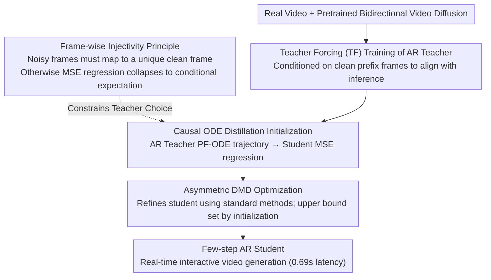

# Causal Forcing: Autoregressive Diffusion Distillation Done Right for High-Quality Real-Time Interactive Video

**Conference**: ICML 2026  
**arXiv**: [2602.02214](https://arxiv.org/abs/2602.02214)  
**Code**: TBD  
**Area**: Video Generation / Diffusion Distillation  
**Keywords**: Autoregressive Video Generation, Diffusion Distillation, Causal Attention, Frame-wise Injectivity

## TL;DR
This paper identifies the theoretical requirement of "**frame-wise injectivity**" and proposes Causal Forcing—a method that replaces the **bidirectional teacher with an autoregressive teacher** for ODE distillation initialization. This avoids the performance collapse seen in Self-Forcing, achieving significant gains over Self-Forcing in dynamics (+19.3%), VisionReward (+8.7%), and instruction following (+16.7%), while maintaining the same inference latency (0.69s).

## Background & Motivation

**Background**: Real-time interactive video generation requires distilling multi-step diffusion models into few-step autoregressive (AR) models. Current methods (CausVid, Self-Forcing) employ "asymmetric distillation"—distilling a pretrained bidirectional video diffusion model into an AR student model.

**Limitations of Prior Work**: Although Self-Forcing is the state-of-the-art (SOTA), a significant performance gap remains compared to standard DMD (distilling a bidirectional student), with 10-20% regressions in dynamics, visual quality, and instruction following. This suggests a fundamental issue in existing AR distillation pipelines.

**Key Challenge**: An "architectural gap" exists when distilling from a bidirectional model to an AR student—bidirectional models use full attention (accessing future frames), while AR models are restricted to causal attention (based only on past frames). While existing methods use ODE initialization and DMD stages, neither theoretically handles this gap correctly.

**Goal**: The root cause is that ODE distillation violates the "**frame-wise injectivity**" requirement. When distilling from a bidirectional teacher to an AR student, the same noisy frame can correspond to multiple different clean frames, causing the MSE loss to learn a conditional expectation (average) rather than a true flow mapping. The solution is to use an AR teacher for ODE distillation initialization, as the AR teacher's PF-ODE naturally satisfies frame-wise injectivity.

## Method

### Overall Architecture

The goal is to distill a multi-step bidirectional video diffusion model into a few-step AR student for real-time interaction. The core innovation is replacing the "teacher" used for ODE initialization. The process consists of three stages: first, training an AR diffusion model as a teacher using Teacher Forcing (TF); second, initializing the few-step AR student using Causal ODE distillation from this AR teacher; and third, further optimizing the student via asymmetric DMD. The critical difference from Self-Forcing is using an AR teacher that satisfies frame-wise injectivity for initialization.

### Key Designs

**1. Frame-wise Injectivity: Diagnosing the Root Cause of Self-Forcing Collapse**

The loss of visual quality and dynamics in Self-Forcing was previously treated as an engineering tuning issue. This paper attributes it to a neglected theoretical condition: frame-wise injectivity. For ODE distillation to work, each noisy frame must map to a unique clean frame, i.e., for any noisy frame $x_t^i$, there exists a unique $x_0^i$ such that $x_0^i = \phi^{AR}(x_t^i, t)$. While bidirectional teachers satisfy injectivity at the level of the *entire video*, they break it at the *single-frame level* (Lemma 3.2): the same noisy frame corresponds to different clean frames depending on subsequent frames. Consequently, the student's MSE objective fails to converge to a deterministic flow mapping and collapses to the conditional expectation $\mathbb{E}[x_0^i \mid x_t^i]$—averaging multiple outcomes, which blurs the output. This is a fundamental flaw in the initialization phase that DMD cannot recover from.

**2. Teacher Forcing vs. Diffusion Forcing: Selecting the "Non-standard" TF**

To build an AR teacher, one must choose the conditioning method. Diffusion Forcing (DF) conditions on noisy prefix frames $x_t^{<i}$, while Teacher Forcing (TF) conditions on clean prefix frames $x_0^{<i}$. Although DF is often considered standard, TF is superior here (Proposition 3.4). DF creates a training-inference distribution mismatch: the model sees high-noise prior frames during training but clean, generated frames during inference. TF aligns training with inference inputs, eliminating this gap. Experiments show a massive difference—TF achieves 111.2% higher VisionReward than DF.

**3. Causal ODE Distillation: Initializing with an Injective AR Teacher**

Applying the TF-trained AR teacher for ODE initialization replaces the bidirectional teacher. Given ground-truth clean prefix frames $x_{gt}^{<i}$ and starting from Gaussian noise $x_T^i$, the AR teacher generates a sequence of intermediate states $\{x_t^i\}_{t \in \mathcal{S}}$ along the PF-ODE trajectory. The student then fits this flow mapping via MSE regression:

$$\min_\theta \mathbb{E}\big[\|G_\theta(x_t^i, x_{gt}^{<i}, t) - x_0^i\|^2\big]$$

This works because the AR teacher is inherently causal; its PF-ODE naturally satisfies frame-wise injectivity. The MSE regression no longer collapses to an average, and the student learns a true flow mapping. This provides a clean, high-quality starting point for DMD, which experiments confirm is bounded by the quality of this initialization.

## Key Experimental Results

### Main Results

| Model | Throughput ↑ | Latency ↓ | Dynamics ↑ | VisionReward ↑ | Instruction Following ↑ | User Rating ↓ |
| :--- | :--- | :--- | :--- | :--- | :--- | :--- |
| Wan2.1 (Bidirectional) | 0.78 | 103s | 61 | 5.275 | 42 | 2.29 |
| CausVid (AR Distill) | 17.0 | 0.69s | 62 | 5.741 | 12 | 4.27 |
| Self-Forcing | 17.0 | 0.69s | 57 | 5.820 | 48 | 2.87 |
| **Ours (Causal Forcing)** | **17.0** | **0.69s** | **68** | **6.326** | **56** | **1.64** |

Improvements over Self-Forcing: Dynamics +19.3%, VisionReward +8.7%, Instruction Following +16.7%.

### Ablation Study

| Configuration | Dynamics | VisionReward | Instruction Following | Description |
| :--- | :--- | :--- | :--- | :--- |
| DF + Self-Forcing ODE + DMD | 60 | 1.583 | 30 | DF causes severe collapse |
| TF + Self-Forcing ODE + DMD | 50 | 3.343 | 32 | TF improves but ODE is insufficient |
| TF + Self-Forcing ODE + DMD (Chunk) | 24 | 3.330 | 38 | Bidirectional teacher ODE performs poorly |
| **TF + Causal ODE + DMD (Chunk)** | **68** | **6.326** | **56** | Full Proposed Method |

### Key Findings
- TF significantly outperforms DF (VisionReward +111.2%), highlighting the importance of training-inference distribution alignment.
- Causal ODE provides massive gains over Self-Forcing ODE in chunk-level settings (VisionReward +90%, Dynamics +183%), with even more extreme gains in frame-level evaluations.
- The DMD stage cannot compensate for poor ODE initialization—the initialization quality determines the performance ceiling for DMD.

## Highlights & Insights
- **Clear Theoretical Contribution**: The paper is the first to use the mathematical framework of frame-wise injectivity to explain performance collapse in AR distillation, proving that Self-Forcing fundamentally violates this condition.
- **Correction of TF vs. DF**: It challenges common wisdom by proving DF is inferior to TF for AR diffusion; the paper provides a rigorous proof of distribution mismatch and quantifies the 111% performance gap.
- **Transferable Design**: The frame-wise injectivity principle applies not only to ODE distillation but also naturally extends to Consistency Distillation (CD) frameworks.
- **Practical Effectiveness**: Achieves double-digit percentage improvements over SOTA Self-Forcing across multiple metrics under identical computational budgets.

## Limitations & Future Work
- Gap in long video generation: The model trained on 5-second videos suffers from a training-inference gap when extrapolated; requires orthogonal long-video methods like LongLive or Rolling Forcing.
- CD still weaker than ODE: The proposed Causal CD, while theoretically correct, currently underperforms Causal ODE distillation, potentially due to the vanilla LCM implementation.
- Insufficient comparison with GAN distillation: Comparison with APT2 (which uses GAN + TF-CD initialization) was not possible as it is not open-sourced.

## Related Work & Insights
- **vs. Self-Forcing** (Huang et al. 2025a): Both use a two-stage ODE + DMD pipeline. However, Self-Forcing uses a bidirectional teacher while this work uses an AR teacher to satisfy frame-wise injectivity—fixing a fundamental architectural flaw.
- **vs. CausVid** (Yin et al. 2025): Both focus on AR distillation, but CausVid uses an asymmetric paradigm with lower performance.
- **vs. DMD Methodology**: While standard DMD works well for bidirectional students, it fails for AR student initialization; initialization quality is the limiting factor for DMD performance.

## Rating
- Novelty: ⭐⭐⭐⭐⭐  The theoretical framework of frame-wise injectivity and the correction of the TF vs. DF paradigm are pioneering.
- Experimental Thoroughness: ⭐⭐⭐⭐⭐  Covers ODE, DMD, and CD across chunk and frame-level modes, with 5 baselines and multi-dimensional evaluation (VBench, VisionReward, User Study).
- Writing Quality: ⭐⭐⭐⭐  Clear theoretical derivation and deep diagnostic insights.
- Value: ⭐⭐⭐⭐⭐  Resolves a core performance bottleneck in real-time video generation with a reusable theoretical framework.

## Related Papers

- [\[CVPR 2026\] InstantViR: Real-Time Video Inverse Problem Solver with Distilled Diffusion Prior](../../CVPR2026/model_compression/instantvir_real-time_video_inverse_problem_solver_with_distilled_diffusion_prior.md)
- [\[CVPR 2025\] Towards Practical Real-Time Neural Video Compression](../../CVPR2025/model_compression/towards_practical_real-time_neural_video_compression.md)
- [\[CVPR 2026\] Real-Time Neural Video Compression with Unified Intra and Inter Coding](../../CVPR2026/model_compression/real-time_neural_video_compression_with_unified_intra_and_inter_coding.md)
- [\[ICML 2026\] Beyond Tokens: Enhancing RTL Quality Estimation via Structural Graph Learning](beyond_tokens_enhancing_rtl_quality_estimation_via_structural_graph_learning.md)
- [\[ICML 2026\] LFQ: Logit-aware Final-block Quantization for Boosting the Generation Quality of Low-Bit Quantized LLMs](lfq_logit-aware_final-block_quantization_for_boosting_the_generation_quality_of_.md)

<!-- RELATED:END -->

<!-- RELATED:START -->

## Related Papers

- [\[CVPR 2026\] InstantViR: Real-Time Video Inverse Problem Solver with Distilled Diffusion Prior](../../CVPR2026/model_compression/instantvir_real-time_video_inverse_problem_solver_with_distilled_diffusion_prior.md)
- [\[CVPR 2025\] Towards Practical Real-Time Neural Video Compression](../../CVPR2025/model_compression/towards_practical_real-time_neural_video_compression.md)
- [\[CVPR 2026\] Real-Time Neural Video Compression with Unified Intra and Inter Coding](../../CVPR2026/model_compression/real-time_neural_video_compression_with_unified_intra_and_inter_coding.md)
- [\[ICML 2026\] Beyond Tokens: Enhancing RTL Quality Estimation via Structural Graph Learning](beyond_tokens_enhancing_rtl_quality_estimation_via_structural_graph_learning.md)
- [\[ICML 2026\] LFQ: Logit-aware Final-block Quantization for Boosting the Generation Quality of Low-Bit Quantized LLMs](lfq_logit-aware_final-block_quantization_for_boosting_the_generation_quality_of_.md)

<!-- RELATED:END -->
