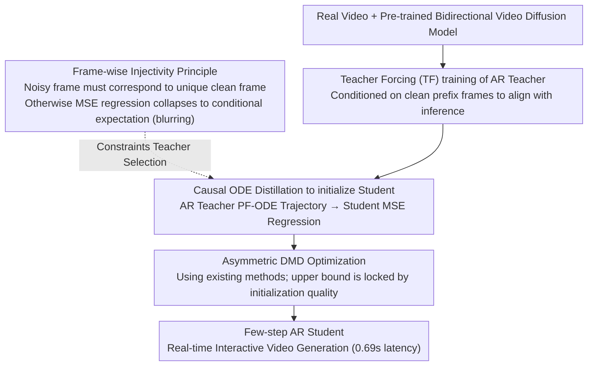

# Causal Forcing: Autoregressive Diffusion Distillation Done Right for High-Quality Real-Time Interactive Video

**Conference**: ICML 2026  
**arXiv**: [2602.02214](https://arxiv.org/abs/2602.02214)  
**Code**: TBD  
**Area**: Video Generation / Diffusion Distillation  
**Keywords**: Autoregressive Video Generation, Diffusion Distillation, Causal Attention, Frame-wise Injectivity

## TL;DR
This paper identifies the theoretical requirement of "**frame-wise injectivity**" and proposes the Causal Forcing method. By substituting the **bidirectional teacher with an autoregressive teacher** for ODE distillation initialization, it avoids performance collapse seen in Self-Forcing. Compared to Self-Forcing, it achieves +19.3% Dynamics, +8.7% VisionReward, and +16.7% Instruction Following while maintaining the same inference latency (0.69s).

## Background & Motivation

**Background**: Real-time interactive video generation requires distilling multi-step diffusion models into few-step autoregressive (AR) models. Current methods (CausVid, Self-Forcing) employ "asymmetric distillation"—distilling a pre-trained bidirectional video diffusion model into an AR student model.

**Limitations of Prior Work**: Although Self-Forcing is SOTA, a significant performance gap remains compared to standard DMD (which distills bidirectional students)—with 10-20% declines in dynamics, visual quality, and instruction following. This indicates fundamental issues within existing AR distillation pipelines.

**Key Challenge**: An "architectural gap" exists when distilling from a bidirectional model to an AR student. Bidirectional models use full attention (accessing future frames), whereas AR models are restricted to causal attention (conditioned only on past frames). While current methods use ODE initialization and DMD stages, neither theoretically addresses this gap correctly.

**Key Insight**: The root cause is that ODE distillation violates the "**frame-wise injectivity**" requirement. When distilling from a bidirectional teacher to an AR student, a single noisy frame can correspond to multiple distinct clean frames, causing the MSE loss to learn the conditional expectation (mean) rather than a true flow mapping. The solution is using an AR teacher for ODE distillation initialization, as the AR teacher's PF-ODE naturally satisfies frame-wise injectivity.

## Method

### Overall Architecture

Ours distills multi-step bidirectional video diffusion models into real-time interactive few-step AR students. The core innovation lies in replacing the teacher used for ODE initialization. The process consists of three stages: first, training an AR diffusion model as a teacher using Teacher Forcing (TF); second, performing Causal ODE distillation to initialize the few-step AR student using this AR teacher; third, applying asymmetric DMD optimization based on this initialization. The sole yet critical difference from Self-Forcing is the use of an AR teacher that satisfies frame-wise injectivity.

### Key Designs

**1. Frame-wise Injectivity: Diagnosing the Theoretical Root of Self-Forcing Performance Collapse**

The degradation of image quality and dynamics when distilling AR students from bidirectional teachers was previously considered a niche engineering issue. This paper attributes it to a neglected theoretical condition: frame-wise injectivity. For ODE distillation to be valid, every noisy frame must map to a unique clean frame, i.e., $x_0^i = \phi^{AR}(x_t^i, t)$. The PF-ODE trajectory of a bidirectional teacher satisfies injectivity for the entire video but violates it at the single-frame level (Lemma 3.2). Specifically, one noisy frame may correspond to multiple clean frames depending on different future frames. Consequently, the student's MSE regression target does not converge to a deterministic flow mapping but collapses to the conditional expectation $\mathbb{E}[x_0^i \mid x_t^i]$, resulting in blurred outputs. Since this is a fundamental flaw in the initialization stage, subsequent DMD optimization cannot recover the lost quality, necessitating a change in teacher selection.

**2. Teacher Forcing vs. Diffusion Forcing: Selecting the "Non-standard" TF**

To create an AR teacher, one must decide on the conditioning method. Two options exist: Teacher Forcing (TF) conditions on clean prefix frames $x_0^{<i}$ during training, while Diffusion Forcing (DF) conditions on noisy prefix frames $x_t^{<i}$. Although DF is often treated as the standard approach, this paper finds TF to be superior (Proposition 3.4). DF introduces a training-inference distribution mismatch: the model sees high-noise previous frames during training but clean generated frames during inference. TF training aligns with the inference input distribution, eliminating this gap. Experiments show a massive difference, with TF achieving 111.2% higher VisionReward than DF.

**3. Causal ODE Distillation: Initializing Students with Injectivity-Satisfying AR Teachers**

An AR teacher trained via TF replaces the bidirectional teacher for ODE initialization. Given ground-truth clean prefix frames $x_{gt}^{<i}$, starting from Gaussian noise $x_T^i$, the AR teacher generates a sequence of intermediate states $\{x_t^i\}_{t \in \mathcal{S}}$ along the PF-ODE trajectory. The student fits this flow mapping via MSE regression:

$$\min_\theta \mathbb{E}\big[\|G_\theta(x_t^i, x_{gt}^{<i}, t) - x_0^i\|^2\big]$$

This succeeds because the AR teacher is inherently causal, and its PF-ODE naturally satisfies frame-wise injectivity. The MSE regression no longer collapses to an average, allowing the student to learn the true flow mapping. This provides a clean, high-quality starting point for DMD, which experiments confirm is limited by the quality of this initialization.

## Key Experimental Results

### Main Results

| Model | Throughput ↑ | Latency ↓ | Dynamics ↑ | VisionReward ↑ | Instruction Following ↑ | User Study Score ↓ |
|------|--------|------|--------|---------------|----------|----------|
| Wan2.1 (Bidirectional) | 0.78 | 103s | 61 | 5.275 | 42 | 2.29 |
| CausVid (AR Distillation) | 17.0 | 0.69s | 62 | 5.741 | 12 | 4.27 |
| Self-Forcing | 17.0 | 0.69s | 57 | 5.820 | 48 | 2.87 |
| **Causal Forcing** | **17.0** | **0.69s** | **68** | **6.326** | **56** | **1.64** |

Gains over Self-Forcing: Dynamics +19.3%, VisionReward +8.7%, Instruction Following +16.7%.

### Ablation Study

| Configuration | Dynamics | VisionReward | Instruction Following | Description |
|------|--------|-------------|----------|------|
| Diffusion Forcing (DF) + Self-Forcing ODE + DMD | 60 | 1.583 | 30 | DF leads to severe collapse |
| Teacher Forcing (TF) + Self-Forcing ODE + DMD | 50 | 3.343 | 32 | TF improves but ODE is insufficient |
| TF + Self-Forcing ODE + DMD (Chunk-level) | 24 | 3.330 | 38 | Bidirectional teacher ODE performs poorly |
| **TF + Causal ODE + DMD (Chunk-level)** | **68** | **6.326** | **56** | Full Proposed Method |

### Key Findings
- TF significantly outperforms DF (VisionReward +111%), highlighting the importance of training-inference distribution alignment.
- Causal ODE significantly outperforms Self-Forcing ODE in chunk-level settings (VisionReward +90%, Dynamics +183%), with even more extreme gains at the frame level (Dynamics +3100%).
- The DMD stage cannot compensate for gaps in ODE initialization; high-quality initialization determines the performance ceiling for DMD.

## Highlights & Insights
- **Clear Theoretical Contribution**: This work is the first to use a mathematical framework of frame-wise injectivity to explain performance collapse in AR distillation, proving that Self-Forcing fundamentally violates this condition.
- **Counter-intuitive TF vs. DF Conclusion**: Challenging common assumptions, the paper proves DF is inferior to TF in AR diffusion due to distribution mismatch, quantifying a 111% performance gap.
- **Transferable Design**: The frame-wise injectivity principle applies not only to ODE distillation but also naturally extends to Consistency Distillation (CD) frameworks, leading to the introduction of Causal CD.
- **Significant Practical Impact**: Under identical computational budgets, the method achieves double-digit percentage improvements over SOTA Self-Forcing across multiple metrics.

## Limitations & Future Work
- Gap in long video generation: The model is trained on 5-second videos; direct extrapolation to longer sequences creates a training-inference gap. Orthogonal long-video adaptation methods like LongLive or Rolling Forcing are required.
- Consistency Distillation remains weaker than ODE: While theoretically correct, the proposed Causal CD performs worse than Causal ODE distillation, likely due to the vanilla LCM implementation.
- Insufficient comparison with GAN distillation: Lacks direct comparison with APT2 (which uses GAN + TF CD initialization) because it is not open-sourced.

## Related Work & Insights
- **vs. Self-Forcing** (Huang et al. 2025a): Both utilize a two-stage ODE distillation + DMD pipeline. However, Self-Forcing uses a bidirectional teacher while ours uses an AR teacher. The critical distinction is the satisfaction of frame-wise injectivity; ours provides a fundamental correction to Self-Forcing's architectural flaw.
- **vs. CausVid** (Yin et al. 2025): Both focus on AR distillation, but CausVid first proposed the asymmetric distillation paradigm and exhibits lower performance.
- **vs. DMD Methodology**: Standard DMD is effective for distilling bidirectional students but shows poor performance when directly applied to AR student initialization; the initialization quality effectively dictates the DMD upper bound.

## Rating
- Novelty: ⭐⭐⭐⭐⭐ The theoretical framework of frame-wise injectivity and the flipped conclusion on TF vs. DF are highly original.
- Experimental Thoroughness: ⭐⭐⭐⭐⭐ Covers ODE distillation, DMD, and CD across both chunk-level and frame-level evaluations, employing VBench, VisionReward, and user studies.
- Writing Quality: ⭐⭐⭐⭐ Theoretical derivations are clear and problem diagnosis is deep, though some phrasing could be more concise.
- Value: ⭐⭐⭐⭐⭐ Resolves a core performance bottleneck in real-time video generation and provides a reusable theoretical framework with substantial gains over SOTA.

<!-- RELATED:START -->

## Related Papers

- [\[CVPR 2026\] Elastic Weight Consolidation Done Right for Continual Learning](../../CVPR2026/model_compression/elastic_weight_consolidation_done_right_for_continual_learning.md)
- [\[CVPR 2025\] Towards Practical Real-Time Neural Video Compression](../../CVPR2025/model_compression/towards_practical_real-time_neural_video_compression.md)
- [\[ICML 2026\] Beyond Tokens: Enhancing RTL Quality Estimation via Structural Graph Learning](beyond_tokens_enhancing_rtl_quality_estimation_via_structural_graph_learning.md)
- [\[ICML 2026\] ScaLoRA: Optimally Scaled Low-Rank Adaptation for Efficient High-Rank Fine-Tuning](scalora_optimally_scaled_low-rank_adaptation_for_efficient_high-rank_fine-tuning.md)
- [\[ICML 2026\] Semantic Integrity Matters: Benchmarking and Preserving High-Density Reasoning in KV Cache Compression](semantic_integrity_matters_benchmarking_and_preserving_high-density_reasoning_in.md)

<!-- RELATED:END -->
