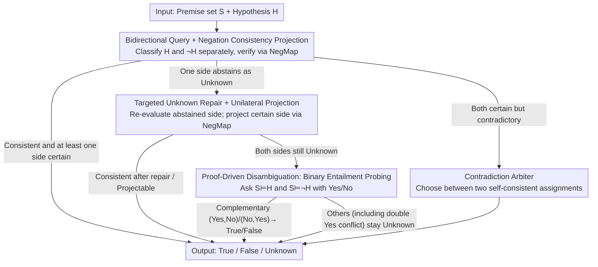

# Compositional Consistency-Guided Decoding for Three-Way Logical Question Answering

**Conference**: ICML 2026  
**arXiv**: [2604.06196](https://arxiv.org/abs/2604.06196)  
**Code**: None  
**Area**: LLM Reasoning  
**Keywords**: Logical Reasoning, Consistency Decoding, Three-way QA, Test-time Reasoning, Negation Mapping

## TL;DR

By leveraging the deterministic negation mapping between hypothesis $H$ and its negation $\neg H$ in three-way logical QA, multiple LLM calls are composed at test-time and disambiguated through consistency constraints. This reduces epistemic Unknowns and improves reasoning accuracy without requiring training.

## Background & Motivation

**Background**: Three-way logical question answering (True / False / Unknown) requires a model to determine whether a set of premises $S$ entails a hypothesis $H$, entails $\neg H$, or if neither can be inferred. LLMs typically complete three-way classification via a single structured prompt, with each query processed independently.

**Limitations of Prior Work**: LLMs frequently output "Unknown" during a single call—many of which are not due to insufficient premises but rather "epistemic Unknowns" caused by model uncertainty or conservative behavior. For instance, Claude Sonnet 4.5 reaches an Unknown rate of 75.5% under strict zero-CoT prompting, even though 72.6% of the gold labels are actually True or False. This false abstention significantly lowers accuracy and coverage.

**Key Challenge**: Three-way logical QA inherently contains a strong structural constraint—the negation mapping $\mathsf{NegMap}$: True ↔ False are swapped, while Unknown remains unchanged. That is, $y(\neg H) = \mathsf{NegMap}(y(H))$. However, standard prompting treats $H$ and $\neg H$ as two unrelated queries, completely wasting this built-in compositional consistency relationship.

**Goal**: Design a training-free, solver-free test-time decoding layer that utilize negation consistency constraints to propagate information across multiple LLM calls, thereby reducing epistemic Unknowns and enhancing overall reasoning quality.

**Key Insight**: Since queries for $H$ and $\neg H$ are two "noisy observations" of the same underlying logical state, if one side provides a definite judgment, the label for the other side can be derived via negation mapping. When both sides are uncertain, the deadlock can be broken by falling back to simpler binary entailment probing.

**Core Idea**: Upgrade single prompting to multi-view compositional reasoning using negation consistency constraints—query both $H$ and $\neg H$, accept if consistent, and progressively repair or probe if inconsistent or abstained. All decisions are ultimately projected onto a consistent assignment satisfying the negation mapping.

## Method

### Overall Architecture

CGD-PD (Consistency-Guided Decoding with Proof-Driven Disambiguation) is a test-time reasoning layer wrapped around any LLM. It takes a premise set $S$ and hypothesis $H$ as input and outputs one of True / False / Unknown without training or external solvers. Its starting point is the mathematical constraint inherent in three-way logical QA—the negation mapping $\mathsf{NegMap}$ links the judgment of $H$ with that of $\neg H$ (swapping True/False, keeping Unknown unchanged). Thus, the two queries are essentially noisy observations of the same state. CGD-PD treats this constraint as a hard rule during decoding, cascading at least 2 and at most 6 calls in order of increasing effort: first checking bidirectional consistency, then repairing Unknowns directionally if inconsistent, then falling back to binary entailment probing if still deadlocked, and finally arbitrating if both sides are certain but contradictory. Each step is triggered only if the previous step failed to reach a consistent assignment.

### Key Designs

**1. Bidirectional Query + Negation Consistency Projection: Combining independent noisy classifications into a constrained joint inference**

The limitation is that LLMs under single prompting are sensitive to phrasing, often giving inconsistent labels or abstaining. CGD-PD no longer treats $H$ and $\neg H$ as unrelated. It calls $y_H = \mathsf{Classify}(S, H)$ and $y_{\neg H} = \mathsf{Classify}(S, \neg H)$ separately, where $\neg H$ is constructed using a normalized wrapper (e.g., "NOT: $H$") with its semantics defined in the prompt. After obtaining labels, it verifies them via negation mapping: if $y_{\neg H} = \mathsf{NegMap}(y_H)$ and at least one side is a definite label (not double Unknown), it returns $y_H$. This is effective because it provides redundant observations of the same logical state and uses the hard constraint of $\mathsf{NegMap}$ for disambiguation—once noisy classifications are bound into a joint problem, the parts that corroborate each other become reliable.

**2. Targeted Unknown Repair + Unilateral Projection: Eliminating epistemic abstention without compromising true uncertainty**

The first step often fails because one side abstains. Many of these Unknowns are due to model conservatism rather than insufficient premises. Thus, $\mathsf{FixUnknown}(S, H)$ is called only for the abstaining side. This specialized prompt treats Unknown as a last resort—allowed only if necessary premises are clearly missing—and requires the model to state what is missing while extracting corresponding sentences from the premises. If the labels satisfy negation consistency after repair, $y_H$ is returned. If one side is certain while the other remains Unknown, the certain side's label is projected back to $H$ via the negation mapping. This step only modifies the abstaining side, reducing false abstention while keeping genuinely uncertain samples as Unknown. However, as noted in the paper, this projection depends on the reliability of the certain call and lacks formal guarantees.

**3. Proof-Driven Disambiguation: Breaking double Unknown deadlocks via binary entailment probing (the "PD" in the method name)**

If both sides remain Unknown after repair, CGD-PD reduces the dimensionality, replacing the three-way problem with narrower binary entailment probing: asking $b_H = \mathsf{EntailsYesNo}(S, H)$ and $b_{\neg H} = \mathsf{EntailsYesNo}(S, \neg H)$ via Yes/No questions. This focused approach removes Unknown as an easy exit, exposing cases where the three-way prompt used Unknown as a default value. To avoid over-commitment, the decoder only accepts complementary patterns: $(Yes, No)$ for True and $(No, Yes)$ for False. Other cases (especially conflicts like double Yes) revert to Unknown without being arbitrary. This is "proof-driven" as the focused question provides lightweight evidence of deducibility, though it is not a formal proof system.

**4. Contradiction Arbiter: Handling rare conflicts where both sides are certain but violate negation mapping**

In rare cases, both sides initially provide certain labels that contradict each other (e.g., answering True for both $H$ and $\neg H$). This violates $\mathsf{NegMap}$, and since there is no Unknown, neither repair nor probing is triggered. The cascade then reaches a specialized arbitration prompt to choose between the two internally consistent assignments $y_H$ and $\mathsf{NegMap}(y_{\neg H})$. The arbiter is rarely invoked but ensures that the final output always satisfies the hard constraint of negation consistency, preventing logically contradictory predictions.

### A Full Example

Take a gold True sample run on Claude as an example: calls 1–2 (bidirectional) yield $y_H=\text{Unknown}$ and $y_{\neg H}=\text{Unknown}$. Both abstain; consistency is met but no certain label exists. Calls 3–4 run $\mathsf{FixUnknown}$ on both sides: the $H$ side remains Unknown while the $\neg H$ side is repaired to False. Projecting back via $\mathsf{NegMap}(\text{False})=\text{True}$ yields the correct result. This chain uses 4 calls to "rescue" a sample that would have been recorded as an epistemic abstention. Statistically, the full six-call sequence is triggered for 54% of samples on GPT-5.2 and 61% on Claude, reflecting the prevalence of initial Unknown outputs.

## Key Experimental Results

### Main Results

Evaluated on the first-order logic fields of the FOLIO dataset (204 samples) using structured prompts with strict zero-CoT and temperature 0.

| Model | Method | Accuracy (%) | Unknown Rate (%) | Epistemic Unknown Rate (%) | Avg. Calls |
| :--- | :--- | :--- | :--- | :--- | :--- |
| GPT-5.2 | Single | 63.7 | 57.4 | 41.5 | 1.00 |
| GPT-5.2 | CGD-PD | 68.1 | 53.9 | 36.3 | 4.36 |
| Claude Sonnet 4.5 | Single | 42.2 | 75.5 | 72.6 | 1.00 |
| Claude Sonnet 4.5 | CGD-PD | 49.0 | 58.8 | 53.3 | 4.91 |

Paired bootstrap 95% CI: GPT-5.2 accuracy gain +4.4pp (CI: +1.5 ~ +7.4), Claude accuracy gain +6.8pp (CI: +3.4 ~ +10.3).

### Coverage and Reliability of Certain Labels

| Model | Method | Coverage (%) | Answer Accuracy (%) | Gold Unknown Retention (%) | Gold U→T | Gold U→F |
| :--- | :--- | :--- | :--- | :--- | :--- | :--- |
| GPT-5.2 | Single | 42.6 | 79.3 | 88.4 | 3 | 5 |
| GPT-5.2 | CGD-PD | 46.1 | 83.0 | 88.4 | 4 | 4 |
| Claude Sonnet 4.5 | Single | 24.5 | 60.0 | 81.2 | 9 | 4 |
| Claude Sonnet 4.5 | CGD-PD | 41.2 | 61.9 | 69.6 | 13 | 8 |

### Key Findings
- CGD-PD does not simply replace Unknown with low-quality certain labels—GPT-5.2's answer accuracy improved from 79.3% to 83.0%, with a simultaneous increase in coverage.
- Gold Unknown retention remained unchanged at 88.4% for GPT-5.2, indicating no over-parsing of truly uncertain samples. For Claude, this rate dropped from 81.2% to 69.6%, suggesting some over-parsing.
- CGD-PD changed 15/204 predictions on GPT-5.2 and 34/204 on Claude; changes were primarily converting Unknown into correct certain labels.
- The full six-call sequence was triggered for over half the samples, reflecting the ubiquity of Unknown outputs.

## Highlights & Insights
- **Turning task-inherent compositional structure into decoding constraints**: Negation mapping is an intrinsic mathematical property of three-way logical QA. The core insight of CGD-PD is that this known relationship should not be wasted in independent queries but explicitly utilized during reasoning. This logic can be extended to any task with known input transformation-output constraint relationships.
- **Layered disambiguation is superior to global enforcement**: The progressive design—trying consistency first, then targeted repair, then dimensionality reduction probing—balances reducing false abstention with protecting true uncertainty better than direct forced disambiguation.

## Limitations & Future Work
- Validated only on FOL formula inputs in FOLIO; natural language inputs would significantly increase difficulty due to scope ambiguity in negations.
- Only two API models and one zero-CoT prompt family were used; no comparison with test-time baselines like self-consistency under the same call budget.
- Over-parsing of Gold Unknowns on Claude (retention dropped to 69.6%) is a primary weakness requiring more refined selectivity mechanisms.
- Precise contributions of components are hard to pinpoint without branch-level diagnostic logs (e.g., repairer change rate, arbiter coverage).

## Related Work & Insights
- **vs Self-Consistency (Wang et al., 2023)**: Self-consistency aggregates multiple samples of the same prompt. CGD-PD utilizes compositional constraints between logically coupled different prompts; the two are complementary.
- **vs CheckList / Metamorphic Testing (Ribeiro et al., 2020; Cho et al., 2025)**: Metamorphic testing uses transformation-relation pairs to *evaluate* failure modes; CGD-PD further utilizes them to *guide* test-time decisions.

## Rating
- Novelty: ⭐⭐⭐⭐ The idea of turning known logical constraints into test-time decoding rules is simple and inspiring.
- Experimental Thoroughness: ⭐⭐⭐ Limited scale with 204 validation samples from one dataset, two models, and one prompt family.
- Writing Quality: ⭐⭐⭐⭐⭐ Clear problem definition, natural progression of the method, and thorough diagnostic analysis.
- Value: ⭐⭐⭐⭐ The proposed principle of "utilizing task-inherent compositional structure to constrain decoding" is widely transferable.

<!-- RELATED:START -->

## Related Papers

- [\[ACL 2025\] Graph-guided Cross-composition Feature Disentanglement for Compositional Zero-shot Learning](../../ACL2025/model_compression/graph-guided_cross-composition_feature_disentanglement_for_compositional_zero-sh.md)
- [\[ACL 2026\] Calibrated Speculative Decoding: Frequency-Guided Candidate Selection for Efficient Inference](../../ACL2026/model_compression/calibrated_speculative_decoding_frequency-guided_candidate_selection_for_efficie.md)
- [\[ICML 2026\] SPEED-Bench: A Unified and Diverse Benchmark for Speculative Decoding](speed-bench_a_unified_and_diverse_benchmark_for_speculative_decoding.md)
- [\[ICML 2026\] LK Losses: Direct Acceptance Rate Optimization for Speculative Decoding](lk_losses_direct_acceptance_rate_optimization_for_speculative_decoding.md)
- [\[ICML 2026\] Critique-Guided Distillation for Robust Reasoning via Refinement](critique-guided_distillation_for_robust_reasoning_via_refinement.md)

<!-- RELATED:END -->
