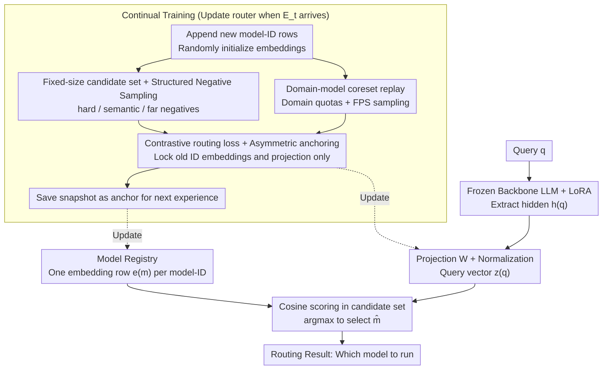

# Continual Model Routing in Evolving Model Hubs

**Conference**: ICML 2026  
**arXiv**: [2605.28577](https://arxiv.org/abs/2605.28577)  
**Code**: Available (annotated in paper, repository link to be updated)  
**Area**: Continual Learning / Model Routing / Embedding Retrieval  
**Keywords**: continual learning, pre-inference routing, model hub, contrastive embedding, anchoring, experience replay  

## TL;DR
When the number of available experts in a model hub grows from hundreds to thousands and models are continuously added or retired, traditional "train-once routers" or "pure model card retrieval" fail to scale. The authors formalize this as a "continual classification (growing label space)" problem, construct CMRBench—a benchmark spanning 4 stages with over 2000 candidate models—and propose CARvE. CARvE utilizes contrastive embedding scoring, checkpoint anchoring to prevent drift, and structured negative sample replay to maintain discriminative power. It achieves a 5-point improvement in D-Acc over standard LoRA replay with only half the forgetting.

## Background & Motivation

**Background**: Model hubs like Hugging Face already host millions of pre-trained models. When deploying MoE or tool-use systems, the core problem has shifted from "can a model be trained" to "which model should be run." This pre-inference routing must be completed under strict latency and cost constraints without executing multiple candidate models. Representative methods include Gorilla (using RAT/RAG to retrieve model cards), HuggingGPT (using LLM controllers to read metadata for selection), and various BM25 / dense retrievers that directly score model cards.

**Limitations of Prior Work**: (1) Once candidate scale reaches thousands, static retrieval methods (model card similarity) degrade significantly—BGE-M3 achieves only 13.6% M-Acc with 2000+ models. (2) Model hubs are inherently non-stationary: new models arrive, old ones are deprecated, and new versions of the same series are frequently released. Training a router as a one-time classifier leads to rapid collapse when new waves of models arrive. (3) Joint training with all previous data violates deployment constraints of continual learning (old data may be restricted, and computational budgets are limited).

**Key Challenge**: The router must simultaneously satisfy three conflicting requirements: stable scoring in an open label space of 1000+ classes, incremental adaptation as new models arrive, and zero overhead for executing candidate models. Existing methods that solve one often sacrifice the others.

**Goal**: Formalize pre-inference model routing as a "continual classification" problem where the label space grows over time; design a new benchmark for fair evaluation; and provide a specific router capable of handling scale, drift, and forgetting.

**Key Insight**: The authors observe three facts: (1) Routing is essentially a discriminative task (query → model-ID) which can leverage contrastive embeddings instead of generation. (2) "Parameter/output anchoring" and replay buffers in continual learning can suppress catastrophic forgetting. (3) Large-vocabulary softmax is expensive, but using a fixed-size candidate set can reduce per-example scoring to $O(Kd)$. Combining these avoids the bottlenecks of the Gorilla-style SFT/RAT approach.

**Core Idea**: Model IDs are learned as incrementally appendable contrastive embedding vectors. When new experiences arrive, checkpoint anchoring is used to lock the geometry of old model embeddings and projection matrices. This is combined with structured hard/semantic/far negative samples and domain-weighted coreset replay to maintain the discriminative surface.

## Method

### Overall Architecture
CARvE frames "which hub model to route to" as an embedding scoring problem with an appendable label space. Experiences arrive chronologically as $\{E_t\}_{t=1}^T$, where each $E_t$ provides triples $(q_i, m_i, d_i)$ (query, correct model, domain). The candidate pool expands cumulatively as $\mathcal{M}_{\leq t} = \bigcup_{k \leq t} \mathcal{M}_k$. For scoring, a frozen backbone LLM (default LLaMA2-7B + LoRA) extracts query hidden states $h(q) \in \mathbb{R}^D$, which are normalized through a learnable projection $W$ to obtain the query vector $z(q) = h(q)W / \lVert h(q)W \rVert_2$. Each model ID maintains its own learnable normalized embedding $e(m) = v(m)/\lVert v(m) \rVert_2$. Cosine scoring $s(q,m) = z(q)^\top e(m) / \tau$ is performed over the candidate set $\mathcal{C}(q)$, outputting $\hat m = \arg\max_{m \in \mathcal{C}(q)} s(q,m)$. As new experiences arrive, the registry $\mathcal{R}$ appends new model ID rows. The projection $W$, model embedding table $\{v(m)\}$, and LoRA adapters are updated, using the snapshot from the end of the previous experience as an anchor to prevent the geometry of old IDs from being disrupted by new data.

### Key Designs

**1. Checkpoint-based asymmetric anchoring: Locking old model geometry while leaving new models free during experience transitions**

Model hubs are non-stationary; an influx of new models can cause the router to drift with new data, distorting previously learned old model embeddings—the routing equivalent of catastrophic forgetting. CARvE addresses this by saving a snapshot of parameters $\{v_{t-1}(m)\}_{m \in \mathcal{M}_{\leq t-1}}$ and $\Theta_{t-1}$ at the start of experience $t$. During training on $E_t$, two anchoring terms are added to the main contrastive loss to pull geometry back to position: a cosine drift for old model embeddings $\mathcal{L}_{\mathrm{emb}} = \frac{1}{|\mathcal{M}_{\leq t-1}|}\sum_m (1 - \cos(v_t(m), v_{t-1}(m)))$ and a mean squared drift for the projection matrix $\mathcal{L}_{\mathrm{proj}} = \frac{1}{|\Theta_t|}\sum_\theta \frac{1}{|\theta|}\lVert \theta - \theta_{t-1}\rVert_2^2$. Crucially, this anchoring is **asymmetric**—$\mathcal{L}_{\mathrm{emb}}$ only applies to old ID embedding rows, while new model rows are unconstrained. Since routing relies on embedding similarity rather than a fixed classification head, the geometry of embeddings and projections must be locked directly (unlike LwF/EWC which lock decision boundaries). As new models need to find their positions in the space, hard locking would prevent learning; thus, locking only the old while freeing the new balances forgetting and adaptation. In experiments, after experience 3, standard replay drops to 60.8 on Exp1 while CARvE maintains 74.5, demonstrating the effectiveness of asymmetric constraints.

**2. Fixed-size candidate set training + structured negative sampling: Bypassing thousand-class softmax while ensuring discriminative power**

When candidate models reach the thousands, performing softmax over all $\mathcal{M}_{\leq t}$ for every example is expensive and sparse. CARvE instead constructs a candidate set $\mathcal{C}(q)$ of size $K$ for each $(q, m^+)$. This set always includes the positive $m^+$ and mixes three types of negatives: "hard confusers" (the highest-scoring samples under the current router, periodically re-mined), "semantic negatives" from the same or related domains, and "far negatives" from different domains, with random padding to prevent repetition. The loss is the contrastive cross-entropy within this set: $\mathcal{L}_{\mathrm{route}} = -\log \frac{\exp(s(q,m^+))}{\sum_{m \in \mathcal{C}(q)} \exp(s(q,m))}$. This reduces scoring costs from $O(|\mathcal{M}_{\leq t}| d)$ to $O(Kd)$, while deployment can further compress retrieval to $O(\log |M|)$ using FAISS. The three types of negatives manage different levels of discrimination: hard confusers support fine-grained differentiation, semantic negatives support intra-family distinction (e.g., distinguishing yolov8m/n/s), and far negatives maintain macro-domain structure.

**3. Domain-model coreset replay + random initialization: Efficient replay under long-tail distributions and avoiding model card bias**

Hub data is heavy-tailed; common domains are flooded with samples while long-tail domains are sparse. Random sampling in replay wastes budget on common domains. Given a replay budget $B$, CARvE assigns quotas to domains based on frequency (with floors and optional ceilings), limits the maximum samples per model ID within a domain, and uses farthest-point sampling (FPS) in the fixed embedding space to pick the most diverse samples—trading redundancy for coverage. Another counter-intuitive decision is **random initialization** of model embeddings rather than using model card text encoding for a warm start. The authors found that card-based initializations performed 3–5pp lower in D-Acc and doubled forgetting compared to random initialization. This is because card embeddings encode linguistic similarity of descriptions, which conflicts with the discriminative geometry required for routing; the contrastive objective must first "undo" this semantic geometry before reorganizing the space.

### Loss & Training
The total loss is a weighted sum of the contrastive term and the two anchoring terms: $\mathcal{L} = \mathcal{L}_{\mathrm{route}} + \lambda_{\mathrm{emb}} \mathcal{L}_{\mathrm{emb}} + \lambda_{\mathrm{proj}} \mathcal{L}_{\mathrm{proj}}$. The backbone LLM remains frozen throughout, with only LoRA adapters, the projection $W$, and the model embedding table being updated. When a new experience arrives, new embedding rows are appended by ID without re-indexing; anchoring is applied to router parameters (embeddings, projection) but does not constrain LoRA.

## Key Experimental Results

### Main Results
CMRBench consists of 4 temporal experiences covering APIBench (852 models), ToolMMBench (481), HuggingBench E3 (520), and HuggingBench E4 (547), totaling ~34k samples. Metrics include: Model-ID accuracy (M), Model-family accuracy (F, grouping similar models like yolov8m/n/s), and Domain accuracy (D), with corresponding forgetting (FGT) metrics. The table below shows averages across 4 experiences (LLaMA2-7B backbone):

| Method | M-Acc ↑ | F-Acc ↑ | D-Acc ↑ | D-FGT ↓ |
|------|---------|---------|---------|---------|
| BGE-M3 retrieval | 13.6 | 16.2 | 44.0 | 3.3 |
| Gorilla RAG | 6.7 | 10.4 | 43.0 | 0.1 |
| HuggingGPT (Qwen3-32B) | – | – | 51.7 | – |
| Sequential Finetuning | 28.0 | 34.8 | 64.3 | 37.2 |
| TIES merging | 7.6 | 10.9 | 28.6 | 32.6 |
| LwF | 28.8 | 35.9 | 56.4 | 39.5 |
| EWC | 31.3 | 38.4 | 66.2 | 31.4 |
| Random Replay 10% | 39.1 | 47.3 | 75.9 | 13.1 |
| Random Replay 20% | 41.3 | 49.8 | 78.1 | 7.8 |
| **CARvE 10% replay** | **~46.4** | – | **80.7** | **5.9** |
| **CARvE 20% replay** | 46.4 | – | **82.9** | **3.0** |
| LoRA Joint Training | – | – | 79.3 | – |

Key observations: (1) Pure retrieval routing fails at hub scale, with BGE-M3 achieving only 13.6% M-Acc. (2) In the continual learning setting, with the same 10% replay budget, CARvE exceeds standard LoRA replay in D-Acc by 4.8 points and reduces forgetting from 13.1% to 5.9%. (3) CARvE even outperforms the joint training upper bound (79.3 → 80.7), suggesting that anchoring + structured negative samples provide beneficial regularization.

### Ablation Study

| Configuration | Key Effect | Description |
|------|---------|------|
| Full CARvE | D-Acc 80.7 / D-FGT 5.9 | Baseline |
| Card initialization for embeddings | D-Acc −3 to −5pp, FGT roughly doubled | Geometric conflict; consistent across 4 variants |
| CARvE + EWC | On par with CARvE | Fisher regularization is not the source of CARvE’s gain |
| Switch to Qwen2.5-7B | D-Acc 81.5 | Conclusions stable across similar-sized backbones |
| Switch to Qwen3-4B | D-Acc and FGT both worsen | Representation quality of small models is the bottleneck |
| Exp1 performance post-Exp3 | Std Replay 60.8 vs. CARvE 74.5 | Anchoring effectively prevents drift |
| Exp3 performance post-Exp4 | Std Replay 54 vs. CARvE 69.7 | Confirms new model influx is the primary pressure source |

### Key Findings
- Domain-level accuracy benefits most (+5pp), followed by model family, while model ID is the most difficult; this aligns with the fact that macro-structure in embedding space is easier to stabilize, while fine-grained distinction relies on negative sample quality.
- Standard replay shows significant collapse after HuggingBench introduction (Exp3-4), whereas CARvE remains stable, validating anchoring as the key to resisting hub expansion.
- Using model cards for embedding initialization is consistently worse: routers require "discriminative geometry" rather than "semantic similarity geometry."

## Highlights & Insights
- **Problem Reframing**: This is the first work to explicitly treat pre-inference model routing as "continual classification with an expanding label space." This allows for the legitimate introduction of continual learning tools (replay/anchor/coreset) into the routing domain.
- **Asymmetric Anchoring**: Traditional continual learning often anchors all parameters or none; CARvE’s approach of locking only old ID embeddings and projections while leaving new IDs free provides a "semi-frozen" strategy transferable to any continual task with extensible embedding tables (retrieval, recommendation, open-vocab classification).
- **Counter-intuitive Experiment**: Random initialization > model card initialization. This demonstrates that "semantic similarity $\neq$ routing discrimination," serving as a valuable negative result for those attempting warm-start embeddings with text encoders.

## Limitations & Future Work
- The candidate set size $K$ and hard negative mining frequency are fixed; there is no adaptive scheme for when specific families become exceptionally large.
- The 4 experiences evaluated are sequentially concatenated in time, but real hubs involve "addition" and "deprecation/replacement" simultaneously; this work does not explicitly handle index compression or cleaning for retired models.
- The router learns a direct query→model mapping without considering engineering constraints like cost, latency, or licensing; industrial deployment would require an additional layer for multi-objective reranking.
- Only 7B-class backbones were tested; larger models (70B+) might improve embedding quality but the memory overhead might undermine the cost-saving premise of a standalone router.

## Related Work & Insights
- **vs Gorilla / RAT**: Gorilla uses RAG/RAT for LLM-based model-ID generation; at hub scale, it underperforms zero-shot SFT due to retrieval noise. CARvE discards model cards for a pure embedding approach, avoiding failure modes where retrieval provides misleading context.
- **vs HuggingGPT-style Controllers**: Using large LLMs as routers (Qwen3-32B) yields 51.7% D-Acc, but at much higher inference costs. CARvE's 80.7% shows that small backbones with contrastive embeddings can surpass large LLM controllers at a fraction of the cost.
- **vs Traditional Continual Learning Baselines**: LwF/EWC focus on classification layer regularization, but routers lack fixed heads. CARvE’s shift to anchoring embeddings and projections is a paradigm for translating continual learning to open label spaces.
- **vs Classic MoE Routers**: MoE gating networks are end-to-end trained differentiable routers with fixed, symmetric candidates. This work addresses the first systematic solution for "external hubs with 1000+ candidates that grow over time" in non-stationary heterogeneous environments.

<!-- RELATED:START -->

## Related Papers

- [\[ICML 2026\] Saliency-Aware Model Merging](saliency-aware_model_merging.md)
- [\[ICML 2026\] Effective Model Pruning: Measure the Redundancy of Model Components](effective_model_pruning_measure_the_redundancy_of_model_components.md)
- [\[ICML 2026\] Decouple Searching from Training: Scaling Data Mixing via Model Merging for Large Language Model Pre-training](decouple_searching_from_training_scaling_data_mixing_via_model_merging_for_large.md)
- [\[ICLR 2026\] FlyPrompt: Brain-Inspired Random-Expanded Routing with Temporal-Ensemble Experts for General Continual Learning](../../ICLR2026/model_compression/flyprompt_brain-inspired_random-expanded_routing.md)
- [\[ICML 2025\] BECAME: BayEsian Continual Learning with Adaptive Model MErging](../../ICML2025/model_compression/became_bayesian_continual_learning_with_adaptive_model_merging.md)

<!-- RELATED:END -->
