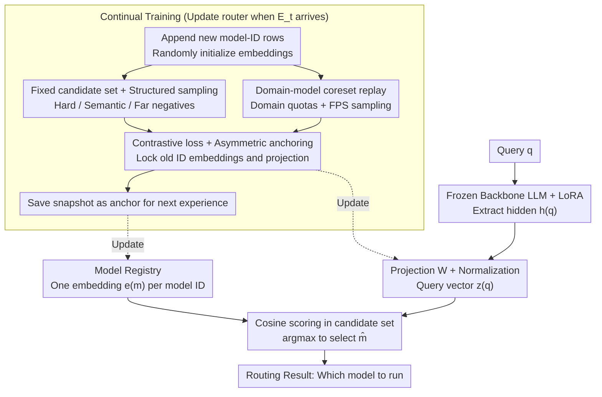

# Continual Model Routing in Evolving Model Hubs

**Conference**: ICML 2026  
**arXiv**: [2605.28577](https://arxiv.org/abs/2605.28577)  
**Code**: Available (Noted in paper, repository link to be updated)  
**Area**: Continual Learning / Model Routing / Embedding Retrieval  
**Keywords**: continual learning, pre-inference routing, model hub, contrastive embedding, anchoring, experience replay  

## TL;DR
When the number of available experts in a model hub grows from hundreds to thousands and models are continuously added or retired, traditional "train-once routers" or "pure model card retrieval" become insufficient. The authors formalize this as a "continual classification (expanding label space)" problem, construct the CMRBench benchmark covering 4 phases and over 2,000 candidate models, and propose CARvE—a continual router using contrastive embedding scoring, checkpoint anchoring to prevent drift, and structured negative sample replay to maintain discriminative power. CARvE outperforms standard LoRA replay by 5 percentage points in D-Acc while reducing forgetting by half.

## Background & Motivation

**Background**: Model hubs like Hugging Face already host millions of pre-trained models. When deploying MoE or tool-use systems, the core problem has shifted from "can we train a model" to "which model should we run." This pre-inference routing must be completed under strict latency and cost constraints without executing multiple candidate models. Representative methods include Gorilla (using RAT/RAG to retrieve model cards), HuggingGPT (using LLM controllers to read metadata), and various BM25/dense retrievers that score model cards directly.

**Limitations of Prior Work**: (1) Once the scale of candidate models reaches thousands, static retrieval methods (based on model card similarity) significantly degrade—BGE-M3 achieves only 13.6% M-Acc with 2000+ models. (2) Model hubs are inherently non-stationary: new models enter, old ones are deprecated, and new versions of the same series are frequently released. Routers trained as one-off classifiers collapse rapidly when new waves of models arrive. (3) Direct joint training on all accumulated data violates the deployment constraints of continual learning (old data may be restricted, and computational budgets are finite).

**Key Challenge**: Routing must simultaneously satisfy three conflicting requirements: stable scoring in an open label space of 1000+ classes, incremental adaptation as new models arrive, and zero overhead from executing candidate models. Existing methods typically sacrifice at least one of these.

**Goal**: To formalize pre-inference model routing as a "continual classification" problem where the label space grows over time; to design a new benchmark for fair evaluation; and to provide a concrete router capable of handling scale, drift, and forgetting simultaneously.

**Key Insight**: The authors observe three facts: (1) Routing is essentially a discriminative task (query → model-ID), which can be handled via contrastive embeddings without requiring generation. (2) "Parameter/Output anchoring" and replay buffers in continual learning can suppress catastrophic forgetting. (3) Large-vocabulary softmax is prohibitively expensive, but scoring against a fixed-size candidate set can reduce per-instance overhead to $O(Kd)$. Combining these avoids the bottlenecks of SFT/RAT approaches like Gorilla.

**Core Idea**: Model IDs are learned as continuously appendable contrastive embedding vectors. When new experiences arrive, checkpoint anchoring locks the geometry of old model embeddings and projection matrices. This is combined with structured hard/semantic/far negative samples and domain-weighted coreset replay to maintain the discriminative manifold.

## Method

### Overall Architecture
CARvE treats the selection of the best hub model as an embedding scoring problem with an appendable label space. Experiences arrive as sequential batches $\{E_t\}_{t=1}^T$, where each $E_t$ provides triplets $(q_i, m_i, d_i)$ (query, ground-truth model, domain). The candidate pool expands cumulatively as $\mathcal{M}_{\leq t} = \bigcup_{k \leq t} \mathcal{M}_k$. For scoring, a frozen backbone LLM (default LLaMA2-7B + LoRA) extracts a hidden state $h(q) \in \mathbb{R}^D$, which is passed through a learnable projection $W$ and normalized to obtain the query vector $z(q) = h(q)W / \lVert h(q)W \rVert_2$. Each model ID maintains its own learnable normalized embedding $e(m) = v(m)/\lVert v(m) \rVert_2$. Cosine scores $s(q,m) = z(q)^\top e(m) / \tau$ are calculated over a candidate set $\mathcal{C}(q)$, and the output is $\hat m = \arg\max_{m \in \mathcal{C}(q)} s(q,m)$. As new experiences arrive, new model ID rows are appended to the registry $\mathcal{R}$, while the projection $W$, model embedding table $\{v(m)\}$, and LoRA adapters are updated using a snapshot from the end of the previous experience as an anchor to prevent the geometry of old IDs from being disrupted.

### Key Designs

**1. Checkpoint-based Asymmetric Anchoring: Locking old geometry while allowing new model adaptation**

Model hubs are non-stationary; an influx of new models can cause the router to drift toward new data, distorting previously learned embeddings—this is the manifestation of catastrophic forgetting in routing. CARvE counters this by saving a snapshot of parameters $\{v_{t-1}(m)\}_{m \in \mathcal{M}_{\leq t-1}}$ and $\Theta_{t-1}$ at the start of experience $t$. During training on $E_t$, two anchoring terms are added: an embedding cosine drift loss $\mathcal{L}_{\mathrm{emb}} = \frac{1}{|\mathcal{M}_{\leq t-1}|}\sum_m (1 - \cos(v_t(m), v_{t-1}(m)))$ and a projection matrix MSE drift loss $\mathcal{L}_{\mathrm{proj}} = \frac{1}{|\Theta_t|}\sum_\theta \frac{1}{|\theta|}\lVert \theta - \theta_{t-1}\rVert_2^2$. Crucially, this anchoring is **asymmetric**—$\mathcal{L}_{\mathrm{emb}}$ only applies to old ID embedding rows, while new IDs are unconstrained. Since routing depends on embedding similarity rather than a fixed classification head, the geometry must be locked directly; however, new models must find their place in the space, so rigid locking would prevent learning. In experiments, after Experience 3, standard replay D-Acc drops to 60.8 while CARvE maintains 74.5, proving the efficacy of asymmetric constraints.

**2. Fixed-size Candidate Set Training + Structured Negative Sampling: Efficiency without sacrificing discriminative power**

With thousands of models, performing softmax over the full $\mathcal{M}_{\leq t}$ for every instance is expensive and sparse. CARvE constructs a candidate set $\mathcal{C}(q)$ of size $K$ for each $(q, m^+)$. This set always includes the positive $m^+$ and a structured mix of three negative types: hard confusers (highest-scoring models under the current router), semantic negatives (from the same or related domains), and far negatives (from different domains), with random samples used to reach the size $K$. The loss is the contrastive cross-entropy $\mathcal{L}_{\mathrm{route}} = -\log \frac{\exp(s(q,m^+))}{\sum_{m \in \mathcal{C}(q)} \exp(s(q,m))}$. This reduces the per-instance scoring cost from $O(|\mathcal{M}_{\leq t}| d)$ to $O(Kd)$, and deployment can use FAISS to further optimize retrieval to $O(\log |M|)$. Each negative type manages a different layer of discrimination: hard confusers handle fine-grained separation, semantic negatives handle intra-family distinction (e.g., yolov8m vs. yolov8s), and far negatives handle macro-level domain structure.

**3. Domain-Model Coreset Replay + Random Embedding Initialization: Efficient replay and avoiding model card bias**

Hub data follows a heavy-tailed distribution; common domains are over-represented while long-tail domains are sparse. CARvE allocates a replacement budget $B$ by assigning quotas based on domain frequency (with minimum and optional maximum thresholds). Within each domain, the number of samples per model ID is capped, and farthest-point sampling (FPS) is used in the embedding space to select the most diverse samples. An additional counter-intuitive decision is the **random initialization** of model embeddings rather than using model card text encoding. Empirical results show that card-based initializations perform 3–5pp lower in D-Acc and double the forgetting, as card embeddings encode linguistic similarity which conflicts with the discriminative geometry required for routing.

### Loss & Training
The total loss is a weighted sum of the contrastive term and the two anchoring terms: $\mathcal{L} = \mathcal{L}_{\mathrm{route}} + \lambda_{\mathrm{emb}} \mathcal{L}_{\mathrm{emb}} + \lambda_{\mathrm{proj}} \mathcal{L}_{\mathrm{proj}}$. The backbone LLM remains frozen throughout, with only the LoRA adapters, projection $W$, and embedding table being updated. When new experiences arrive, new rows are appended to the table without re-indexing, and anchoring is applied solely to the router parameters (embeddings, projection) and not the LoRA adapters.

## Key Experimental Results

### Main Results
CMRBench consists of 4 temporal experiences covering APIBench (852 models), ToolMMBench (481), HuggingBench E3 (520), and HuggingBench E4 (547), totaling ~34k samples. Metrics include Model-ID Accuracy (M), Model-family Accuracy (F), and Domain Accuracy (D), along with Forgetting (FGT) for each. The table below shows the average across 4 experiences (LLaMA2-7B backbone):

| Method | M-Acc ↑ | F-Acc ↑ | D-Acc ↑ | D-FGT ↓ |
|:---|:---:|:---:|:---:|:---:|
| BGE-M3 retrieval | 13.6 | 16.2 | 44.0 | 3.3 |
| Gorilla RAG | 6.7 | 10.4 | 43.0 | 0.1 |
| HuggingGPT (Qwen3-32B) | – | – | 51.7 | – |
| Sequential Finetuning | 28.0 | 34.8 | 64.3 | 37.2 |
| TIES merging | 7.6 | 10.9 | 28.6 | 32.6 |
| LwF | 28.8 | 35.9 | 56.4 | 39.5 |
| EWC | 31.3 | 38.4 | 66.2 | 31.4 |
| Random Replay 10% | 39.1 | 47.3 | 75.9 | 13.1 |
| Random Replay 20% | 41.3 | 49.8 | 78.1 | 7.8 |
| **CARvE 10% replay** | **~46.4** | – | **80.7** | **5.9** |
| **CARvE 20% replay** | 46.4 | – | **82.9** | **3.0** |
| LoRA Joint Training | – | – | 79.3 | – |

Key observations: (1) Pure retrieval-based routing fails at scale; BGE-M3 reaches only 13.6% M-Acc. (2) Under the continual learning setting with the same 10% replay budget, CARvE achieves 4.8pp higher D-Acc than standard LoRA replay with only ~1/2 the forgetting (5.9% vs. 13.1%). (3) CARvE even slightly exceeds the joint training upper bound (79.3 → 80.7), suggesting that anchoring and structured negatives provide beneficial regularization.

### Ablation Study

| Configuration | Key Effect | Description |
|:---|:---|:---|
| Full CARvE | D-Acc 80.7 / D-FGT 5.9 | Baseline |
| Card-based Initialization | D-Acc −3 to −5pp, FGT ~doubled | Geometric conflict; consistent across 4 variants |
| CARvE + EWC | On par with CARvE | Fisher regularization is not the source of CARvE’s gain |
| Backbone: Qwen2.5-7B | D-Acc 81.5 | Conclusions remain stable across similar-sized backbones |
| Backbone: Qwen3-4B | D-Acc and FGT worsen | Representation quality of small models is the bottleneck |
| Eval Exp1 after Exp3 | Std replay 60.8 vs. CARvE 74.5 | Anchoring effectively prevents drift |
| Eval Exp3 after Exp4 | Std replay 54 vs. CARvE 69.7 | Confirms new model influx is the primary pressure source |

### Key Findings
- Domain-level accuracy benefits the most (+5pp), followed by model family, with model ID being the most challenging. This aligns with the idea that macro-structures in embedding space are easier to stabilize, while fine-grained distinction relies on negative sample quality.
- Standard replay shows a significant collapse after HuggingBench integration (Exp3-4), whereas CARvE shows almost no collapse, validating anchoring as critical for hub expansion.
- Using model cards for initialization is detrimental. Academic insight: routing requires "discriminative geometry" rather than "semantic similarity geometry."

## Highlights & Insights
- **Problem Reframing**: This is the first work to explicitly treat pre-inference model routing as a "continual classification with expanding label space," allowing the utilization of replay, anchoring, and coreset techniques.
- **Asymmetric Anchoring**: While traditional continual learning often anchors all parameters, CARvE only anchors old IDs and the projection, leaving new IDs free. This "semi-frozen" approach is transferable to any search or recommendation task with an expanding embedding table.
- **Counter-intuitive Experiment**: Random initialization > model card initialization. This proves that semantic similarity does not equal routing discriminability—a valuable negative result for researchers tempted to use text encoders for embedding warm starts.

## Limitations & Future Work
- The candidate set size $K$ and hard negative mining frequency are currently fixed; an adaptive scheme might be necessary when certain model families become extremely large.
- Evaluations are sequential, whereas real hubs involve both additions and retirements/replacements. This work does not explicitly handle index compression for deprecated models.
- The router learns a direct query→model mapping without considering engineering constraints like cost, latency, or licenses, which would require a multi-objective reranking layer in production.
- Only 7B-class backbones were tested; while larger models (70B+) might improve embedding quality, their inference cost might undermine the "save money by running a router" premise.

## Related Work & Insights
- **vs. Gorilla / RAT**: Gorilla relies on LLMs generating model IDs, which degrades at hub scale due to retrieval noise; CARvE bypasses text-based model cards, avoiding failure modes where retrieval provides misleading context.
- **vs. HuggingGPT-style Controllers**: Large LLM routers (Qwen3-32B) yield 51.7% D-Acc but have high inference costs. CARvE’s 80.7% shows that small backbones with contrastive embeddings can outperform large controllers at a fraction of the cost.
- **vs. Continual Learning Baselines**: LwF/EWC focus on classification layer regularization, but routers lack a fixed head. CARvE succeeds by shifting the anchor to the manifold (embeddings and projection).
- **vs. Classic MoE Routers**: MoE gating networks are end-to-end differentiable routers with fixed, symmetric candidates. CARvE provides the first systematic solution for "external hubs with 1000+ non-stationary heterogeneous candidates."

<!-- RELATED:START -->

## Related Papers

- [\[ICML 2026\] Saliency-Aware Model Merging](saliency-aware_model_merging.md)
- [\[ICML 2026\] Effective Model Pruning: Measure the Redundancy of Model Components](effective_model_pruning_measure_the_redundancy_of_model_components.md)
- [\[ICML 2026\] Decouple Searching from Training: Scaling Data Mixing via Model Merging for Large Language Model Pre-training](decouple_searching_from_training_scaling_data_mixing_via_model_merging_for_large.md)
- [\[ICML 2026\] Energy-Structured Low-Rank Adaptation for Continual Learning](energy-structured_low-rank_adaptation_for_continual_learning.md)
- [\[ICML 2025\] BECAME: BayEsian Continual Learning with Adaptive Model MErging](../../ICML2025/model_compression/became_bayesian_continual_learning_with_adaptive_model_merging.md)

<!-- RELATED:END -->
