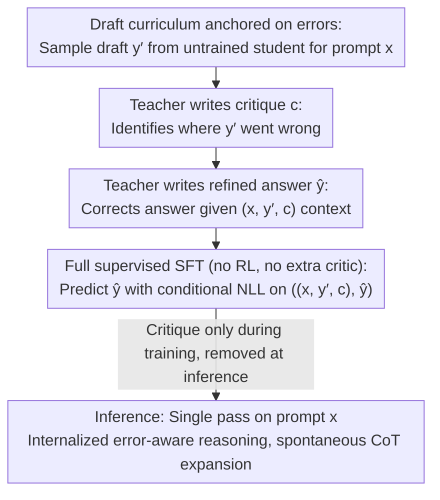

# Critique-Guided Distillation for Robust Reasoning via Refinement

**Conference**: ICML 2026  
**arXiv**: [2505.11628](https://arxiv.org/abs/2505.11628)  
**Code**: No public repository link provided  
**Area**: Model Compression / Knowledge Distillation  
**Keywords**: Knowledge Distillation, Mathematical Reasoning, Critique, Self-Correction, Supervised Fine-Tuning  

## TL;DR
Enable the student to **consume** rather than **generate** the teacher's critique during training—predict the teacher's refined answer conditioned on (prompt, student draft, teacher critique). At inference, a single prompt pass generates longer and more accurate reasoning chains without compromising instruction-following capabilities, unlike CFT.

## Background & Motivation

**Background**: The mainstream recipe for distilling strong reasoning capabilities from a large teacher model to a small student model is SFT/Distilled-SFT—directly imitating the teacher's gold answer or CoT on the same prompt. A few works (CFT, Self-Refine, Reflexion) attempt to introduce "critique" signals to teach the model to self-correct.

**Limitations of Prior Work**: (i) Pure SFT involves "learning conclusions without the underlying logic," leading to collapse on OOD and difficult problems; (ii) Methods like Self-Refine/Reflexion run critiques multiple times during inference, doubling computational costs; (iii) Critique Fine-Tuning (CFT, Wang 2025) moves critique generation to training, forcing the student to "generate critiques"—resulting in severe output-format drift: LLaMA3.1-8B's IFEval score plummeted from 76.9% to 55.6%, significantly damaging general capabilities.

**Key Challenge**: While critiques help a model understand "what went wrong and why," **training a student to output critiques** and **training a student to refine answers based on critiques** are two different tasks. The former modifies the student's output distribution and format, while the latter treats critiques merely as additional training conditions. Conflating these leads to CFT's "gain in math, loss in IFEval" trade-off.

**Goal**: Retain all benefits of critique and eliminate side effects of critique generation, while maintaining single-pass inference and unchanged model architecture.

**Key Insight**: Critiques serve only as a "semantic scaffold" during training—they inform the student of errors in the current answer, but the student's learning target remains singular: correcting those errors. During inference, neither the critique nor the student's draft is provided; the model "internalizes" error-aware reasoning.

**Core Idea**: **Decouple critique consumption from critique generation**—during training, the student sees its own poor draft + the teacher's critique but is supervised only to predict the teacher's refined answer. At inference, only the prompt is input for single-pass generation.

## Method

### Overall Architecture
CGD aims to solve a specific problem: teaching a small student to "correct errors" using a large teacher's guidance without training the student to output critiques (which ruins instruction following). The approach is a minimalist pipeline involving three-step data synthesis and one-time SFT without new modules or prompt format changes. First, for each prompt $x$, the untrained student $S_{\theta_{\text{init}}}$ samples a "likely incorrect" draft $y' \sim S_{\theta_{\text{init}}}(\cdot \mid x)$. Then, the teacher $T_\phi$ observes $(x, y')$ and generates a textual critique $c \sim T_\phi(\cdot \mid x, y')$ identifying errors. Finally, the teacher produces a gold-standard refinement $\hat{y} \sim T_\phi(\cdot \mid x, y', c)$ based on the full context. The student is trained on the quadruple $((x, y', c), \hat{y})$. Crucially, the critique appears only as a condition during training and is removed during inference.

### Key Designs

**1. Student-specific error-anchored curriculum: Targeting critiques at actual student failures**

Standard distilled SFT error: "Providing the same teacher solution regardless of student mistakes," essentially teaching via a teacher's generic imagination of errors. CGD reverses this: draft $y'$ is not pre-generated but **sampled per prompt using $S_{\theta_{\text{init}}}$**. Thus, critiques and refined answers are tied to the specific failure modes of that checkpoint, automatically creating a "curriculum customized to student weaknesses." The authors term this the "specificity and relevance of feedback," identifying it as the driver for CGD gains. Ablations show that replacing critiques with placeholders or irrelevant text reduces gains, proving that specific feedback—not just extra context—shapes the learning signal.

**2. Conditional training vs. single-pass inference: Critique as a "semantic scaffold"**

This design specifically targets the collapse observed in CFT. CFT's objective is $-\log S_\theta(c \mid x, y')$, forcing the student to generate critiques, which shifts the output distribution toward critique styles and causes format drift (IFEval 76.9 $\rightarrow$ 55.6). CGD's objective remains standard conditional NLL: $\mathcal{L}(\theta) = \mathbb{E}_{(x, y', c, \hat{y})}\big[-\log S_\theta(\hat{y} \mid x, y', c)\big]$—the model is always supervised to "write the correct answer given a prompt," preventing distribution pollution. At inference, the model sees only $x$ and generates in a single pass without special tokens or template changes. The beauty lies in the fact that while critiques are removed, the student has internalized the "error-to-correction" mapping, leading to **spontaneous** reasoning chain elongation (up to 4.4$\times$ on AIME).

**3. Fully supervised objective without RL or extra critics: Achieving self-correction via simple SFT**

The teacher serves as both critic and refiner, providing textual critiques rather than scalar rewards, aligning with the empirical observation that "effective feedback must be specific and actionable." Compared to similar self-correction routes, CGD eliminates heavy components: no discriminator training (vs. GRACE/QCRD), no separate critic model (vs. CTRL/Shepherd), and no multi-round decoding (vs. Self-Refine). The cost is just a standard SFT—100K samples processed in 8 GPU-hours on 16 A100s, far lower than RL pipelines with reward models and sampling loops, yet achieving self-correction behavior similar to SCoRe or RL4F.

### Loss & Training
The sole loss is the conditional NLL in Eq. (1). All baselines (SFT, Distilled SFT, CFT) share the same 100K samples, batch size 64, and 1 epoch to align step counts, with a single training run taking roughly 8 A100·h. The teacher used is LLaMA3.3-70B Instruct (LLaMA family) or S1.1-32B (Qwen family).

## Key Experimental Results

### Main Results

| Student | Method | Math Reasoning Avg ↑ | General Reasoning Avg ↑ | Representative Gain |
|---------|------|---------------------|------------------------|------------|
| LLaMA3.1-8B-Instruct | base | 41.3 | 29.9 | — |
| LLaMA3.1-8B-Instruct | Distilled SFT | 43.7 | 31.9 | — |
| LLaMA3.1-8B-Instruct | CFT | 41.5 | 32.4 | AMC23 22.5 |
| LLaMA3.1-8B-Instruct | **CGD** | **46.9** | **36.7** | **AMC23 37.5 (+15.0)**, OlympiadBench 23.7 (+8.0) |
| S1.1-3B | base | 35.4 | 17.9 | — |
| S1.1-3B | Distilled SFT | 41.7 | 33.5 | — |
| S1.1-3B | CFT | 38.9 | 29.5 | MATH500 49.6 |
| S1.1-3B | **CGD** | **46.1** | **33.4** | **MATH500 61.8 (+12.2)**, Minerva-Math +6.9 |

Cross-family validation: On Qwen2.5-Math-7B, CGD achieved a +22.6% relative gain over base with 8 A100·h training cost.

### Ablation Study

| Metric Dimension | Metric | LLaMA3.1-8B base | + CFT | + CGD | Interpretation |
|---------|------|------------------|-------|-------|------|
| IFEval (Instruction Following) | acc | 76.9 | **55.6 (-21.3)** | ≥76.9 | CFT catastrophic degradation; CGD preserves capability |
| MUSR / TruthfulQA / BBH / HumanEval | Overall | baseline | Significant drop | Stable or improved | CGD does not damage general capabilities |
| AIME (greedy/Pass@1) | acc | Weak | Weak | Significantly stronger | Max gain at low sampling budget |
| Reasoning Chain Length (AIME) | tokens | 1× | — | **4.4×** | Spontaneous CoT expansion without inference critique |

### Key Findings
- **Specificity of critique is the causal driver**: Authors performed ablation by controlling the relevance of critiques to actual student errors; gains shrunk significantly when relevance dropped. This proves the gain is not from "seeing more context" but from specific feedback shaping the learning signal.
- **AMC23 +15.0 / MATH500 +12.2 concentrated in low Pass@k**: This implies CGD improves the "per-sample reasoning quality" rather than relying on expanded sampling budgets; Pass@k continues to grow with $k$, indicating no distribution collapse.
- **CFT's collapse is objective-based, not a hyperparameter issue**: The authors explicitly point out that training to generate critiques causes fundamental side effects that hyperparameters cannot fix, proving the necessity of decoupling.
- **Cross-family transferability**: Gains of 5-7% in math reasoning were observed across LLaMA, Qwen, S1.1, Mixtral, and OLMo families; even CGD trained on pure math data transferred to HumanEval code generation.

## Highlights & Insights
- The concept of "decoupling consumption from generation" is noteworthy. While many self-improvement/self-refine works couple "judging" with "outputting judgments," CGD cleanly keeps the "use of feedback" while discarding "feedback generation," avoiding format drift with zero extra inference overhead.
- Using student-specific errors for the curriculum is conceptually similar to "on-policy" ideas in RLHF/DPO but implemented purely via SFT. It is a "pseudo on-policy" approach—achieving RL-level benefits at SFT costs.
- The "rich information during training, pure prompt during inference" paradigm can naturally extend to other fields: e.g., providing students with plans/scratchpads/tool-call trajectories during training to internalize them for single-pass inference. CGD formalizes the "minimal viable recipe" for this class of methods.
- The IFEval 76.9 $\rightarrow$ 55.6 data point is highly educational; it explains why many "reasoning-enhanced" models perform worse on general chatbot benchmarks and localizes the issue to the training objective rather than data scale.

## Limitations & Future Work
- Student guidance is biased by incorrect teacher critiques: Authors admit teacher critique quality (LLaMA3.3-70B) is a bottleneck for hard math; no robustness curve for critique error rates was provided.
- Evaluation focuses primarily on math/reasoning benchmarks with HumanEval as OOD; multimodal, long-context, and safety scenarios were not explored.
- The training set contains <0.1% fuzzy overlap with evaluation sets (removed by authors), but contamination risks in web-crawled data persist; large gains (+15%) require cautious attribution.
- Comparison with RL-based self-correction (SCoRe, RL4F) is limited in the main text; results are in the appendix. Using CGD as an initialization for RL still requires validation.

## Related Work & Insights
- **vs. Critique Fine-Tuning (CFT, Wang 2025)**: CFT predicts critiques; CGD predicts refined answers. Given the same $(x, y', c)$ data, the conditional directions are opposite. Results show CGD outperforms CFT by 5-7% in math while avoiding IFEval disasters.
- **vs. Self-Refine / Reflexion (Madaan/Shinn 2023)**: These methods run multi-round critique loops at inference; CGD incorporates critiques into training for single-pass inference, offering lower latency for the same budget.
- **vs. On-policy distillation (GKD/SKD)**: GKD/SKD use teacher probabilities or rewards as implicit signals; CGD provides explicit textual semantic signals. These can be combined—CGD data + GKD loss might yield further improvements.
- **vs. SCoRe / RL4F**: RL methods require reward models and sampling loops; CGD achieves similar behavioral self-correction using comparable data at the cost of a single SFT run.

## Rating
- Novelty: ⭐⭐⭐⭐ "Decoupled consumption" is a clear concept, though technically it is a re-framing of CFT's conditional targets. The SFT framework itself is standard.
- Experimental Thoroughness: ⭐⭐⭐⭐ Five model families, two datasets, three types of evaluation (math, general, OOD), and negative examples (IFEval) are included. Robustness to critique quality and RL comparisons are relegated to the appendix.
- Writing Quality: ⭐⭐⭐⭐⭐ Problem motivation is exceptionally well-targeted (using CFT's IFEval failure as a primary selling point). The algorithm is concisely described with 11 lines of pseudo-code and one formula.
- Value: ⭐⭐⭐⭐⭐ 8 GPU-hours for a +22.6% cross-family gain, no architectural changes, and single-pass inference—this is a highly practical strong baseline for small model reasoning distillation.

<!-- RELATED:START -->

## Related Papers

- [\[ICML 2026\] Toward Understanding Adversarial Distillation: Why Robust Teachers Fail](toward_understanding_adversarial_distillation_why_robust_teachers_fail.md)
- [\[ICLR 2026\] STAR: Similarity-guided Teacher-Assisted Refinement for Super-Tiny Function Calling Models](../../ICLR2026/model_compression/star_similarity-guided_teacher-assisted_refinement_for_super-tiny_function_calli.md)
- [\[AAAI 2026\] Efficient Reasoning for Large Reasoning Language Models via Certainty-Guided Reflection Suppression](../../AAAI2026/model_compression/efficient_reasoning_for_large_reasoning_language_models_via_certainty-guided_ref.md)
- [\[ACL 2025\] LLMSR@XLLM25: Less is More: Enhancing Structured Multi-Agent Reasoning via Quality-Guided Distillation](../../ACL2025/model_compression/llmsrxllm25_less_is_more_enhancing_structured_multi-agent_reasoning_via_quality-.md)
- [\[CVPR 2026\] Rank-Guided Pseudo-Bias Learning for Robust Black-Box Adaptation](../../CVPR2026/model_compression/rank-guided_pseudo-bias_learning_for_robust_black-box_adaptation.md)

<!-- RELATED:END -->
