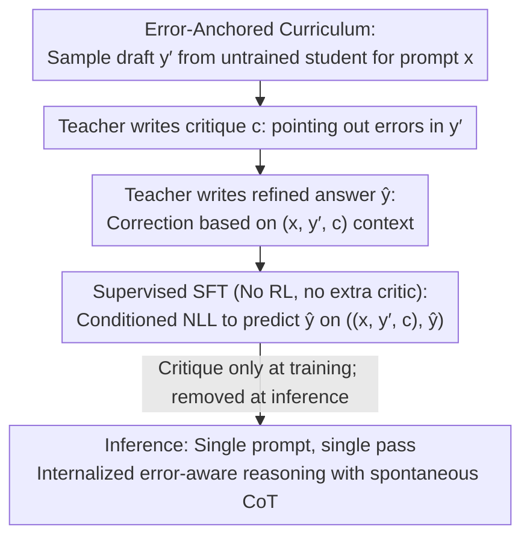

# Critique-Guided Distillation for Robust Reasoning via Refinement

**Conference**: ICML 2026  
**arXiv**: [2505.11628](https://arxiv.org/abs/2505.11628)  
**Code**: No public repository link provided  
**Area**: Model Compression / Knowledge Distillation  
**Keywords**: Knowledge Distillation, Mathematical Reasoning, Critique, Self-Correction, SFT  

## TL;DR
The student **consumes** rather than **generates** the teacher's critique during training. By predicting the teacher's refined answer conditioned on (prompt, student's own draft, teacher's critique), the model produces longer and more accurate reasoning chains in a single inference pass without compromising instruction-following capabilities as seen in CFT.

## Background & Motivation

**Background**: The dominant recipe for distilling strong reasoning capabilities from a large teacher into a small student is SFT/Distilled-SFT—directly imitating the teacher's gold answer or CoT on the same prompt. A few works (CFT, Self-Refine, Reflexion) attempt to introduce "critique" signals to force the model to learn self-correction.

**Limitations of Prior Work**: (i) Pure SFT learns "conclusions without the underlying logic," causing performance to collapse on OOD and difficult problems; (ii) Methods like Self-Refine/Reflexion require multiple inference passes for critique, doubling computation costs; (iii) Wang 2025's Critique Fine-Tuning (CFT) moves critique generation to training time, training the student to "generate critiques"—this results in severe output-format drift, where LLaMA3.1-8B's IFEval score plummeted from 76.9% to 55.6%, eroding general capabilities.

**Key Challenge**: Teaching a model "where it went wrong and how to fix it" via critique is beneficial, but **training the student to output a critique** versus **training the student to refine an answer based on a critique** are distinct tasks. The former alters the student's output distribution and format, while the latter treats the critique as an additional training-time condition. Mixing these tasks, as in CFT, leads to "winning math but losing IFEval."

**Goal**: To retain all the benefits of critiques while stripping away the side effects of critique generation, maintaining single-pass inference and an unchanged model architecture.

**Key Insight**: Critique should serve only as a "semantic scaffold" during training—it informs the student of errors in the current answer, but the student's learning target remains singular: correcting that error. At inference time, neither the critique nor the student's draft is provided; the model "internalizes" error-aware reasoning.

**Core Idea**: **Decouple critique consumption from critique generation**. During training, the student sees its own poor answer plus the teacher's critique but is supervised only to predict the teacher's refined answer. At inference, only the prompt is input for a single-pass generation.

## Method

### Overall Architecture
CGD addresses a specific problem: enabling a small student to learn "correction-based reasoning" from a large teacher without training the student to output critiques and lose instruction-following skills. It employs a minimalist pipeline of three-step data synthesis and one-time SFT without introducing new modules or changing prompt formats. First, an untrained student $S_{\theta_{\text{init}}}$ samples a "likely incorrect" draft $y' \sim S_{\theta_{\text{init}}}(\cdot \mid x)$ for each prompt $x$. Next, a teacher $T_\phi$ observes $(x, y')$ and writes a textual critique $c \sim T_\phi(\cdot \mid x, y')$ identifying errors. Finally, the teacher produces a gold-standard refinement $\hat{y} \sim T_\phi(\cdot \mid x, y', c)$ based on the full context. The student is trained on the quadruple $((x, y', c), \hat{y})$. Crucially, the critique appears only as a condition during training and is removed during inference.

### Key Designs

**1. Student-specific error-anchored curriculum: Tailoring critiques to real student errors**

Standard distilled SFT feeds the same teacher solution regardless of the student's mistake, teaching based on generic errors imagined by the teacher. CGD reverses this: the draft $y'$ is not pre-generated but **sampled fresh from $S_{\theta_{\text{init}}}$ for each prompt**. Consequently, the critique and refined answer are bound to the actual failure modes of that specific checkpoint, automatically creating a curriculum "customized to student weaknesses." The authors refer to this as the "specificity and relevance of feedback" and identify it as the primary driver of CGD's gains. Ablations show that replacing the critique with placeholders or irrelevant text—making it mismatched with the student's actual error—significantly reduces gains, proving that the improvement is not just from "seeing more context" but from the specific feedback refining the learning signal.

**2. Quadruple conditioning at training, single prompt at inference: Critique as a "semantic scaffold"**

This design directly addresses the collapse observed in CFT. CFT's objective is $-\log S_\theta(c \mid x, y')$, forcing the student to generate critiques, which drags the output distribution toward critique styles and causes drift in general tasks (IFEval 76.9→55.6). CGD’s objective remains standard conditional NLL $\mathcal{L}(\theta) = \mathbb{E}_{(x, y', c, \hat{y})}\big[-\log S_\theta(\hat{y} \mid x, y', c)\big]$—the supervision is always "write the correct answer given the prompt," preventing distribution contamination. During inference, the model sees only $x$ and generates in a single forward pass without special tokens or template changes. The elegance lies in the fact that while the critique is entirely removed at inference, the student's internal representation has internalized the "error-to-correction" mapping, leading to **spontaneous extension** of reasoning chains (up to 4.4× on AIME).

**3. Fully supervised training without RL or extra critics: Using simple SFT to achieve RL-like self-correction**

A single teacher acts as both critic and refiner, providing textual critiques rather than scalar rewards, which aligns with the empirical observation that "effective feedback must be specific and actionable." Compared to similar self-correction approaches, CGD eliminates heavy lifting: it requires no discriminator (unlike GRACE/QCRD), no separate critic model (unlike CTRL/Shepherd), and no multi-round decoding (unlike Self-Refine). The only cost is a standard SFT—100K samples processed in 8 GPU-hours on 16 A100s. Implementation costs are significantly lower than RL pipelines with reward models and sampling loops, yet it achieves self-correction behavior similar to SCoRe and RL4F.

### Loss & Training
The sole loss is the conditional NLL in Eq. (1). All baselines (SFT, Distilled SFT, CFT) share the same 100K samples, batch size 64, and 1 epoch, ensuring aligned step counts. A single training run takes approximately 8 A100-hours. Teachers used include LLaMA3.3-70B Instruct (for the LLaMA family) or S1.1-32B (for the Qwen family).

## Key Experimental Results

### Main Results

| Student | Method | Math Reasoning Avg ↑ | General Reasoning Avg ↑ | Notable Gains |
|---------|------|---------------------|------------------------|------------|
| LLaMA3.1-8B-Instruct | base | 41.3 | 29.9 | — |
| LLaMA3.1-8B-Instruct | Distilled SFT | 43.7 | 31.9 | — |
| LLaMA3.1-8B-Instruct | CFT | 41.5 | 32.4 | AMC23 22.5 |
| LLaMA3.1-8B-Instruct | **CGD** | **46.9** | **36.7** | **AMC23 37.5 (+15.0)**, OlympiadBench 23.7 (+8.0) |
| S1.1-3B | base | 35.4 | 17.9 | — |
| S1.1-3B | Distilled SFT | 41.7 | 33.5 | — |
| S1.1-3B | CFT | 38.9 | 29.5 | MATH500 49.6 |
| S1.1-3B | **CGD** | **46.1** | **33.4** | **MATH500 61.8 (+12.2)**, Minerva-Math +6.9 |

Cross-family validation: CGD achieved a +22.6% relative gain over the base on Qwen2.5-Math-7B with 8 A100-hours of training.

### Ablation Study

| Benchmark | Metric | LLaMA3.1-8B base | + CFT | + CGD | Insight |
|---------|------|------------------|-------|-------|------|
| IFEval (Inst. Following) | acc | 76.9 | **55.6 (-21.3)** | ≥76.9 | CFT shows catastrophic degradation; CGD preserves performance. |
| MUSR / TruthfulQA / BBH / HumanEval | Avg | baseline | Significant drop | Stable or improved | CGD does not damage general capabilities. |
| AIME (greedy/Pass@1) | acc | Low | Low | Significantly stronger | Gains are maximized at low sampling budgets. |
| Reasoning Chain Length (AIME) | tokens | 1× | — | **4.4×** | Spontaneously lengthens CoT despite no critique at inference. |

### Key Findings
- **The "specificity" of critiques is the causal driver**: Ablations controlling the relevance of the critique to the student's actual error showed significant shrinkage in gains when relevance dropped, proving that performance spikes result from specific feedback rather than merely increased context length.
- **AMC23 +15.0 / MATH500 +12.2 concentrated at low Pass@k**: This implies CGD improves the "per-sample reasoning quality" rather than relying on expanded sampling budgets; performance continues to scale with $k$, indicating no distribution collapse.
- **CFT's collapse is objective-driven, not a hyperparameter issue**: The authors explicitly state that catastrophic IFEval loss is a fundamental side effect of switching the training target to critique generation, which cannot be fixed via tuning—justifying the need for decoupling.
- **Cross-family transferability**: Improvements of 5-7% in math reasoning were observed across five model families (LLaMA, Qwen, S1.1, Mixtral, OLMo); notably, CGD trained on pure math data even transferred to HumanEval code generation.

## Highlights & Insights
- The concept of "decoupling consumption from generation" is highly notable. While many self-improvement works couple "judging" with "outputting judgments," CGD cleanly retains the ability to utilize feedback while discarding the requirement to generate it, bypassing format drift with zero extra inference overhead.
- Using student-specific errors for the curriculum is conceptually similar to "on-policy" ideas in RLHF/DPO but implemented purely via SFT, creating a "pseudo-on-policy" method that captures RL benefits at SFT costs.
- The paradigm of "rich information during training, prompt-only during inference" can be naturally extended: for example, giving the student plans/scratchpads/tool-use traces during training for internalization. CGD serves as a minimal viable proof for this class of methods.
- The 76.9→55.6 drop in IFEval is highly educational—it explains why many "reasoning-enhanced" models perform worse as general chatbots and identifies the training objective, rather than data scale or learning rate, as the culprit.

## Limitations & Future Work
- The teacher remains a bottleneck when writing incorrect critiques: The authors admit that LLaMA3.3-70B's critique quality is a limiting factor on hard math problems, and robustness curves against critique error rates were not provided.
- Evaluation is primarily focused on math/reasoning benchmarks with HumanEval as OOD; scenarios like multimodal, long-context, and conversational safety were not explored.
- While the authors removed direct overlaps, the risk of contamination in web-crawled instruction data persists; large gains like +15% require cautious attribution.
- Direct comparisons with RL-based self-correction (SCoRe, RL4F) are limited in the main text (mostly residing in the appendix), and the utility of CGD as an initialization checkpoint for RL requires further validation.

## Related Work & Insights
- **vs Critique Fine-Tuning (CFT, Wang 2025)**: CFT targets critique prediction, while CGD targets refined answer prediction—same data but inverted conditional directions. CGD outperforms CFT by 5-7% in math while avoiding the IFEval disaster.
- **vs Self-Refine / Reflexion (Madaan/Shinn 2023)**: These methods run critiques in an inference loop; CGD internalizes critiques into training and uses single-pass inference—resulting in lower latency for the same reasoning budget.
- **vs On-policy distillation (GKD/SKD)**: GKD/SKD use teacher probabilities or rewards as implicit signals; CGD provides explicit semantic signals via textual critiques. These are complementary—combining CGD data with GKD loss might yield further gains.
- **vs SCoRe / RL4F**: RL approaches require reward models and sampling loops; CGD achieves similar self-correction behavior at SFT costs using homogenous data.

## Rating
- Novelty: ⭐⭐⭐⭐ "Decouple consumption from generation" is a clear concept, though the technical implementation is an objective rewrite of CFT; the SFT framework itself is standard.
- Experimental Thoroughness: ⭐⭐⭐⭐ Five model families, two datasets, three evaluation categories, and the IFEval counter-example are included, though robustness to critique quality and head-to-head RL comparisons are relegated to the appendix.
- Writing Quality: ⭐⭐⭐⭐⭐ Problem motivation is precisely targeted (using CFT's IFEval loss as a selling point). The algorithm is concisely explained with 11 lines of pseudocode and one formula.
- Value: ⭐⭐⭐⭐⭐ +22.6% cross-family gain with 8 GPU-hours, no architectural changes, and single-pass inference—this is a powerful, "plug-and-play" baseline for small-to-medium model reasoning distillation.

<!-- RELATED:START -->

## Related Papers

- [\[ICML 2026\] Toward Understanding Adversarial Distillation: Why Robust Teachers Fail](toward_understanding_adversarial_distillation_why_robust_teachers_fail.md)
- [\[ICLR 2026\] STAR: Similarity-guided Teacher-Assisted Refinement for Super-Tiny Function Calling Models](../../ICLR2026/model_compression/star_similarity-guided_teacher-assisted_refinement_for_super-tiny_function_calli.md)
- [\[AAAI 2026\] Efficient Reasoning for Large Reasoning Language Models via Certainty-Guided Reflection Suppression](../../AAAI2026/model_compression/efficient_reasoning_for_large_reasoning_language_models_via_certainty-guided_ref.md)
- [\[ACL 2025\] LLMSR@XLLM25: Less is More: Enhancing Structured Multi-Agent Reasoning via Quality-Guided Distillation](../../ACL2025/model_compression/llmsrxllm25_less_is_more_enhancing_structured_multi-agent_reasoning_via_quality-.md)
- [\[ECCV 2024\] Adversarially Robust Distillation by Reducing the Student-Teacher Variance Gap](../../ECCV2024/model_compression/adversarially_robust_distillation_by_reducing_the_student-teacher_variance_gap.md)

<!-- RELATED:END -->
