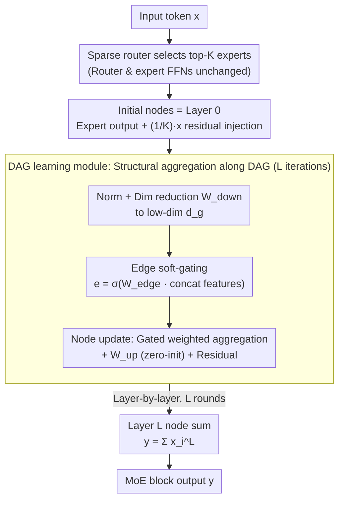

# DAG-MoE: From Simple Mixture to Structural Aggregation in Mixture-of-Experts

**Conference**: ICML 2026  
**arXiv**: [2606.01062](https://arxiv.org/abs/2606.01062)  
**Code**: https://github.com/JiaruiFeng/DAG-MoE  
**Area**: Model Compression / MoE Architecture  
**Keywords**: Mixture-of-Experts, Structural Aggregation, DAG, Multi-step Reasoning, Sparse Routing  

## TL;DR
Replaces the standard "weighted sum" aggregation of top-$K$ expert outputs in MoE with structural aggregation via a dynamically learned Directed Acyclic Graph (DAG), significantly enhancing MoE expressivity and downstream inference performance with negligible increases in routing or parameter overhead.

## Background & Motivation

**Background**: Modern LLMs commonly use MoE to decouple parameter counts from computation—a router selects top-$K$ FFN experts for each token, outputting $y=\sum_{i=1}^{N} g_i(x) E_i(x)$. Existing scaling axes focus on improving routing accuracy or making expert granularity finer ($G=d_f/d_r$).

**Limitations of Prior Work**: While fine-grained approaches expand the combination space $\binom{N}{K}$, doubling $N$ simultaneously doubles routing parameters and load-balancing complexity. Furthermore, since routers and experts have been repeatedly optimized, gains from further tuning are diminishing.

**Key Challenge**: The standard aggregation form $\sum g_i E_i$ is **permutation-invariant**—once the top-$K$ set is fixed, the output is uniquely determined by this multiset of experts. Experts lack order, interaction, and multi-step combination capabilities within a single layer. Thus, the third core component of MoE—**aggregation**—has been ignored, locking expressivity within the weighted sum function family.

**Goal**: (i) Propose an aggregation form stronger than weighted sum without increasing routing complexity; (ii) Provide rigorous expressivity comparisons; (iii) Design a lightweight, end-to-end learnable module to implement such aggregation.

**Key Insight**: View the selected $K$ experts as nodes on a DAG—each node occupies a **distinct structural role**, and expert outputs are aggregated layer-by-layer along DAG edges. For a fixed $K$, the number of possible DAGs grows exponentially with depth, providing a new scaling axis.

**Core Idea**: Replace the permutation-invariant weighted sum in the MoE layer with a **per-token dynamically learned structural aggregation on a DAG**, thereby amplifying the combination space without modifying the router or experts.

## Method

### Overall Architecture
DAG-MoE only modifies the final aggregation step in the MoE block. A token enters, the router selects top-$K$ experts, and $K$ initial node representations are initialized (including a $1/K$ scaled residual of the original token). Then, a **DAG learning module** iterates $L$ times: in each round, it reduces nodes to low dimensions, dynamically learns "edges" (soft gates) for current nodes, updates representations along these edges, and finally sums all nodes at layer $L$.

### Key Designs

**1. General Formulation and Theory**: 
The authors prove that structural aggregation is strictly stronger than weighted sum. They show (Prop 3.1) that any DAG can be injectively encoded, leading to (Theorem 3.2) DAG-MoE being strictly stronger than standard MoE. Crucially, Theorem 3.3 states that a single DAG-MoE layer with one attention layer can simulate a complete dynamic program in $O(K\log n)$ input length, a feat standard MoE cannot achieve.

**2. Lightweight DAG Learning Module**: 
The module fixes $n(l)=K$ per layer and allows connectivity from layer $l-1$ to $l$. It reduces representations to a low dimension $d_g \ll d$ for structure learning to minimize overhead. Edge features are concatenated to learn a soft gate:
$$e^l_{(i,j)} = \sigma(W_{\mathrm{edge}}^l x^l_{(i,j)})$$
Node information is weighted by these gates, projected back, and added to the residual. Zero-initializing $W_{\mathrm{up}}$ ensures the module acts as an identity mapping early in training, maintaining stability.

**3. Initial Node Residual Injection**: 
To prevent token information dilution, each initial node receives $x_i^0 = g_{\bm{k}[i]}(x) E_{\bm{k}[i]}(x) + \tfrac{1}{K} x$. Summing $K$ nodes at the end recovers exactly 1x the original residual, matching Transformer block conventions.

### Loss & Training
The model uses standard token-choice routing with load-balance loss and router Z-loss. The base architecture is adapted from Llama 3.1-8B and trained as a standard causal LM.

## Key Experimental Results

### Main Results
Large-scale training on 40B tokens compared DAG-MoE-l ($d_g=256, L=2$) vs. MoE-l (including a shared expert for parameter alignment):

| Dataset | Metric | MoE-l | DAG-MoE-l | Gain |
|--------|------|-------|-----------|------|
| Pile (in-domain) | PPL ↓ | 10.51 | 10.27 | -0.24 |
| Wikipedia (OOD) | PPL ↓ | 21.08 | 20.54 | -0.54 |
| FineWeb-Edu (OOD) | PPL ↓ | 25.38 | 24.69 | -0.69 |
| C4 (OOD) | PPL ↓ | 35.21 | 34.21 | -1.00 |

### Ablation Study

| Configuration | Param Gain | ΔPPL ↑ / Eval Loss ↓ | Description |
|------|------|----------------------|------|
| Standard MoE | 0 | 0.000 / 2.7168 | Baseline |
| Chain-of-Experts | 393K | 0.480 | Iterative routing baseline |
| **DAG-MoE-s ($L=2$)**| 393K | **0.587** | Best performance |
| MLP mixing | 98K | -0.0838 | Unstructured mixing causes regression |

### Key Findings
- **Structure is the key**: Unstructured MLP mixing performs worse than the baseline, confirming that the "order and iterative combination" of a DAG provides essential inductive bias.
- **Iteration count $L$ is efficient**: Most gains are captured by $L=2$, with minimal marginal utility at $L=3$. 
- **Low throughput cost**: $L=2$ adds only 4.49% wall-clock overhead.
- **Gains in multi-step reasoning**: Downstream improvements are concentrated in reasoning tasks (GPQA, BBH) rather than pattern-matching ones.

## Highlights & Insights
- Proposes MoE "aggregation" as a new independent design axis and bridges it with GNN expressivity theory.
- The "theory as motivation, experiment as evidence" approach provides strong justification for structural aggregation.
- The finding that the OOD gap is larger than the in-domain gap supports the theory that structural diversity is crucial for unseen token-expert combinations.

## Limitations & Future Work
- The learnable DAG space is currently restricted to adjacent layer connectivity.
- The method relies on soft-gating gradients; finding the "globally optimal" discrete DAG remains an open problem.
- Scaling behavior beyond 700M parameters and 40B tokens is yet to be fully validated.

## Related Work & Insights
- **vs Chain-of-Experts**: DAG-MoE routes only once, reducing complexity while achieving better performance (+0.107 PPL). 
- **vs Fine-grained MoE**: While fine-grained MoE scales via expert selection ($N$), DAG-MoE scales via expert combination (aggregation). These approaches are orthogonal.

## Rating
- Novelty: ⭐⭐⭐⭐⭐ 
- Experimental Thoroughness: ⭐⭐⭐⭐ 
- Writing Quality: ⭐⭐⭐⭐⭐ 
- Value: ⭐⭐⭐⭐

## Related Papers

- [\[ICML 2026\] RQ-MoE: Residual Quantization via Mixture of Experts for Efficient Input-Dependent Vector Compression](rq-moe_residual_quantization_via_mixture_of_experts_for_efficient_input-dependen.md)
- [\[ICLR 2026\] Coupling Experts and Routers in Mixture-of-Experts via an Auxiliary Loss](../../ICLR2026/model_compression/coupling_experts_and_routers_in_mixture-of-experts_via_an_auxiliary_loss.md)
- [\[ICLR 2026\] Unveiling Super Experts in Mixture-of-Experts Large Language Models](../../ICLR2026/model_compression/unveiling_super_experts_in_mixture-of-experts_large_language_models.md)
- [\[CVPR 2026\] Enhancing Mixture-of-Experts Specialization via Cluster-Aware Upcycling](../../CVPR2026/model_compression/enhancing_mixture_of_experts_specialization_via_cluster_aware_upcycling.md)
- [\[ICLR 2026\] Efficient Quantization of Mixture-of-Experts with Theoretical Generalization Guarantees](../../ICLR2026/model_compression/efficient_quantization_of_mixture-of-experts_with_theoretical_generalization_gua.md)

<!-- RELATED:END -->

<!-- RELATED:START -->

## Related Papers

- [\[ICLR 2026\] MoBE: Mixture-of-Basis-Experts for Compressing MoE-based LLMs](../../ICLR2026/model_compression/mobe_mixture-of-basis-experts_for_compressing_moe-based_llms.md)
- [\[ICML 2026\] RQ-MoE: Residual Quantization via Mixture of Experts for Efficient Input-Dependent Vector Compression](rq-moe_residual_quantization_via_mixture_of_experts_for_efficient_input-dependen.md)
- [\[ICLR 2026\] Coupling Experts and Routers in Mixture-of-Experts via an Auxiliary Loss](../../ICLR2026/model_compression/coupling_experts_and_routers_in_mixture-of-experts_via_an_auxiliary_loss.md)
- [\[ICLR 2026\] Unveiling Super Experts in Mixture-of-Experts Large Language Models](../../ICLR2026/model_compression/unveiling_super_experts_in_mixture-of-experts_large_language_models.md)
- [\[NeurIPS 2025\] Dense Backpropagation Improves Training for Sparse Mixture-of-Experts](../../NeurIPS2025/model_compression/dense_backpropagation_improves_training_for_sparse_mixture-of-experts.md)

<!-- RELATED:END -->
