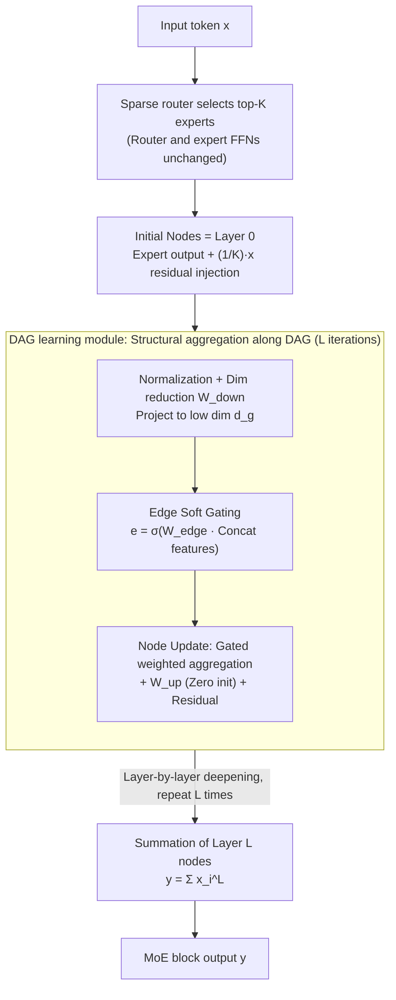

# DAG-MoE: From Simple Mixture to Structural Aggregation in Mixture-of-Experts

**Conference**: ICML 2026  
**arXiv**: [2606.01062](https://arxiv.org/abs/2606.01062)  
**Code**: https://github.com/JiaruiFeng/DAG-MoE  
**Area**: Model Compression / MoE Architecture  
**Keywords**: Mixture-of-Experts, Structured Aggregation, DAG, Multi-step Reasoning, Sparse Routing  

## TL;DR
Replaces the "weighted sum" of top-$K$ expert outputs in standard MoE with structural aggregation via a dynamically learned DAG. This significantly enhances MoE expressiveness and downstream reasoning performance with almost zero increase in routing or parameter overhead.

## Background & Motivation

**Background**: Modern LLMs generally decouple parameter count and computation via MoE—a router selects top-$K$ FFN experts for each token, and the output is $y=\sum_{i=1}^{N} g_i(x) E_i(x)$. Existing scaling axes focus on two lines: making routing algorithms more accurate (Expert-Choice, RNN router, load-balance loss improvements) or making expert granularity finer (fine-grained, where larger $G=d_f/d_r$ increases the combination space).

**Limitations of Prior Work**: While fine-grained approaches explode the number of combinations $\binom{N}{K}$ (top-2/8=28 vs. top-4/16=1820), doubling $N$ simultaneously doubles routing parameters and load balancing complexity. Consequently, SOTA systems avoid extreme granularity. Furthermore, routers and experts have been repeatedly optimized, leading to diminishing returns.

**Key Challenge**: The standard aggregation form $\sum g_i E_i$ is **permutation invariant**—once the top-$K$ set is fixed, the output is uniquely determined by this "multiset" of experts. Experts have no order or interaction, making multi-step combinations within a single layer impossible. In other words, the third core component of MoE—**aggregation**—has been neglected, locking the expressive upper bound to the weighted sum function family.

**Goal**: (i) Propose an aggregation form stronger than weighted sum without increasing routing complexity; (ii) Provide rigorous expressiveness comparisons; (iii) Design a lightweight, end-to-end learnable module to implement this aggregation.

**Key Insight**: Treat the selected $K$ experts as nodes in a DAG—each node occupies a **different structural role**, and expert outputs are aggregated layer-by-layer along DAG edges. Thus, even with identical expert sets and router scores, a different DAG yields a completely different output. For a fixed $K$, the number of possible DAGs grows exponentially with depth, providing a brand-new scaling axis.

**Core Idea**: Replace the permutation-invariant weighted sum step in the MoE layer with **structured aggregation on a per-token dynamically learned DAG**, thereby amplifying the combination space without touching the router or experts.

## Method

### Overall Architecture
DAG-MoE only modifies the final aggregation step in the MoE block, leaving the sparse router and expert FFNs intact. When a token enters, the router selects top-$K$ experts and provides $K$ initial node representations as usual. Each initial node is also injected with a $1/K$ scaled residual of the original token as layer 0 of the DAG. Then, a new **DAG learning module** takes over: it iterates $L$ times. In each round, it projects nodes to a lower dimension, dynamically learns a set of "edges" (soft gating) for nodes at the current depth, and updates representations along these edges. Finally, it sums all nodes at layer $L$ as the output for that token in the current layer. Since the router and experts are unchanged, it is natively compatible with existing MoE training stacks.

### Key Designs

**1. General Formalization of DAG-style Aggregation: Theoretically proving "structured aggregation" is strictly stronger than "weighted sum"**

Standard MoE output $y=\sum_i g_i E_i$ is permutation invariant—once the top-$K$ set is fixed, the output is uniquely determined by this multiset. DAG-MoE organizes the top-$K$ list $\bm{k}$ into a DAG $G=(\mathcal{V},\mathcal{A})$ with depth $L$ and $n(l)$ nodes per layer. Node $(l,i)$ specifies its source nodes via incoming edges $A_i^l$, and a single root node $(L,1)$ provides the final output. Formally, the initial layer is $x_i^0 = g_{\bm{k}[i]}(x) E_{\bm{k}[i]}(x)$, intermediate layers are $x_i^l = \mathrm{AGG}(\{x_j^k \mid (k,j)\in A_i^l\})$, and the output is $y=\mathrm{AGG}(\{x_j^k \mid (k,j)\in A_1^L\})$. Using GNN/D-VAE tools, if $\mathrm{AGG}$ is injective (constructed theoretically via MLP+sum/min/max), three conclusions follow: Prop 3.1: Any DAG can be injectively encoded; Theorem 3.2: DAG-MoE is strictly stronger than standard MoE; Theorem 3.3: A single-layer DAG-MoE with one multi-head attention layer can simulate a complete dynamic programming process within $O(K\log n)$ length, while standard MoE cannot. This proof transforms the intuition of "why aggregation matters" into a provable expressiveness gap.

**2. Lightweight DAG learning module: Learning the DAG per-token without ground-truth structure**

The general DAG search space is too large for end-to-end learning, so the space is constrained: fix $n(l)=K$ per layer, and allow node $(l,i)$ to connect only from the adjacent previous layer $l-1$, with earlier information carried via residuals. Each iteration starts with normalization and reduction: $x_{i,\mathrm{input}}^l=\mathrm{LN}(x_i^{l-1})$, $x_{i,\mathrm{down}}^l=W_{\mathrm{down}}^l x_{i,\mathrm{input}}^l$, compressing representations to a low dimension $d_g \ll d$. For each node pair $(i,j)$, candidate edge features are $x^l_{(i,j)}=\mathrm{Concat}(x_{i,\mathrm{down}}^l, x_{j,\mathrm{down}}^l)$, and a soft gate is learned:

$$e^l_{(i,j)} = \sigma(W_{\mathrm{edge}}^l x^l_{(i,j)})$$

to continuously control edge activation. Node information is aggregated via gated weighting $\hat{x}^l_{(i,j)} = e^l_{(i,j)} \odot W_{\mathrm{node}}^l x^l_{(i,j)}$, projected back to original dimension, and added via residual: $x_i^l = W_{\mathrm{up}}^l\sum_j \hat{x}_{(i,j)}^l + x_i^{l-1}$. After $L$ rounds, output $y=\sum_{i=1}^K x_i^L$. This design solves three engineering problems: learning the $K\times K$ adjacency matrix as a sigmoid soft gate avoids discrete structure search (similar to DARTS); structural learning in low-dimensional space keeps overhead comparable to a single shared expert; and zero-initializing $W_{\mathrm{up}}$ ensures the module acts as an identity mapping initially, avoiding scale drift and gradient instability.

**3. Initial Node Token Residual Injection: Maintaining accessibility of original token representations**

If initial nodes only contain expert outputs, the token's own information might be diluted during aggregation. Thus, each initial node is injected with a scaled original representation: $x_i^0 = g_{\bm{k}[i]}(x) E_{\bm{k}[i]}(x) + \tfrac{1}{K} x$. The $1/K$ factor ensures that after summing $K$ nodes in the final $\sum_i x_i^L$, the total residual contribution of the original token is exactly 1, matching the magnitude of the Transformer block's outer residual stream. Ablations show that removing this residual or the $1/K$ scaling causes training divergence or failure to converge.

### Loss & Training
Follows Switch Transformer's token-choice router + load-balance loss, with additional router Z-loss to suppress logit drift. The backbone is modified from Llama3.1-8B. The training objective is standard causal LM.

## Key Experimental Results

### Main Results
Pre-training on 12B tokens of the Pile using three model tiers (DAG-MoE-s/-m/-l), with a baseline enhanced by a shared expert for strict parameter alignment. Large-scale training on 40B tokens compares DAG-MoE-l ($d_g=256$, $L=2$, 699M params) vs. MoE-l (shared expert $d_r=512$, 699M params):

| Dataset | Metric | MoE-l | DAG-MoE-l | Gain |
|--------|------|-------|-----------|------|
| Pile (in-domain) | PPL ↓ | 10.51 | 10.27 | -0.24 |
| Wikipedia (OOD) | PPL ↓ | 21.08 | 20.54 | -0.54 |
| FineWeb-Edu (OOD) | PPL ↓ | 25.38 | 24.69 | -0.69 |
| C4 (OOD) | PPL ↓ | 35.21 | 34.21 | -1.00 |

The OOD gap is significantly larger than in-domain, consistent with Theorem 3.2 stating that expressiveness advantages are more critical under distribution shift.

### Ablation Study

| Configuration | Param Add | ΔPPL ↑ / Eval Loss ↓ | Description |
|------|------|----------------------|------|
| Standard MoE | 0 | 0.000 / 2.7168 | Baseline |
| + shared expert | 393K | 0.433 | Same params, just more experts |
| Chain-of-Experts (CoE) | 393K | 0.480 | Same params, iterative router |
| **DAG-MoE-s ($L=2$)** | 393K | **0.587** | Structural aggregation is strongest |
| MLP mixing $d_g=64$ | 98K | -0.0838 (Regression) | Unstructured MLP mixing is worse |
| Downstream Finetuning (DAG-MoE-l vs MoE-l) | — | 26.13 vs 24.06 (avg 7 task) | GPQA +6.06, Lambada +3.46, PIQA +3.15 |

### Key Findings
- **Structure itself is key**, not just extra parameters: CoE with identical parameters only achieved 0.480, while unstructured MLP performed worse than the baseline. This indicates that the "order and iterative combination" provided by DAG is a truly effective inductive bias.
- **Iteration count $L$ is more cost-effective than dimension $d_g$**: Moving from $L=0\to1$ and $L=1\to2$ drops PPL by ~0.5, while $L=3$ shows marginal returns. $d_g=64, L=2$ outperforms $d_g=128, L=1$ with fewer parameters.
- **Low throughput cost**: $L=1$ adds only 1.51% wall-clock overhead; $L=2$ adds 4.49%. FLOPs are nearly identical.
- **Downstream gains concentrated in multi-step reasoning**: Significant improvements in GPQA, Lambada, PIQA, and BBH, while pattern-matching tasks like HellaSwag/MMLU remain nearly unchanged—confirming that structural aggregation primarily benefits compositional reasoning.

## Highlights & Insights
- Posits the MoE "aggregation operator" as an independent design axis and links it to GNN expressiveness (D-VAE/GIN framework), contributing three progressive theoretical results.
- Theorem 3.3 (single-layer DAG-MoE + attention can simulate DP) is a bold claim, though the authors conservatively state it is a capacity result and do not claim learned DAGs explicitly correspond to DP procedures.
- The soft gate $e^l_{(i,j)}$ effectively learns an adjacency matrix as a sigmoid mask, similar to continuous relaxation in NAS/DARTS but performed on a tiny $K\times K$ graph to avoid search costs.
- The "OOD gap > in-domain gap" phenomenon is rare in MoE literature but theoretically sound: OOD tokens are more likely to fall into unseen expert combinations, where structural aggregation diversity advantages are magnified.

## Limitations & Future Work
- DAG space is artificially restricted (fixed $K$ nodes, adjacent layer connections), which limits the full potential of Prop 3.1 and Thm 3.3.
- The problem of "finding the optimal DAG" and "stabilizing learning" is largely unaddressed, relying solely on sigmoid gating and gradients.
- Experiments capped at 699M parameters / 40B tokens. Scaling behavior for multi-billion parameter models remains unknown; the 4.49% time overhead for $L=2$ might be amplified in larger sequential models.
- The implementation of AGG (simplified to sigmoid gating + sum) lacks full ablation compared to the theoretical injective MLP+sum.

## Related Work & Insights
- **vs. Chain-of-Experts (CoE, Wang 2025)**: CoE uses "multi-round routing + incremental refinement," requiring independent routers per round. DAG-MoE routes once and leaves multi-step logic to the DAG module, outperforming CoE by 0.107 PPL at equal parameters.
- **vs. S′MoRE (Zeng 2025)**: S′MoRE also uses structural aggregation but with fixed tree structures as PEFT adapters; DAG-MoE generalizes this to arbitrary DAGs within the backbone.
- **vs. DiEP (Bai 2026)**: DiEP uses DAGs for differentiable expert pruning; DAG-MoE uses them to increase expressivity.
- **vs. Fine-grained MoE (He 2024 et al.)**: Fine-grained focuses on expanding combinations by picking "which" experts; DAG-MoE expands "how" they combine. These axes are orthogonal.

## Rating
- Novelty: ⭐⭐⭐⭐⭐ Treats aggregation as a standalone axis for expressiveness and links it to GNN theory.
- Experimental Thoroughness: ⭐⭐⭐⭐ Three model tiers and multiple baselines, though scale is still relatively small.
- Writing Quality: ⭐⭐⭐⭐⭐ Elegant progression from theory to experiment; excellent qualitative explanation of OOD vs. in-domain results.
- Value: ⭐⭐⭐⭐ Provides a nearly "free" new axis for MoE improvement (<5% throughput), though sequential scaling is unproven.

<!-- RELATED:START -->

1. **Switch Transformers**: Scaling to Trillion Parameter Models with Simple and Efficient Sparsity (Fedus et al., 2022)
2. **DeepSeek-V3 Technical Report**: Explaining Multi-token Prediction and Fine-grained Expert Design (DeepSeek-AI, 2024)
3. **Chain-of-Experts**: High-order Expert Interaction for Mixture-of-Experts (Wang et al., 2025)

<!-- RELATED:END -->

## Related Papers

- [\[ICML 2026\] RQ-MoE: Residual Quantization via Mixture of Experts for Efficient Input-Dependent Vector Compression](rq-moe_residual_quantization_via_mixture_of_experts_for_efficient_input-dependen.md)
- [\[ICLR 2026\] Coupling Experts and Routers in Mixture-of-Experts via an Auxiliary Loss](../../ICLR2026/model_compression/coupling_experts_and_routers_in_mixture-of-experts_via_an_auxiliary_loss.md)
- [\[ICLR 2026\] Unveiling Super Experts in Mixture-of-Experts Large Language Models](../../ICLR2026/model_compression/unveiling_super_experts_in_mixture-of-experts_large_language_models.md)
- [\[CVPR 2026\] Enhancing Mixture-of-Experts Specialization via Cluster-Aware Upcycling](../../CVPR2026/model_compression/enhancing_mixture_of_experts_specialization_via_cluster_aware_upcycling.md)
- [\[ICLR 2026\] LD-MoLE: Learnable Dynamic Routing for Mixture of LoRA Experts](../../ICLR2026/model_compression/ld-mole_learnable_dynamic_routing_for_mixture_of_lora_experts.md)

<!-- RELATED:END -->
