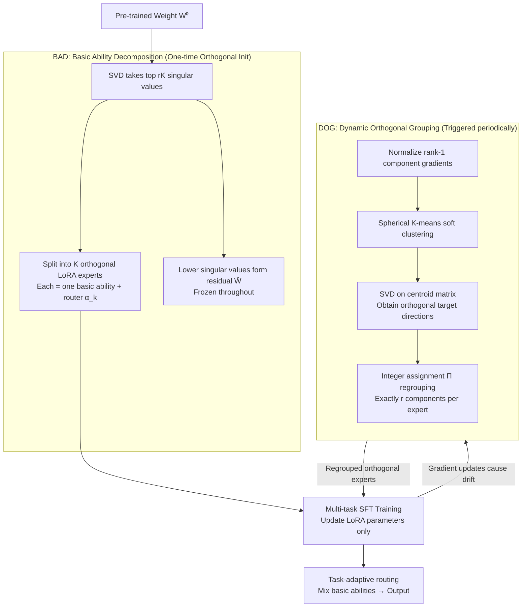

# Decomposing the Basic Abilities of Large Language Models: Mitigating Cross-Task Interference in Multi-Task Instruct-Tuning

**Conference**: ICML 2026  
**arXiv**: [2605.05676](https://arxiv.org/abs/2605.05676)  
**Code**: https://github.com/wangbing1416/BADIT  
**Area**: LLM Efficiency / Multi-Task Fine-Tuning / LoRA / MoE  
**Keywords**: Multi-task Instruction Fine-tuning, Cross-task Interference, SVD-LoRA, Spherical Clustering, Orthogonal Basic Abilities

## TL;DR
This paper addresses the cross-task gradient conflict in multi-task instruction fine-tuning by proposing Badit. It first uses SVD to decompose pre-trained weights into naturally orthogonal high-singular-value LoRA "basic ability" experts. During training, it applies spherical K-means to dynamically group rank-1 components orthogonally. This shifts the focus from "isolating parameters by task" to "decoupling by basic abilities," achieving an average improvement of 2.68 Rouge over GainLoRA across six LLMs.

## Background & Motivation
**Background**: The strong multi-task capabilities of current LLMs are primarily supported by multi-task instruction fine-tuning. However, multi-task training inevitably leads to *cross-task interference*—different tasks generate opposing gradients on shared parameters, causing mutual overriding. Existing solutions follow two main paths: (1) Task-specific neuron/parameter selection (e.g., Leng & Xiong 2025), which uses gradient attribution to identify and train only the parameter subsets dedicated to each task. (2) MoE-style expert isolation (LoRAMoE, OLoRA, etc.), which assigns independent LoRA experts to each task and applies orthogonality constraints.

**Limitations of Prior Work**: Empirical analysis on 15 SuperNI tasks (Fig. 1, Fig. 2) reveals that both categories of methods fall short. Whether it is "task-activated neurons/parameters" or "experts routed in MoE," **the vast majority are activated by multiple tasks simultaneously**—some neurons are even shared by all 15 tasks. In other words, "task-exclusive" parameters are largely an illusion, and cross-task interference is never truly eliminated.

**Key Challenge**: Using "tasks" as the granularity for isolation is inherently flawed because tasks are surface-level labels rather than functional segmentation units existing at the parameter level. Forcing groupings by task inevitably leads to parameter sharing due to the overlap in required abilities between tasks.

**Goal**: (1) Identify more fundamental, truly separable ability units than "tasks"; (2) Design an MoE structure where these units remain orthogonal throughout training.

**Key Insight**: Fig. 1 also reveals an inverse signal: "certain neurons/parameters are consistently **co-activated** across multiple tasks." these co-activation sets recur, forming a small number of "basis sets." The authors propose an analogy: LLMs encode several **orthogonal basic abilities**, and every task is a linear combination of these abilities. Therefore, parameters should be isolated by "basic ability" rather than by "task."

**Core Idea**: Use SVD to decompose pre-trained weights into multiple naturally orthogonal LoRA experts (each corresponding to a basic ability). During training, use spherical clustering to continuously regroup rank-1 components, forcing the gradient directions of different experts to remain orthogonal.

## Method

### Overall Architecture
Badit decomposes each LLM weight matrix $\mathbf{W}^0\in\mathbb{R}^{m\times n}$ as $\mathbf{W}^0 = \sum_{k=1}^{K}\alpha_k \mathbf{A}_k\mathbf{B}_k + \widehat{\mathbf{W}}$. The top $rK$ singular values are split into $K$ rank-$r$ LoRA experts, each interpreted as a "basic ability" with a learnable router $\alpha_k$, while the remaining small singular values form the residual $\widehat{\mathbf{W}}$, which is frozen. The workflow consists of two stages: **BAD** uses SVD to provide an initially orthogonal ability decomposition, and **DOG** periodically regroups components during training to restore orthogonality diluted by gradients, with routers adaptively mixing these abilities per task.

### Key Designs

**1. Basic Ability Decomposition (BAD): Obtaining a Train-Free Orthogonal "Ability Dictionary" via SVD**

To solve the issue where "task-based" experts share parameters due to overlapping abilities, the method seeks functional units already present in the parameters. BAD performs SVD on the pre-trained weights $\mathbf{W}^0$, takes the top $rK$ singular values/vectors, and splits them into $K$ segments. The $k$-th segment constructs $\mathbf{A}_k = \mathbf{U}_{[r(k-1):rk]}\,\mathrm{diag}(\sqrt{\boldsymbol{\Sigma}_{[r(k-1):rk]}})$ and its symmetric $\mathbf{B}_k$ to form a rank-$r$ LoRA expert. The remaining part is frozen as a residual. The paper (Appendix A) proves that these $K$ experts are **naturally orthogonal at initialization**—the left/right singular vectors of SVD reside in non-overlapping subspaces. The key insight is that basic abilities are not randomly assigned and trained like in LoRAMoE, but are principal directions already existing in the pre-trained weights. SVD effectively provides a free orthogonal dictionary, shifting the burden of "expert differentiation" from training to initialization.

**2. Dynamically Orthogonal Grouping (DOG): Transform Orthogonality into Discrete Optimization for Regrouping**

Orthogonality from SVD only holds at $t=0$ and drifts as gradients update (Fig. 4 shows LoRAMoE inter-expert angles deviating from 90°). Ablations show that "maintaining orthogonality throughout training" is more critical than a "good initialization." DOG triggers regrouping every few steps: first, the concatenated gradient $\mathbf{g}_i$ of each rank-1 component $[\mathbf{a}_i;\mathbf{b}_i^\top]$ is normalized to $\widehat{\mathbf{g}}_i$. Then, an assignment matrix $\boldsymbol{\Pi}\in\{0,1\}^{rK\times K}$ is found (ensuring each expert gets $r$ components) to maximize intra-expert gradient consistency and inter-expert orthogonality:

$$\max_{\boldsymbol{\Pi}}\sum_k \Big\|\sum_i \pi_{i,k}\widehat{\mathbf{g}}_i\Big\|^2 .$$

The solution is a three-step iteration: use spherical K-means for initial assignment; calculate centroids $\mathbf{c}_k^{(\tau)}=\sum_i \pi_{i,k}^{(\tau)}\widehat{\mathbf{g}}_i$ and perform SVD on the centroid matrix $\mathbf{C}^{(\tau)}=\mathbf{U}_c\boldsymbol{\Sigma}_c\mathbf{V}_c^\top$ to get $\mathbf{Q}^{(\tau)}=\mathbf{U}_c\mathbf{V}_c^\top$ as the target orthogonal directions; finally, solve an integer assignment problem with $\sum_i \pi_{i,k}=r$ constraints based on inner products $\langle \widehat{\mathbf{g}}_i, \mathbf{q}_k^{(\tau)}\rangle$. This avoids hard orthogonality penalties that destabilize training, converting it into discrete re-classification. Appendix C proves the MoE output remains mathematically invariant before and after regrouping, preventing model disturbance.

### Loss & Training
The standard SFT loss $\mathcal{L}(\mathcal{F}(\mathbf{x};\boldsymbol{\theta}), y)$ is used without additional regularization. The number of experts is $K=8$, with rank $r$ aligned with LoRAMoE. DOG is triggered periodically (clustering and optimization are performed on CPU). Two evaluation paradigms: mixed training (15 tasks mixed) and sequential training (5 task orders averaged, focusing on forgetting).

## Key Experimental Results

### Main Results
Comparison of 5 baselines across SuperNI (15 tasks) and 6 LLMs (Qwen3, Llama3, Gemma2). Results for Qwen3-8B and Llama3-8B:

| Model / Setting | Method | Mixed Rouge↑ | Seq Rouge↑ | Seq Forget Rate↓ | Seq Backward↑ |
|------|------|------|------|------|------|
| Qwen3-8B | LoRA | 54.22 | 47.08 | 9.21 | -8.11 |
| Qwen3-8B | LoRAMoE | 54.64 | 48.07 | 8.47 | -6.23 |
| Qwen3-8B | GainLoRA (Prev. SOTA) | 54.33 | 48.44 | 8.96 | -6.42 |
| Qwen3-8B | **Badit (Ours)** | **55.87** | **50.86** | **6.95** | **-5.43** |
| Llama3-8B | LoRA | 52.58 | 44.88 | 12.41 | -10.23 |
| Llama3-8B | GainLoRA | 52.71 | 45.04 | 12.70 | -10.94 |
| Llama3-8B | **Badit (Ours)** | **54.75** | **48.83** | **8.57** | **-3.49** |

Badit outperforms GainLoRA by an average of **2.68 Rouge** across 6 LLMs, showing the best performance in forgetting rates and backward transfer. On Llama3-8B, the forget rate dropped from 12+ to 8.57, and backward transfer improved from -10 to -3.49.

### Ablation Study
Breakdown of BAD and DOG contributions (Δ is the total drop relative to full Badit):

| Model | Config | Seq Rouge | Seq Forget | Mixed Rouge | Δ |
|------|------|-----------|------------|-------------|---|
| Qwen3 | Badit (full) | 50.86 | 6.95 | 55.87 | - |
| Qwen3 | w/o BAD | 50.07 | 7.34 | 55.02 | 2.03 |
| Qwen3 | w/o DOG | 49.70 | 8.20 | 54.85 | 3.43 |
| Qwen3 | w/o BAD & DOG | 48.07 | 8.47 | 54.64 | 5.54 |
| Llama3 | Badit | 48.83 | 8.57 | 54.75 | - |
| Llama3 | w/o BAD | 47.92 | 9.30 | 54.02 | 2.37 |
| Llama3 | w/o DOG | 47.33 | 9.74 | 53.74 | 3.68 |

### Key Findings
- **DOG is more important than BAD**: Removing DOG causes a larger performance drop than removing BAD, indicating that maintaining orthogonality throughout training is more vital than the initialization itself.
- **Support for Basic Ability Hypothesis (Fig. 4)**: Badit's inter-expert gradient angles remain close to 90°, and intra-expert angles are around 60° (roughly 20° lower than LoRAMoE), proving it effectively achieves inter-expert orthogonality and intra-expert consistency.
- **Acceptable Overhead**: Total training time is approximately $1.22\times$ that of LoRAMoE, with the extra cost coming from CPU-based spherical K-means and integer optimization.

## Highlights & Insights
- **Shifting Isolation Granularity from "Tasks" to "Abilities"**: This is a conceptual leap. Traditional MoE assumes each task maps to an expert; this work argues tasks are linear combinations of abilities, which are the atomic units. This perspective explains why task-level isolation often fails—tasks overlap in the ability dimension.
- **SVD as a "Train-Free Expert Differentiator"**: The difficult problem of expert differentiation is offloaded to a pure linear algebra operation (SVD), which is efficient and provably orthogonal, building upon PiSSA.
- **The "Cluster-then-Orthogonalize" logic in DOG is transferable**: Direct orthogonal penalties often disturb the loss landscape. DOG's approach of grouping similar directions then orthogonalizing them as clusters while maintaining end-to-end training is a robust design for any scenario requiring directional decoupling.
- **Invariance Proof**: The mathematical proof in Appendix C ensuring MoE output remains unchanged after regrouping is crucial, as it avoids disturbing the model during dynamic restructuring.

## Limitations & Future Work
- The 1.22× training cost might scale unfavorably with larger batches or larger $K$, potentially becoming a bottleneck in industrial settings.
- CPU-based clustering and optimization may become a synchronization bottleneck for GPU-bound training; GPU implementations are required.
- The assumption that "basic abilities = principal SVD directions" is mathematically elegant but lacks semantic interpretability (e.g., math, reasoning) via probing experiments.
- The frozen residual $\widehat{\mathbf{W}}$ discards minor singular value directions, which might be a bottleneck for long-tail tasks.

## Related Work & Insights
- **vs LoRAMoE / OLoRA**: These use randomly initialized LoRA experts with task-based routing and maintain orthogonality via penalties. Badit initializes with SVD and maintains orthogonality via regrouping.
- **vs PiSSA**: PiSSA is a single-expert SVD-LoRA. Badit extends this by slicing the SVD spectrum into $K$ segments to serve as multiple experts for decoupling.
- **vs GainLoRA**: GainLoRA is a SOTA MoE approach that still uses task-based parameter assignment. This paper provides empirical evidence against the "task-separable" assumption to achieve its gains.

## Rating
- Novelty: ⭐⭐⭐⭐ Shifting granularity to basic abilities is a compelling conceptual shift; SVD + clustering is a novel combination for this problem.
- Experimental Thoroughness: ⭐⭐⭐⭐ Comprehensive coverage across 6 LLMs and multiple training paradigms.
- Writing Quality: ⭐⭐⭐⭐ Clear motivation derived from counter-intuitive findings in Fig. 1/2; well-structured method section.
- Value: ⭐⭐⭐⭐ Highly relevant for LLM post-training; the performance gains are attractive for industrial pipelines.

<!-- RELATED:START -->

## Related Papers

- [\[CVPR 2026\] DuetMerging: Synergizing Dynamic and Static Strategies for Mitigating Task Interference in Model Merging](../../CVPR2026/model_compression/duetmerging_synergizing_dynamic_and_static_strategies_for_mitigating_task_interf.md)
- [\[CVPR 2026\] TaskIT: Memory-Efficient Fine-Tuning of Multi-LoRA LLMs via Cross-Task Importance Transfer](../../CVPR2026/model_compression/taskit_memory-efficient_fine-tuning_of_multi-lora_llms_via_cross-task_importance.md)
- [\[CVPR 2025\] Task Singular Vectors: Reducing Task Interference in Model Merging](../../CVPR2025/model_compression/task_singular_vectors_reducing_task_interference_in_model_merging.md)
- [\[ACL 2026\] TLoRA: Task-aware Low Rank Adaptation of Large Language Models](../../ACL2026/model_compression/tlora_task-aware_low_rank_adaptation_of_large_language_models.md)
- [\[CVPR 2026\] Discovering Adaptive Task Dependencies for Efficient Multi-Task Representation Compression](../../CVPR2026/model_compression/discovering_adaptive_task_dependencies_for_efficient_multi-task_representation_c.md)

<!-- RELATED:END -->
