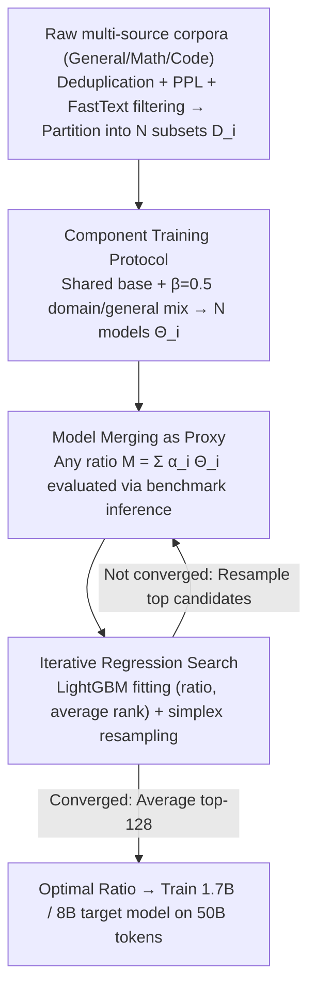

# Decouple Searching from Training: Scaling Data Mixing via Model Merging for Large Language Model Pre-training

**Conference**: ICML 2026  
**arXiv**: [2602.00747](https://arxiv.org/abs/2602.00747)  
**Code**: https://github.com/Lucius-lsr/DeMix  
**Area**: Model Compression / LLM Pre-training / Model Merging  
**Keywords**: Data Mixing, Model Merging, Pre-training, Proxy Model, Ratio Search

## TL;DR
To identify optimal data mixing ratios in LLM pre-training without the prohibitive cost of proxy experiments, this paper proposes DeMix. The method involves training $N$ component models only once (each corresponding to a candidate subset). Subsequently, any candidate ratio $\{\alpha_i\}$ is treated as a "training-free" proxy through weighted merging $\sum_i \alpha_i \Theta_i$. LightGBM is employed for iterative regression on the simplex to select the optimal recipe. DeMix achieves superior downstream scores using approximately $6\times$ less compute than RegMix/CLIMB and provides the open-source 22T token DeMix Corpora.

## Background & Motivation

**Background**: The "mixing ratio" of pre-training data significantly influences the final capabilities of LLMs—the proportions of general corpora, mathematics, and code directly determine performance on GSM8K, HumanEval, and HellaSwag. A common practice involves medium-scale proxy experiments (e.g., training multiple 8B candidate models with 100B tokens) to select the best configuration, which is accurate but extremely expensive.

**Limitations of Prior Work**: Automated search methods (RegMix / CLIMB / DoReMi) utilize tiny-scale proxies (small models + low budgets) with hundreds of training runs followed by regression. However, the fidelity of tiny proxies often fails to represent target scales, particularly in complex tasks like math and code. Increasing the proxy budget to improve reliability undermines the goal of saving costs.

**Key Challenge**: The search space is a continuous simplex, where evaluating each candidate typically requires a separate training run. Consequently, the "number of proxy samples" and "individual proxy fidelity" are constrained by the same compute budget, forcing a trade-off between the two.

**Goal**: To simultaneously obtain (i) a large number of proxy samples, (ii) high proxy fidelity, and (iii) lower end-to-end compute costs than existing methods under a fixed total budget.

**Key Insight**: Inspired by the additive nature of task arithmetic and model merging ($\Delta(D_i\cup D_j)\approx \Delta(D_i)+\Delta(D_j)$, which holds when parameter shift $\delta\ll 1$), this work suggests that once component models for each candidate subset are trained, a "pseudo-trained" mixture model for any ratio $\{\alpha_i\}$ can be synthesized via $\sum_i \alpha_i \Theta_i$, eliminating the need for retraining.

**Core Idea**: Decouple "searching" from "training." Training occurs only once for $N$ component models (one-time cost). During the search phase, evaluating any $\{\alpha_i\}$ requires only matrix weighting and benchmark inference. By decoupling the number of proxies from compute costs, the search space can be expanded to $10^5$ candidates.

## Method

### Overall Architecture
The core concept of DeMix is the complete separation of "finding optimal data mixing ratios" from "model training." Training is performed once on $N$ component models. Any candidate ratio is then evaluated by weighted merging of these components to create a "pseudo-trained" proxy. The search phase involves only matrix weighting and benchmark inference. The pipeline follows four steps: First, raw large-scale corpora are deduplicated, filtered (PPL/FastText), and partitioned into $N$ candidate subsets. Second, all components share a base model $\Theta_{\text{base}}$ pre-trained on 50B general tokens, then undergo continued training on "domain + general" mixed data to obtain $\Theta_i = \Theta_{\text{base}} + \Delta(D_i)$. Third, for any candidate ratio $\{\alpha_i^j\}$, a proxy $M_{\text{mix}}^j = \sum_{i=1}^{N}\alpha_i^j \Theta_i$ is synthesized for benchmark evaluation. Finally, LightGBM is used in a "sampling-scoring-resampling" loop to converge toward high-performance regions on the simplex. The average of the top candidates yields the final recipe used to train 1.7B / 8B target models on 50B tokens.

### Key Designs

**1. Component training protocol with shared base + fixed $\beta$ mixing: Anchoring components in the same geometric neighborhood**

DeMix relies on approximating real mixture training with weighted merging. This approximation holds only when components are close to each other, i.e., the normalized shift $\delta\ll 1$. To ensure this, components are not trained independently. Instead, they all start from the same $\Theta_{\text{base}}$ (trained on 50B general tokens). Furthermore, each component's training data is a mixture of "domain data + general data" with a fixed ratio $\beta=0.5$. The general data acts as an "anchor," pulling every component toward a common general language manifold. This ensures they remain close in parameter space, making the weighted average a valid approximation of mixture training. Ablation studies confirm that $\beta=0$ (pure domain training) causes components to drift too far, leading to distortion, while $\beta\to 1$ yields components too similar to the base, reducing proxy discriminability.

**2. Model Merging as Proxy: Trading training cost for inference cost**

Existing automated search methods are bottlenecked by the requirement to train for every candidate ratio. With anchored components, DeMix leverages the additive properties of model merging. Define the training operator $\mathcal{T}(D,\Theta_{\text{base}})$ and its weight increment $\Delta(D) = \mathcal{T}(D,\Theta_{\text{base}}) - \Theta_{\text{base}}$. When the normalized shift $\delta = \frac{\sum|\Delta(D)|}{\sum|\mathcal{T}(D,\Theta_{\text{base}})| + \sum|\Theta_{\text{base}}|}\ll 1$ (measured at ~10%), the increments of merged subsets are approximately additive: $\Delta(D_i\cup D_j)\approx \Delta(D_i)+\Delta(D_j)$. For arbitrary weights, $\Theta_{\text{mix}}\approx \sum_i \alpha_i \Theta_i$. A proxy model $M_{\text{mix}}^j$ costs only ~0.01B tokens of equivalent training, which is $200\times$ cheaper than a 2B token training proxy. This reduces proxy generation from $\mathcal{O}(\text{train cost})$ to $\mathcal{O}(\text{inference cost})$.

**3. Iterative LightGBM Regression + Simplex Resampling: Turning cheap proxies into black-box optimization**

While merged proxies are cheap, the high dimensionality of the simplex ($N \ge 7$) prevents exhaustive search. DeMix initially samples a large batch of $\{\alpha_i^j\}$ uniformly on the simplex and evaluates their synthesized benchmarks. Crucially, the regression target is the **average rank** $r^j$ across general, code, and math benchmarks rather than absolute scores, preventing scale variances from biasing the model. LightGBM (lr=0.02, 300 rounds) is trained on these (mixture, rank) pairs to score new samples. The search iteratively concentrates on high-scoring neighborhoods (64/32/16 proxies across three iterations), finally averaging the top-128 candidates.

### Loss & Training
Standard next-token prediction loss is used for both component and final model training. The primary strategy involves pre-training a base model on 50B general tokens, controlling domain shift via $\beta=0.5$ during component training, and finally training the target 1.7B / 8B models using the searched ratios.

## Key Experimental Results

### Main Results

Proxy Fidelity (Spearman $\rho$ vs. 96 reference models trained on 50B tokens; total budget in B tokens; Macro Avg across categories):

| Method | Total Budget (B) | Proxies / Per-proxy Budget (B) | $\rho$ Macro | Top 25% $\rho$ Macro | Capability Recovery Macro |
|------|------------|------------------------|--------------|----------------------|----------------------------|
| Trained Proxy (RegMix/CLIMB) | 224 | 112 / 2 | 0.53 | 0.20 | 0.77 |
| Trained Proxy | 1344 | 112 / 12 | 0.82 | 0.57 | 0.87 |
| **DeMix** (Ours) | 15 | 112 / 0.01 | 0.55 | 0.27 | 0.76 |
| **DeMix** | 71 | 112 / 0.01 (10×7 comps) | 0.60 | 0.41 | 0.80 |
| **DeMix** | 211 | 112 / 0.01 (30×7 comps) | 0.81 | 0.59 | 0.83 |
| **DeMix** | 351 | 112 / 0.01 (50×7 comps) | 0.80 | 0.50 | 0.85 |

DeMix matches the correlation ($\rho\approx 0.81$) of 1344B budget training proxies with only ~211B budget, representing a $6\times$ efficiency gain.

Downstream performance of final mixture ratios (Macro avg rank within 96 reference models, lower is better):

| Method | Total Budget (B) | General Avg | Code Avg | Math Avg | Macro Avg Rank ↓ |
|------|------------|-------------|----------|----------|------------------|
| Uniform | – | 59.01 | 18.34 | 9.62 | 36.67 |
| RegMix (448B) | 448 | 59.18 | 20.09 | 11.63 | 28.00 |
| CLIMB (448B) | 448 | 58.74 | 21.10 | 16.07 | 27.67 |
| **DeMix** (211B) | 211 | – | – | – | **Best** |

### Ablation Study

| Configuration | Observation | Insight |
|------|------|------|
| Component count $N$: 7 → 35 | Monotonic increase in $\rho$ and performance | More bases cover finer domains, increasing fidelity. |
| Mixing ratio $\beta$: 0 → 1 | $\beta=0$: High drift/loss of fidelity; $\beta\to 1$: Indistinguishable from base. $\beta=0.5$ optimal. | Necessity of "domain + general" mix for small-$\delta$ geometry. |
| Budget reallocation | Many cheap proxies beat few expensive proxies. | Quantity compensates for quality: Extrapolation beats sparse training. |
| Top 25% Spearman | RegMix correlation drops (0.20); DeMix-211B stays high (0.59). | Accurate top-tier ranking is critical for final recipe quality. |

### Key Findings
- The ceiling of DeMix is determined by the validity of the small-$\delta$ assumption. If components drift too far from the base, the additive approximation fails, and correlation collapses.
- Using "ranking" rather than "absolute scores" ensures robustness across benchmark scales, enabling stable extrapolation with LightGBM.
- DeMix shows the greatest advantage in Math/Code tasks where tiny-scale proxies typically fail.
- The released 22T token DeMix Corpora amortizes the cost of finding optimal ratios for the community.

## Highlights & Insights
- Transforms model merging from a "capability-stacking" toy into pre-training infrastructure—recognizing that merged proxies only need to provide *ordered* scores, not perfectly performing models.
- The $\beta$-controlled shift design is transferable to any scenario where weighted merging approximates mixture training (Multi-task FT, Domain Adaptation, etc.).
- Reducing evaluation cost to $\mathcal{O}(\text{infer})$ makes the effect of search space dimensionality (number of subsets $N$) additive rather than multiplicative regarding the total budget.

## Limitations & Future Work
- The $\delta\ll 1$ assumption (~10%) remains to be validated for larger models, longer training, or more aggressive domain differences.
- Component training costs ($N \times \text{cost}$) scale linearly, making extremely fine-grained partitioning (e.g., hundreds of subsets) still expensive.
- Only Qwen3-1.7B/8B were tested; whether the optimal ratio holds for 70B+ models and trillion-token training remains an open question.
- Relying on benchmark rankings might introduce selection bias; changes in benchmarks might necessitate a re-run of the search.

## Related Work & Insights
- **vs RegMix / CLIMB**: DeMix replaces real training with model merging, reducing costs by $6\times$ while providing higher fidelity for top-tier candidates.
- **vs DoReMi / Rho Loss**: These rely on evaluation loss; DeMix uses downstream benchmark rankings, which align better with end-goal performance in complex tasks.
- **vs Task Arithmetic / TIES-Merging**: DeMix utilizes the additive hypothesis for "ordering" rather than "functional performance," lowering the engineering barrier.
- **vs Scaling Laws**: Scaling laws address "model size vs data amount"; DeMix addresses the orthogonal "data internal composition" problem.

## Rating
- Novelty: TBD
- Experimental Thoroughness: TBD
- Writing Quality: TBD
- Value: TBD

<!-- RELATED:START -->

## Related Papers

- [\[ICML 2026\] Model Merging Scaling Laws in Large Language Models](model_merging_scaling_laws_in_large_language_models.md)
- [\[ICML 2026\] GradPower: Powering Gradients for Faster Language Model Pre-Training](gradpower_powering_gradients_for_faster_language_model_pre-training.md)
- [\[ICML 2026\] Saliency-Aware Model Merging](saliency-aware_model_merging.md)
- [\[ICML 2026\] FRISM: Fine-Grained Reasoning Injection via Subspace-Level Model Merging for Vision–Language Models](frism_fine-grained_reasoning_injection_via_subspace-level_model_merging_for_visi.md)
- [\[ICML 2026\] Post-Hoc Merging Is Not Enough: Many-Shot Model Merging with Loss-Gap Balancing](post-hoc_merging_is_not_enough_many-shot_model_merging_with_loss-gap_balancing.md)

<!-- RELATED:END -->
