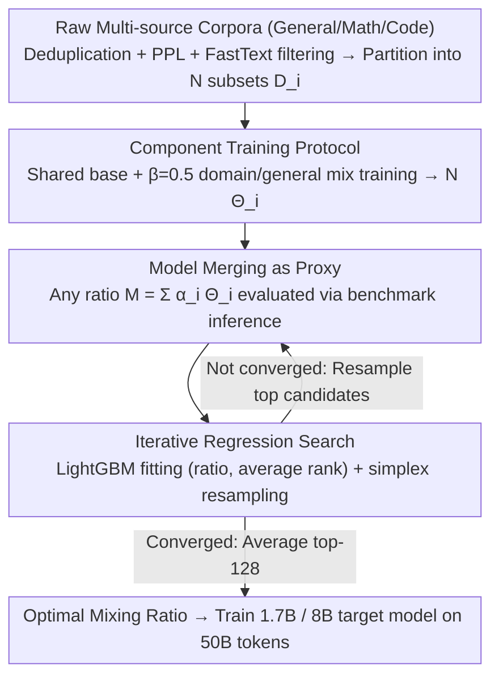

# Decouple Searching from Training: Scaling Data Mixing via Model Merging for Large Language Model Pre-training

**Conference**: ICML 2026  
**arXiv**: [2602.00747](https://arxiv.org/abs/2602.00747)  
**Code**: https://github.com/Lucius-lsr/DeMix  
**Area**: Model Compression / LLM Pre-training / Model Merging  
**Keywords**: Data Mixing, Model Merging, Pre-training, Proxy Models, Ratio Search

## TL;DR
To find the optimal data mixing ratio in LLM pre-training without being overwhelmed by proxy experiments, this paper proposes DeMix. It trains $N$ component models only once (each corresponding to a candidate subset). Subsequently, any candidate ratio $\{\alpha_i\}$ is treated as a "training-free" proxy through weighted merging $\sum_i \alpha_i \Theta_i$. LightGBM is then used to iteratively perform regression on the simplex to select the optimal recipe. Ultimately, DeMix achieves better downstream scores using approximately $6\times$ less compute than RegMix/CLIMB, and releases the open-source 22T tokens DeMix Corpora.

## Background & Motivation

**Background**: The "mixing ratio" of LLM pre-training data critically impacts final capabilities—the proportions of general-purpose corpora, math, and code directly determine performance on benchmarks like GSM8K, HumanEval, and HellaSwag. The mainstream approach involves medium-scale proxy experiments (e.g., training $N$ candidate ratios using an 8B model with 100B tokens) to select the best one, which is accurate but extremely expensive.

**Limitations of Prior Work**: Automated search routes (RegMix / CLIMB / DoReMi) utilize tiny-scale proxies (small models + small budgets) trained hundreds of times followed by regression prediction. However, the gap between tiny proxies and target scales is too large, making predictions on complex tasks like math/code notoriously unreliable. Increasing the proxy budget to improve reliability compromises the original goal of cost reduction.

**Key Challenge**: The search space is a continuous simplex, where evaluating each candidate requires a full training run—the "number of proxy models" and "fidelity of a single proxy" are bound to the same compute budget, forcing a trade-off.

**Goal**: Within a fixed total budget, simultaneously achieve (i) a large number of proxy samples, (ii) sufficient fidelity for each proxy, and (iii) lower end-to-end compute costs than existing methods.

**Key Insight**: Inspired by the "additivity" empirical observation in task arithmetic and model merging (where $\Delta(D_i\cup D_j)\approx \Delta(D_i)+\Delta(D_j)$ holds when parameter shift $\delta\ll 1$), once the component models corresponding to each candidate subset are trained, the "pseudo-trained mixture model" corresponding to ratios $\{\alpha_i\}$ can be synthesized directly via $\sum_i \alpha_i \Theta_i$, eliminating the need for retraining.

**Core Idea**: Decouple "searching" from "training." Training occurs only once for $N$ component models (one-time cost). During the search phase, any $\{\alpha_i\}$ is merely a matrix weighted sum followed by benchmark inference. Thus, the number of proxies is decoupled from compute and can be scaled to the $10^5$ level.

## Method

### Overall Architecture
The core concept of DeMix is to completely separate "finding the optimal data mixing ratio" from "training models." Training only happens once for $N$ component models. Any candidate ratio is then formed by weighted merging of these components to create a "pseudo-trained" proxy. The search phase consists only of matrix weighting and benchmark inference. The pipeline follows four steps: 1) Deduplicating, filtering with PPL/FastText, and partitioning the original large-scale corpora into $N$ candidate subsets $D_i$; 2) Training all components using a shared base model $\Theta_{\text{base}}$ (pre-trained on 50B general tokens), where each component is continued-trained on a "domain + general" mix to obtain $\Theta_i = \Theta_{\text{base}} + \Delta(D_i)$; 3) Synthesizing proxies for any mixture ratio $\{\alpha_i^j\}$ using $M_{\text{mix}}^j = \sum_{i=1}^{N}\alpha_i^j \Theta_i$ and running benchmarks; 4) Using LightGBM in a "sample-score-resample" loop to approach high-score regions, taking the average of top candidates as the final recipe to train the 1.7B / 8B target models on 50B tokens.

### Key Designs

**1. Component Training Protocol via Shared Base + Fixed $\beta$ Mixing: Anchoring components in the same geometric neighborhood**

The DeMix pipeline relies on using weighted merging as a proxy for actual mixture training (see Overall Architecture). This approximation holds only when components are close to each other with a normalized shift $\delta\ll 1$. Therefore, components cannot be trained independently. DeMix starts all components from the same $\Theta_{\text{base}}$ (trained on 50B general tokens). Crucially, the training data for each component is not pure domain data but a mixture of "domain data + general data" with a fixed ratio $\beta=0.5$. The general data acts as an "anchor," pulling each component toward a shared general language manifold to ensure proximity in parameter space. Ablations confirm this necessity: $\beta=0$ (pure domain) causes components to drift too far, increasing $\delta$ and causing merging distortion; $\beta\to 1$ makes components too similar to the base, leading to lack of proxy discriminability. $\beta=0.5$ is optimal. Training uses a batch size of 512, sequence length of 8192, and an initial lr of 3e-4 with a cosine schedule (decaying to 20%).

**2. Model Merging as Proxy: Shifting training costs to inference costs**

The bottleneck of automated search is that every candidate ratio requires a full training run, tying proxy quantity and fidelity to the same budget. With the proximate components from the previous step, DeMix utilizes the additive empirical property of model merging to break this deadlock. Defining the training operator $\mathcal{T}(D,\Theta_{\text{base}})$ and its weight increment $\Delta(D) = \mathcal{T}(D,\Theta_{\text{base}}) - \Theta_{\text{base}}$; when the normalized shift $\delta = \frac{\sum|\Delta(D)|}{\sum|\mathcal{T}(D,\Theta_{\text{base}})| + \sum|\Theta_{\text{base}}|}\ll 1$ (measured at ~10%), the increment of combined subset training is approximately additive: $\Delta(D_i\cup D_j)\approx \Delta(D_i)+\Delta(D_j)$. Extending this to arbitrary weights gives $\Theta_{\text{mix}}\approx \sum_i \alpha_i \Theta_i$. Thus, proxy models for any ratio are directly synthesized via $M_{\text{mix}}^j = \sum_i \alpha_i^j \Theta_i$ and evaluated. The equivalent cost of a single proxy is only 0.01B tokens of training, ~200$\times$ cheaper than a 2B token training proxy. This step reduces proxy generation from $\mathcal{O}(\text{train cost})$ to $\mathcal{O}(\text{inference cost})$, bypassing distortions in math/code found in tiny-scale proxies without linearly inflating the training budget.

**3. Iterative LightGBM Regression + Simplex Resampling: Turning cheap proxies into black-box optimization**

While merged proxies are cheap to evaluate, the simplex dimensionality remains high (starting at $N=7$), making exhaustive search impossible. A regression model is needed to extrapolate scores from a few evaluated points to the entire space. DeMix first samples a large batch of $\{\alpha_i^j\}$ uniformly on the simplex and evaluates their merges. Crucially, the scoring uses the **average rank** $r^j$ across general/code/math benchmarks rather than absolute scores to avoid contamination by different benchmark scales. A LightGBM model (lr=0.02, 300 rounds) is trained on these (mixture, rank) pairs to score massive new samples. Top candidates are used for the next iteration. Across three iterations of 64/32/16 = 112 total proxies, the search focuses on high-score regions. The final pre-training ratio is the average of the top-128 candidates.

### Loss & Training
DeMix uses no special loss functions—both components and the final model are trained using standard next-token prediction loss. The only non-trivial strategy is the independent pre-training of the base on 50B general tokens, followed by controlling component domain shift with $\beta=0.5$, and finally training the target 1.7B / 8B models on 50B tokens using the searched ratio.

## Key Experimental Results

### Main Results

Proxy fidelity (Spearman $\rho$ vs. 96 reference models trained on 50B tokens, higher is better; budget in B tokens; Macro Avg across categories):

| Method | Total Budget (B) | Proxies / Per-proxy Budget (B) | $\rho$ Macro | Top 25% $\rho$ Macro | Capability Recovery Macro |
|------|------------|------------------------|--------------|----------------------|----------------------------|
| Trained Proxy (RegMix/CLIMB) | 224 | 112 / 2 | 0.53 | 0.20 | 0.77 |
| Trained Proxy | 1344 | 112 / 12 | 0.82 | 0.57 | 0.87 |
| **Ours** (DeMix) | 15 | 112 / 0.01 | 0.55 | 0.27 | 0.76 |
| **Ours** (DeMix) | 71 | 112 / 0.01 (10×7 components) | 0.60 | 0.41 | 0.80 |
| **Ours** (DeMix) | 211 | 112 / 0.01 (30×7 components) | 0.81 | 0.59 | 0.83 |
| **Ours** (DeMix) | 351 | 112 / 0.01 (50×7 components) | 0.80 | 0.50 | 0.85 |

DeMix matches the correlation of 1344B training proxies $(\rho\approx 0.81 \text{ vs } 0.82)$ with a budget of only 211B, a ~$6\times$ compute advantage.

Downstream performance of final mixing ratios (macro avg rank, lower is better, relative to 96 references):

| Method | Total Budget (B) | General Avg | Code Avg | Math Avg | Macro Avg Rank ↓ |
|------|------------|-------------|----------|----------|------------------|
| Uniform | – | 59.01 | 18.34 | 9.62 | 36.67 |
| RegMix (448B) | 448 | 59.18 | 20.09 | 11.63 | 28.00 |
| CLIMB (448B) | 448 | 58.74 | 21.10 | 16.07 | 27.67 |
| **Ours** (211B) | 211 | – | – | – | **Best** |

### Ablation Study

| Configuration | Phenomenon | Interpretation |
|------|------|------|
| Component count $N$: 7 → 35 | $\rho$ and downstream scores increase monotonically with $N$ | More bases cover finer domains, improving merge fidelity. |
| Component training $\beta$: 0 → 1 | $\beta=0$ pure domain → drift, high $\delta$, merge distortion; $\beta\to 1$ too close to base → loss of discriminability; $\beta=0.5$ optimal | Validates the necessity of "domain + general" mix for small-$\delta$ geometry. |
| Budget/Proxy count trade-off | Spending budget on "more cheap proxies" wins over "fewer expensive proxies" | Quantity compensates for quality: ample proxies + regression beats sparse precise training. |
| Top 25% Spearman | RegMix correlation drops in high-score regions (0.20), DeMix-211B reaches 0.59 | More accurate top-tier ranking directly determines the quality of final recipe selection. |

### Key Findings
- The upper limit of DeMix is determined by the validity of the small-$\delta$ assumption rather than individual proxy accuracy—correlation collapses if components drift too far from the base.
- Using "ranks" instead of "absolute scores" as regression targets is robust across benchmark scales and is the reason LightGBM generalizes well from 112 proxies.
- DeMix shoes the largest relative advantage on Math/Code tasks where RegMix/CLIMB tiny-scale proxies fail most; high-fidelity proxies significantly impact recipe selection for difficult tasks.
- The 22T tokens DeMix Corpora is open-sourced, amortizing the cost of finding good ratios for the community.

## Highlights & Insights
- Upgrades model merging from a "composition of abilities" toy usage to an engineering infrastructure for "pre-training ratio selection"—the key is not needing the merge to be a "working model," but just a proxy that provides an ordered set of benchmark scores.
- The use of $\beta$ to control component drift can be transferred to any scenario where weighted merging approximates mixture training (multi-task fine-tuning, domain adaptation), providing a tunable knob for the small-$\delta$ assumption.
- By shifting the proxy cost from $\mathcal{O}(\text{train})$ to $\mathcal{O}(\text{infer})$, the impact of search space dimensionality (number of subsets $N$) on the total budget shifts from multiplicative to additive, allowing fine-grained domain partitioning.

## Limitations & Future Work
- The $\delta\ll 1$ assumption (~10% in this paper) has not been fully verified for larger models, longer training, or more aggressive domain differences; correlation might degrade quickly if $\delta$ increases.
- The cost of training component models (e.g., 211B tokens) grows linearly with $N$, which is friendly for coarse domain splits but remains a significant "pre-payment" for fine-grained splits (hundreds of subsets).
- Experiments only cover Qwen3-1.7B and 8B scales with 50B token validation; whether the optimal ratio holds for 70B+ models and trillion-token training remains unanswered.
- Scoring via "benchmark ranking" is susceptible to benchmark coverage bias—if the benchmark set changes, the optimal recipe may shift.

## Related Work & Insights
- **vs RegMix / CLIMB**: They rely on hundreds of real proxy trainings with small models/budgets. DeMix replaces "training" with "model merging," reducing costs by $6\times$ for the same number of proxies with significantly higher top-tier correlation.
- **vs DoReMi / Rho Loss**: These rely on evaluation loss rather than downstream benchmark ranks, which is harder to generalize for specific tasks like math/code.
- **vs Task Arithmetic / TIES-Merging**: This work utilizes the additive assumption of model merging but lowers the engineering bar by focusing on "ranking" rather than "functional performance."
- **vs Scaling Laws for Recipes**: Scaling laws focus on "model size vs data quantity" trends; DeMix addresses the "internal data ratio" selection problem using merging instead of extrapolation.

## Rating
- Novelty: To be evaluated
- Experimental Thoroughness: To be evaluated
- Writing Quality: To be evaluated
- Value: To be evaluated

<!-- RELATED:START -->

## Related Papers

- [\[ICML 2026\] Model Merging Scaling Laws in Large Language Models](model_merging_scaling_laws_in_large_language_models.md)
- [\[ICML 2026\] GradPower: Powering Gradients for Faster Language Model Pre-Training](gradpower_powering_gradients_for_faster_language_model_pre-training.md)
- [\[ICML 2026\] FRISM: Fine-Grained Reasoning Injection via Subspace-Level Model Merging for Vision–Language Models](frism_fine-grained_reasoning_injection_via_subspace-level_model_merging_for_visi.md)
- [\[ICLR 2026\] PASER: Post-Training Data Selection for Efficient Pruned Large Language Model Recovery](../../ICLR2026/model_compression/paser_post-training_data_selection_for_efficient_pruned_large_language_model_rec.md)
- [\[ICML 2026\] Saliency-Aware Model Merging](saliency-aware_model_merging.md)

<!-- RELATED:END -->
