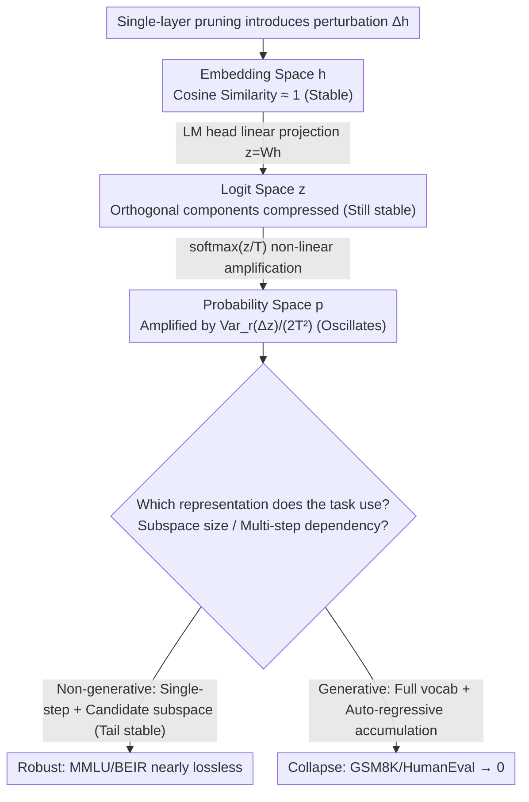

# Demystifying When Pruning Works via Representation Hierarchies

**Conference**: ICML 2026  
**arXiv**: [2603.24652](https://arxiv.org/abs/2603.24652)  
**Code**: Mentioned in the paper as "available in the project repository" but no public link provided  
**Area**: LLM Model Compression / Network Pruning / Representation Analysis  
**Keywords**: Network Pruning, Generative Task Degradation, Softmax Amplification, Representation Hierarchies, KL Divergence

## TL;DR
Starting from the three-level representation hierarchy of "embedding $\rightarrow$ logit $\rightarrow$ probability," this paper uses second-order Taylor expansion theory to prove: perturbations caused by pruning in the embedding and logit spaces are inherently small, but the non-linear softmax step amplifies these perturbations into the probability space by a factor of $\mathrm{Var}_r(\Delta z)/(2T^2)$. Combined with step-wise accumulation through auto-regressive decoding, this ultimately causes generative tasks to collapse. In contrast, non-generative tasks remain naturally robust because they rely only on candidate token subspaces—unifying the explanation for why pruning is nearly lossless on MMLU and retrieval but drops to zero on GSM8K and HumanEval.

## Background & Motivation
**Background**: As LLM scales expand, network pruning (Wanda, SparseGPT, ShortGPT, Attn/MLP Drop, etc.) has become a mainstream compression solution. Intra-layer approaches sparsify individual layers (unstructured / 2:4 / 4:8), while inter-layer approaches directly remove specific transformer blocks or attention/MLP sub-layers. These methods have been proven to preserve performance nearly losslessly on "non-generative tasks" such as retrieval, multiple-choice QA, and text classification.

**Limitations of Prior Work**: However, a recurring anomaly has been observed in practical deployment—the same pruned model shows almost no degradation on MMLU, yet collapses to zero on GSM8K / HumanEval / NarrativeQA (e.g., Mistral-7B-Instruct dropping from 48.4 $\rightarrow$ 0.0 on GSM8K, 4.9 $\rightarrow$ 0.0 on HumanEval, and 13.8 $\rightarrow$ 0.0 on MBPP after removing 8 MLP layers). No theoretical explanation has accounted for this "task-dependent vulnerability," leaving the industry to rely on empirical trial and error.

**Key Challenge**: Existing explanations attribute this to "the high dimensionality of the output space in generative tasks (vocabulary $|\mathcal{V}|$ far exceeding embedding dimension $d$ or candidate count $k$)" or "auto-regressive accumulation." These are intuitive descriptions that fail to provide quantitative predictions. More importantly, they do not answer how small embedding perturbations transform into catastrophic shifts in probability.

**Goal**: (1) Decompose LLM inference along the information flow into three representation spaces (embedding $h$, logit $z$, probability $p$) and quantify perturbations in each; (2) Provide closed-form formulas to analytically predict the impact of pruning on each space; (3) Explain why non-generative tasks are robust while generative tasks are fragile; (4) Provide practical implementation guidance.

**Key Insight**: The authors focus on a specific detail: for the same post-pruning $\Delta h$, the shift in logit space $\Delta z = W \Delta h$ is a linear transformation (rotation + scaling), but in the probability space, $\Delta p = \mathrm{softmax}(z + \Delta z)/T - \mathrm{softmax}(z)/T$ is significantly amplified by the non-linear exponential normalization. Auto-regressive decoding then transforms single-step small errors into accumulated multi-step divergence.

**Core Idea**: The paper attributes the "task dependency" of pruning performance to **differences in perturbation propagation across representation hierarchies**. Linear layers (embedding $\rightarrow$ logit) largely maintain similarity; the softmax non-linearity acts as the true amplifier, and multi-step decoding functions as a "looping speaker" for that amplifier. Non-generative tasks remain robust because they only care about logit order or a small candidate subspace, never being fully exposed to this amplification loop.

## Method

### Overall Architecture
The paper does not propose a new pruning algorithm; instead, it builds a **diagnostic framework** to answer "why pruning is task-selective." It decomposes LLM inference into three representation spaces—embedding $h^{(l)}$, logit $z$, and probability $p$—applies pruning to each layer individually, and tracks how perturbations flow from $\Delta h$ to $\Delta z$ and finally $\Delta p$. The framework uses empirical measurements (cosine similarity + KL divergence) to reveal the phenomena and second-order Taylor expansion to derive closed-form formulas for the underlying causes. Finally, it extends the single-step analysis to multi-step auto-regressive generation and demonstrates the "candidate token subspace" mechanism. Representative pruning methods used include Wanda / SparseGPT (intra-layer) and ShortGPT / Attn-Drop / MLP-Drop (inter-layer), using Qwen-2.5-7B-Instruct and Mistral-7B as backbones.

### Key Designs

**1. Three-Space Perturbation Measurement Protocol: Pinpointing the Amplification Step**

Previous works often focused on weight sparsity or end-to-end perplexity, which masks the internal propagation of perturbations. Here, a controlled probe is established: during a standard forward pass of the baseline model, only the current layer is replaced with its pruned version while others remain unchanged. This isolates the "single-layer" perturbation $\Delta h_l$. Its effect is then quantified along the representation chain: angular deviation $1-\mathrm{CosineSim}(h_l, h_l+\Delta h_l)$ in the embedding space, $1-\mathrm{CosineSim}(z, z+\Delta z)$ after the LM head in logit space, and finally $\Delta p$ after $p^{(l)}=\mathrm{softmax}(z^{(l)}/T)$ in probability space. Results show that while cosine similarity remains near 1 for embedding and logit spaces, the probability space exhibits violent oscillations. This isolation design reveals that the amplification occurs specifically during the final non-linear transition.

**2. Taylor Local Theory (Theorem 1-3): Proving Softmax as the Amplifier**

The paper uses second-order Taylor expansion to provide a closed-form formula for why logits remain stable while probabilities do not. Linear stability is confirmed as the offset in embedding/logit space is approximated as $1-\mathrm{CosineSim}(h, h+\Delta h) \approx \|\Delta h_\perp\|^2 / (2\|h\|^2)$, depending only on the squared ratio of the orthogonal component to the original vector norm. Since $\|\Delta h\| \ll \|h\|$ for single layers, this ratio is naturally small. The true amplification occurs at the softmax step: the probability space offset $1-\mathrm{CosineSim}(p, p+\Delta p) \approx \mathrm{Var}_r(\Delta z)/(2T^2)$, where $r_i = p_i^2/\|p\|^2$. When measured via KL divergence, $\mathrm{KL}(p\|q) \approx \mathrm{Var}_{i\sim p}(\Delta z_i)/(2T^2)$. The crucial factor is not the magnitude of $\Delta z$ but its **variance** across the vocabulary—even a small $\Delta z$ can be exponentially amplified if its distribution is non-uniform. Furthermore, the temperature $T$ in the denominator means lower temperatures (sharper distributions) amplify the pruning error more severely.

**3. Generative vs. Non-Generative Subspace Mechanism: Multi-Scale Analysis**

Since probabilities oscillate, why are multiple-choice and retrieval tasks robust? The difference lies in the representation chain location, subspace size, and step count. Generative tasks sample from the full vocabulary $|\mathcal{V}|$ at every step; single-step errors are fed back via the KV cache, causing the pruned model to diverge from the baseline's token history (Fig 7 shows similarity dropping from ~1 at step 1 to near 0 at step 10). Conversely, non-generative tasks usually focus on the first step and examine only logit rankings or a candidate token subset $\mathcal{C}\subset\{1,\dots,|\mathcal{V}|\}$ (e.g., A/B/C/D). Fig 8 shows these candidate tokens typically fall in the **tail** of the probability distribution, where relative perturbations are much smaller than at the top tokens, leaving the argmax stable. This decomposes target robustness into three variables: the representation space used, the dimensionality of the task-relevant subspace, and the presence of temporal dependency.

### Loss & Training
This study is a training-free analysis and does not involve specific training loss functions. All pruning methods (Wanda, SparseGPT, ShortGPT, Attn-Drop, MLP-Drop) follow their original protocols; experiments primarily involve forward pass measurements rather than fine-tuning.

## Key Experimental Results

### Main Results
Comparison of non-generative vs. generative tasks for Mistral-7B under inter-layer pruning (removing 8 attention layers Drop-8A or 8 MLP layers Drop-8M):

| Task Type | Task | Full (7.1B) | Drop-8A (6.8B) | Drop-8M (5.7B) |
|-----------|------|-------------|----------------|----------------|
| Retrieval (E5-Mistral) | Avg of 13 BEIR | 58.9 | 53.4 | 56.8 |
| Multi-choice | BoolQ | 85.9 | 86.0 | 78.2 |
| Multi-choice | MMLU | 62.1 | 62.0 | 59.1 |
| Multi-choice Avg | 5 Tasks | 69.3 | 69.8 | 64.3 |
| Generative | GSM8K | 48.4 | 36.2 | **0.0** |
| Generative | HumanEval | 4.9 | **0.0** | **0.0** |
| Generative | MBPP | 13.8 | 0.4 | **0.0** |
| Generative | NarrativeQA | 16.3 | 9.6 | 2.0 |
| Generative Avg | 5 Tasks | 22.3 | 13.2 | **0.8** |

Drop-8M loses only 5 points on Multi-choice Avg but collapses from 22.3 to 0.8 on Generative Avg (97% degradation).

### Ablation Study
Consistency between theoretical estimates and actual measurements (Fig 6, Qwen-2.5-7B Layer 14 Attention Pruning):

| Metric | Theory vs. Empirical | Notes |
|--------|----------------------|-------|
| Angular deviation $\Delta p$ | Tight Fit | $\mathrm{Var}_r(\Delta z)/(2T^2)$ formula is accurate |
| KL divergence $p\|q$ | Tight Fit | $\mathrm{Var}_{i\sim p}(\Delta z_i)/(2T^2)$ formula is accurate |
| Embedding Cosine Sim | ~1.0 | Single-layer $\|\Delta h\| \ll \|h\|$ |
| Logit Cosine Sim | ~1.0 | LM head further compresses relative orthogonal components |
| Probability Cosine Sim | High Fluctuation | Softmax non-linearly amplifies variance |

Perturbation accumulation during generation (Fig 7, Drop-8A on Qwen-2.5-7B):

| Decoding Step | Embedding/Logit Sim | Probability Sim | Remarks |
|---------------|---------------------|-----------------|---------|
| 1 (Prompt) | ~1.0 | Lower but stable | Models share identical history |
| 2-3 | ~0.95 | Sharp drop | History tokens begin to differ |
| 10+ | < 0.5 | Near 0 | Complete divergence; garbled output |

### Key Findings
- **Softmax, not the LM head, is the key amplifier**: Intuition suggests $z = Wh$ might amplify noise due to the massive vocabulary dimension, but logit cosine similarity matches embedding similarity. Linear transformation actually compresses relative orthogonal components. Softmax is the real amplifier because of its explicit dependence on logit variance and inverse temperature.
- **Candidate token subspaces act as safety shields**: Answer tokens for multiple-choice questions often reside in the tail of the distribution, where absolute probability values and perturbation magnitudes are small. Argmax remains largely unaffected by the probability oscillations of head tokens.
- **Auto-regression is an echo chamber, not the root cause**: Even if single-step $\Delta z$ has moderate variance, auto-regression propagates this difference into the KV cache, turning state differences into sequence divergence.
- **Temperature $T$ regulates pruning robustness**: Since $T^2$ is in the denominator, lower temperatures (yielding sharper outputs) make the model more fragile to pruning. This provides a "red flag" for deploying pruned models with low temperature.

## Highlights & Insights
- **Closed-loop of Theory, Empiricism, and Performance**: Using controlled probing to reveal phenomenological differences, Taylor expansion for derivation, and benchmarks for verification creates a robust analysis chain.
- **Reduction of task robustness to three engineering variables**: Representation space (Embedding / Logit / Probability) + Task-relevant subspace dimensionality + Temporal dependency. This allows for the prediction of pruning feasibility without full benchmark runs.
- **Actionability of `Var_r(Δz)/(2T²)`**: This metric requires only single-layer perturbation statistics, allowing it to be used for early-stopping or adjusting pruning rates during the compression process.
- **Unified logic for pruning and quantization**: The paper suggests that quantization-induced error follows the same theoretical framework, potentially unifying compression-induced degradation research.

## Limitations & Future Work
- The framework is training-free and does not explore how post-training or fine-tuning might repair softmax amplification; in practice, most pruned models undergo SFT/distillation.
- Taylor expansions are only valid for "local, single-layer" perturbations; joint multi-layer pruning or severe perturbations (first/last layers) might require more refined boundary analyses.
- Experiments focus on dense LLMs (Qwen-2.5, Mistral); it is unclear if "softmax amplification" remains the primary bottleneck for MoE (partial expert activation) or SSM (Mamba) architectures.
- The "tail token" explanation for MC task robustness is an empirical observation; the boundary conditions based on prompt engineering styles (which might shift candidate tokens to the head) are not fully explored.
- No automated algorithm was provided for optimal layer selection based on $\mathrm{Var}_r(\Delta z)/(2T^2)$.

## Related Work & Insights
- **vs ShortGPT / Attn-Drop / MLP-Drop**: These methods are used as the subjects of analysis. This paper provides a closed-loop explanation for their specific failures rather than replacing them.
- **vs Wanda / SparseGPT**: The paper demonstrates that the generative vs. non-generative split holds regardless of unstructured or structured (2:4 / 4:8) intra-layer pruning patterns.
- **vs Gromov et al. (2024)**: While prior work observed that deeper layer removal has less impact, this paper upgrades that finding to explain *why* the impact depends on the representation space and temporal dimension used by the task.
- **Insight**: This paradigm of "controlled probe + Taylor expansion + task decomposition" can be extended to other compression techniques. It suggests that when designing LLM deployment pipelines, temperature and output subspace should be considered co-variables of pruning feasibility.

## Rating
- Novelty: ⭐⭐⭐⭐ (While not a new algorithm, it is a high-quality analysis that first provides a unified framework for the "task-dependent" pruning gap.)
- Experimental Thoroughness: ⭐⭐⭐⭐ (Covers multiple pruning types, LLMs, and task categories; could benefit from MoE or fine-tuning scenarios.)
- Writing Quality: ⭐⭐⭐⭐⭐ (Excellent flow between formulas and visualization; each theoretical point is mapped clearly to experimental figures.)
- Value: ⭐⭐⭐⭐ (Directly informs deployment strategies, though lacks a finished tool for automated layer selection.)

<!-- RELATED:START -->

## Related Papers

- [\[ICML 2026\] Multi-Adapter Representation Interventions via Energy Calibration](multi-adapter_representation_interventions_via_energy_calibration.md)
- [\[ICML 2026\] The Bridge-Garden Dilemma in LLM Distillation: Why Mixing Hard and Soft Labels Works](the_bridge-garden_dilemma_in_llm_distillation_why_mixing_hard_and_soft_labels_wo.md)
- [\[ACL 2025\] Disentangling the Roles of Representation and Selection in Data Pruning](../../ACL2025/model_compression/disentangling_the_roles_of_representation_and_selection_in_data_pruning.md)
- [\[ICML 2026\] When Shared Knowledge Hurts: Spectral Over-Accumulation in Model Merging](when_shared_knowledge_hurts_spectral_over-accumulation_in_model_merging.md)
- [\[ICML 2025\] From Logits to Hierarchies: Hierarchical Clustering made Simple](../../ICML2025/model_compression/from_logits_to_hierarchies_hierarchical_clustering_made_simple.md)

<!-- RELATED:END -->
