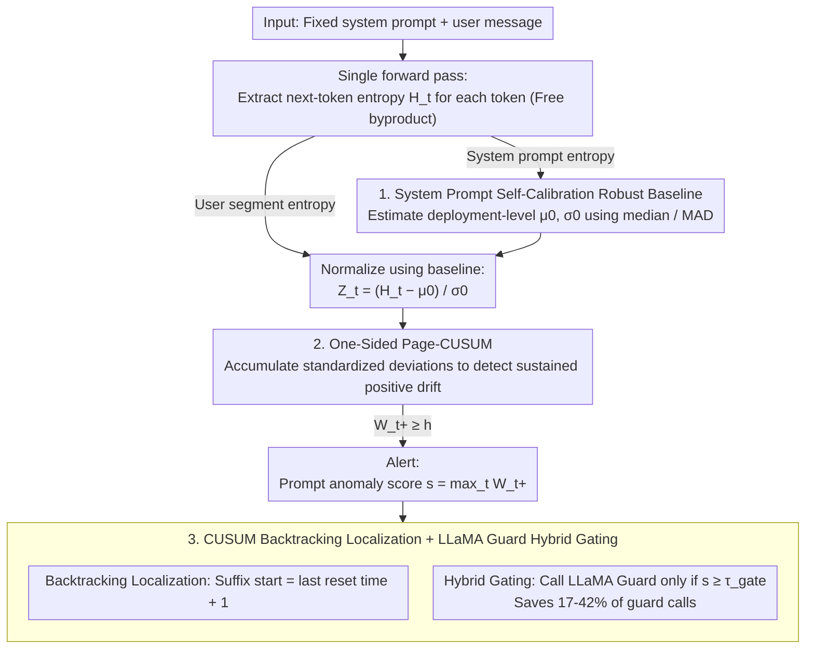

# Detecting Fluent Optimization-Based Adversarial Prompts via Sequential Entropy Changes

**Conference**: ICML 2026  
**arXiv**: [2605.19966](https://arxiv.org/abs/2605.19966)  
**Code**: https://github.com/cpdonline/cpdonline (Available)  
**Area**: LLM Security / Jailbreak Detection / Online Changepoint Detection  
**Keywords**: Adversarial suffix, Page-CUSUM, token entropy, system prompt baseline, jailbreak localization  

## TL;DR
The authors model "fluent optimization-based jailbreak suffix detection" as online changepoint detection on token-level entropy streams. By using the entropy distribution of fixed system prompts to calculate a MAD robust baseline for normalizing user token entropy, they run a Page-CUSUM cumulative statistic $W_t^+$ that triggers an alert upon exceeding a threshold. Across 6 open-source aligned LLMs, this method achieves higher F1 scores than window-based perplexity for five attack types (GCG, AutoDAN, AdvPrompter, BEAST, AutoDAN-HGA), accurately localizes 79.6% of alerts within suffixes, and serves as a lightweight gate for LLaMA Guard, saving 17-42% of guard calls.

## Background & Motivation

**Background**: Current runtime defenses for LLM jailbreaking generally fall into two categories: (1) Statistical detectors: calculating global perplexity (PP) or windowed perplexity (WPP) as an anomaly score; (2) Safety classifiers: using fine-tuned LLMs like LLaMA Guard to judge safety. The former is lightweight but only considers scalar statistics, while the latter offers high precision but requires an additional LLM forward pass.

**Limitations of Prior Work**: New generations of attacks following GCG (e.g., AutoDAN, AdvPrompter, BEAST, AutoDAN-HGA) include "low perplexity/fluency" as an explicit optimization goal. Consequently, the global PP AUROC for distinguishing benign and adversarial inputs collapses to a range around $0.5 \pm 0.04$ across six models—rendering threshold adjustments useless. WPP performs better by capturing local spikes via maximum NLL within a window, but the optimal window size $w$ is highly model-dependent (e.g., $w=15$ for LLaMA-2-7B, $w=1$ for Vicuna-7B/Qwen2.5-7B). Larger windows average adversarial loss with benign context, causing "boundary blurring" where alerts often occur on either side of the suffix boundary rather than inside it.

**Key Challenge**: The characteristic of fluent adversarial suffixes is not "high absolute perplexity," but rather "consistently pushing up model uncertainty over the token stream." This represents a mean shift in the temporal dimension. However, both PP and WPP compress sequences into scalars or local means, losing the critical signal of "drift persistence."

**Goal**: (a) Develop a model-agnostic, training-free, pure forward-bypass method for online detection of adversarial suffixes; (b) Provide token-level suffix starting position localization (which PP/WPP struggle with); (c) Enable integration with expensive classifiers like LLaMA Guard in a gating pipeline to reduce guard call rates.

**Key Insight**: The authors observe that for a fixed system prompt in a given deployment, the token entropy distribution remains stable. Benign user inputs share a similar entropy distribution, whereas optimization-based suffixes introduce a "sustained upward mean shift" in the user segment. This is precisely the "fastest online detection of sustained mean shifts" problem that the 1954 Page-CUSUM control chart excels at.

**Core Idea**: Treat the token-level next-token entropy stream as a 1D time series. Use the system prompt to estimate a robust baseline $(\hat\mu_0, \hat\sigma_0)$ to standardize the user segment into $Z_t$, and run a one-sided Page-CUSUM cumulative statistic $W_t^+$, alerting when it exceeds threshold $h$. The CUSUM backtracking rule is used to infer the suffix starting position $\hat\nu$.

## Method

### Overall Architecture
The method addresses the blind spot where fluent adversarial suffixes silently increase model uncertainty without significantly affecting global perplexity by transforming the problem into online changepoint detection on a 1D time series. Each request consists of a fixed system prompt $\mathbf{x}^{\text{sys}}$ and a user message $\mathbf{x}^{\text{usr}}$. During a standard forward pass, the entropy $H_t = -\sum_v p_\theta(v|x_{<t})\log p_\theta(v|x_{<t})$ of the next-token distribution $p_\theta(\cdot|x_{<t})$ at each token position is extracted as a zero-cost byproduct. The system prompt segment $\{H_i^{\text{sys}}\}$ is used to estimate a deployment-level robust baseline, standardizing the user segment $\{H_t^{\text{usr}}\}$ into $Z_t$. A one-sided Page-CUSUM accumulated statistic $W_t^+$ is then computed. An alert is triggered if $W_t^+\geq h$ at any moment, with the prompt-level anomaly score defined as $s(\mathbf{x}^{\text{usr}})=\max_t W_t^+$ for ROC evaluation. The suffix starting point is inferred using the CUSUM reset times. The entire pipeline is $O(1)$ per token and $O(T)$ per prompt with constant memory, allowing it to be directly integrated into production inference paths.

### Key Designs

**1. System Prompt Self-Calibrated Robust Baseline $(\hat\mu_0,\hat\sigma_0)$: Turning fixed overhead into free deployment reference samples**

The absolute magnitude of entropy is strongly coupled with model scale, tokenizer, and system prompt wording, making a cross-model hard threshold impossible—the reason WPP’s optimal window size varies by model. The authors' ingenuity lies in the fact that the system prompt is completely fixed in a given deployment; its $m$ token entropies naturally serve as "attack-free" reference samples. Using them as a baseline requires no offline training or dataset preparation. The baseline uses median and MAD for robust location and scale estimation: $\hat\mu_0=\mathrm{median}(\{H_i^{\text{sys}}\})$, $\hat\sigma_0=c\cdot\mathrm{median}(|H_i^{\text{sys}}-\hat\mu_0|)$. The constant $c\approx 1.4826$ aligns MAD with Gaussian-$\sigma$, and $\hat\sigma_0\geq\varepsilon$ prevents degradation. User segments are standardized as $Z_t=(H_t^{\text{usr}}-\hat\mu_0)/\hat\sigma_0$. MAD is chosen over mean/variance because a few specific words in the system prompt can result in very high entropy for individual tokens; median and MAD are insensitive to such extremes. Combined with $c$ correction, the same threshold can be shared across LLaMA, Vicuna, and Qwen, which is key to making CPD model-agnostic.

**2. One-Sided Page-CUSUM for Detecting Sustained Drift $W_t^+$: Using 1954 control charts to capture "drift persistence"**

The failure of PP/WPP lies in compressing sequences into scalars or local means, losing the temporal signal of "uncertainty steadily climbing." The essence of an adversarial suffix is precisely a sustained positive mean shift in the user segment. Page-CUSUM is classically designed as the optimal sequential test for the "fastest detection of sustained mean shifts." It is applied iteratively with slack $k\geq 0$ and threshold $h>0$: $W_t^+=\max\{0,\,W_{t-1}^++Z_t-k\}$, with $W_0^+=0$. The stopping time is $\tau=\inf\{t\geq 1:W_t^+\geq h\}$. When the mean of $\{Z_t\}$ is near zero, $W_t^+$ frequently resets to zero, preventing statistical noise from accumulating indefinitely. Once a sustained positive drift occurs, $W_t^+$ accumulates monotonically until crossing $h$. Compared to windowed detection, the primary advantage is not requiring a predefined window scale—CUSUM naturally adapts to drift lengths ranging from dozens to hundreds of tokens. Slack $k$ provides noise resistance; the paper evaluates sensitivity for $k\in\{-0.5,0,0.5\}$ (Appendix B.3), using the canonical $k=0$ for the main text, with threshold $h$ selected to maximize F1 on the training sets.

**3. CUSUM Backtracking Localization $\hat\nu$ + LLaMA Guard Hybrid Gating: Obtaining "event-level output" and "cost savings" simultaneously**

Beyond alerting, CUSUM provides suffix localization nearly for free—a capability PP/WPP lacks. Localization uses standard backtracking: denoting the last time $W_t^+=0$ as the reset time $t_0$, the starting point estimate is $\hat\nu=t_0+1$, which corresponds exactly to "the token where the entropy stream began to deviate after last being quiet." Each reset accurately marks the moment before a drift begins. This positional information is useful for "automatically clipping the suffix before continuing" or "highlighting suspicious segments for safety audit." Another benefit is hybrid gating: since over 90% of production loads are benign, it is unnecessary to run LLaMA Guard for every request. Using a gating threshold $\tau_{\text{gate}}$, if $s(\mathbf{x}^{\text{usr}})<\tau_{\text{gate}}$, the request is judged benign and skips the guard; otherwise, LLaMA Guard is invoked for semantic evaluation. CPD reduces guard usage from "every request" to "only suspicious requests," saving 17-42% of guard calls in empirical tests without dropping the hybrid F1.

### Loss & Training
The method is training-free and involves no gradient updates. The only "tuning" is the threshold $h$, selected via 5-fold stratified CV (stratified by attack family) to maximize F1 on training folds. All token entropies are obtained directly from standard forward passes of the base LLM without additional networks.

## Key Experimental Results

### Main Results
Benchmark matched at $\alpha=1$ perplexity (1012 adversarial + 1012 benign, 5-fold stratified CV); CPD uses canonical $k=0$. F1 / AUROC results:

| Model | PP AUROC | Best WPP F1 / AUROC | CPD F1 / AUROC |
|------|----------|--------------------|----------------|
| LLaMA-2-7B | 0.46 | 0.74 / 0.77 (WPP15) | **0.82 / 0.88** |
| LLaMA-2-13B | 0.49 | 0.74 / 0.78 (WPP10) | **0.80 / 0.87** |
| Vicuna-7B | 0.50 | 0.77 / **0.85** (WPP1) | 0.77 / 0.82 |
| Vicuna-13B | 0.51 | 0.77 / 0.84 (WPP10) | **0.80 / 0.85** |
| Qwen2.5-7B | 0.51 | 0.83 / 0.91 (WPP1) | **0.85 / 0.91** |
| Qwen2.5-14B | 0.50 | 0.80 / 0.85 (WPP10) | **0.85 / 0.91** |

PP AUROC values all collapse near $0.5$—a structural necessity, confirming that a single PP threshold cannot distinguish samples when PP is matched. CPD leads in F1 across all 6 models (margin +0.001 to +0.08) and leads or ties in AUROC for 5 models, except Vicuna-7B where per-token max-NLL (WPP1) slightly wins in AUROC due to the model's low benign entropy variance.

### Ablation Study
A "Signal × Mechanism" two-axis ablation on LLaMA-2-7B with $k=0$:

| Mechanism | Signal | F1 | AUROC |
|------|------|----|-------|
| CUSUM | NLL | 0.874 | 0.918 |
| CUSUM | Entropy | 0.818 | 0.878 |
| Window $w=1$ | NLL | 0.734 | 0.783 |
| Window $w=1$ | Entropy | 0.699 | 0.706 |

The primary conclusion is "Mechanism is more important than Signal": Switching to CUSUM improves F1 by ~12-14 points regardless of whether NLL or entropy is used. While NLL+CUSUM is ~6 F1 points higher than entropy+CUSUM, the main text uses entropy because it allows for MAD self-calibration via the system prompt, a property NLL lacks.

### Key Findings
- **Superior Localization Precision**: At F1-optimal thresholds for LLaMA-2-7B, CPD accurately places 79.55% of alerts inside the suffix, compared to only 17-46% for WPP1-WPP20. CPD achieves 0% in the "before+in" (crossing boundary) category (vs. 12.9-37.9% for WPP) and has the lowest benign false alarms (20.45% vs. 33.7-45.1% for WPP). This is an inherent advantage of Page-CUSUM: each $W^+$ reset marks the onset of drift.
- **Universal across 5 Attack Families**: Evaluated on an ensemble of GCG (200), AutoDAN (200), AdvPrompter (312), BEAST (100), and AutoDAN-HGA (200), CPD achieved the best or second-best F1 across all six base LLMs. This suggests "sustained entropy drift" is a common feature of optimization-based adversarial suffixes rather than an artifact of a specific attack family.
- **High Utility in Hybrid Gating**: On an imbalanced deployment stream of 17,297 prompts (4.2% attack rate), using CPD as a gate for LLaMA Guard (LG1) saves 42.2% of guard calls while maintaining a hybrid F1 of 0.82. For LG2, it saves 33.8% while maintaining F1 = 0.73. At the same F1 level, WPP only saves 13-18%. This translates directly to significant cost reductions in production by skipping nearly half of the LLaMA Guard forward passes.

## Highlights & Insights
- **Applying Classical Control Charts to DL Attacks**: Applying the 1954 Page-CUSUM directly to LLM token entropy streams involves no deep learning training but outperforms ad-hoc window heuristics. This suggests that classical sequential analysis tools are undervalued in the LLM era; any attack characterized by "sustained shifts" (e.g., deceptive alignment, context poisoning, long-horizon manipulation) warrants re-evaluation using tools like CUSUM or EWMA.
- **System Prompts as a Gift, Not a Burden**: While industry typically views the system prompt as a fixed overhead, the authors turn it into a free self-calibration sample for deployment. This is a brilliant shift—any runtime detector reliant on "normal behavior distribution" can benefit from this.
- **Integrated Detection and Localization**: Backtracking via CUSUM to infer $\hat\nu$ is a zero-cost byproduct with massive downstream benefits (automatic suffix clipping, explainability for safety audits, attack forensics). This is something prompt-level classifiers like LLaMA Guard cannot provide, suggesting that next-generation defenses should treat event-level output as a first-class citizen.

## Limitations & Future Work
- **Append-only Suffixes Only**: The method assumes attacks are appended after the user task. It is likely inapplicable to "persuasive rewriting" jailbreaks where the entire user request is rewritten, as there is no "pre-drift" baseline segment.
- **Dependence on System Prompt Stability**: If a deployment allows dynamic system prompts or multi-turn accumulated contexts, recomputing $(\hat\mu_0, \hat\sigma_0)$ adds overhead and potential instability. Baseline estimation in multi-turn scenarios remains an open problem.
- **Signal Trade-off (Entropy vs. NLL)**: Ablations show NLL+CUSUM outperforms entropy+CUSUM by 6 F1 points, but NLL cannot be self-calibrated using the system prompt (NLL requires ground-truth tokens). Future work could explore NLL proxies for system prompts to combine both advantages.
- **Threshold Tuning**: Although $h$ is a single scalar, it still requires sweep optimization. Determining $h$ in real-world unsupervised/weakly-supervised deployments without labeled attack samples is a core deployment challenge.
- **Adaptive Attacks**: Evaluations only cover base LLM detection without considering mitigation-aware attacks. An adversary aware of CPD could optimize suffixes to suppress $Z_t$ (e.g., by restricting entropy increases). "CPD-aware GCG" is a natural next step for research.

## Related Work & Insights
- **vs. PP / WPP (Jain et al. 2023, Alon-Kamfonas 2023)**: PP/WPP use scalar anomaly scores and assume adversarial inputs must have high perplexity. CPD uses sequential mean shifts, making it robust against fluent attacks; mechanism ablations show that the mechanism (CUSUM vs. Window) is more dominant than the signal choice.
- **vs. LLaMA Guard (Inan et al. 2023)**: Guard is a powerful but expensive supervised classifier. CPD acts as a complementary lightweight gate, implementing a two-tier defense paradigm of "lightweight statistics + heavy semantics."
- **vs. SPD (Candogan et al. 2025)**: Comparison in Appendix B.5 shows CPD’s advantage in being fully online and training-free.
- **vs. Safety Fine-tuning / RLHF**: These are training-time defenses, whereas CPD is a runtime defense. They are orthogonal and stackable; CPD’s value remains even when alignment is bypassed (e.g., guard-targeted GCG reducing LG1 recall from .9+ to .85), as it still captures the entropy drift.

## Rating
- Novelty: ⭐⭐⭐⭐ Formally applying Page-CUSUM for LLM jailbreak detection is novel, and the integration with classical sequential analysis is well-executed.
- Experimental Thoroughness: ⭐⭐⭐⭐⭐ Coverage across 6 base LLMs, 5 attack families, 2024 prompts, 5-fold CV, perplexity matching, signal-mechanism ablations, imbalanced stream testing, and sensitivity analysis is comprehensive and rigorous.
- Writing Quality: ⭐⭐⭐⭐ Method derivation is concise; localization and hybrid gating experiments clearly articulate why this method provides more than just a marginal F1 gain.
- Value: ⭐⭐⭐⭐⭐ Being completely training-free, $O(T)$ online, and capable of saving 30%+ of guard calls while integrating seamlessly into existing pipelines makes the path to production almost zero.

<!-- RELATED:START -->

## Related Papers

- [\[ICML 2026\] Toward Understanding Adversarial Distillation: Why Robust Teachers Fail](toward_understanding_adversarial_distillation_why_robust_teachers_fail.md)
- [\[ICML 2026\] Entropy-Aware On-Policy Distillation of Language Models](entropy-aware_on-policy_distillation_of_language_models.md)
- [\[ICML 2026\] Efficient Learned Image Compression without Entropy Coding](efficient_learned_image_compression_without_entropy_coding.md)
- [\[ICML 2026\] Float8@2bits: Entropy Coding Enables Data-Free Model Compression](float82bits_entropy_coding_enables_data-free_model_compression.md)
- [\[ICCV 2025\] CIARD: Cyclic Iterative Adversarial Robustness Distillation](../../ICCV2025/model_compression/ciard_cyclic_iterative_adversarial_robustness_distillation.md)

<!-- RELATED:END -->
