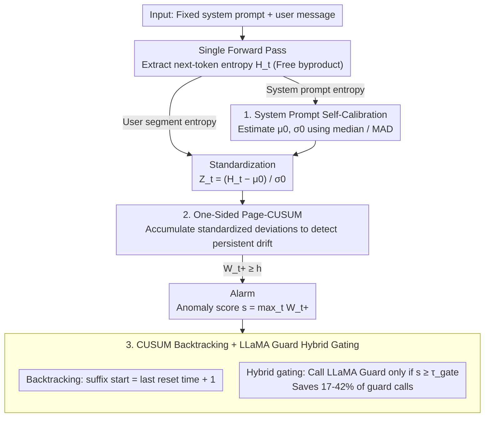

# Detecting Fluent Optimization-Based Adversarial Prompts via Sequential Entropy Changes

**Conference**: ICML 2026  
**arXiv**: [2605.19966](https://arxiv.org/abs/2605.19966)  
**Code**: https://github.com/cpdonline/cpdonline (Available)  
**Area**: LLM Safety / Jailbreak Detection / Online Change-Point Detection  
**Keywords**: Adversarial Suffix, Page-CUSUM, token entropy, system prompt baseline, jailbreak localization  

## TL;DR
The authors model "fluent optimization-based jailbreak suffix detection" as online change-point detection over token-level entropy streams. By utilizing the entropy distribution of fixed system prompts to calculate a robust MAD-based baseline for standardizing user token entropy, a Page-CUSUM cumulative statistic $W_t^+$ is monitored, triggering an alarm when a threshold is exceeded. Evaluated across 6 open-source aligned LLMs against five attack families (GCG, AutoDAN, AdvPrompter, BEAST, AutoDAN-HGA), this method achieves higher F1 scores than window-based perplexity. It precisely localizes 79.6% of alarms within the suffix and serves as a lightweight gate for LLaMA Guard, saving 17-42% of guard calls.

## Background & Motivation

**Background**: Current runtime defenses for LLM jailbreaking are categorized into two main approaches: (1) Statistical detectors: calculating global perplexity (PP) or window perplexity (WPP) as anomaly scores; (2) Safety classifiers: using fine-tuned LLMs like LLaMA Guard to determine if a prompt is unsafe. The former is lightweight but limited to scalar statistics, while the latter is accurate but requires an additional LLM forward pass.

**Limitations of Prior Work**: New generations of attacks post-GCG (AutoDAN, AdvPrompter, BEAST, AutoDAN-HGA) include "low perplexity/fluency" as an explicit optimization goal. Consequently, the global PP AUROC between benign and adversarial prompts collapses to an interval of $\pm 0.04$ around $0.5$ across six models—rendering threshold adjustments ineffective. WPP performs better by capturing local spikes via maximum NLL in a window, but the optimal window size $w$ is highly model-dependent (e.g., $w=15$ for LLaMA-2-7B vs. $w=1$ for Vicuna-7B/Qwen2.5-7B). Furthermore, larger windows average adversarial loss with benign context, causing severe "boundary smearing" where alarms are triggered near the suffix edges rather than inside it.

**Key Challenge**: The characteristic of fluent adversarial suffixes is not "high absolute perplexity" but a "persistent upward mean shift of model uncertainty along the token stream." PP and WPP compress sequences into scalars or local means, losing the critical signal of "drift persistence."

**Goal**: (a) Develop a model-agnostic, training-free, pure forward-pass bypass method for online adversarial suffix detection; (b) Provide token-level suffix start position localization; (c) Integrate with expensive classifiers like LLaMA Guard as a gating pipeline to reduce call rates.

**Key Insight**: The authors observe that for each request, the token entropy distribution of a fixed system prompt is stable in a given deployment. While benign user inputs share a similar distribution, optimization-based suffixes introduce a "persistent upward mean shift"—precisely the problem that the 1954 Page-CUSUM control chart was designed to solve as the "fastest online detection of persistent mean shifts."

**Core Idea**: Treat the token-level next-token entropy stream as a 1D time series. Use the system prompt to estimate a robust baseline $(\hat\mu_0, \hat\sigma_0)$ to standardize the user segment into $Z_t$. Execute a one-sided Page-CUSUM $W_t^+$; an alarm triggers when the threshold $h$ is exceeded. The backtracking rule of CUSUM is then used to estimate the suffix start position $\hat\nu$.

## Method

### Overall Architecture
The method addresses the blind spot where fluent adversarial suffixes subtly increase model uncertainty without being captured by global perplexity by transforming the problem into online change-point detection on 1D time series. Each request consists of a fixed system prompt $\mathbf{x}^{\text{sys}}$ and a user message $\mathbf{x}^{\text{usr}}$. During a standard forward pass, the entropy $H_t = -\sum_v p_\theta(v|x_{<t})\log p_\theta(v|x_{<t})$ of the next-token distribution is extracted at each position—this is a "free" byproduct. The entropy sequence from the system prompt $\{H_i^{\text{sys}}\}$ is used to estimate a deployment-level robust baseline, which standardizes the user segment $\{H_t^{\text{usr}}\}$ into $Z_t$. The Page-CUSUM cumulative statistic $W_t^+$ is then calculated. If $W_t^+ \geq h$ at any time, an alarm is triggered. The prompt-level anomaly score is defined as $s(\mathbf{x}^{\text{usr}})=\max_t W_t^+$. The zero-reset timing of CUSUM is used to backtrack the suffix start. The pipeline is per-token $O(1)$, per-prompt $O(T)$, and operates with constant memory.

### Key Designs

**1. System Prompt Self-Calibrated Robust Baseline $(\hat\mu_0,\hat\sigma_0)$: Turning fixed overhead into free reference samples**

The absolute magnitude of entropy is strongly coupled with model scale, tokenizer, and the phrasing of the system prompt, preventing the use of a hard threshold across models. The authors leverage the fact that the system prompt is completely fixed in a given deployment; its $m$ token entropies naturally serve as "attack-free" reference samples. Baseline estimation uses median and MAD for robust position and scale: $\hat\mu_0=\mathrm{median}(\{H_i^{\text{sys}}\})$, $\hat\sigma_0=c\cdot\mathrm{median}(|H_i^{\text{sys}}-\hat\mu_0|)$, where $c\approx 1.4826$ calibrates MAD to Gaussian-$\sigma$. The user segment is standardized as $Z_t=(H_t^{\text{usr}}-\hat\mu_0)/\hat\sigma_0$. MAD is chosen over mean/variance because a few tokens in the system prompt can have very high entropy; median and MAD are insensitive to these outliers.

**2. One-Sided Page-CUSUM for Detecting Persistent Drift $W_t^+$: Using 1954 control charts for "drift persistence"**

The failure of PP/WPP lies in compressing sequences into scalars, losing the temporal signal of uncertainty "climbing." An adversarial suffix essentially creates a persistent positive mean shift in the user segment. Page-CUSUM is classically optimal for detecting persistent mean shifts. It iterates $W_t^+=\max\{0,\,W_{t-1}^++Z_t-k\}$ with slack $k\geq 0$ and threshold $h>0$. When the mean of $\{Z_t\}$ is near zero, $W_t^+$ repeatedly resets to zero, preventing noise accumulation. Once a persistent positive drift occurs, $W_t^+$ accumulates monotonically until crossing $h$. Unlike windowed detection, $W_t^+$ naturally adapts to varying suffix lengths.

**3. CUSUM Backtracking Localization $\hat\nu$ + LLaMA Guard Hybrid Gating: Attaining event-level output and cost savings**

CUSUM provides suffix localization for free. If $t_0$ is the last time $W_t^+=0$, the start estimate is $\hat\nu=t_0+1$. This is useful for automatic suffix pruning or security auditing. Furthermore, since over 90% of production loads are benign, the method uses a gating threshold $\tau_{\text{gate}}$. If $s(\mathbf{x}^{\text{usr}})<\tau_{\text{gate}}$, the prompt is judged benign and skips the expensive LLaMA Guard call. This reduces guard calls by 17-42% without dropping hybrid F1.

### Loss & Training
The method is training-free. The only "tuning" is the threshold $h$, selected by maximizing F1 on the training fold via 5-fold stratified CV. Token entropies are taken directly from the base LLM's standard forward pass.

## Key Experimental Results

### Main Results
Perplexity-matched benchmark ($\alpha=1$ matching; 1012 adversarial + 1012 benign). CPD uses canonical $k=0$. F1 / AUROC results:

| Model | PP AUROC | Best WPP F1 / AUROC | CPD F1 / AUROC |
|------|----------|--------------------|----------------|
| LLaMA-2-7B | 0.46 | 0.74 / 0.77 (WPP15) | **0.82 / 0.88** |
| LLaMA-2-13B | 0.49 | 0.74 / 0.78 (WPP10) | **0.80 / 0.87** |
| Vicuna-7B | 0.50 | 0.77 / **0.85** (WPP1) | 0.77 / 0.82 |
| Vicuna-13B | 0.51 | 0.77 / 0.84 (WPP10) | **0.80 / 0.85** |
| Qwen2.5-7B | 0.51 | 0.83 / 0.91 (WPP1) | **0.85 / 0.91** |
| Qwen2.5-14B | 0.50 | 0.80 / 0.85 (WPP10) | **0.85 / 0.91** |

PP AUROC collapses around 0.5, verifying that a single PP threshold cannot distinguish matched prompts. CPD leads in F1 across all 6 models and leads or ties in AUROC for 5 models.

### Ablation Study
Ablation on "Signal × Mechanism" for LLaMA-2-7B ($k=0$):

| Mechanism | Signal | F1 | AUROC |
|------|------|----|-------|
| CUSUM | NLL | 0.874 | 0.918 |
| CUSUM | Entropy | 0.818 | 0.878 |
| Window $w=1$ | NLL | 0.734 | 0.783 |
| Window $w=1$ | Entropy | 0.699 | 0.706 |

The mechanism is more important than the signal: switching to CUSUM improves F1 by ~12-14 points regardless of using NLL or entropy.

### Key Findings
- **Localization Superiority**: At F1-optimal thresholds, CPD places 79.55% of alarms inside the suffix, whereas WPP ranges from 17-46%. CPD effectively marks the moment before drift begins.
- **Cross-Attack Robustness**: Evaluated on a mix of 5 attack families, CPD consistently achieves top performance, indicating that "persistent entropy drift" is a common feature of optimization-based adversarial suffixes.
- **Gating Efficiency**: In an imbalanced stream (4.2% attack rate), CPD as a gate saves 42.2% of guard calls while maintaining F1, significantly outperforming WPP (13-18% savings).

## Highlights & Insights
- **Classic Control Charts for Modern Attacks**: Applying the 1954 Page-CUSUM to LLM entropy streams proves more effective than ad-hoc windowing heuristics, suggesting that sequential analysis tools are undervalued in LLM safety.
- **System Prompt as a Gift**: Instead of viewing the system prompt as overhead, the authors use it as a "free self-calibration sample," a concept applicable to any runtime detector.
- **Detection-Localization Integration**: Suffix localization $\hat\nu$ is a near-zero-cost byproduct of CUSUM with high downstream value for pruning and auditing.

## Limitations & Future Work
- **Append-only Suffixes**: The method assumes attacks are appended. It may not apply to persuasive rewriting where no clear "baseline segment" exists.
- **System Prompt Stability**: Dynamic prompts or increasing context in multi-turn conversations may require re-estimating baselines, introducing overhead.
- **Adaptive Attacks**: If attackers optimize against CPD (e.g., by constraining entropy increases), they might bypass detection, necessitating "CPD-aware" adversary research.

## Related Work & Insights
- **vs. PP / WPP**: While PP assumes high perplexity, CPD focuses on "mean shift," making it robust to fluent attacks.
- **vs. LLaMA Guard**: CPD is complementary, acting as a lightweight gate to reduce the cost of heavy semantic classifiers.
- **vs. Safety Fine-tuning**: CPD provides an independent layer of defense that remains effective even if alignment is bypassed.

## Rating
- Novelty: ⭐⭐⭐⭐
- Experimental Thoroughness: ⭐⭐⭐⭐⭐
- Writing Quality: ⭐⭐⭐⭐
- Value: ⭐⭐⭐⭐⭐

<!-- RELATED:START -->

<!-- RELATED:END -->

## Related Papers

- [\[ICML 2026\] Toward Understanding Adversarial Distillation: Why Robust Teachers Fail](toward_understanding_adversarial_distillation_why_robust_teachers_fail.md)
- [\[ICML 2026\] Entropy-Aware On-Policy Distillation of Language Models](entropy-aware_on-policy_distillation_of_language_models.md)
- [\[ICML 2026\] Efficient Learned Image Compression without Entropy Coding](efficient_learned_image_compression_without_entropy_coding.md)
- [\[ICML 2026\] Float8@2bits: Entropy Coding Enables Data-Free Model Compression](float82bits_entropy_coding_enables_data-free_model_compression.md)
- [\[CVPR 2026\] Adversarial Concept Distillation for One-Step Diffusion Personalization](../../CVPR2026/model_compression/adversarial_concept_distillation_for_one-step_diffusion_personalization.md)

<!-- RELATED:END -->
