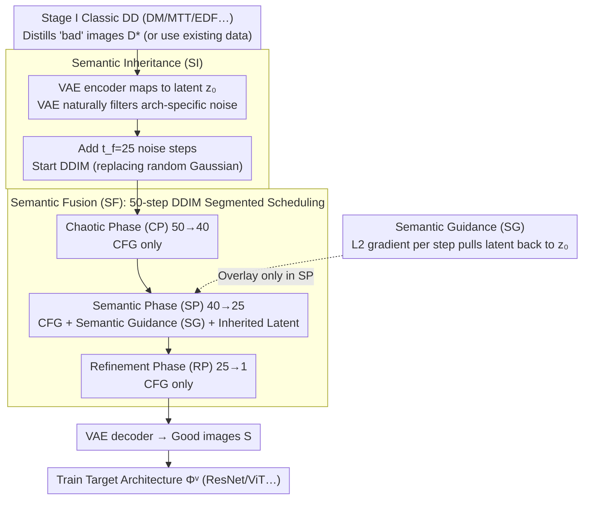

# DIVER: Diving Deeper into Distilled Data via Expressive Semantic Recovery

**Conference**: ICML 2026  
**arXiv**: [2605.12649](https://arxiv.org/abs/2605.12649)  
**Code**: To be confirmed  
**Area**: Model Compression / Dataset Distillation  
**Keywords**: Dataset Distillation, Diffusion Model Priors, Cross-architecture Generalization, Semantic Recovery, Two-stage Distillation

## TL;DR
DIVER transforms the classic Dataset Distillation (DD) from a "single-stage direct evaluation" into a two-stage paradigm: "distill first, then revive semantics with pretrained diffusion models." Through a three-step process of semantic inheritance, guidance, and fusion, it recovers suppressed high-level semantics from "gibberish" images distilled via ConvNets. This improves the accuracy of the same distilled data on heterogeneous architectures like ResNet18/ViT by 3–10 percentage points, requiring only 2.48s and 4GB VRAM per image.

## Background & Motivation

**Background**: Dataset Distillation (DD) compresses millions of training images into dozens or thousands of "synthetic proxy samples," ensuring that models trained on this proxy set achieve performance close to the original set. The mainstream approach follows bilevel optimization: the inner loop evaluates classification loss on a fixed proxy architecture $\varPhi^p$ (usually a small ConvNet), while the outer loop directly updates synthetic images in pixel space based on criteria like gradient matching, distribution matching, or trajectory matching.

**Limitations of Prior Work**: Pixel-space bilevel optimization causes synthetic images to deeply overfit to the specific low-frequency/high-frequency patterns of $\varPhi^p$, resulting in abstract, noisy images that lack realism. When such proxy sets are used to train ResNet18, ShuffleNet, or ViT, performance collapses significantly—Tab. 1 shows that cross-architecture accuracy for classic DM/MTT/EDF on ImageNet subsets is sometimes worse than random selection (e.g., ImageFruit IPC=1: MTT 15.4% vs. Random 14.1% is only a 1.3-point gain; at IPC=10, 18.9% < 19.6%).

**Key Challenge**: A structural trade-off exists between distillation accuracy (on $\varPhi^p$) and cross-architecture generalization (on heterogeneous $\varPhi^v$). The optimization target is the loss of $\Phi^p$, but actual deployment uses $\Phi^v$; the "architecture-specific optimal solution" converged upon by the former is not a global optimum for the latter. This manifests as images containing high-frequency textures useful only for ConvNets (but noise for ViT) while losing essential semantic clarity.

**Goal**: Without rerunning DD, accessing the original dataset, or retraining diffusion models, refine "bad images" $\mathcal{D}^*$ into "good images" $\mathcal{S}$ that simultaneously satisfy three conditions: (1) retain the implicit dataset-level semantics in $\mathcal{D}^*$; (2) filter out architecture-sensitive "noise" patterns; and (3) appear realistic with clear category attributes.

**Key Insight**: The authors assert that diffusion models (especially pretrained DiTs) are naturally "natural image manifold projectors." By feeding abstract distilled images as latent initializations into the reverse process, the diffusion process itself pulls the images toward the real distribution. Furthermore, the hierarchical feature extraction of neural networks (shallow layers capture textures/edges, deep layers capture semantics) suggests that the VAE encoding step itself filters architecture-specific noise.

**Core Idea**: Encode "distilled images" into latents via VAE $\to$ add appropriate noise as a DDIM starting point $\to$ use the distilled image latent for "loyalty guidance" alongside class labels for conditional guidance during the mid-stage of the diffusion process. This recovers synthetic images possessing both semantic clarity and original dataset knowledge, serving as a hot-pluggable plugin for any existing DD method.

## Method

### Overall Architecture
DIVER formally decouples the original DD problem into two stages: DD + DDD. Stage I uses any classic DD algorithm (DM / DC / MTT / NCFM / EDF / SRe²L / G-VBSM) to distill "bad images" $\mathcal{D}^*=\{(\tilde x_i, \tilde y_i)\}$ on a ConvNet (one can even skip this and directly use released distilled data). Stage II (DDD, Diving into Distilled Data) is the core contribution: it fixes a pretrained guided diffusion model (primarily DiT-XL/2 + vae-ft-mse trained on 256×256 ImageNet) and treats each distilled image as a latent starting point for the DDIM reverse process. During sampling, it applies semantic guidance using the distilled latent and conditional guidance using category labels to recover "good images" $\mathcal{S}=\mathcal{H}_{\mathcal{D}^*}(\tilde x)$ for training the target architecture $\varPhi^v$.

For a single image: it is first projected to latent $z_0$ via a VAE encoder $\tilde x \xrightarrow{\mathcal{E}} z_0$, then $t_f=25$ steps of noise are added to get $z_{t_f}$. A 50-step DDIM reverse process is initialized with $\hat z_{t_r}=z_{t_f}$. During the chaotic and refinement segments, only CFG is run; during the semantic segment $[t_h, t_l]=[40, 25]$, semantic guidance is superimposed. Finally, $\hat z_0 \xrightarrow{\mathcal{F}}$ decodes the synthetic image. Formally, the goal is $\mathcal{S}^* = \arg\min_{\mathcal{S}} \mathcal{M}(\varPhi^v_\mathcal{O}(x), \varPhi^v_\mathcal{S}(\mathcal{H}_{\mathcal{D}^*}(\tilde x)))$ where $|\mathcal{S}|=|\mathcal{D}|\ll|\mathcal{O}|$. Stage II is entirely training-free, does not access the original set $\mathcal{O}$, and is invisible to the proxy structure $\varPhi^p$.

### Key Designs

**1. Semantic Inheritance (SI): Distilled Images as Diffusion Starting Points**

In classic DD, useful dataset-level semantics and architecture-specific patterns (noise for ViT) are coupled. SI uses a pretrained VAE to project distilled images to latent $z_0$, adds $t_f$ steps of noise $z_{t_f}=\sqrt{\alpha_{t_f}}z_0+\sqrt{1-\alpha_{t_f}}\epsilon$, and uses $\hat z_{t_r}=z_{t_f}$ to replace the random Gaussian starting point. This ensures distilled images participate in diffusion "in latent form." The noise filtering relies on the observation that VAE encoders, constrained by natural image distributions, treat non-natural architecture-specific noise as low-gain signals and discard them during compression. $t_f$ is the key trade-off: if too large, the latent is dominated by the Gaussian prior (losing semantics); if too small, it deviates from the Gaussian assumption (sampling quality drops). $t_f=25$ is the sweet spot.

**2. Semantic Guidance (SG): Preventing Semantic Drift**

CFG continuously injects category conditions $c$, which can push the latent toward the "class average," erasing discriminative information from the distilled image. SG adds a gradient at each step to pull $\hat z_t$ back to $z_0$, modifying the DDIM update to $\hat z_{t-1}=s(\hat z_t,t,\epsilon_\theta)-\gamma\nabla_{\hat z_t}\mathcal{G}_t(\hat z_t)$ with an $L_2$ guidance function $\mathcal{G}_t=(\hat z_t-z_0)^2\cdot\sigma_t/2$ and scale $\gamma=0.1$. To minimize overhead, the gradient $\nabla\mathcal{G}_t$ is approximated as $(\hat z_t-z_0)\sigma_t$, avoiding backpropagation and keeping sampling time nearly identical to vanilla DiT (2.48s vs 2.41s).

**3. Semantic Fusion (SF): Scheduling Guidance during Semantic Formation**

Applying SG throughout the process causes artifacts early on and reduces realism later. SF follows diffusion phase theory, dividing the 50-step process into Chaotic (CP, $50\to 40$), Semantic (SP, $40\to 25$), and Refinement (RP, $25\to 1$) phases. SG + CFG are only combined during the SP window where semantics are forming. This maintains fidelity to distilled images without polluting initial noise sampling or late-stage sharpening. SF improves MTT accuracy from 21.1%/28.3% (SI+SG only) to 22.3%/29.8% (Full DIVER) for IPC=1/10.

### Loss & Training
DIVER Stage II is **completely training-free**. The diffusion model and VAE use frozen pretrained weights (DiT-XL/2 + vae-ft-mse). There are only three hyperparameters: $t_f=25$, $[t_h, t_l]=[40, 25]$, and $\gamma=0.1$ (0.02 for NCFM). Target architecture $\varPhi^v$ follows the original DD protocol (hard/soft labels).

## Key Experimental Results

### Main Results

Evaluated on ImageNet-1K (224×224) and 12 ImageNet subsets (128×128), with images resized to 256×256 for DiT. Baselines cover pixel optimization (DM/MTT/EDF/NCFM), distribution matching (SRe²L/G-VBSM), and diffusion-native (Minimax/D⁴M/MGD³) methods. Proxy $\varPhi^p$=ConvNet, Evaluation $\varPhi^v$ = ResNet18 / ShuffleNet-V2 / MobileNet-V2 / EfficientNet-B0 / ViT-b/16.

| Config (ImageFruit) | IPC=1 | IPC=10 | Gain Source |
|---|---|---|---|
| MTT (baseline) | 15.4 ± 1.6 | 18.9 ± 1.4 | Pixel-space Trajectory Matching |
| MTT + DIVER (Ours) | **22.3 ± 1.8** | **29.8 ± 2.0** | +6.9 / +10.9 |
| EDF (baseline) | 16.2 ± 1.8 | 23.2 ± 2.1 | Prev. SOTA Pixel Method |
| EDF + DIVER (Ours) | **20.3 ± 1.9** | **34.5 ± 2.3** | +4.1 / +11.3 |
| DM | 11.3 ± 1.4 | 19.3 ± 1.5 | Distribution Matching |
| DM + DIVER (Ours) | **18.5 ± 1.9** | **22.4 ± 1.8** | +7.2 / +3.1 |
| NCFM | 17.1 ± 1.6 | 20.5 ± 2.5 | Current SOTA |
| NCFM + DIVER (Ours) | **18.8 ± 1.7** | **25.5 ± 1.6** | +1.7 / +5.0 |

Cross-architecture Generalization: DC + DIVER improves from 24.9% to 30%+ at IPC=1 on ImageA. On full ImageNet-1K, DIVER paired with MGD³ sets a new SOTA for ResNet-18 at IPC=10.

Efficiency: On a single RTX-4090, 2.48s per synthetic image with 4.02 GB VRAM usage.

### Ablation Study (Tab. 6, ImageFruit + MTT)

| Configuration | IPC=1 | IPC=10 | Description |
|---|---|---|---|
| Random (No DD, No DIVER) | 14.1 ± 1.4 | 19.6 ± 1.8 | Baseline |
| DD only (MTT) | 15.4 ± 1.6 | 18.9 ± 1.4 | Classic DD; loses to random at IPC=10 |
| Random* + Full DIVER | 14.6 ± 1.8 | 21.7 ± 1.6 | Proves DIVER uses distilled semantics |
| MTT + raw DiT (No SI/SG/SF) | 17.8 ± 1.2 | 23.4 ± 1.3 | Simple DiT pass already helps |
| MTT + SI only | 19.5 ± 1.4 | 26.2 ± 1.5 | SI contributes +4.1 / +7.3 |
| MTT + SG only | 20.4 ± 1.7 | 27.8 ± 1.9 | SG provides the largest gain |
| MTT + SI + SG | 21.1 ± 1.9 | 28.3 ± 1.6 | SI+SG shows saturation |
| MTT + SI + SG + SF (full) | **22.3 ± 1.8** | **29.8 ± 2.0** | SF adds final +1.2 / +1.5 |

### Key Findings
- **SG is the most critical module**: Removing SG causes a larger drop than removing SI, indicating that pinning the latent back to the distilled image is more effective for generalization than just VAE filtering.
- **Random* experiment**: Feeding random original images into DIVER yields only 21.7% at IPC=10 (vs 23.4% for pure DiT), proving the gains come from the "compressed semantics" in distilled images, not just the diffusion prior.
- **Structural trade-off**: DIVER decreases accuracy on the proxy ConvNet while significantly increasing it on heterogeneous architectures, intentionally sacrificing arch-specific overfitting for generalization.
- **Robustness**: DIVER works across SD-V1.5 / DiT / SiT. Lower gains on SD-V1.5 suggest that architecture alignment and pretraining domain (ImageNet) are important.

## Highlights & Insights
- **Redefining DD as a two-stage DD + DDD problem**: This is a paradigm decoupling. The authors acknowledge that the classic DD objective is inherently biased toward $\varPhi^p$, and the DDD task is defined specifically to bridge this gap.
- **Distilled images as latent starting points**: This distinguishes DIVER from diffusion-native DD (like D⁴M) which replaces classic DD with coreset selection. DIVER "revives" the vast existing ecosystem of distilled datasets as a universal, training-free upgrader.
- **Three-phase guidance scheduling**: SF treats "when to guide" as a design dimension (CP: no, SP: strong, RP: no), a pattern transferable to image editing and style transfer.
- **Efficiency**: The zero-gradient approximation $(\hat z_t-z_0)\sigma_t$ and latent-space guidance make the process nearly free computationally.

## Limitations & Future Work
- Dependency: Performance is limited by the quality of Stage I distilled images; if the initial semantics are too poor, Stage II cannot fully recover them.
- Diffusion Foundation: Currently only validated with DiT/SiT/SD-V1.5; integration with modern Flow Matching or Consistency Models is unexplored.
- Domain/Resolution: Primarily ImageNet-based; performance on OOD domains (medical, remote sensing) or high-resolution datasets needs further study.
- Future Work: Learning the SG objective (e.g., via contrastive learning) or making SF phase transitions adaptive rather than fixed.

## Related Work & Insights
- **vs. GLaD**: GLaD does matching in GAN latent space but remains single-stage and requires expensive inner loops. DIVER is two-stage, training-free, and reuses any DD output.
- **vs. Diffusion-native DD (D⁴M/MGD³)**: These methods bypass classic DD. DIVER views diffusion as a "post-processing repair tool" for classic DD, and Tab. 4 shows DIVER + MGD³ can even provide additive gains.
- **vs. SDEdit**: While SDEdit modifies local attributes of real images, DIVER performs "semantic recovery" on non-natural distilled images.

## Rating
- Novelty: ⭐⭐⭐⭐ Concepts like two-stage decoupling and DDD task definition are breakthroughs, though components (SI/SG/SF) draw from established diffusion priors.
- Experimental Thoroughness: ⭐⭐⭐⭐ Extensive coverage across 6 baselines, 12 datasets, 5 architectures, and multiple IPC settings.
- Writing Quality: ⭐⭐⭐⭐ Clear motivation and formal definitions; well-designed figures mitigate dense notation.
- Value: ⭐⭐⭐⭐⭐ Extremely high practical value as a training-free plugin to upgrade the entire classic DD ecosystem.

<!-- RELATED:START -->

## Related Papers

- [\[ICML 2026\] Mind Your Margin and Boundary: Are Your Distilled Datasets Truly Robust?](mind_your_margin_and_boundary_are_your_distilled_datasets_truly_robust.md)
- [\[ICML 2026\] IDLM: Inverse-distilled Diffusion Language Models](idlm_inverse-distilled_diffusion_language_models.md)
- [\[ICLR 2026\] PASER: Post-Training Data Selection for Efficient Pruned Large Language Model Recovery](../../ICLR2026/model_compression/paser_post-training_data_selection_for_efficient_pruned_large_language_model_rec.md)
- [\[ICML 2026\] Hard Labels In! Rethinking the Role of Hard Labels in Mitigating Local Semantic Drift](hard_labels_in_rethinking_the_role_of_hard_labels_in_mitigating_local_semantic_d.md)
- [\[ICLR 2026\] A Recovery Guarantee for Sparse Neural Networks](../../ICLR2026/model_compression/a_recovery_guarantee_for_sparse_neural_networks.md)

<!-- RELATED:END -->
