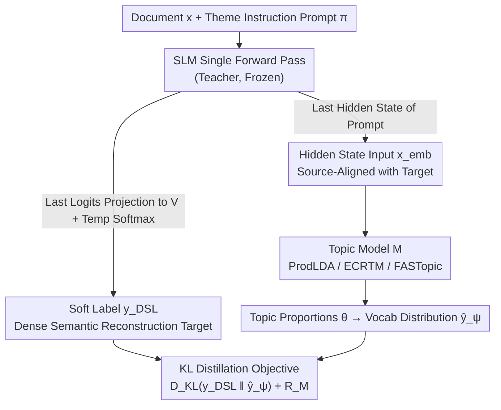

# DSL-Topic: Improving Topic Modeling by Distilling Soft Labels from Language Models

**Conference**: ICML 2026  
**arXiv**: [2602.17907](https://arxiv.org/abs/2602.17907)  
**Code**: https://github.com/raymondzmc/dsl-topic-models (Available)  
**Area**: NLP Understanding / Topic Modeling / Knowledge Distillation  
**Keywords**: Neural Topic Models, Soft Label Distillation, Small Language Models, KL Reconstruction Objective, Implicit Bayesian Inference  

## TL;DR
The authors utilize the next-token probability distribution generated by a small language model (SLM), prompted to "generate a theme word for the document," and project it onto the topic model vocabulary as dense soft labels. These labels replace the traditional Bag-of-Words (BoW) reconstruction target to train neural topic models (ProdLDA / ECRTM / FASTopic). This significantly improves Purity across three datasets (20NewsGroup, TweetTopic, StackOverflow) and provides a Bayesian interpretation of "projecting implicit LM posterior predictions onto a structured topic family."

## Background & Motivation

**Background**: Mainstream neural topic models follow the LDA-VAE lineage (ProdLDA, ETM, CombinedTM, ZeroshotTM), which encodes documents into continuous latent variables $\theta$ and infers topic–word distributions via BoW reconstruction loss. Newer models like ECRTM add embedding clustering regularization, and FASTopic uses Optimal Transport (OT) to align documents, topics, and words in a shared embedding space.

**Limitations of Prior Work**: The BoW objective can only assign probability mass to "words appearing in the document," completely ignoring context and compositional semantics. On short texts like TweetTopic and StackOverflow, co-occurrence signals are too sparse to learn coherent topics (e.g., LDA's Purity on StackOverflow is only .174, and ProdLDA's is only .265).

**Key Challenge**: Directly using LLMs for topic modeling (e.g., TopicGPT, Prompt-based) sacrifices the probabilistic framework—topics are represented in natural language, and document assignments are hard decisions, failing to characterize topic uncertainty. Furthermore, LLM context windows cannot accommodate large corpora. One must typically choose between the "structural advantages of probabilistic topic models" and the "semantic priors of LLMs."

**Goal**: Retain the probabilistic structure of VAE-based topic models while making the reconstruction target carry the semantic/thematic information encoded by LMs, without introducing extra training stages or depending on large-scale generation.

**Key Insight**: The authors observe that if a prompt requests an LM to "Generate a single word label capturing the document theme," the next-token logits distribution immediately following the prompt is essentially a dense semantic distribution over "theme-related words." It can assign probabilities even to words that do not appear in the document but are thematically relevant (e.g., Figure 1 shows a document about religious debate assigning probability to unmentioned religious terms).

**Core Idea**: Project this LM-induced prompt-conditioned next-token distribution onto the topic model vocabulary $V$, obtain soft labels $y_{DSL}$ via softmax, and train any vocab-reconstruction topic model using KL divergence to fit $y_{DSL}$. This is equivalent to distilling the LM's implicit Bayesian posterior prediction into a structured topic family.

## Method

### Overall Architecture
The paper aims to inject semantic priors from SLMs into neural topic model training without altering the model structure or adding extra training stages. For each document $x$, a fixed thematic instruction prompt $\pi$ is provided. A single forward pass through an SLM produces two components: a dense "soft label" as the training target and a hidden state as the input representation. Specifically, the next-token logits immediately following the prompt are projected onto the vocabulary $V$ and processed via temperature softmax to obtain the soft label $y_{DSL}$. Meanwhile, the last-layer hidden state at the final prompt position, $x_{emb} = h_{LM}(x,\pi)$, is fed into the topic model $\mathcal{M}$ (ProdLDA / ECRTM / FASTopic) to infer topic proportions $\theta$ and output the predicted vocabulary distribution $\hat{y}_\psi(x)$. During training, the original BoW reconstruction term is replaced with $D_{KL}(y_{DSL} \| \hat{y}_\psi)$, while the model’s inherent regularization $\mathcal{R}_{\mathcal{M}}$ is retained. The LM is not trained, and soft labels can be pre-computed once and reused offline.

### Key Designs

**1. Prompt-Conditioned Soft Target $y_{DSL}$: Replacing Word Frequency with LM Next-Token Distribution**

Traditional BoW targets can only assign probability to words appearing in the document. When co-occurrence is sparse, topic models often learn residual stop words. The authors note that by prompting an LM to "generate a theme word," the subsequent next-token distribution is a dense semantic distribution. For a religious debate document, it assigns probability to relevant but absent words like *god*, *atheist*, or *believer*. A vocabulary $V$ of $|V|=2000$ high-frequency words is filtered (restricted to words representable by a single token in the LM tokenizer, covering 98%). After a forward pass with `<system, x, π>`, the sub-vector of logits $\ell_V(x,\pi) \in \mathbb{R}^{|V|}$ within $V$ is extracted. Soft labels are generated as $y_{DSL}(x,\pi) = \mathrm{softmax}(\ell_V(x,\pi) / \tau)$ with $\tau=3$. Unlike BoW, $y_{DSL}$ treats the semantic priors from LM pre-training as a cost-effective semantic augmentation, injecting knowledge of "which words are theme-related" into the topic model.

**2. Hidden State Input $x_{emb}$: Aligning Input and Target in the Same Semantic Space**

If the input remained BoW, the model would have to infer "LM themes from word bags," introducing noise into the distillation. Instead, the authors use the LM's own hidden states: for an autoregressive LM, the hidden state at the final prompt position is exactly the vector projected by the LM head to form next-token logits. Thus, $x_{emb}$ and $y_{DSL}$ naturally reside in the same "pre-projection" semantic space. The topic model's encoder interface (formerly BoW/SBERT) is replaced, while the internal structure of ProdLDA/ECRTM/FASTopic remains unchanged. This allows KL distillation to focus solely on projecting the real-valued semantic space of the LM onto the structured vocabulary distribution of the topic model.

**3. Model-Agnostic KL Distillation: Enhancing Three Types of Topic Model Backbones**

By replacing the BoW-NLL reconstruction term with the KL distillation term, the general training objective is formulated as:

$$\mathcal{L}_{DSL}(x) = \lambda \, D_{KL}(y_{DSL}(x,\pi) \,\|\, \hat{y}_\psi(x)) + \mathcal{R}_{\mathcal{M}}(x;\psi)$$

where $\mathcal{R}_{\mathcal{M}}$ preserves model-specific regularizers: KL divergence for the logistic-normal prior in ProdLDA, embedding clustering in ECRTM, and OT terms in FASTopic. Since KL magnitudes are relatively small compared to these regularizers, $\lambda = 10^3$ is used to balance them. This plug-and-play approach is supported by a Bayesian interpretation: an LM under prompt-conditioned input can be viewed as an implicit Bayesian predictor $y_{DSL}(v|x,\pi) \approx \int p_{LM}(v|c)\, p_{LM}(c|x,\pi) \, dc$ for latent concepts $c$. The topic model then projects this implicit posterior prediction into a structured hypothesis family $\mathcal{P}_{\mathcal{M}}(x_{emb}) \subseteq \Delta^{|V|-1}$ with a low-dimensional topic bottleneck.

### Loss & Training
The complete objective follows the equation above. Hyperparameters $\tau=3$ and $\lambda=10^3$ are kept consistent across three datasets. SLM teachers include ERNIE-4.5-0.3B, Qwen3.5-0.8B, Llama-3.2-1B, Phi-3-mini, and Llama-3.1-8B. Soft labels are pre-computed once and cached; no LM forward passes occur during topic model training.

## Key Experimental Results

### Main Results
Average results across 3 datasets × 4 topic counts ($K=25, 50, 75, 100$) × 5 seeds. Representative Purity comparisons (higher is better):

| Dataset | LDA | ProdLDA | CombinedTM | BERTopic | ProdLDA + DSL (Qwen3.5-0.8B) | ECRTM + DSL (Qwen3.5-0.8B) |
|--------|-----|---------|-----------|----------|-----------------------------|---------------------------|
| 20NewsGroup | .301 | .356 | .391 | .352 | **.542** | .561 |
| TweetTopic | .441 | .533 | .588 | .562 | **.781** | .781 |
| StackOverflow | .174 | .265 | .306 | .202 | **.788** | .805 |

On short texts like StackOverflow, Purity jumps from .265 (ProdLDA baseline) to .803 (Phi-3-mini + DSL). LLM ratings (topic quality) increase from 2.49 for ProdLDA to 2.89-2.92, and $C_V$ coherence increases from .351 to .399-.404.

### Ablation Study
A cross-grid of "3 Topic Model Architectures × 5 SLM Teachers" was conducted. The table below shows $C_V$ / LLM ratings on 20NewsGroup:

| Backbone (Qwen3.5-0.8B Teacher) | $C_V$ | LLM rating | I-RBO | Purity |
|--------------------------|-------|------------|-------|--------|
| ProdLDA + DSL | .399 | 2.86 | .980 | .542 |
| ECRTM + DSL | **.423** | 2.82 | .975 | .561 |
| FASTopic + DSL | .347 | 2.15 | 1.000 | .504 |
| (Baseline) ProdLDA | .351 | 2.49 | .992 | .356 |

### Key Findings
- ProdLDA and ECRTM are universally enhanced. However, FASTopic's $C_V$/LLM rating on 20NewsGroup slightly underperforms its baseline. This is attributed to target-solver mismatch: FASTopic's Sinkhorn-OT is designed for sparse BoW targets, while DSL provides top-k dense distributions, forcing transport to spread quality across a wider support set, which weakens the sharp features preferred by coherence metrics.
- Teacher SLMs between 0.3B and 8B perform consistently. Even the smallest ERNIE-4.5-0.3B outperforms ZeroshotTM/CombinedTM/BERTopic/FASTopic using GTE-large-en-v1.5 (0.4B), suggesting that passing semantic signals via next-token probabilities is more direct and effective than using sentence-encoder representations.
- ProdLDA + DSL is recommended as the default: it offers the best performance-complexity trade-off. Its $C_V$/Purity is within 0.02 of ECRTM + DSL, but it consistently wins in LLM ratings without ECRTM's complex clustering regularizers or OT solvers.

## Highlights & Insights
- **Reconstruction Targets Carry Semantic Priors**: Previously, researchers either modified inputs (adding SBERT) or architectures (using OT) when BoW was insufficient. DSL highlights a neglected dimension—switching the target from word frequency statistics to LM next-token distributions. This is simple yet yields the highest empirical gains.
- **Efficiency via Small Teachers**: A 0.3B ERNIE is sufficient, meaning the additional computational overhead is negligible. After pre-computing soft labels, the training phase is as fast as original ProdLDA, contrasting with methods requiring online LLM prompting (e.g., TopicGPT).
- **Bayesian Interpretation Bridges Distillation and Structure**: By interpreting $y_{DSL}$ as an implicit posterior prediction and the topic model as a structured hypothesis family $\mathcal{P}_{\mathcal{M}}$, the KL reconstruction becomes an explicit Bayesian projection. This provides a template for using LMs as priors and structured models for inference in other latent variable scenarios like HMMs or state-space models.

## Limitations & Future Work
- The vocabulary $V$ is limited to single-token words (98% coverage). In multilingual or specialized corpora, the missing 2% might contain key "theme labels." Future work could involve marginalization over multiple tokens or BPE-aware projection.
- The prompt $\pi$ is a fixed monolingual English instruction. There is no systematic comparison of prompt designs (e.g., multi-turn, multilingual, CoT-style), so prompt sensitivity is not fully estimated.
- The performance dip in FASTopic + DSL suggests that changing the target is coupled with the original model's regularization design. Applying DSL to new models requires checking if the regularizers assume sparse BoW-style targets.
- Evaluation still relies on $C_V$, LLM rating, and Purity. While the proposed retrieval-based metric is useful, the end-to-end value for downstream tasks like summarization or interpretable clustering needs more evidence.

## Related Work & Insights
- **vs ProdLDA / ECRTM / FASTopic**: These modify architectures (VAE priors, clustering, OT) given a BoW target. DSL modifies the target itself, allowing it to overlap with these architectures as an orthogonal design dimension.
- **vs TopicGPT / Mu et al. 2024**: Pure prompt-based methods offer high interpretability but lose the probabilistic framework. DSL uses the LM as a one-time "teacher," gaining semantic priors while preserving probabilistic inference and uncertainty.
- **vs CombinedTM / ZeroshotTM**: These use SBERT as input. DSL uses the LM hidden state at the prompt position for input and the next-token distribution for the target, ensuring input-target consistency which aligns topics more effectively.
- **vs Yang et al. 2025**: They use LLMs to refine topic word distributions post-training via OT loss. DSL shifts semantic signals to the training phase; the two approaches are complementary.

## Rating
- Novelty: ⭐⭐⭐⭐ The perspective of using next-token probability as a topic reconstruction target is clear and systematic. The Bayesian interpretation elevates it to a paradigm level.
- Experimental Thoroughness: ⭐⭐⭐⭐ The 3×3×5×4×5 grid is extensive; main metrics significantly exceed baselines. Retrieval metrics and vocabulary size supplements are comprehensive.
- Writing Quality: ⭐⭐⭐⭐ The method section logically covers targets, inputs, loss, and interpretation. Figure 1 provides an intuitive motivation.
- Value: ⭐⭐⭐⭐ A simple code modification plus a 0.3B teacher multiplies Purity on short texts. Very practical for industrial topic modeling/clustering pipelines.

<!-- RELATED:START -->

## Related Papers

- [\[ICML 2026\] The Bridge-Garden Dilemma in LLM Distillation: Why Mixing Hard and Soft Labels Works](the_bridge-garden_dilemma_in_llm_distillation_why_mixing_hard_and_soft_labels_wo.md)
- [\[CVPR 2026\] Rethinking Dataset Distillation: Hard Truths about Soft Labels](../../CVPR2026/model_compression/rethinking_dataset_distillation_hard_truths_about_soft_labels.md)
- [\[ICML 2026\] Hard Labels In! Rethinking the Role of Hard Labels in Mitigating Local Semantic Drift](hard_labels_in_rethinking_the_role_of_hard_labels_in_mitigating_local_semantic_d.md)
- [\[ACL 2025\] CAMI: A Counselor Agent Supporting Motivational Interviewing through State Inference and Topic Exploration](../../ACL2025/model_compression/cami_a_counselor_agent_supporting_motivational_interviewing_through_state_infere.md)
- [\[CVPR 2026\] Masking Teacher and Reinforcing Student for Distilling Vision-Language Models](../../CVPR2026/model_compression/masking_teacher_and_reinforcing_student_for_distilling_vision-language_models.md)

<!-- RELATED:END -->
