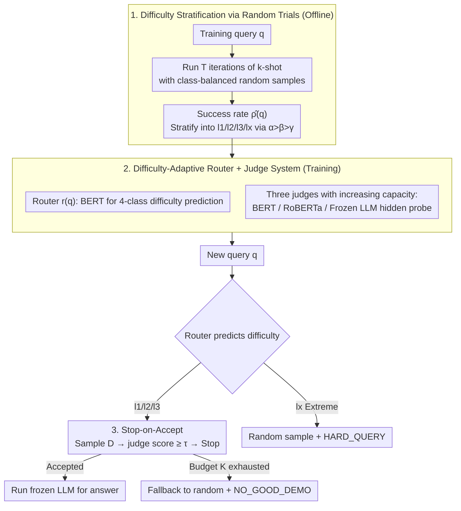

# Easier to Judge Than to Find: Predicting In-Context Learning Success for Demonstration Selection

**Conference**: ICML 2026  
**arXiv**: [2605.18512](https://arxiv.org/abs/2605.18512)  
**Code**: To be confirmed  
**Area**: LLM / NLP  
**Keywords**: In-Context Learning, Demonstration Selection, Success Rate Prediction, Difficulty Stratification, Inference Budget  

## TL;DR
This paper reframes ICL demonstration selection from "searching for the optimal $D^\star$ in a vast combinatorial space" to "judging whether a sampled $(q,D)$ pair will succeed." It proposes DiSP—a framework that stratifies queries by difficulty and employs lightweight judge models for "sample-and-judge" with early stopping. DiSP achieves up to a 3.4% improvement over strong baselines on five classification benchmarks while reducing end-to-end real-time latency by up to 23×.

## Background & Motivation

**Background**: The ICL performance of Large Language Models (LLMs) is extremely sensitive to the specific demonstrations included in the prompt and their ordering. Mainstream approaches model demonstration selection as an "instance-adaptive search" problem—given a query $q$, they select a demonstration set $D^\star$ from a large candidate pool via traditional retrieval (BM25 / kNN), learned retrievers/rankers (Rubin et al., Uprise, Se2, SeDPO), or proxy scoring based on model feedback.

**Limitations of Prior Work**: The candidate space is combinatorially explosive—selecting and ordering $k$ items from $N$ candidates results in $\binom{N}{k}k!$ combinations, making exhaustive LLM evaluation infeasible. Even when using proxy scores to prune the candidate set, reliable search still requires running the LLM on multiple candidates for verification; however, "running LLM verification" is the very overhead these methods seek to minimize, leading to a self-contradiction. Furthermore, proxy signals are often unreliable: semantically similar demonstrations do not guarantee LLM correctness, and the same demonstration performs differently under various queries.

**Key Challenge**: The search paradigm assumes "finding the optimal $D^\star$ is the goal," but finding the optimum in a combinatorial space is too expensive. Moreover, the "compute budget required for selection" varies significantly across queries—simple queries may succeed with any demonstration, while difficult queries may remain unsolved regardless of compute expenditure. A uniform search strategy is inherently resource-inefficient.

**Goal**: To replace the expensive search for the "optimal demonstration" with a significantly cheaper binary classification problem—predicting if a sampled demonstration is "good enough"—while adaptively allocating compute budgets based on query difficulty.

**Key Insight**: The core observation is that "discrimination is easier than generation"—predicting if ICL will succeed given a $(q, D)$ pair is much simpler than searching for the optimal $D^\star$ from scratch. If a lightweight judge $g(q,D)$ can estimate $P(s(q,D)=1\mid q, D)$ at minimal cost, a "sample-and-judge" workflow can be implemented: sample candidates from a random proposal, have the judge score them sequentially, and stop at the first acceptable one.

**Core Idea**: DiSP (Difficulty-Stratified Success Prediction) = Estimating success rates for each training query via random trials → Stratifying queries into four difficulty levels → Training a router to predict difficulty and three level-specific judges of varying capacities → Allocating sampling budgets by difficulty during inference, stopping upon acceptance, and falling back to random samples with risk labels for unresolvable queries.

## Method

### Overall Architecture
DiSP replaces the combinatorial search for $D^\star$ with an initial difficulty assessment followed by sequential judging of random samples. It consists of three stages: Offline, success rates for training queries are estimated via random trials to stratify them into four levels; Then, a difficulty-predicting router and three judges with increasing capacities are trained; During inference, the router assigns a new query to a level, and the corresponding judge sequentially evaluates samples, stopping at the first success to run the target LLM. If the budget is exhausted or the query is too hard, it falls back to a random demonstration with a risk label. The target LLM remains frozen throughout.

### Key Designs

**1. Stratification via Random Trials: Letting Queries Decide Their Own Compute Budget**

Prior methods treat all queries equally, wasting search compute on "trivial" queries (correct regardless of demonstrations) or "impossible" queries (incorrect regardless of effort). DiSP stratifies queries by fixed **class-balanced** random proposals ($k=|\mathcal{Y}|$, one random example per class in shuffled order). For each training query $q$, $T$ random $k$-shot contexts are executed to obtain success indicators $s(q,D_t)=\mathbb{I}[\hat{y}(q,D_t)=y^\star]$, yielding the empirical success rate $\hat{\rho}(q)=\frac{1}{T}\sum_t s(q,D_t)$. Queries are categorized by thresholds $\alpha>\beta>\gamma$ into $l_1$ (Easy, $\hat{\rho}\geq\alpha$), $l_2$ (Medium), $l_3$ (Vulnerable), and $l_x$ (Hard, $\hat{\rho}<\gamma$). The rationale is that the probability of at least one success in $K$ trials is $1-(1-\hat{\rho}(q))^K$; smaller $\hat{\rho}$ necessitates more sampling. By isolating $l_1$ and $l_x$ for "one-shot random + risk label" handling, compute is concentrated on $l_2/l_3$ queries that actually benefit from selection.

**2. Difficulty-Adaptive Router + Judge: Replacing Retrieval with Discrimination**

This design implements the principle that judging is easier than finding. Instead of training a task-specific retriever that maps $q$ to a demonstration set, DiSP trains binary classifiers to judge whether a given $(q,D)$ will lead to success. The router $r(q)$ uses BERT-base (~110M) for 4-class difficulty prediction. Three judges estimate success probability $g_\ell(q,D)\approx P(s(q,D)=1\mid q,D)$, with capacities increasing by level: $g_{l_1}$ uses BERT-base, $g_{l_2}$ uses RoBERTa-Large (~330M), and only $g_{l_3}$ employs a lightweight classification head atop the frozen target LLM’s hidden representations. This follows the principle of "expensive features only when necessary." Probing experiments confirm that successful and failed $(q,D)$ pairs are highly separable in LLM hidden space, justifying the use of small classifiers over large retrievers.

**3. Stop-on-Accept Feasibility Testing: From Ranking to Acceptance**

Converting demonstration selection from "ranking" to "feasibility testing" is the key to compute efficiency—ranking requires evaluating all candidates, whereas feasibility testing stops at the first acceptable one. For a query routed to $\hat{\ell}\in\{l_1,l_2,l_3\}$, samples $D_i\sim\mathcal{P}_{\text{rand}}$ are drawn and scored by $g_{\hat{\ell}}(q,D_i)$. Once $g_{\hat{\ell}}(q,D_i)\geq\tau_{\hat{\ell}}$, it is immediately accepted. If the budget $K_{\hat{\ell}}$ is exhausted (where $K_{l_1}<K_{l_2}<K_{l_3}$), the system falls back to a random demonstration with a `NO_GOOD_DEMO` label. Queries routed to $l_x$ skip judging and are labeled `HARD_QUERY`. This provides a formal guarantee: if the judge error is bounded, the true success probability of an accepted sample is at least $\tau_{\hat{\ell}}$. The budget $K_\ell$ serves as a precision-cost "knob," while risk labels offer clear "abstention" signals for downstream systems.

### Loss & Training
The router is trained on $\mathcal{D}_{\text{route}}=\{(q,\ell(q))\}$ using 4-class cross-entropy. The three judges are trained on $\mathcal{D}_{l_j}=\{((q,D),s(q,D)):\ell(q)=l_j\}$ using binary cross-entropy. The target LLM is frozen throughout. All thresholds $\tau_\ell$ and budgets $K_\ell$ are inference-time hyperparameters that can be selected along a cost-accuracy curve on a validation set.

## Key Experimental Results

### Main Results
Performance comparison on 5 classification benchmarks (TREC, SST-2, SST-5, AGNews, MNLI) using LLaMA3-8B and Qwen2.5-7B. Results are the mean of 6 independent runs selecting one context per query.

| Method (LLaMA3-8B) | TREC | SST-2 | SST-5 | AGNews | MNLI | Average |
|------------------|------|-------|-------|--------|------|------|
| Zero-shot | 70.5 | 94.7 | 41.7 | 72.9 | 52.3 | 66.4 |
| Random (Single) | 73.8 | 94.9 | 46.6 | 84.1 | 66.9 | 73.3 |
| BM25 | 75.2 | 94.7 | 52.3 | 86.1 | 65.6 | 74.8 |
| Uprise | 75.8 | 94.0 | 48.3 | 90.7 | 58.9 | 73.6 |
| Se2 | 68.2 | 93.4 | 51.7 | 86.1 | 60.9 | 72.1 |
| SeDPO | 67.5 | 93.4 | 47.0 | 88.1 | 61.6 | 71.5 |
| **DiSP (Ours)** | **79.2** | **95.4** | **54.3** | 89.7 | **69.5** | **77.6** |

On Qwen2.5-7B, DiSP averages 82.9%, 2.4% higher than the strongest baseline (BM25 80.5%) and 13.1% higher than zero-shot. Gains are most significant on difficult tasks like TREC and MNLI.

### Ablation Study
End-to-end wall-clock cost (Average across 5 datasets):

| Phase | Uprise | Se2 | SeDPO | DiSP |
|------|--------|-----|-------|------|
| Training (min) | 13.4 | 114.9 | 157.1 | **6.7** |
| Testing (min) | 0.4 | 0.6 | 0.6 | **0.1** |
| Total (min) | 13.8 | 115.4 | 157.6 | **6.8** |
| Gain (vs DiSP) | 2.0× | 17.0× | 23.2× | 1.0× |

### Key Findings
- DiSP is simultaneously the most accurate and the most efficient across five classification tasks, breaking the "precision-efficiency trade-off." This validates the "judging is easier than finding" principle.
- The 23× training speedup stems from avoiding task-specific retriever training; the 6× testing speedup comes from "stop-on-accept" logic and lightweight judges.
- Hidden state probing shows that successful/failed $(q, D)$ pairs are structurally separable, indicating that ICL failure modes leave detectable signals.
- The use of the $l_x$ category introduces an "abstention" semantics. `HARD_QUERY` and `NO_GOOD_DEMO` provide clear triggers for downstream handling (human audit or external retrieval).

## Highlights & Insights
- The "judging is easier than finding" insight is potentially universal, applicable to RL, code generation, and tool use where evaluating a solution is cheaper than generating one.
- Stratified compute allocation is more realistic for production, where a distribution typically includes many simple and few "long-tail" hard queries.
- Using random proposals instead of learned retrievers keeps the framework data-agnostic and simplifies engineering.
- The combination of stop-on-accept, explicit budgets, and risk labels makes the system highly tunable and interpretable for deployment.

## Limitations & Future Work
- Verification is limited to **classification** tasks. Success indicators $s(q, D) = \mathbb{I}[\hat{y} = y^\star]$ require re-designing for open-ended generation (QA, summarization) where hard labels do not exist.
- Estimating $\hat{\rho}(q)$ requires $T$ LLM runs per training query, incurring a non-trivial offline cost during initial deployment.
- Thresholds $(\alpha, \beta, \gamma)$ and $\tau_\ell$ are manual hyperparameters that may require re-tuning for different LLMs or tasks.
- If the random proposal distribution differs significantly from the test distribution (OOD), success rate estimation and routing may degrade.

## Related Work & Insights
- **vs Rubin et al. (EPR), Uprise, SeDPO**: These methods train task-specific retrievers to find optimal sets. DiSP reverses the direction—judging a given context—replacing ranking with "stop-on-accept" feasibility testing.
- **vs Batch-ICL**: While Batch-ICL addresses order sensitivity, DiSP decouples selection from judgment; the two are orthogonal and can be combined.
- **vs Model Cascade/Routing**: Traditional routing selects model scales; DiSP selects the scale of **auxiliary judges** based on input difficulty.
- **vs Conformal Prediction**: DiSP complements uncertainty quantification by providing actionable abstention semantics via risk labels.

## Rating
- Novelty: ⭐⭐⭐⭐ The perspective of "discrimination vs. generation" in ICL selection is systematically implemented for the first time.
- Experimental Thoroughness: ⭐⭐⭐ Validated on 5 classification benchmarks across 2 LLMs, though lacks evaluation on open-ended generation or direct comparison with prompt optimization (e.g., DSPy).
- Writing Quality: ⭐⭐⭐⭐ Clear three-stage framework and formal guarantees in the appendix.
- Value: ⭐⭐⭐⭐ The combination of 23× speedup and accuracy gains is highly attractive for production deployment.

<!-- RELATED:START -->

## Related Papers

- [\[ICLR 2026\] LLMs Encode Their Failures: Predicting Success from Pre-Generation Activations](../../ICLR2026/model_compression/llms_encode_their_failures_predicting_success_from_pre-generation_activations.md)
- [\[ICML 2026\] Images as Tables: In-Context Learning with TabPFN for Low-Data Detection of AI-Generated Images](images_as_tables_in-context_learning_with_tabpfn_for_low-data_detection_of_ai-ge.md)
- [\[ICML 2026\] Token Sparse Attention: Efficient Long-Context Inference with Interleaved Token Selection](token_sparse_attention_efficient_long-context_inference_with_interleaved_token_s.md)
- [\[AAAI 2026\] Predicting the Future by Retrieving the Past](../../AAAI2026/model_compression/predicting_the_future_by_retrieving_the_past.md)
- [\[ICML 2026\] Provably Learning Attention with Queries](provably_learning_attention_with_queries.md)

<!-- RELATED:END -->
