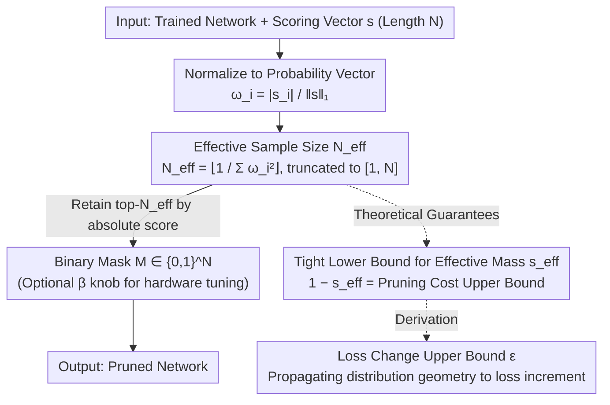

# Effective Model Pruning: Measure the Redundancy of Model Components

**Conference**: ICML 2026 Spotlight  
**arXiv**: [2509.25606](https://arxiv.org/abs/2509.25606)  
**Code**: https://github.com/noMushroomw/Effective-model-pruning  
**Area**: Model Compression  
**Keywords**: Model Pruning, Effective Sample Size, Inverse Simpson Index, Adaptive Sparsity, General Threshold  

## TL;DR
Ours borrows the concept of "effective sample size" from particle filtering to map any scoring vector directly to an adaptive retention count $N_{\text{eff}} = \lfloor 1/\sum_i \omega_i^2 \rfloor$ as a pruning threshold. This approach avoids manual sparsity setting and provides a theoretical upper bound on the loss change before and after pruning.

## Background & Motivation

**Background**: Neural network pruning has formed a rich spectrum of methods categorized across three dimensions: "what to prune" (unstructured weights / structured channels / attention heads), "when to prune" (pre-training / during training / post-training), and "how to score" (magnitude, sensitivity, data-driven metrics). However, most methods still require manual determination of the number of components to retain after obtaining a scoring vector $s$.

**Limitations of Prior Work**: The choice of sparsity is extremely sensitive—overly aggressive pruning causes immediate performance drops, while overly conservative pruning wastes efficiency gains. Current practices either involve costly iterative pruning (e.g., Lottery Ticket Hypothesis), manual per-layer budget setting, or treating sparsity as a hyperparameter requiring meticulous tuning (e.g., SparseGPT and Wanda require a pre-specified global sparsity rate). For Large Language Models (LLMs), this tuning cost becomes prohibitive.

**Key Challenge**: The "scoring" and "quantification" of pruning are often tethered together in discussions, but they are independent problems. Existing methods constantly compete on new scoring metrics while defaulting to user-defined quantities; the scoring distribution itself contains unused information regarding "how many elements are truly significant."

**Goal**: Design a general threshold rule that is **independent of scoring criteria and network architecture**. The aim is to decouple "how many components to retain" from hyperparameters, determining it directly from the scoring distribution while providing a provable upper bound on loss variation.

**Key Insight**: A similar problem exists in particle filtering—given a set of weighted particles, how to determine "how many particles are statistically effective." The answer is the effective sample size $N_{\text{eff}} = 1/\sum_i \omega_i^2$, known in ecology as the Inverse Simpson Diversity Index, which is directly related to Rényi entropy. By normalizing the scoring vector into a probability distribution, this value naturally reflects "scoring concentration": higher concentration implies dominance by a few components allowing more pruning, while a uniform distribution suggests equal contribution, allowing almost no pruning.

**Core Idea**: Normalize any scoring vector $s$ to $\omega_i = |s_i|/\|s\|_1$ and retain the top $N_{\text{eff}} = \lfloor 1/\sum_i \omega_i^2 \rfloor$ components while pruning the rest. This provides a unified, tuning-free threshold across architectures and criteria.

## Method

### Overall Architecture
EMP (Effective Model Pruning) addresses the long-neglected half of pruning: while scoring criteria are highly developed, the number of components to retain remains arbitrary. Ours proposes a general rule based solely on the shape of the scoring distribution—Input: a trained network and scoring vector $s \in \mathbb{R}^N$; Output: a binary mask $M \in \{0,1\}^N$. The pipeline consists of three steps: normalize absolute scores by the $\ell_1$ norm into a probability vector $\omega_i = |s_i|/\|s\|_1$, calculate $N_{\text{eff}}$ truncated to $[1, N]$, and set indices for the top-$N_{\text{eff}}$ elements of $|s|$ to 1. The complexity is $O(N\log N)$ due to sorting. An optional deployment knob $\beta \in [0.5, 2]$ is provided for hardware-specific sparsity requirements to adjust retention to $\beta N_{\text{eff}}$. The distribution $\omega$ is also used to derive analytical upper bounds for "pruning cost" and "loss change" based on distribution geometry.

### Key Designs

**1. Effective Sample Size $N_{\text{eff}}$: Letting the distribution determine sparsity**

Prior methods like SparseGPT or Wanda require manual global sparsity rates. Ours derives this hyperparameter from the distribution: $N_{\text{eff}} \triangleq \lfloor 1/\sum_i \omega_i^2 \rfloor$. Geometrically, this is the inverse of the squared distance from $\omega$ to the simplex centroid $\zeta_{[N]}$. A uniform distribution ($N_{\text{eff}} \to N$) allows no pruning, while a distribution concentrated on a single point ($N_{\text{eff}} \to 1$) allows maximum pruning. Ours proves that $A_\nu = \tilde{\Delta} \cap (B_\nu - B_{\nu+1})$ partitions the simplex into shells, each corresponding to a fixed $N_{\text{eff}}$. This is useful because it is architecture-agnostic, adaptive to dimension $N$, and invariant to coordinate permutation.

**2. Tight Lower Bound of Effective Mass $s_{\text{eff}}$: Measuring the "weight" of pruned elements**

Ours quantifies the importance of pruned elements using the retained normalized mass $s_{\text{eff}} = \sum_{i=1}^{N_{\text{eff}}} \omega_{(i)}$. The pruning cost is $1 - s_{\text{eff}}$. While a general relaxation yields a trivial $s_{\text{eff}} \geq N_{\text{eff}}/N$, ours constructs a minimum point $p_\nu = \zeta_{[N]} + \frac{r_{\nu+1}}{r_1}(\zeta_{[1]} - \zeta_{[N]})$ on $A_\nu$ to find the tight bound:

$$1 - s_{\text{eff}} \leq \frac{N-N_{\text{eff}}}{N}\left(1 - \sqrt{\frac{N-N_{\text{eff}}-1}{(N_{\text{eff}}+1)(N-1)}}\right),$$

asymptotically approximated as $\frac{N-N_{\text{eff}}}{N}\big(1 - \sqrt{(N-N_{\text{eff}})/(N N_{\text{eff}})}\big)$. This bound allows estimating the pruning cost bound based solely on the scoring distribution shape.

**3. Loss Change $\epsilon$ Propagation: From geometry to loss increments**

For the magnitude criterion, pruning introduces a loss difference $\epsilon = |L(\theta^*) - L(\theta^k)|$. Using a lemma from Zhang et al. (2023), ours derives $\epsilon \leq \frac{1-\rho}{2N\rho}\mathrm{Tr}(H)\|\theta^* - \theta^{N_{\text{eff}}}\|_2^2$. Combined with the tight bound on parameter distance $\|\theta^* - \theta^{N_{\text{eff}}}\|^2 \leq \|\theta^*\|_1^2 (1-s_{\text{eff}})^2 (N - N_{\text{eff}})$, an analytical bound depending only on $\rho$ and $N$ is obtained:

$$\epsilon \lesssim \|\theta^*\|_1^2\, \mathrm{Tr}(H)\, \frac{(1-\rho)^4}{2\rho}\left(1 - \sqrt{\frac{1-\rho}{N\rho}}\right)^2.$$

This identifies that for $N=1000$ and $\rho > 0.2$, the bound approaches 0, implying minimal loss increment if $N_{\text{eff}}$ is within a reasonable range.

### Loss & Training
EMP is a **pure post-training** rule. It does not modify training objectives or require fine-tuning. Experiments intentionally omit fine-tuning to isolate the effect of the threshold. The $\beta$ knob serves hardware deployment; $\beta = 1$ consistently acts as the watershed between lossless and performance-degrading pruning.

## Key Experimental Results

### Main Results
EMP was tested with magnitude pruning across FC, CNN, Transformer, KAN, and LLM architectures without any fine-tuning.

| Dataset | Model | Sparsity (%) | Dense Loss | EMP Loss | $\epsilon$ |
|---------|-------|--------------|------------|----------|------------|
| CIFAR10 | FC12 | 42.89 | 1.5123 | 1.4454 | 0.0669 |
| CIFAR10 | AlexNet | 62.22 | 0.4664 | 0.4286 | 0.0378 |
| CIFAR10 | VGG16 | 59.47 | 0.4234 | 0.3184 | 0.1050 |
| CIFAR100 | ResNet18 | 56.20 | 0.8740 | 0.9287 | 0.0547 |
| CIFAR100 | ResNet50 | 54.74 | 0.8586 | 0.8387 | 0.0199 |
| TinyImageNet | ResNet50 | 48.10 | 2.0213 | 1.9853 | 0.0360 |

For LLMs, average performance across 7 zero-shot tasks (LLaMA and LLaMA-2):

| Method | Avg. Sparsity (%) | Avg. $\Delta$PPL | Avg. $\Delta$Acc (%) |
|--------|-------------------|------------------|----------------------|
| Wanda (Fixed) | 50.00 | +0.799 | -1.40 |
| Magnitude (Fixed) | 50.00 | +2.982 | -2.60 |
| EMP-Wanda | 40.47 | +0.678 | -1.37 |
| EMP-Magnitude | 36.63 | +0.752 | -0.93 |

### Ablation Study
$\beta$ sensitivity was verified by scanning $\beta \in \{0.5, 0.75, 1, 1.25, 1.5, 2\}$.

| $\beta$ Setting | Behavior | Explanation |
|-----------------|----------|-------------|
| $\beta < 1$ | Sharp performance drop | Pruning exceeds $N_{\text{eff}}$, removing critical components |
| $\beta = 1$ | Inflection point | Precisely at the "lossless $\to$ drop" threshold across architectures |
| $\beta > 1$ | Plateauing performance | Retaining more components yields no significant gain |

### Key Findings
- $\beta = 1$ **consistently** identifies the pruning threshold across FC, CNN, Transformer, and LLM, suggesting $N_{\text{eff}}$ captures an intrinsic, architecture-independent sparsity.
- Different criteria yield different $N_{\text{eff}}$ for the same model, making $N_{\text{eff}}$ a **metric for evaluating scoring quality**—better criteria result in more concentrated distributions (smaller $N_{\text{eff}}$).
- Magnitude pruning failure in LLMs at 50% is largely due to rigid global budgets; with EMP's adaptive threshold, magnitude pruning performs comparably to Wanda.

## Highlights & Insights
- Entirely decouples "how much to retain" from hyperparameters, saving grid search costs in the LLM era.
- Defines pruning cost via distribution geometry. The "distribution as budget" philosophy can extend to MoE expert activation, attention sparsification, etc.
- Provides a new scale for assessing pruning criteria. Instead of comparing accuracy at fixed sparsity, criteria can be compared based on the $N_{\text{eff}}$ they produce.
- Potential as a deterministic hard gating mechanism for attention, potentially alleviating attention sink phenomena.

## Limitations & Future Work
- The $\epsilon$ bound derivation is strictly valid for magnitude pruning; extensions to general differentiable scores are needed.
- $N_{\text{eff}}$ acts as a local threshold within layers, lacking global coordination for cross-layer importance.
- Skipping fine-tuning entirely results in performance drops at high sparsity (>50%); integration with local reconstruction methods like SparseGPT is needed.

## Related Work & Insights
- **vs Lottery Ticket**: LTH finds subnets via iterative retraining; EMP provides a threshold once without retraining.
- **vs SparseGPT/Wanda**: These require pre-specified sparsity; EMP derives it from the distribution. EMP-Wanda achieves better PPL at lower sparsity, proving the value of adaptive rates.
- **vs OBD/OBS**: Classical second-order methods guarantee local optimality via Hessian estimates; EMP offers global thresholds with provable error bounds using only first-order or zero-order scores.

## Rating
- Novelty: ⭐⭐⭐⭐⭐ Introducing $N_{\text{eff}}$ and geometric bounds to pruning is a strong cross-disciplinary contribution.
- Experimental Thoroughness: ⭐⭐⭐⭐ Coverage of five major architectures and four criteria is broad, though direct comparison with some recent LLM pruners (ShortGPT) is missing.
- Writing Quality: ⭐⭐⭐⭐ Clear mathematical and geometric intuition, though notation is dense.
- Value: ⭐⭐⭐⭐⭐ High practical value as it solves the "sparsity choice" pain point with a 5-line implementation.

<!-- RELATED:START -->

## Related Papers

- [\[ICML 2026\] Continual Model Routing in Evolving Model Hubs](continual_model_routing_in_evolving_model_hubs.md)
- [\[NeurIPS 2025\] Towards Effective Federated Graph Foundation Model via Mitigating Knowledge Entanglement](../../NeurIPS2025/model_compression/towards_effective_federated_graph_foundation_model_via_mitigating_knowledge_enta.md)
- [\[ICLR 2026\] AdaRank: Adaptive Rank Pruning for Enhanced Model Merging](../../ICLR2026/model_compression/adarank_adaptive_rank_pruning_for_enhanced_model_merging.md)
- [\[ICML 2026\] Saliency-Aware Model Merging](saliency-aware_model_merging.md)
- [\[ICML 2026\] Decouple Searching from Training: Scaling Data Mixing via Model Merging for Large Language Model Pre-training](decouple_searching_from_training_scaling_data_mixing_via_model_merging_for_large.md)

<!-- RELATED:END -->
