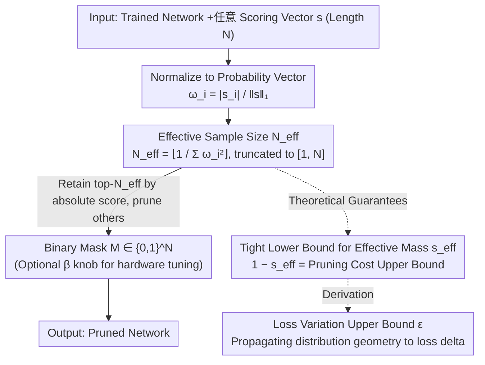

# Effective Model Pruning: Measure the Redundancy of Model Components

**Conference**: ICML 2026 Spotlight  
**arXiv**: [2509.25606](https://arxiv.org/abs/2509.25606)  
**Code**: https://github.com/noMushroomw/Effective-model-pruning  
**Area**: Model Compression  
**Keywords**: Model Pruning, Effective Sample Size, Inverse Simpson Index, Adaptive Sparsity, Universal Threshold  

## TL;DR
This paper borrows the concept of "effective sample size" from particle filtering to directly map any scoring vector to an adaptive retention count $N_{\text{eff}} = \lfloor 1/\sum_i \omega_i^2 \rfloor$. This serves as a pruning threshold that avoids manual sparsity settings and provides a theoretical upper bound for loss variation before and after pruning.

## Background & Motivation

**Background**: Neural network pruning has formed a diverse spectrum of methods, categorizable by "what to prune" (unstructured weights / structured channels / attention heads), "when to prune" (pre-training / during training / post-training), and "how to score" (magnitude, sensitivity, data-driven metrics). However, the vast majority of methods still require manual intervention to decide how many components to retain after obtaining a scoring vector $s$.

**Limitations of Prior Work**: The choice of sparsity is extremely sensitive—being too aggressive causes immediate performance drops, while being too conservative wastes efficiency gains. Current practices involve either costly iterative pruning (such as Lottery Ticket retraining), manual per-layer budget setting, or treating sparsity as a hyperparameter requiring fine-tuning (e.g., SparseGPT and Wanda require a pre-specified global sparsity rate). At the scale of Large Language Models (LLMs), this tuning cost becomes prohibitive.

**Key Challenge**: The "scoring" and "quantification" of pruning are discussed as a bundled entity, yet they are independent problems. Existing methods constantly compete on new scoring metrics but default to letting users "guess" the quantity; meanwhile, the score distribution itself already carries information regarding "how many elements are truly significant," which remains underutilized.

**Goal**: Design a universal threshold rule that is **agnostic to scoring criteria and network architecture**. This rule aims to decouple "how many components to retain" from hyperparameters, determining it directly from the score distribution while providing a provable upper bound on loss variation.

**Key Insight**: The authors notice a similar problem in particle filtering—given a set of weighted particles, how to determine "how many particles are statistically effective." The answer is the effective sample size $N_{\text{eff}} = 1/\sum_i \omega_i^2$, known in ecology as the Inverse Simpson Diversity Index, which is directly linked to Rényi entropy. By normalizing the scoring vector into a probability distribution, this value naturally reflects "score concentration": higher concentration implies dominance by a few components allowing more pruning, while higher uniformity suggests equal contribution, meaning almost nothing can be pruned.

**Core Idea**: Normalize any scoring vector $s$ into $\omega_i = |s_i|/\|s\|_1$ and retain the top $N_{\text{eff}} = \lfloor 1/\sum_i \omega_i^2 \rfloor$ components while pruning the rest—a unified, parameter-free pruning threshold universal across architectures and criteria.

## Method

### Overall Architecture
EMP (Effective Model Pruning) addresses the long-neglected half of pruning: while scoring criteria have become highly sophisticated, the decision of "how many to keep" remains arbitrary. Its solution is a universal rule based solely on the shape of the score distribution, independent of architecture or criteria—inputting a trained network and any scoring vector $s \in \mathbb{R}^N$, and outputting a binary mask $M \in \{0,1\}^N$. The pipeline consists of three steps: first, normalize absolute scores by the $\ell_1$ norm into a probability vector $\omega_i = |s_i|/\|s\|_1$; second, calculate an "effective sample size" $N_{\text{eff}}$ from $\omega$ and truncate it to $[1,N]$; finally, set the indices of the top-$N_{\text{eff}}$ values in $|s|$ to 1 and prune the rest. The complexity is $O(N\log N)$ (one sorting operation), implementable in five lines of code, with an optional deployment knob $\beta \in [0.5,2]$ to fine-tune the retention count to $\beta N_{\text{eff}}$ for specific hardware requirements. The algorithm follows these core steps, while the resulting distribution $\omega$ is governed by two theoretical branches—deriving analytical upper bounds for "pruning cost" and "loss variation" from the distribution geometry, providing the rule with provable error guarantees.

### Key Designs

**1. Effective Sample Size $N_{\text{eff}}$: Letting the distribution determine the pruning rate**

The pain point is direct—methods like SparseGPT and Wanda require a pre-specified global sparsity. EMP derives this hyperparameter from the distribution: defining $N_{\text{eff}} \triangleq \lfloor 1/\sum_i \omega_i^2 \rfloor$, which is the effective sample size used in particle filtering to judge statistical effectiveness. Geometrically, it equals the reciprocal of the squared distance from $\omega$ to the simplex centroid $\zeta_{[N]}$. More uniform distributions are closer to the centroid ($N_{\text{eff}} \to N$), whereas sharper distributions approaching a single point result in $N_{\text{eff}} \to 1$. The authors prove that $A_\nu = \tilde{\Delta} \cap (B_\nu - B_{\nu+1})$ partitions the simplex into spherical shells, each corresponding to a fixed $N_{\text{eff}}$. Its effectiveness stems from three properties: it only depends on the score distribution, adapts to dimension $N$, and is invariant to coordinate permutation.

**2. Tight Lower Bound for Effective Mass $s_{\text{eff}}$: Calculating "pruned importance" from distribution shape**

Knowing how many to keep is insufficient; one must manage the importance of the pruned portion. The authors characterize this using the retained normalized mass $s_{\text{eff}} = \sum_{i=1}^{N_{\text{eff}}} \omega_{(i)}$, where $1 - s_{\text{eff}}$ is the direct measure of pruning cost. The problem translates to finding the infimum of $\varphi_\nu(\omega) = \sum_{i=1}^{\nu}\omega_i$ on $A_\nu$. By constructing the minimum point $p_\nu = \zeta_{[N]} + \frac{r_{\nu+1}}{r_1}(\zeta_{[1]} - \zeta_{[N]})$, they prove it is the global minimum of $\varphi_\nu$ on $A_\nu$, yielding the tight bound:

$$1 - s_{\text{eff}} \leq \frac{N-N_{\text{eff}}}{N}\left(1 - \sqrt{\frac{N-N_{\text{eff}}-1}{(N_{\text{eff}}+1)(N-1)}}\right),$$

asymptotically approximating $\frac{N-N_{\text{eff}}}{N}\big(1 - \sqrt{(N-N_{\text{eff}})/(N N_{\text{eff}})}\big)$. This tight bound allows for a theoretical upper limit on pruning cost based solely on distribution shape without experiments.

**3. Propagation of Loss Change $\epsilon$ Upper Bound: From distribution geometry to loss increment**

The third step converts "mass" into the actual loss delta. When the scoring criterion is the parameter magnitude, the loss difference introduced by pruning is $\epsilon = |L(\theta^*) - L(\theta^k)|$. Using a lemma from Zhang et al. 2023, the authors solve for $\epsilon \leq \frac{1-\rho}{2N\rho}\mathrm{Tr}(H)\|\theta^* - \theta^{N_{\text{eff}}}\|_2^2$. By applying the tight bound of parameter distance $\|\theta^* - \theta^{N_{\text{eff}}}\|^2 \leq \|\theta^*\|_1^2 (1-s_{\text{eff}})^2 (N - N_{\text{eff}})$, they arrive at an analytical upper bound depending only on $\rho$ and $N$:

$$\epsilon \lesssim \|\theta^*\|_1^2\, \mathrm{Tr}(H)\, \frac{(1-\rho)^4}{2\rho}\left(1 - \sqrt{\frac{1-\rho}{N\rho}}\right)^2.$$

This chain bridges "distribution geometry" and "pruning cost." In experiments with $N=1000$ and $\rho > 0.2$, the upper bound approaches 0, meaning that if $N_{\text{eff}}$ falls within a reasonable range, the loss increment is theoretically suppressed.

### Loss & Training
EMP is a **purely post-training** rule. it does not modify the training objective or require post-pruning fine-tuning. In experiments, the authors intentionally avoid any fine-tuning to isolate the effect of the threshold itself. The single knob $\beta$ serves only hardware deployment—if the target hardware requires lower sparsity than $N_{\text{eff}}/N$, the retention count is scaled to $\beta N_{\text{eff}}$, with $\beta = 1$ consistently marking the dividing line between "lossless" and "performance drop."

## Key Experimental Results

### Main Results
The authors tested the combination of EMP and magnitude pruning on five architectures: FC, CNN, Transformer, KAN, and LLM, all without fine-tuning.

| Dataset | Model | Sparsity (%) | Dense Loss | EMP Loss | $\epsilon$ |
|--------|------|-----------|------------|----------|------------|
| CIFAR10 | FC12 | 42.89 | 1.5123 | 1.4454 | 0.0669 |
| CIFAR10 | AlexNet | 62.22 | 0.4664 | 0.4286 | 0.0378 |
| CIFAR10 | VGG16 | 59.47 | 0.4234 | 0.3184 | 0.1050 |
| CIFAR100 | ResNet18 | 56.20 | 0.8740 | 0.9287 | 0.0547 |
| CIFAR100 | ResNet50 | 54.74 | 0.8586 | 0.8387 | 0.0199 |
| TinyImageNet | ResNet50 | 48.10 | 2.0213 | 1.9853 | 0.0360 |

Across all architectures, $\epsilon \leq 0.105$, consistent with the theoretical upper bound. LLM zero-shot results (average of 7 tasks) for LLaMA and LLaMA-2:

| Method | Avg Sparsity (%) | Avg $\Delta$PPL | Avg $\Delta$Acc (%) |
|------|---------------|------------------|---------------------|
| Wanda (Fixed) | 50.00 | +0.799 | -1.40 |
| Magnitude (Fixed) | 50.00 | +2.982 | -2.60 |
| EMP-Wanda | 40.47 | +0.678 | -1.37 |
| EMP-Magnitude | 36.63 | +0.752 | -0.93 |

EMP-Magnitude reclaimed performance for magnitude pruning from a "2.6% drop" back to a "0.93% drop," by reducing sparsity from 50% to 36.63%.

### Ablation Study
The robustness of $N_{\text{eff}}$ as a threshold was verified by scanning $\beta \in \{0.5, 0.75, 1, 1.25, 1.5, 2\}$.

| $\beta$ Setting | Behavior | Explanation |
|-------------|------|------|
| $\beta < 1$ | Sharp performance drop | Pruning more than $N_{\text{eff}}$ begins to remove truly significant components |
| $\beta = 1$ | Performance pivot | Consistently located at the "lossless → drop" threshold across all architectures |
| $\beta > 1$ | Plateaued performance | Additional components provide no gain, just less pruning |
| GPT-2 Head Pruning (Taylor) | $N_{\text{eff}} = 141.4$, PPL +1.0% | Head importance is nearly uniform |
| GPT-2 Head Pruning (Weight) | $N_{\text{eff}} = 134.0$, PPL +6.5% | Weight norm criterion is more aggressive |

### Key Findings
- $\beta = 1$ **consistently** identifies the transition point across FC, CNN, Transformer, and LLM, indicating that $N_{\text{eff}}$ captures an architecture-agnostic intrinsic sparsity.
- Different criteria yield different $N_{\text{eff}}$ for the same model, which can serve as a **metric to evaluate scoring quality**—better criteria produce more concentrated distributions with smaller $N_{\text{eff}}$.
- For LLMs, the failure of magnitude pruning at 50% sparsity is primarily due to the "fixed global budget" being too coarse; using EMP's adaptive threshold allows the magnitude criterion to match Wanda's performance.
- EMP applied to RGB pixels (locally on $4\times4$ patches) achieves PSNR 38.3 dB at 32.3% sparsity, proving it works for features, not just parameters.

## Highlights & Insights
- Decouples "how many to keep" from the hyperparameter pool. EMP requires no tuning knobs, saving a dimension in grid searches for LLM pruning experiments.
- Defines pruning cost via distribution geometry. $N_{\text{eff}}$ treats the reciprocal of the distance to the centroid as the "effective dimension." This "distribution as budget" concept can migrate to MoE expert activation, attention sparsification, etc.
- Provides a new metric for scoring criteria. Instead of comparing accuracy at fixed sparsity, one can compare $N_{\text{eff}}$ values; sharper distributions indicate better redundancy identification.
- Inherently compatible with gated attention. EMP acts as a deterministic hard-gate—truncating via top-$N_{\text{eff}}$ effectively creates a parameter-free hard gate, potentially mitigating "attention sink" phenomena.

## Limitations & Future Work
- The $\epsilon$ bound derivation is strictly valid for magnitude criteria; for Wanda and Taylor, it is only experimentally validated and requires theoretical extension to general differentiable scores.
- $N_{\text{eff}}$ is a global threshold (or per-layer global). It lacks cross-layer coordination, potentially leading to sub-optimal allocation between shallow and deep layers.
- Skipping fine-tuning entirely still leads to noticeable drops at high sparsity (>50%) in LLMs, needing combination with SparseGPT-style local reconstruction.
- Systems combining EMP with learned gating or as an initialization for adaptive feature selection remain unexplored.

## Related Work & Insights
- **vs. Lottery Ticket / Iterative Magnitude Pruning**: While LTH finds higher sparsity subnets through multiple retraining rounds, EMP provides a single-shot threshold without retraining, making it suitable for fast deployment.
- **vs. SparseGPT / Wanda**: Both require pre-specified sparsity. EMP derives it from the distribution. EMP-Wanda achieves better PPL with lower sparsity, suggesting "adaptive rate" can be stacked with "good scoring."
- **vs. OBD / OBS**: Classic second-order methods require Hessian estimates for local optimality. EMP provides a global threshold with only first-order or zero-order scores, sacrificing "optimality" for "controllable error."

## Rating
- Novelty: ⭐⭐⭐⭐⭐ Introducing $N_{\text{eff}}$ and geometric bounds to pruning is a true interdisciplinary transfer.
- Experimental Thoroughness: ⭐⭐⭐⭐ Coverage of five architectures and four criteria is strong, though lacks direct comparison with some recent LLM pruners (e.g., ShortGPT).
- Writing Quality: ⭐⭐⭐⭐ Clear mathematical derivations and intuition (simplex shells), though notation is dense.
- Value: ⭐⭐⭐⭐⭐ Highly practical, solving a major pain point with code simple enough to implement in 5 lines.

<!-- RELATED:START -->

## Related Papers

- [\[ICML 2026\] Continual Model Routing in Evolving Model Hubs](continual_model_routing_in_evolving_model_hubs.md)
- [\[ICLR 2026\] AdaRank: Adaptive Rank Pruning for Enhanced Model Merging](../../ICLR2026/model_compression/adarank_adaptive_rank_pruning_for_enhanced_model_merging.md)
- [\[NeurIPS 2025\] Towards Effective Federated Graph Foundation Model via Mitigating Knowledge Entanglement](../../NeurIPS2025/model_compression/towards_effective_federated_graph_foundation_model_via_mitigating_knowledge_enta.md)
- [\[ICML 2026\] Saliency-Aware Model Merging](saliency-aware_model_merging.md)
- [\[ICML 2026\] Decouple Searching from Training: Scaling Data Mixing via Model Merging for Large Language Model Pre-training](decouple_searching_from_training_scaling_data_mixing_via_model_merging_for_large.md)

<!-- RELATED:END -->
