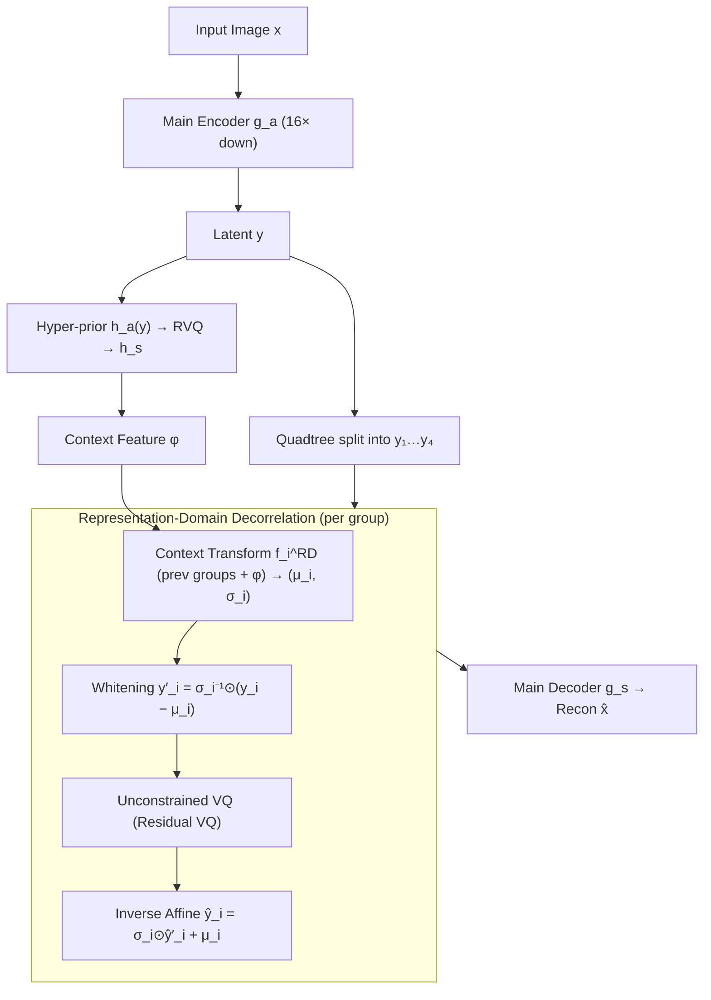

# Efficient Learned Image Compression without Entropy Coding

**Conference**: ICML 2026  
**arXiv**: [2605.23323](https://arxiv.org/abs/2605.23323)  
**Code**: To be confirmed  
**Area**: Model Compression / Learned Image Coding / Generative Compression  
**Keywords**: Learned Image Compression, Entropy-Coding-Free, Vector Quantization, Context Reparameterization, GPU Parallelization  

## TL;DR
EF-LIC replaces the slow and serial entropy coding module in the learned image compression pipeline with a two-step process: "unconstrained vector quantization to maximize index entropy + representation-domain context reparameterization to eliminate latent correlation." It theoretically proves that its R–D performance can approximate entropy-coding schemes, achieving a 67.86% bit-rate saving over MS-ILLM on Kodak/LPIPS while being 10x faster in decoding.

## Background & Motivation

**Background**: Modern learned image compression (LIC) follows the three-stage paradigm of VAE encoder + quantization + entropy coding (Ballé 2018). While performance has surpassed JPEG/VVC, particularly in perceptual metrics where they significantly outperform traditional codecs, entropy coding (rANS) combined with a context model is essential for the "last mile" to eliminate statistical and correlation redundancies.

**Limitations of Prior Work**: Entropy coding (especially rANS) involves complex control flow and is **inherently serial**, requiring execution on the CPU. A single forward pass can spend over 100 ms on entropy coding, more than all other GPU modules combined. Simplifying or removing entropy coding typically leads to immediate performance degradation—COIN uses INR to bypass it but only reaches JPEG levels, and OSCAR uses diffusion but at an exorbitant inference cost.

**Key Challenge**: From an information theory perspective, the end-to-end code length $R \ge H(X)$. Entropy coding exists to make the actual code length approach the entropy lower bound. Once removed, indices must be encoded with a fixed length, forcing the code length to be $\log K^n$. To avoid wasting this upper bound, one **must make the index distribution approach a uniform distribution** (maximum entropy) and ensure there is **no predictable correlation** between adjacent latents—a task that has not been systematically addressed until now.

**Goal**: Construct a completely GPU-friendly LIC framework that **does not call any entropy coding** while maintaining R–D performance comparable to entropy-coding schemes.

**Key Insight**: Redundancy in LIC is split into "statistical" and "correlation" types for separate treatment. The former is addressed using unconstrained VQ to push the index distribution toward maximum entropy, while the latter is "washed away" using representation-domain context affine reparameterization. Both are tensor operators and naturally parallelizable on GPUs.

**Core Idea**: Instead of predicting conditional distributions and sending logits to an entropy coder, it **directly operates in the representation domain**. It uses context-driven $(\bm\mu_i, \bm\sigma_i)$ to perform an affine transformation on the current latent group $\bm y_i$ into a decorrelated space before quantization. Using a sufficiently large VQ codebook theoretically ensures $\Delta H \to 0$.

## Method

### Overall Architecture

EF-LIC aims to remove the slow, serial entropy coding module that is restricted to the CPU without sacrificing R–D performance. The workflow is as follows: an input image $\bm x$ is transformed by the main encoder $g_a$ (downsampling factor $f_y=16$) into latents $\bm y$. A hyper-prior branch $\bm z=h_a(\bm y)$ (downsampling $f_z=64$) is quantized via RVQ to derive context features $\bm\phi=h_s(\hat{\bm z})$. Then, $\bm y$ is split into $N=4$ groups $(\bm y_1, \dots, \bm y_4)$ using a quadtree. Each group is "whitened" into a decorrelated space using context-driven affine parameters before VQ. Finally, the main decoder $g_s$ reconstructs $\hat{\bm x}$. The entire pipeline **contains no entropy encoder/decoder**; all VQ indices are sent as fixed-length codes, and all modules are pure tensor operators that can be completed in a single batch on the GPU.

### Key Designs

**1. Unconstrained VQ: Elevating "Index Maximum Entropy" to a Theorem**

Without entropy coding, indices must use fixed-length coding, where the code length is forced to $n\log K$. Whether this upper bound is wasteful depends on whether the entropy of the index sequence $J$ can reach it—i.e., whether statistical redundancy $\Delta H = \frac{n\log K - H(J)}{n\log K}$ can be reduced to 0. EF-LIC **imposes no rate constraints** during training, using only codebook commitment, codebook updates, and reconstruction loss (L1 + LPIPS + PatchGAN). Proposition 3.1 proves by contradiction that under a fixed-length budget $R = \log K$, any distortion-optimal quantizer $Q^*$ must satisfy $\Delta H = 0$. This explains why the index distribution of VQ-VAE/DAC naturally approaches uniform distribution upon convergence; the paper elevates this empirical phenomenon into a theorem, justifying the removal of entropy coding.

**2. Representation-Domain Decorrelation: Replacing Probability Prediction with Latent Whitening**

In addition to statistical redundancy, there is correlation redundancy between adjacent latent groups. Traditional LIC relies on a context model $f_i^{\text{CM}}$ to predict parameters $(\bm\mu_i, \bm\sigma_i)$ for a conditional distribution, which is then used by the entropy coder. EF-LIC uses the **same pair** of $(\bm\mu_i, \bm\sigma_i) = f_i^{\text{RD}}(\bm\psi_i)$, but instead of using them as probability parameters, it performs affine whitening $\bm y_i' = \bm\sigma_i^{-1} \odot (\bm y_i - \bm\mu_i)$ in the representation domain. Theorem 3.5 guarantees this substitution: for any $\varepsilon \in (0, 1)$, there exists an implementation such that $D_X^{\text{RD}}(R') \le D_X^{\text{CM}}(R)$ under a slightly larger budget $R' = R/(1-\varepsilon)$. This shift makes the pipeline a pure tensor operator, eliminating repeated CPU-GPU transfers.

**3. Residual VQ + Shared Multi-codebook: Single Model covering 5 Bit rates**

To support multi-rate deployment, EF-LIC implements all quantizers as Residual VQ (RVQ), composed of stackable codebooks. During inference, selecting the first $m$ codebooks determines the bit rate. Training averages reconstruction losses for each $m \in \{1, 2, 3, 4, 5\}$ (Eq. 8). Codebook sizes are set as $K_1=1024, K_2=512, K_3=256, K_4=128, K_{\bm z}=1024$, naturally forming a coarse-to-fine rate gradient without additional parameters.

### Loss & Training

$$\mathcal{L}=\frac{1}{|\mathcal{M}|}\sum_{m\in\mathcal{M}}\big(\|\bm x-\hat{\bm x}_m\|_1+\lambda_{\text{per}}\mathcal{L}_{\text{per}}+\lambda_{\text{adv}}\mathcal{L}_{\text{adv}}+\lambda_{\text{cb}}\mathcal{L}_{\text{cb}}^m\big)$$

Where $\mathcal{L}_{\text{per}}$ uses VGG-LPIPS, $\mathcal{L}_{\text{adv}}$ uses adaptive PatchGAN, and $\mathcal{L}_{\text{cb}}$ is the VQ-VAE commitment and codebook update loss. The model was trained on a 1% subset of ImageNet with $256 \times 256$ random crops using Adam $(\beta_1, \beta_2) = (0.5, 0.9)$, batch size 16, for 2M iterations.

## Key Experimental Results

### Main Results (BD-rate vs. MS-ILLM, LPIPS, lower is better)

| Method | Enc. (ms) | Dec. (ms) | Params (M) | Kodak | DIV2K |
|------|-----------|-----------|------------|--------|--------|
| VVC (VTM-23.10) | >9999 | 150.30 | — | +313.84% | +285.10% |
| HiFiC | 526.51 | 1408.60 | 181.6 | +45.82% | +46.36% |
| MS-ILLM | 165.38 | 147.79 | 181.4 | 0.00% | 0.00% |
| DiffEIC | 210.18 | 4661.74 | 1379.5 | −37.71% | −15.76% |
| OSCAR (diffusion, no EC) | 53.04 | 167.56 | 1009.3 | −37.31% | −14.51% |
| RDEIC | 157.25 | 426.68 | 1380.3 | −52.08% | −35.70% |
| **EF-LIC-s** | **9.94** | **6.26** | **11.51** | −55.38% | −47.36% |
| **EF-LIC** | **17.62** | **13.72** | **35.74** | **−67.86%** | **−62.33%** |

### Ablation Study (Kodak / LPIPS / 1M iter)

| Configuration | BD-rate | ΔFLOPs | Enc. (ms) | Dec. (ms) |
|------|---------|--------|-----------|-----------|
| VQ baseline (no decorr) | 0.00% | 0.00% | 5.51 | 7.06 |
| VQ + EC | −14.73% | +4.30% | 362.07 | 300.83 |
| UQ + EC (typical LIC) | −20.73% | +7.53% | 63.12 | 71.72 |
| **EF-LIC** | **−22.20%** | +7.54% | 17.62 | **13.72** |

### Key Findings
- **EF-LIC's R–D even slightly outperforms its entropy-coded variant UQ+EC** (−22.20% vs −20.73%), while being 3.6x faster in encoding and 5.2x faster in decoding.
- **Entropy coding is the latency bottleneck**: In the VQ+EC setup, the entropy coding module accounts for 96.7% of the total decoding time.
- **Representation-domain reparameterization contributes 22.2% BD-rate**: Adding the RD module to the VQ baseline alone achieves savings equivalent to UQ+EC, proving that affine whitening and probability-domain context modeling are equally effective.

## Highlights & Insights
- **Theoretically removing the "essential" entropy coding module**: Previously, the industry assumed "no entropy coding = poor performance." This paper provides a proof that with large enough codebooks and sufficient training, fixed-length VQ index rates can losslessy approach entropy-coding lower bounds.
- **Elegant duality between Probability and Representation Domains**: Traditional models use parameters as likelihoods; EF-LIC uses them as whitening parameters. This "transforming probability modeling into representation transformation" concept can be transferred to audio/video codecs.
- **Small models beating Diffusion models**: With only 35.7M parameters, EF-LIC crushes RDEIC (1380M) and OSCAR (1009M), indicating that removing the entropy coding bottleneck allows for better allocation of the design budget to the main codec instead of heavy generators.

## Limitations & Future Work
- The evaluation focuses heavily on **perceptual metrics (LPIPS/DISTS)**; performance on PSNR/MS-SSIM is not prioritized, which may limit its advantage in medical or scientific imaging.
- Theorem 3.5 depends on having "large $K$ and sufficient expressive power," leaving the practical gap in smaller codebooks or limited transformer layers less quantified.
- Index collapse or dead codebook issues in VQ are known engineering risks not deeply discussed.
- Potential performance in higher-dimensional latents such as **video or audio** needs further verification.

## Related Work & Insights
- **vs MS-ILLM / HiFiC**: Conventional generative LIC relies on entropy coding; EF-LIC achieves >50% better BD-rate while removing EC.
- **vs OSCAR / DiffEIC**: Diffusion-based methods bypass entropy coding but are 100x–1000x slower due to the iterative process or INR usage.
- **vs Control-GIC**: Previous VQ-GAN LICs ignored latent correlations; EF-LIC's RD module proves that decorrelation yields a 22.2% gain.

## Rating
- Novelty: ⭐⭐⭐⭐⭐ 
- Experimental Thoroughness: ⭐⭐⭐⭐⭐ 
- Writing Quality: ⭐⭐⭐⭐⭐ 
- Value: ⭐⭐⭐⭐⭐

## Related Papers

- [\[ICML 2026\] Float8@2bits: Entropy Coding Enables Data-Free Model Compression](float82bits_entropy_coding_enables_data-free_model_compression.md)
- [\[CVPR 2026\] Block-based Learned Image Compression without Blocking Artifacts](../../CVPR2026/model_compression/block-based_learned_image_compression_without_blocking_artifacts.md)
- [\[CVPR 2025\] Learned Image Compression with Dictionary-based Entropy Model](../../CVPR2025/model_compression/learned_image_compression_with_dictionary-based_entropy_model.md)
- [\[AAAI 2026\] DynaQuant: Dynamic Mixed-Precision Quantization for Learned Image Compression](../../AAAI2026/model_compression/dynaquant_dynamic_mixed-precision_quantization_for_learned_i.md)
- [\[ICML 2026\] Entropy-Aware On-Policy Distillation of Language Models](entropy-aware_on-policy_distillation_of_language_models.md)

<!-- RELATED:END -->

<!-- RELATED:START -->

## Related Papers

- [\[ICML 2026\] ZipMoE: Efficient On-Device MoE Serving via Lossless Compression and Cache-Affinity Scheduling](zipmoe_efficient_on-device_moe_serving_via_lossless_compression_and_cache-affini.md)
- [\[ICML 2026\] Towards Steering without Sacrifice: Principled Training of Steering Vectors for Prompt-only Interventions](towards_steering_without_sacrifice_principled_training_of_steering_vectors_for_p.md)
- [\[ICML 2026\] Float8@2bits: Entropy Coding Enables Data-Free Model Compression](float82bits_entropy_coding_enables_data-free_model_compression.md)
- [\[ICML 2026\] FlattenGPT: Depth Compression for Transformer with Layer Flattening](flattengpt_depth_compression_for_transformer_with_layer_flattening.md)
- [\[ICML 2026\] Semantic Integrity Matters: Benchmarking and Preserving High-Density Reasoning in KV Cache Compression](semantic_integrity_matters_benchmarking_and_preserving_high-density_reasoning_in.md)

<!-- RELATED:END -->
