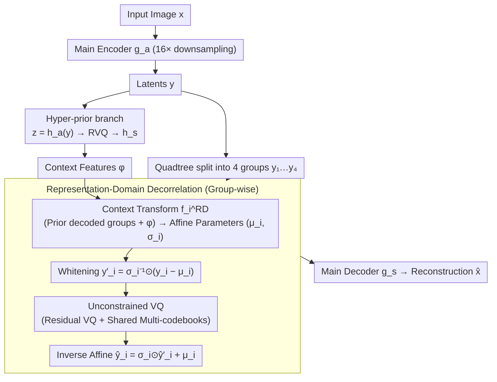

# Efficient Learned Image Compression without Entropy Coding

**Conference**: ICML 2026  
**arXiv**: [2605.23323](https://arxiv.org/abs/2605.23323)  
**Code**: TBD  
**Area**: Model Compression / Learned Image Coding / Generative Compression  
**Keywords**: Learned image compression, entropy-free coding, vector quantization, context reparameterization, GPU parallelism

## TL;DR
EF-LIC replaces the slow and serial entropy coding module in the learned image compression pipeline with a two-step approach: "unconstrained vector quantization to maximize index entropy + representation-domain context reparameterization to eliminate latent correlations." It is theoretically proven that its R–D performance can approach that of entropy coding schemes. In practice, it saves 67.86% bitrate compared to MS-ILLM on Kodak/LPIPS and achieves 10x faster decoding.

## Background & Motivation

**Background**: Modern learned image compression (LIC) follows the three-stage paradigm of VAE encoder + quantization + entropy coding (Ballé 2018). Its performance has surpassed JPEG/VVC, and the strongest models significantly outperform traditional encoders in perceptual metrics. Entropy coding (rANS), combined with context models to eliminate statistical and correlation redundancies simultaneously, represents the "last mile" of performance.

**Limitations of Prior Work**: Entropy coding (especially rANS) has complex control flow and is **inherently serial**, necessitating execution on the CPU. During a single forward pass, entropy coding can consume over 100 ms, exceeding the total time of all other GPU modules. Simplifying or removing entropy coding typically leads to immediate performance degradation—COIN bypassed entropy coding using INR but only matched JPEG levels, while OSCAR used diffusion to bypass it but incurred prohibitive inference costs.

**Key Challenge**: From an information theory perspective, the end-to-end code length satisfies $R \ge H(X)$. Entropy coding exists to keep the actual code length close to the entropy lower bound. Once removed, indices must be encoded using fixed lengths, forcing the code length to be $\log K^n$. To prevent this upper bound from being wasteful, one must **ensure the index distribution approaches a uniform distribution** (maximum entropy) and ensure there is **no predictable correlation** between adjacent latents—neither of which has been systematically achieved before.

**Goal**: Construct a completely GPU-friendly LIC framework that **does not invoke any entropy coding**, while maintaining R–D performance comparable to entropy coding schemes.

**Key Insight**: Categorize LIC redundancies into "statistical" and "correlation" redundancies for separate treatment—the former is pushed toward maximum entropy using unconstrained VQ, while the latter is "whitened" through affine reparameterization in the representation domain. Both are tensor operators and naturally support GPU parallelism.

**Core Idea**: Instead of predicting conditional distributions and feeding logits to an entropy coder, it **directly performs affine transforms in the representation domain** using context-driven $(\bm\mu_i, \bm\sigma_i)$ to map the current latent group $\bm y_i$ into a decorrelated space before quantization. Using a sufficiently large VQ codebook theoretically ensures $\Delta H \to 0$.

## Method

### Overall Architecture

EF-LIC aims to remove the slow, serial, CPU-bound entropy coding module from the LIC pipeline without sacrificing R–D performance. The process is as follows: the input image $\bm x$ is transformed into latents $\bm y$ via a main encoder $g_a$ (downsampling factor $f_y=16$). A hyper-prior branch $\bm z=h_a(\bm y)$ (downsampling $f_z=64$) is quantized via RVQ and decoded to context features $\bm\phi=h_s(\hat{\bm z})$. Then, $\bm y$ is split into $N=4$ groups $(\bm y_1, \dots, \bm y_4)$ using a quadtree. Each group is "whitened" into a decorrelated space using context-driven affine parameters before VQ. Finally, the main decoder $g_s$ reconstructs $\hat{\bm x}$. The entire pipeline contains **no entropy encoder/decoder**; all VQ indices are sent as fixed-length codes, and all modules are pure tensor operators that can be executed in batches on the GPU.

### Key Designs

**1. Unconstrained VQ: Elevating "Index Maximum Entropy" from Empirical Observation to Theorem**

When entropy coding is removed, indices can only be encoded with fixed lengths, where the rate is fixed at $n\log K$. Whether this upper bound is wasteful depends on whether the entropy of the index sequence $J$ can approach it—specifically, whether statistical redundancy $\Delta H = \frac{n\log K - H(J)}{n\log K}$ can be compressed toward 0. EF-LIC's solution is: **it imposes no rate constraints during training**, using only codebook commitment, codebook updates, and reconstruction losses (L1 + LPIPS + PatchGAN) to let the network learn freely. Proposition 3.1 proves by contradiction that under a fixed-length budget of $R = \log K$, any distortion-optimal quantizer $Q^*$ must satisfy $\Delta H = 0$. This explains why the index distribution of VQ-VAE / DAC is naturally near-uniform upon convergence. This paper elevates this "accidental" empirical phenomenon to a theorem, indicating that as long as the codebook is large enough and end-to-end reconstruction is sufficiently trained, fixed-length VQ index sequences **theoretically no longer require entropy coding to eliminate statistical redundancy**. This is the fundamental legitimacy for removing entropy coding.

**2. Representation-Domain Decorrelation: Replacing "Probability Prediction" with "Latent Whitening"**

Beyond statistical redundancy, correlation redundancy exists between adjacent latent groups. Traditional LIC relies on a context model $f_i^{\text{CM}}$ to predict conditional distribution parameters $(\bm\mu_i, \bm\sigma_i)$ and then lets the entropy coder compress according to $P_{\hat Y_i \mid \hat Y_{<i}}(\cdot; \bm\mu_i, \bm\sigma_i)$. This step is inherently serial. EF-LIC's key innovation is: use the **same pair** of $(\bm\mu_i, \bm\sigma_i) = f_i^{\text{RD}}(\bm\psi_i)$ (where $\bm\psi_i$ is computed from decoded groups $\hat{\bm y}_{<i}$ and $\bm\phi$), but instead of using them as probability parameters, use them directly for affine whitening in the representation domain: $\bm y_i' = \bm\sigma_i^{-1} \odot (\bm y_i - \bm\mu_i)$. After quantization, the inverse transform $\hat{\bm y}_i = \bm\sigma_i \odot \hat{\bm y}_i' + \bm\mu_i$ is applied. Theorem 3.5 guarantees this replacement is not suboptimal: for any $\varepsilon \in (0, 1)$, there exists an implementation such that under a slightly larger budget $R' = R/(1-\varepsilon)$, $D_X^{\text{RD}}(R') \le D_X^{\text{CM}}(R)$. Moving context modeling from the probability domain to the representation domain allows the pipeline to consist purely of tensor operators executed in a single batch, eliminating the need to pass logits/probabilities between the CPU and GPU.

**3. Residual VQ + Shared Multi-Codebooks: One Model for Five Bitrate Points**

Practical codecs must support multi-bitrate deployment. EF-LIC implements all quantizers $Q_{\bm z}$ and $\{Q_i^{\text{RD}}\}$ as Residual VQ (RVQ). An RVQ consists of several stackable codebooks; during inference, taking only the first $m$ codebooks yields the corresponding bitrate. The BPP is $\text{BPP} = \frac{m}{f_y^2} \left( \frac{f_y^2}{f_z^2} \log K_{\bm z} + \frac{1}{N} \sum_i \log K_i \right)$. During training, reconstruction loss is averaged for each $m \in \{1, 2, 3, 4, 5\}$. Codebook sizes decrease across groups: $K_1=1024, K_2=512, K_3=256, K_4=128, K_{\bm z}=1024$, naturally forming coarse-to-fine bitrate gradients.

### Loss & Training

$$\mathcal{L} = \frac{1}{|\mathcal{M}|} \sum_{m \in \mathcal{M}} \left( \|\bm x - \hat{\bm x}_m\|_1 + \lambda_{\text{per}} \mathcal{L}_{\text{per}} + \lambda_{\text{adv}} \mathcal{L}_{\text{adv}} + \lambda_{\text{cb}} \mathcal{L}_{\text{cb}}^m \right)$$

where $\mathcal{L}_{\text{per}}$ uses VGG-LPIPS, $\mathcal{L}_{\text{adv}}$ uses adaptive PatchGAN, and $\mathcal{L}_{\text{cb}}$ is the VQ-VAE commitment + codebook update. The model is trained on a 1% subset of ImageNet with 256×256 random crops, Adam optimizer $(\beta_1, \beta_2) = (0.5, 0.9)$, batch size 16, for 2M iterations, and learning rate $10^{-4} \to 10^{-5}$ at 1.5M iterations.

## Key Experimental Results

### Main Results (BD-rate vs. MS-ILLM, LPIPS, lower is better)

| Method | Enc. (ms) | Dec. (ms) | Params (M) | Kodak | DIV2K |
| :--- | :--- | :--- | :--- | :--- | :--- |
| VVC (VTM-23.10) | >9999 | 150.30 | — | +313.84% | +285.10% |
| HiFiC | 526.51 | 1408.60 | 181.6 | +45.82% | +46.36% |
| MS-ILLM | 165.38 | 147.79 | 181.4 | 0.00% | 0.00% |
| DiffEIC | 210.18 | 4661.74 | 1379.5 | −37.71% | −15.76% |
| OSCAR (diffusion, no EC) | 53.04 | 167.56 | 1009.3 | −37.31% | −14.51% |
| RDEIC | 157.25 | 426.68 | 1380.3 | −52.08% | −35.70% |
| **EF-LIC-s** | **9.94** | **6.26** | **11.51** | −55.38% | −47.36% |
| **EF-LIC** | **17.62** | **13.72** | **35.74** | **−67.86%** | **−62.33%** |

EF-LIC achieves the best BD-rate across four benchmarks: Kodak, Tecnick, DIV2K, and CLIC2020. EF-LIC-s still outperforms RDEIC with 10x fewer parameters.

### Ablation Study (Kodak / LPIPS / 1M iter)

| Configuration | BD-rate | ΔFLOPs | Enc. (ms) | Dec. (ms) |
| :--- | :--- | :--- | :--- | :--- |
| VQ baseline (no decorr) | 0.00% | 0.00% | 5.51 | 7.06 |
| VQ + EC | −14.73% | +4.30% | 362.07 | 300.83 |
| UQ + EC (Typical LIC) | −20.73% | +7.53% | 63.12 | 71.72 |
| **EF-LIC** | **−22.20%** | +7.54% | 17.62 | **13.72** |
| EF-LIC-s | −10.76% | −56.30% | 9.94 | 6.26 |

Per-module runtime decomposition: In UQ+EC, entropy coding alone accounts for 108.60 ms, while EF-LIC skips this segment entirely.

### Key Findings
- **EF-LIC's R–D is even slightly better than its entropy-coded variant UQ+EC** (−22.20% vs −20.73%), while being 3.6× faster at encoding and 5.2× faster at decoding, verifying the "no EC loss" theory.
- **Entropy coding is the latency bottleneck**: The EC module in VQ+EC accounts for 96.7% of total decoding time (507.89/525.09 ms). Removing it drops decoding time to 12.5 ms.
- **Representation-domain reparameterization contributes 22.2% BD-rate**: Adding the RD module to the VQ baseline (without entropy coding) achieves a rate reduction equivalent to UQ+EC, proving that affine whitening is as effective as probability-domain context modeling.
- **EF-LIC-s shows gains come from decorrelation rather than compute**: Reducing EF-LIC-s to match the VQ baseline's decoding latency still results in a 10.76% improvement.

## Highlights & Insights
- **First theoretical removal of the "essential" entropy coding module**: Previously, the industry assumed "no entropy coding = poor performance." This paper provides a clean proof that fixed-length VQ index sequences can losslessy approach the entropy coding lower bound, redefining the boundaries of LIC possibility.
- **Elegant duality between probability and representation domains**: Traditional models use $(\bm\mu, \bm\sigma)$ as parameters for likelihoods; EF-LIC uses them as parameters for affine whitening. Both achieve equivalent decorrelation effects, but the pipeline changes from serial to parallel.
- **Small models outperform diffusion models**: EF-LIC with 35.7M parameters outperforms RDEIC (1380M) and OSCAR (1009M), indicating that the budget previously allocated to asymmetric encoder-decoder designs can be reallocated to the main codec once the entropy coding bottleneck is removed.
- **Strong immediate deployability**: All modules are standard operations (conv/attention/VQ) with no dependency on CPU bridges or rANS libraries.

## Limitations & Future Work
- Evaluation is biased toward **perceptual metrics (LPIPS/DISTS)**; performance on PSNR/MS-SSIM is not presented, and advantages may shrink for medical or scientific imaging.
- Theorem 3.5 depends on $K$ and network capacity being "sufficiently large," leaving actual gaps with small codebooks unquantified.
- VQ failure cases such as index collapse or dead code are not deeply discussed.
- Verification is limited to images; high-dimensional latents in **video / audio** require further testing for the maximum entropy hypothesis.
- Bitstream error robustness is not discussed.

## Related Work & Insights
- **vs MS-ILLM / HiFiC**: Conventional generative LIC models use GANs but rely on entropy coding. EF-LIC saves EC while improving BD-rate by over 50%.
- **vs OSCAR / DiffEIC / RDEIC**: Diffusion-based methods bypass entropy coding but are 100×–1000× slower due to multi-step processes or INR.
- **vs Control-GIC / Mao 2024**: These use VQ but ignore correlations between latent groups. EF-LIC's RD module provides theoretical and experimental improvements over these approaches.

## Rating
- Novelty: ⭐⭐⭐⭐⭐ 
- Experimental Thoroughness: ⭐⭐⭐⭐⭐ 
- Writing Quality: ⭐⭐⭐⭐⭐ 
- Value: ⭐⭐⭐⭐⭐ 

<!-- RELATED:START -->

## Related Papers

- [\[ICML 2026\] Float8@2bits: Entropy Coding Enables Data-Free Model Compression](float82bits_entropy_coding_enables_data-free_model_compression.md)
- [\[CVPR 2026\] Block-based Learned Image Compression without Blocking Artifacts](../../CVPR2026/model_compression/block-based_learned_image_compression_without_blocking_artifacts.md)
- [\[CVPR 2025\] Learned Image Compression with Dictionary-based Entropy Model](../../CVPR2025/model_compression/learned_image_compression_with_dictionary-based_entropy_model.md)
- [\[CVPR 2026\] What Matters in Practical Learned Image Compression](../../CVPR2026/model_compression/what_matters_in_practical_learned_image_compression.md)
- [\[AAAI 2026\] DynaQuant: Dynamic Mixed-Precision Quantization for Learned Image Compression](../../AAAI2026/model_compression/dynaquant_dynamic_mixed-precision_quantization_for_learned_i.md)

<!-- RELATED:END -->
