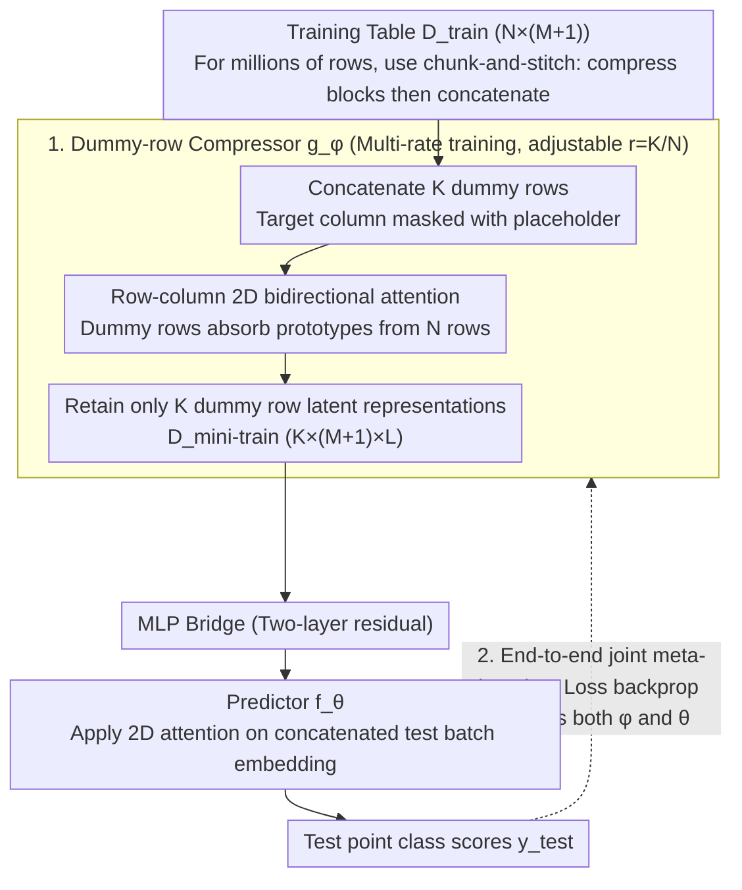

# End-to-End Compression for Tabular Foundation Models

**Conference**: ICML 2026 Spotlight  
**arXiv**: [2602.05649](https://arxiv.org/abs/2602.05649)  
**Code**: https://github.com/machinelearningnuremberg/TACO (Available)  
**Area**: Model Compression / Tabular Foundation Models / In-context Learning  
**Keywords**: Tabular Foundation Models, Context Compression, TabPFN, End-to-End Meta-Learning, Inference Acceleration  

## TL;DR
TACO prepends a learnable transformer compressor to TabPFN-like tabular foundation models. It compresses $N$ rows of training context into a latent representation of $K \ll N$ rows before passing it to the predictor. Through end-to-end joint meta-learning, it achieves a $94\times$ speedup and $97\%$ memory reduction at a $1\%$ compression rate with almost no loss in ROC-AUC.

## Background & Motivation

**Background**: Recent paradigms in tabular prediction have shifted from GBDT to in-context learning (ICL) Tabular Foundation Models (TFMs) like TabPFN, TabICL, and TabDPT. These models are pre-trained on synthetic data and perform inference by feeding the entire training set as context into a bidirectional transformer in a single forward pass.

**Limitations of Prior Work**: TFMs utilize 2D bidirectional attention across rows and columns, with a complexity of $\mathcal{O}(N^2 M)$ regarding the number of training samples $N$. Even with KV caching, this only reduces to $\mathcal{O}(NM)$. When $N \times M$ reaches hundreds of thousands of cells, memory usage explodes, forcing authors to use small-to-medium datasets or resort to aggressive row/column subsampling.

**Key Challenge**: The attention context length directly couples "input information volume" with "inference cost"—high prediction accuracy requires the full table, but the full table is computationally prohibitive. Existing mitigations (e.g., distilling MotherNet into an MLP or utilizing TabFlex’s linear attention) either sacrifice accuracy or require architectural modifications; **no prior work has attempted to directly compress the training context itself in an end-to-end manner.**

**Goal**: To compress the in-context context from $N$ rows to $K$ rows ($K \ll N$) while maintaining the TFM backbone and accuracy, linearly reducing inference complexity by $N/K$ times.

**Key Insight**: Decompose in-context learning into two modules: a "compressor $g$" and a "predictor $f$". The compressor is tasked solely with producing the minimal training set summary $D^{\text{mini-train}}$ that allows the downstream predictor to make accurate predictions. This effectively adapts the concept of dataset distillation into the TFM inference pipeline.

**Core Idea**: Insert a transformer compressor to compress the training table into $K$ prototypical rows, then perform **joint meta-learning** with the predictor so that the "compression" process directly serves "downstream prediction accuracy."

## Method

### Overall Architecture

TACO consists of two TabPFN v2-style 2D-attention transformers connected in series:

1.  **Compressor $g_\phi$**: Takes $D^{\text{train}} \in \mathbb{R}^{N \times (M+1)}$ plus a dummy table of $K \times (M+1)$ (dummy rows are initialized by random sampling from the training set, with the target column masked by a special placeholder). After several layers of alternating row/column attention, the dummy row positions absorb information from the actual training table, outputting $D^{\text{mini-train}} \in \mathbb{R}^{K \times (M+1) \times L}$.
2.  **MLP Bridge**: A two-layer residual MLP connects the latent spaces of the two transformers.
3.  **Predictor $f_\theta$**: Uses a standard TabPFN v2 architecture to concatenate $D^{\text{mini-train}}$ with the test batch embedding $\mathcal{E}_f(x^{\text{test}})$ for the attention blocks, outputting class scores for test points.

Both modules consist of 12 layers / 6 heads / 192 dimensions, each with 14M total parameters. The entire pipeline is optimized simultaneously:

$$\arg\min_{\theta,\phi}\;\mathbb{E}_{(D^{\text{train}},D^{\text{test}})\sim p(D)}\;\mathcal{L}\!\left(y^{\text{test}},\;f(x^{\text{test}},g(D^{\text{train}};\phi);\theta)\right)$$

Pre-training involves 80k steps on synthetic data + 11k steps on real data, with a sequence length curriculum progressing from 1k to 60k rows. The compression rate is $r = K/N$.

### Key Designs

**1. Dummy-row attention: Compressing the training table into a differentiable "learned query"**

To compress a training table of $N$ rows into $K \ll N$ rows without the hard information loss seen in random/kNN subsampling, TACO concatenates $K$ dummy rows at the compressor input (with target labels masked). Bidirectional attention allows information to flow freely between the $N+K$ rows, but **only the latent representations of these $K$ dummy rows are retained** as $D^{\text{mini-train}}$. These dummy rows act as learned queries that extract prototypical patterns from the $N$ rows of real data. This is more powerful than hard selection because the compression is **differentiable**, and compressed rows do not have to equal any original row—the compressor can synthesize prototypes from scratch, which explains why TACO significantly outperforms random/kNN subsampling (Insight 5).

**2. End-to-end joint meta-learning: Aligning the compressor and predictor to the same "language"**

Updating only the compressor while freezing the predictor (e.g., using fixed TabPFN v2 weights) forces the compressor to align with a downstream model it cannot influence, which is extremely difficult. TACO instead updates **both simultaneously**: during multi-rate training, each sampled synthetic dataset is compressed and then used for prediction. Losses backpropagate to both $\phi$ and $\theta$ parameters, allowing the predictor to **actively adapt** to the compressed latent space. Ablation studies (Insight 3) where the predictor was frozen show significantly worse performance across all compression rates compared to joint training—this proves that compression and prediction must share the same representation space.

**3. Multi-rate training + chunk-and-stitch: One checkpoint for any compression rate and million-row tables**

To avoid training separate models for each compression rate, during training, $r$ is uniformly sampled from $\{1\%, 2\%, 4\%, 8\%, 16\%\}$. This allows a single checkpoint to perform variable-rate compression, switchable via the $r$ parameter at inference time. Insight 4 confirms no significant performance loss relative to rate-specific training. For massive tables exceeding the compressor's training limit ($\le 10^4$ rows), a "chunk-and-stitch" approach is used: $N=10^6$ is split into 100 blocks of $C=10^4$, each compressed independently to $K_C=100$, and then concatenated into a global $D^{\text{mini-train}}$. This generalizes local compression to any $N$, which was key to the million-row experiments in Insight 6.

### Loss & Training
The model reuses the classification cross-entropy / regression MSE from TFMs as the in-context loss. Continuous targets are discretized into $\le 10$ bins for compatibility with classification training. Optimization uses AdamW with cosine annealing, learning rate warmup to $1 \times 10^{-4}$, weight decay $1 \times 10^{-2}$, gradient clipping at 1.0, and mixed precision. Training took 20 days on 8×H100.

## Key Experimental Results

### Main Results

On 26 classification datasets from TabArena, measuring ROC-AUC (one-vs-one for multi-class):

| Model | Mean ROC-AUC ↑ | Notes |
| :--- | :--- | :--- |
| TabICL | 0.866 ± 0.103 | SOTA TFM Baseline |
| TabPFN v2.0 | 0.866 ± 0.103 | SOTA TFM Baseline |
| POT (No compression) | 0.862 ± 0.101 | Same architecture, no compression control |
| TACO ($r=1\%$) | 0.855 ± 0.097 | Only 1% context |
| TACO ($r=2\%$) | 0.857 ± 0.098 | |
| TACO ($r=4\%$) | 0.857 ± 0.099 | |
| TACO ($r=8\%$) | 0.858 ± 0.100 | |
| TACO ($r=16\%$) | 0.858 ± 0.101 | |

The CD diagram shows no statistically significant difference between $1\%$ compression and POT.

### Inference Efficiency (Synthetic 15k rows × 500 features, no KV cache)

| Method | Subsequent Predict | Speedup | Predict VRAM | VRAM Savings |
| :--- | :--- | :--- | :--- | :--- |
| POT | 28.67 s | 1× | 22.45 GB | — |
| TACO 1% | 306 ms | **93.6×** | 549 MB | **−97.6%** |
| TACO 2% | 382 ms | 75.2× | 845 MB | −96.3% |
| TACO 4% | 544 ms | 52.7× | 1.41 GB | −93.7% |
| TACO 8% | 943 ms | 30.4× | 2.56 GB | −88.6% |
| TACO 16% | 1.91 s | 15× | 4.89 GB | −78.2% |

### Key Findings
- **Compression to 1% is nearly "free"**: Dropping context from 100% to 1% only reduced ROC-AUC from 0.862 to 0.855 (within standard deviation), while accelerating inference by $94\times$ and saving $97.6\%$ VRAM.
- **Joint training is a necessary condition**: Freezing the predictor yielded worse results across all rates (Insight 3), indicating the necessity of a shared representation.
- **TACO significantly outperforms random/kNN subsampling**: The ROC-AUC gap widens at higher compression rates, validating that learned prototypes are superior to hard selections (Insight 5).
- **Chunk-and-stitch unlocks million-row datasets**: On MetroPT-3 (~1.2M rows compressed to 1214 rows, $r=0.1\%$), TACO achieved 0.8955 AUPRC, outperforming random/kNN-based POT/TabPFN v2 baselines (Insight 6).

## Highlights & Insights
- **Embedding dataset distillation into in-context inference**: Unlike traditional distillation used for training acceleration, TACO is the first to make "summarizing the training set" part of the TFM inference pipeline through joint learning—automating "prompt engineering" into "prompt compression."
- **Dummy-row as a differentiable query**: This adapts the latent bottleneck idea from Perceiver / Set Transformer to tabular data. Since the target column is masked, it maintains the interpretability of "unlabeled summaries."
- **Multi-rate training for flexible deployment**: Continuous accuracy-latency trade-offs are handled by a single model using the $r$ parameter, incurring almost zero operational cost.
- **Transferable chunk-and-stitch logic**: Any scenario where global self-attention is bottlenecked by $\mathcal{O}(N^2)$ (e.g., long-sequence inference, large corpus retrieval) can benefit from this "local compression + global stitching" approach.

## Limitations & Future Work
- Evaluation focused on TabArena classification and **did not cover regression or time-series**. The predictor currently uses discretization for regression; extending this is a clear next step.
- Synthetic priors are still primarily SCM-based and have limited coverage of **real-world missing value distributions or temporal distribution shifts**; time-drift priors (e.g., Helli et al. 2024) should be introduced.
- While the $1\%$ compression is not statistically significant in ROC-AUC, the **absolute drop of 0.007** might matter for applications requiring calibration or targeting long-tail classes.
- Chunk-and-stitch assumes IID chunks; there is **no specific alignment mechanism for blocks with covariate shift**, representing a potential engineering risk.

## Related Work & Insights
- **vs TabPFN v2 / TabICL**: Uses the same 2D attention architecture but adds a context compressor; reduces complexity from $\mathcal{O}(N^2 M)$ to $\mathcal{O}(K^2 M)$ where $K=0.01 N$, while maintaining performance.
- **vs MotherNet**: MotherNet distills transformers into per-dataset MLPs ("model compression"); TACO performs "context compression," retaining in-context flexibility while gaining speed.
- **vs TabFlex**: TabFlex uses linear attention to reduce complexity to $\mathcal{O}(N)$, but accuracy is limited; TACO's approach of reducing context length is more effective.
- **vs random / kNN subsampling**: Hard selection loses information; TACO’s differentiable dummy-row compression synthesizes prototypes and is consistently superior at 1–16% rates.

## Rating
- Novelty: ⭐⭐⭐⭐ First to use end-to-end differentiable context compression in TFM pipelines, though dummy-row concepts draw from Perceiver / Set Transformer.
- Experimental Thoroughness: ⭐⭐⭐⭐⭐ 6 key Insights + TabArena/TabFSbench/TableShift/MetroPT-3 benchmarks + detailed ablations (joint training / multi-rate / baselines / chunking).
- Writing Quality: ⭐⭐⭐⭐ Clear labeling of Insights; theoretical sections are concise; figures and tables are well-positioned.
- Value: ⭐⭐⭐⭐⭐ Directly addresses the primary bottleneck of TFMs (scalability to large tables); open-source checkpoints make it plug-and-play for industrial real-time prediction.

<!-- RELATED:START -->

## Related Papers

- [\[ICML 2026\] Towards Resource-Efficient LLMs: End-to-End Energy Accounting of Distillation Pipelines](towards_resource-efficient_llms_end-to-end_energy_accounting_of_distillation_pip.md)
- [\[ICML 2026\] Auditing and Fixing Economic Validity in Tabular Foundation Models for Discrete Choice](auditing_and_fixing_economic_validity_in_tabular_foundation_models_for_discrete_.md)
- [\[CVPR 2026\] A Paradigm Shift: Fully End-to-End Training for Temporal Sentence Grounding in Videos](../../CVPR2026/model_compression/a_paradigm_shift_fully_end-to-end_training_for_temporal_sentence_grounding_in_vi.md)
- [\[ICML 2026\] Quantifying the Uncertainty of Foundation Models with Singular Value Ensembles](quantifying_the_uncertainty_of_foundation_models_with_singular_value_ensembles.md)
- [\[ICML 2026\] BioArc: Discovering Optimal Neural Architectures for Biological Foundation Models](bioarc_discovering_optimal_neural_architectures_for_biological_foundation_models.md)

<!-- RELATED:END -->
