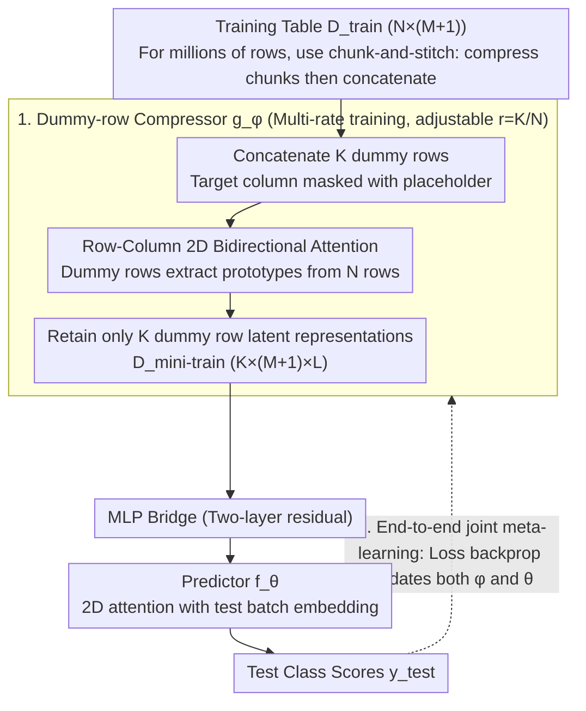

# End-to-End Compression for Tabular Foundation Models

**Conference**: ICML 2026 Spotlight  
**arXiv**: [2602.05649](https://arxiv.org/abs/2602.05649)  
**Code**: https://github.com/machinelearningnuremberg/TACO (Available)  
**Area**: Model Compression / Tabular Foundation Models / In-context Learning  
**Keywords**: Tabular Foundation Models, Context Compression, TabPFN, End-to-End Meta-Learning, Inference Acceleration  

## TL;DR
TACO attaches a learnable transformer compressor in front of TabPFN-like tabular foundation models. It compresses $N$ rows of training context into $K\ll N$ rows of latent representations before feeding them to the predictor. Through end-to-end joint meta-learning, it achieves a 94x inference speedup and 97% memory saving at a 1% compression rate with almost no loss in ROC-AUC.

## Background & Motivation

**Background**: The paradigm in tabular prediction has shifted from GBDT to In-Context Learning (ICL) based Tabular Foundation Models (TFMs) such as TabPFN, TabICL, and TabDPT. These models are pre-trained on synthetic data and directly ingest the entire training set as context into a bidirectional transformer for a single forward pass during inference.

**Limitations of Prior Work**: TFMs utilize row-column 2D bidirectional attention, with complexity relative to training samples $N$ being $\mathcal{O}(N^2 M)$. Even with KV caching, it only reduces to $\mathcal{O}(NM)$. When $N\times M$ reaches hundreds of thousands of cells, memory usage explodes, forcing authors to use small-to-medium tables or resort to aggressive row/column sub-sampling.

**Key Challenge**: The attention context length directly ties "information volume" to "inference cost"—high predictive accuracy requires the full table, but the full table is computationally prohibitive. Existing mitigations (distilling MotherNet into MLPs, TabFlex linear attention) either sacrifice accuracy or change the architecture; **no prior work has attempted to directly compress the training context itself in an end-to-end manner**.

**Goal**: To compress the in-context context from $N$ rows to $K$ rows ($K\ll N$) without altering the TFM backbone or losing accuracy, thereby linearly reducing inference complexity by a factor of $N/K$.

**Key Insight**: Decompose in-context learning into two modules: a "compressor $g$" and a "predictor $f$." The compressor is trained specifically to produce the minimal training set summary $D^{\text{mini-train}}$ that allows the downstream predictor to make accurate predictions. This essentially brings the idea of dataset distillation into the TFM inference workflow.

**Core Idea**: Insert a transformer compressor to compress the training table into $K$ prototypical rows, and perform **joint meta-learning** with the predictor so that "compression" directly serves "downstream prediction accuracy."

## Method

### Overall Architecture

TACO consists of two TabPFN v2-style 2D-attention transformers in series:

1.  **Compressor** $g_\phi$: Inputs $D^{\text{train}}\in\mathbb{R}^{N\times(M+1)}$ plus a $K\times(M+1)$ dummy table (dummy rows are initialized by random sampling from the training set, with the target column masked by a special placeholder). After several layers of alternating row/column attention, the dummy row positions absorb information from the actual training table, outputting $D^{\text{mini-train}}\in\mathbb{R}^{K\times(M+1)\times L}$.
2.  **MLP Bridge**: A two-layer residual MLP connects the latent spaces of the two transformers.
3.  **Predictor** $f_\theta$: Uses a standard TabPFN v2 architecture, concatenating $D^{\text{mini-train}}$ with the test batch embedding $\mathcal{E}_f(x^{\text{test}})$ and feeding them into attention blocks to output class scores for test points.

Both modules have 12 layers / 6 heads / 192 dimensions, each with 7M parameters. The entire pipeline optimizes:

$$\arg\min_{\theta,\phi}\;\mathbb{E}_{(D^{\text{train}},D^{\text{test}})\sim p(D)}\;\mathcal{L}\!\left(y^{\text{test}},\;f(x^{\text{test}},g(D^{\text{train}};\phi);\theta)\right)$$

The model is pre-trained for 80k steps on synthetic data + 11k steps on real data, with a sequence length curriculum progressing from 1k to 60k rows. The compression rate is $r=K/N$.

### Key Designs

**1. Dummy-row attention: Compressing the training table into a set of differentiable "learned queries"**

To compress a training table from $N$ to $K\ll N$ rows without the hard information loss of random/kNN sub-sampling, TACO concatenates $K$ dummy rows at the compressor input (with target labels masked). Bidirectional attention flows freely among the $N+K$ rows, but at the output, **only the latent representations of these $K$ dummy rows are preserved** as $D^{\text{mini-train}}$. These dummy rows act as learned queries that extract prototypical patterns from the $N$ rows of real data. This is more powerful than hard selection because the compression is **differentiable**, and the compressed rows do not need to equal any original row—the compressor can synthesize prototypes from scratch, which is the root cause for TACO significantly outperforming random/kNN sub-sampling in Insight 5.

**2. End-to-end joint meta-learning: Teaching the compressor and predictor the same "language"**

If one only trains the compressor while freezing the predictor with fixed TabPFN v2 weights, the compressor is forced to align with a downstream model it cannot change, which is extremely difficult. TACO instead enables **simultaneous updates** for both: during multi-rate training, every sampled synthetic dataset is first compressed and then predicted, with the loss backpropagated to both $\phi$ and $\theta$. Consequently, the predictor **actively adapts** to the compressed latent space. Ablations in Insight 3 (initializing the predictor as TabPFN v2 but freezing it) show that joint training is superior across all compression rates—demonstrating that "compression" and "prediction" must share the same representation space.

**3. Multi-rate training + chunk-and-stitch: A single checkpoint supporting arbitrary rates and millions of rows**

To avoid training separate models for each compression rate, training uniformly samples $r\in\{1\%, 2\%, 4\%, 8\%, 16\%\}$ for each synthetic dataset. This allows a single checkpoint to learn rate-variable compression, switchable via the $r$ parameter during inference. Insight 4 confirms that dynamic training has no significant performance loss compared to rate-specific training. To handle the constraint that the compressor only sees $\le 10^4$ rows during training, large tables use "chunk-and-stitch": if $N=10^6$, the table is split into 100 chunks of $C=10^4$, each compressed independently to $K_C=100$, then concatenated into a global $D^{\text{mini-train}}$. This extends local compression experience to arbitrary $N$, which was key to the million-row experiments in Insight 6.

### Loss & Training
Direct reuse of TFM classification cross-entropy / regression MSE as the in-context loss. Continuous targets are discretized into $\le 10$ bins to maintain compatibility with classification training. Optimizer: AdamW + cosine annealing, learning rate warmed up to $1\times 10^{-4}$, weight decay $1\times 10^{-2}$, grad clip 1.0, mixed precision. Trained on 8×H100 for 20 days.

## Key Experimental Results

### Main Results

On 26 classification datasets from TabArena, ROC-AUC (one-vs-one for multi-class):

| Model | Mean ROC-AUC ↑ | Description |
|--------|----------------|-------------|
| TabICL | 0.866 ± 0.103 | SOTA TFM Baseline |
| TabPFN v2.0 | 0.866 ± 0.103 | SOTA TFM Baseline |
| POT (No Comp) | 0.862 ± 0.101 | Same arch, no compression |
| TACO ($r=1\%$) | 0.855 ± 0.097 | Only 1% context |
| TACO ($r=2\%$) | 0.857 ± 0.098 | |
| TACO ($r=4\%$) | 0.857 ± 0.099 | |
| TACO ($r=8\%$) | 0.858 ± 0.100 | |
| TACO ($r=16\%$) | 0.858 ± 0.101 | |

CD diagrams show **no statistically significant difference** between 1% compression and POT.

### Inference Efficiency (Synthetic 15k rows × 500 features, no KV cache)

| Method | Subsequent Predict | Speedup | Predict VRAM | VRAM Saving |
|--------|-------------------|--------|--------------|-------------|
| POT | 28.67 s | 1× | 22.45 GB | — |
| TACO 1% | 306 ms | **93.6×** | 549 MB | **−97.6%** |
| TACO 2% | 382 ms | 75.2× | 845 MB | −96.3% |
| TACO 4% | 544 ms | 52.7× | 1.41 GB | −93.7% |
| TACO 8% | 943 ms | 30.4× | 2.56 GB | −88.6% |
| TACO 16% | 1.91 s | 15× | 4.89 GB | −78.2% |

### Key Findings
- **1% Compression is nearly "free"**: Reducing context from 100% to 1% only drops ROC-AUC from 0.862 to 0.855 (within std), while increasing speed by 94x and saving 97.6% VRAM.
- **Joint training is a necessary condition**: Freezing the predictor while training the compressor results in degradation across all rates (Insight 3), proving they must share a representation "language."
- **TACO significantly outperforms random/kNN sub-sampling**: The ROC-AUC gap narrows as the compression rate increases, validating that learned prototypes are superior to hard selection (Insight 5).
- **Chunk-and-stitch unlocks millions of rows**: On MetroPT-3 with ~1.2M training rows compressed to 1214 rows ($r=0.1\%$), TACO achieved an AUPRC of 0.8955, outperforming POT/TabPFN v2 baselines using random/kNN context (Insight 6).

## Highlights & Insights
- **Embedding dataset distillation into in-context inference**: While previous distillation work focused on training acceleration, TACO is the first to make "summarizing the training set" part of the TFM inference pipeline through joint end-to-end learning. This essentially automates TFM "prompt engineering" into "prompt compression."
- **Dummy-rows as differentiable queries**: This adopts the latent bottleneck idea from Perceiver / Set Transformer into the tabular domain. By masking the target column, the "unlabeled summary" interpretability is maintained.
- **Multi-rate training → Single checkpoint, multiple deployments**: The continuous trade-off between accuracy and latency is adjustable via the $r$ parameter at inference time, incurring zero overhead for maintenance.
- **Transferable chunk-and-stitch**: Any scenario where "global self-attention hits the $O(N^2)$ wall" (long sequence inference, large corpus retrieval compression) can benefit from this "local compression + global stitching" approach.

## Limitations & Future Work
- Evaluation is concentrated on TabArena classification and **does not cover regression or time-series**; the current predictor uses discretization to convert regression to classification.
- Synthetic priors remain mostly SCM-based and have limited coverage of **real-world missing value distributions and temporal shifts**; temporal drift priors like those in Helli et al. 2024 should be introduced.
- While 1% compression is statistically insignificant in ROC-AUC, its **absolute value is 0.007 lower**, which may be unstable for applications requiring precise calibration or long-tail classes.
- Chunk-and-stitch assumes chunks are IID; there is **no specific alignment mechanism for chunks with covariate shift**, which is a potential engineering risk.

## Related Work & Insights
- **vs TabPFN v2 / TabICL**: Uses the same 2D attention architecture but adds a context compressor; reduces inference complexity from $\mathcal{O}(N^2 M)$ to $\mathcal{O}(K^2 M)$ where $K=0.01 N$, with roughly equivalent performance.
- **vs MotherNet**: MotherNet distills transformers into per-dataset MLPs ("model compression"); TACO performs "context compression," retaining ICL flexibility while gaining speed.
- **vs TabFlex**: TabFlex uses linear attention to reduce $N^2$ to $N$; TACO directly cuts context length, yielding more aggressive results.
- **vs random / kNN sub-sampling**: Hard selection loses information; TACO's differentiable dummy-row compression synthesizes prototypes, consistently winning at 1–16% compression rates.

## Rating
- Novelty: ⭐⭐⭐⭐ First to use end-to-end differentiable context compression in TFM pipelines, though dummy-row concepts inherit from Perceiver / Set Transformer.
- Experimental Thoroughness: ⭐⭐⭐⭐⭐ 6 Insights + TabArena/TabFSbench/TableShift/MetroPT-3 benchmarks + detailed ablations (Joint training / Multi-rate / Baselines / Chunking).
- Writing Quality: ⭐⭐⭐⭐ Clear Insight numbering; theoretical parts are concise but sufficient; figures are numerous but well-positioned.
- Value: ⭐⭐⭐⭐⭐ Directly addresses the primary bottleneck for TFM adoption (large table performance); open-source checkpoints make it plug-and-play for industrial real-time prediction.

<!-- RELATED:START -->

## Related Papers

- [\[ICML 2026\] LEAP: Learnable End-to-End Adaptive Pruning of Large Language Models](leap_learnable_end-to-end_adaptive_pruning_of_large_language_models.md)
- [\[ICML 2026\] Towards Resource-Efficient LLMs: End-to-End Energy Accounting of Distillation Pipelines](towards_resource-efficient_llms_end-to-end_energy_accounting_of_distillation_pip.md)
- [\[ICML 2026\] Auditing and Fixing Economic Validity in Tabular Foundation Models for Discrete Choice](auditing_and_fixing_economic_validity_in_tabular_foundation_models_for_discrete_.md)
- [\[ICLR 2026\] Adaptive Nonlinear Compression for Large Foundation Models](../../ICLR2026/model_compression/adaptive_nonlinear_compression_for_large_foundation_models.md)
- [\[ICML 2026\] Quantifying the Uncertainty of Foundation Models with Singular Value Ensembles](quantifying_the_uncertainty_of_foundation_models_with_singular_value_ensembles.md)

<!-- RELATED:END -->
