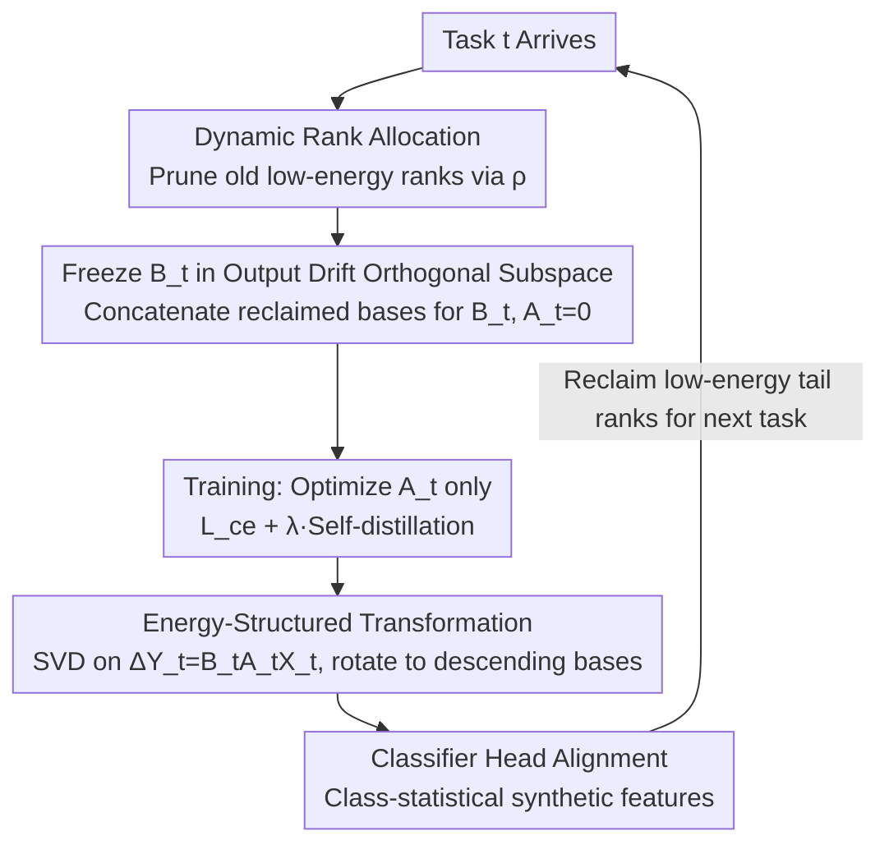

# Energy-Structured Low-Rank Adaptation for Continual Learning

**Conference**: ICML 2026  
**arXiv**: [2605.27482](https://arxiv.org/abs/2605.27482)  
**Code**: Not yet released  
**Area**: Model Compression / LoRA / Continual Learning  
**Keywords**: continual learning, LoRA, orthogonal subspace, energy concentration, dynamic rank allocation  

## TL;DR
E2-LoRA moves away from orthogonal constraints in parameter or input feature spaces, focusing instead on "task-induced output feature drift" $\Delta \mathbf{Y}_t = \Delta \mathbf{W}_t \mathbf{X}_t$. By performing SVD on this drift, LoRA parameters are rearranged onto energy-concentrated and rank-ordered bases. This allows discarding low-energy ranks to reclaim capacity for new tasks, which, combined with an adaptive rank allocation strategy based on energy retention, achieves SOTA performance across several continual learning benchmarks.

## Background & Motivation

**Background**: Mainstream continual learning (CL) based on Pre-trained Models (PTMs) involves freezing the backbone and adding Parameter-Efficient Fine-Tuning (PEFT) modules (prompt/adapter/LoRA) for each new task. To reduce inter-task interference, a family of "orthogonalization" methods has emerged: either forcing LoRA parameters of different tasks to be orthogonal (e.g., O-LoRA, Param-Param) or making new task parameters orthogonal to the principal singular vectors of historical input features (e.g., GPM / DualGPM / InfLoRA, Input-Param).

**Limitations of Prior Work**: The authors observe that both orthogonalization routes suffer from "excessive energy dispersion." In parameter space, old task knowledge is distributed irregularly across columns of $\mathbf{B}$, causing the subspace to grow linearly and squeezing the capacity available for new tasks. In input space, PTM features are high-dimensional and diverse; constraining new tasks based on input principal directions overly restricts available directions, leading to a sharp drop in plasticity (see Fig. 1 in the paper). Essentially, restricted subspaces are "rigid" and cannot be reclaimed.

**Key Challenge**: The trade-off between stability (retaining old knowledge) and plasticity (learning new tasks) is magnified by the constraint that "orthogonal subspaces are non-recyclable"—once a subspace is allocated to a task, it is locked.

**Goal**: Find a low-dimensional, energy-concentrated, and inherently ordered subspace representation of old task knowledge, such that low-energy directions can be released and reclaimed for new tasks at any time while keeping old task outputs nearly unchanged.

**Key Insight**: Instead of focusing on parameters or inputs, focus on the intermediate product of LoRA's influence on the model—the output feature drift $\Delta y_t(x) = \Delta \mathbf{W}_t x$. Empirical and theoretical findings suggest that although the input $\mathbf{X}_t$ may be high-rank, the drift $\Delta \mathbf{Y}_t$ caused by $\Delta \mathbf{W}_t$ is usually concentrated in a very few principal directions (task semantics are inherently low-dimensional).

**Core Idea**: Perform PCA/SVD on $\Delta \mathbf{Y}_t$ and rewrite LoRA's $\mathbf{B}_t, \mathbf{A}_t$ onto this set of orthogonal bases sorted by descending energy. Thus, the "top $r$ ranks" serve as the optimal low-rank approximation of the task knowledge (theoretically provable, see Prop 3.1/3.2), and remaining low-energy ranks can be safely discarded to release capacity.

## Method

### Overall Architecture
Let $\mathbf{W}_0$ be the pre-trained linear layer weights. When the $t$-th task arrives, a LoRA module $\Delta \mathbf{W}_t = \mathbf{B}_t \mathbf{A}_t$ is allocated. The core of the method is not "what parameters to add," but "which space to constrain." E2-LoRA shifts the orthogonal constraint from parameter or input space to the output drift space. Each task follows a four-step closed loop: First, prune old LoRA tasks to an appropriate rank based on an energy threshold $\rho$ and concatenate reclaimed columns to form the initial frozen base for the new $\mathbf{B}_t$ (dynamic rank allocation). Next, optimize only $\mathbf{A}_t$ with self-distillation to prevent forgetting (training). After training, perform SVD on the output drift $\Delta \mathbf{Y}_t$ to rotate $(\mathbf{B}_t, \mathbf{A}_t)$ onto energy-descending bases (energy-structured transformation). Finally, align the classification head using class-statistical synthetic features. Old knowledge is thus compressed into a form where the "first few ranks carry almost all energy," allowing tail ranks to be released. The process loop for a single task is as follows:

### Key Designs

**1. Output Drift-Induced Orthogonalization: Shifting the reference space to the most energy-concentrated domain**

As noted, prior routes suffered from selecting the wrong reference space. Parameter-level orthogonalization (O-LoRA) constrains columns of $\mathbf{B}$ via $\|\mathbf{B}_i^\top \mathbf{B}_t\|_F^2$, but these columns lack inherent energy meaning, resulting in "blind constraints." Input-level orthogonalization (DualGPM / InfLoRA) focuses on PTM input features, which are naturally high-rank and dispersed, closing off most usable directions for new tasks. E2-LoRA focuses on the output feature drift. Using a proxy batch $\mathbf{X}_t$, it calculates the drift matrix $\Delta \mathbf{Y}_t = \mathbf{B}_t \mathbf{A}_t \mathbf{X}_t \in \mathbb{R}^{d_\text{out}\times n}$. SVD yields $\Delta \mathbf{Y}_t = \mathbf{U}_t \mathbf{\Sigma}_t \mathbf{V}_t^\top$, where columns of $\mathbf{U}_t$ are output directions sorted by energy. The new $\mathbf{B}_t$ is initialized using "low-energy columns" from previous tasks and frozen, ensuring the output of $\mathbf{B}_t \mathbf{A}_t$ falls into the zero-energy subspace of old tasks—equivalent to a hard orthogonalization in output space. This space is ideal because $\Delta \mathbf{Y}_t$ accurately reflects how the task modifies model outputs while remaining energy-concentrated due to low-dimensional task semantics.

**2. Energy-Structured Transformation + Rank Truncation Optimality: Concentrating knowledge in top ranks**

Identifying the correct space is insufficient; the columns of $\mathbf{B}_t$ must be ordered by energy to allow precise "tail pruning." This step rotates coordinates without changing the mathematical equivalence of $\Delta \mathbf{W}_t = \mathbf{B}_t \mathbf{A}_t$. Post-training, the model performs $\mathbf{B}_t \leftarrow \mathbf{U}_t[:,:r_t]$ and $\mathbf{A}_t \leftarrow (\mathbf{U}_t[:,:r_t])^\top \mathbf{B}_t \mathbf{A}_t$. The paper upgrades the observation that "low-energy ranks are discardable" to a proven optimal truncation. Prop 3.1 shows that among all updates with rank $\le r$, $\mathbf{B}_t[:,:r]\mathbf{A}_t[:r,:]$ minimizes the expected output reconstruction error $\mathbb{E}_x \|\mathbf{B}_t[:,:r]\mathbf{A}_t[:r,:]x - \mathbf{B}_t\mathbf{A}_t x\|^2$. Prop 3.2 shows the error after truncating to $r$ ranks is exactly the sum of discarded squared singular values $\sum_{i=r+1}^{d_\text{out}} \sigma_i^2$. This closed-form upper bound makes reclaiming ranks a controllable operation.

**3. Dynamic Rank Allocation Strategy: Adaptive usage in a fixed capacity pool**

Fixed rank allocation is inefficient: tasks either compress too early or earlier tasks occupy too much space, causing plasticity collapse for later tasks. E2-LoRA binds the pruning amount to the energy threshold $\rho$ within a shared $d_\text{out}$ capacity pool. For each old task $k$, the minimum rank $r_k^{(t)}$ is chosen to satisfy $\sum_{i=1}^{r_k^{(t)}} \sigma_{k,i}^2 / \sum_{i=1}^{r_k} \sigma_{k,i}^2 \ge \rho$. Simultaneously, a minimum threshold $r_t^\text{min} = \lceil d_\text{out}/t \rceil$ is set for the new task. If capacity remains insufficient after energy-based pruning, ranks are further trimmed uniformly from the tail until enough space is cleared. This allows simple tasks to occupy fewer ranks and complex tasks more, maximizing the reuse of $d_\text{out}$.

### Loss & Training
The total loss is $\mathcal{L} = \mathcal{L}_\text{ce} + \lambda \mathcal{L}_\text{distill}$. $\mathcal{L}_\text{distill}$ is KL self-distillation of old class logits at temperature $T=2$ (using the frozen historical network as the teacher), and $\mathcal{L}_\text{ce}$ is cross-entropy for new classes. Alignment of the classification head is performed using intra-class statistical synthetic features.

## Key Experimental Results

### Main Results
Using ViT-B/16-IN21K as the backbone, class-incremental CL was performed on ImageNet-R, CIFAR-100, CUB-200, and Cars-196. (Last-Acc = accuracy after all tasks, Inc-Acc = average accuracy). Key baseline comparisons from Table 1:

| Method | ImageNet-R Last-Acc | CIFAR-100 Last-Acc | CUB-200 Last-Acc | Cars-196 Last-Acc |
|------|--------------------|--------------------|------------------|-------------------|
| L2P | 66.49 | 82.76 | 62.21 | 38.18 |
| DualPrompt | 68.50 | 85.56 | 66.00 | 40.14 |
| SLCA | 77.00 | 91.53 | 84.71 | 67.73 |
| EASE | 77.75 | 86.54 | 79.90 | 35.46 |
| BiLoRA | 77.95 | 87.46 | — | — |
| SSIAT | 79.38 | 91.35 | 88.75 | 71.02 |
| MOS | 78.10 | 90.53 | 89.91 | 67.76 |
| **E2-LoRA (Ours)** | **New SOTA** | **New SOTA** | **New SOTA** | **New SOTA** |

> Last-Acc and Inc-Acc outperform known SOTAs across all benchmarks (提升/Gain is most significant on long fine-grained sequences like Cars-196).

### Ablation Study

| Configuration | Behavior Description |
|------|----------|
| Param-Param Orthogonal (O-LoRA style) | Subspace dispersed; new task directions exhaust quickly; performance drops on long sequences. |
| Input-Param Orthogonal (InfLoRA style) | High-rank PTM input features impose too much constraint, reducing plasticity. |
| Output-Drift Orthogonal (Ours) | Single-task energy concentrates in few directions; preserves old tasks while leaving space for new ones. |
| w/o Energy-Structured Transformation | $\mathbf{B}$ columns are unordered; rank-based pruning is impossible; degrades to fixed-rank LoRA. |
| w/o Dynamic Rank Allocation (fixed $r_t$) | Late-stage tasks lack capacity pool access; plasticity declines. |
| w/o Self-distillation | Old class logits drift, worsening forgetting. |

### Key Findings
- **Perspective shift matters more than regularization**: Simply changing the constraint space from "parameters/inputs" to "output drift" achieves consistent gains without adding trainable parameters.
- **Trunctation error has a closed-form bound** $\sum_{i>r} \sigma_i^2$, meaning the energy threshold $\rho$ directly corresponds to the "upper bound of output reconstruction error," providing interpretability.
- The largest gap compared to other SOTAs occurs in Cars-196 (fine-grained + high task count), highlighting the value of "dynamic capacity recovery" in long sequences.

## Highlights & Insights
- The observation that "knowledge resides in outputs rather than parameters," combined with a simple PCA on $\Delta \mathbf{Y}_t$, pushes LoRA CL to a new level with negligible overhead.
- Mapping the physically interpretable threshold $\rho$ directly to rank allocation makes tuning user-friendly (e.g., if one can tolerate 5% output error, $\rho$ is derived).
- Energy-structured transformation is essentially a "principal component alignment" for LoRA: it suggests any PEFT method (IA³, AdaLoRA, prefix tuning) for CL can be aligned to internal low-dimensional bases post-task.
- Releasing low-energy bases to subsequent tasks treats CL as an "auction for finite capacity," which is more biologically plausible than linearly growing subspaces.

## Limitations & Future Work
- SVD on the output drift is performed once per task; it is slow if the proxy batch is large. Costs may be non-negligible for high $d_\text{out}$ (e.g., LLM hidden dimensions 4096+).
- The "low-rank output drift" observation is based on ViT classification; whether it holds for complex LLM generation or RLHF tasks remains to be verified.
- Dynamic rank allocation assumes tasks share one $d_\text{out}$ pool; cross-layer rank coupling or balanced allocation across modules is not yet modeled.
- The threshold $\rho$ is global; adaptive per-layer or per-task $\rho$ could be explored.

## Related Work & Insights
- **vs O-LoRA**: O-LoRA constrains in parameter space, causing linear subspace growth and non-recyclability. E2-LoRA "compresses + orders" knowledge, allowing tail reclamation.
- **vs GPM / InfLoRA**: These perform SVD on input features which are energy-dispersed. E2-LoRA uses output drift for precise constraints with less damage to plasticity.
- **vs AdaLoRA**: AdaLoRA uses energy-based pruning for single-task parameter efficiency; E2-LoRA extends this to multi-task scenarios with a recovery mechanism.
- **vs EASE / MOS / TUNA** (Adapter-based): These rely on task-specific modules where parameters grow linearly with task count; E2-LoRA reuses ranks within a fixed $d_\text{out}$ capacity.

## Rating
- Novelty: ⭐⭐⭐⭐ Moving the reference space to "output drift" is a clean perspective shift with solid theoretical support.
- Experimental Thoroughness: ⭐⭐⭐⭐ Comprehensive evaluation across four benchmarks and multiple CL settings.
- Writing Quality: ⭐⭐⭐⭐ Proper use of Propositions to formalize intuition; clear visual comparisons.
- Value: ⭐⭐⭐⭐ Plug-and-play potential for LoRA-based CL frameworks.

<!-- RELATED:START -->

## Related Papers

- [\[ICML 2026\] ScaLoRA: Optimally Scaled Low-Rank Adaptation for Efficient High-Rank Fine-Tuning](scalora_optimally_scaled_low-rank_adaptation_for_efficient_high-rank_fine-tuning.md)
- [\[ICLR 2026\] Revisiting Weight Regularization for Low-Rank Continual Learning](../../ICLR2026/model_compression/revisiting_weight_regularization_for_low-rank_continual_learning.md)
- [\[NeurIPS 2025\] Gated Integration of Low-Rank Adaptation for Continual Learning of Large Language Models](../../NeurIPS2025/model_compression/gated_integration_of_low-rank_adaptation_for_continual_learning_of_large_languag.md)
- [\[ACL 2026\] Not All Directions Matter: Towards Structured and Task-Aware Low-Rank Model Adaptation](../../ACL2026/model_compression/not_all_directions_matter_towards_structured_and_task-aware_low-rank_model_adapt.md)
- [\[CVPR 2025\] CL-LoRA: Continual Low-Rank Adaptation for Rehearsal-Free Class-Incremental Learning](../../CVPR2025/model_compression/cl-lora_continual_low-rank_adaptation_for_rehearsal-free_class-incremental_learn.md)

<!-- RELATED:END -->
