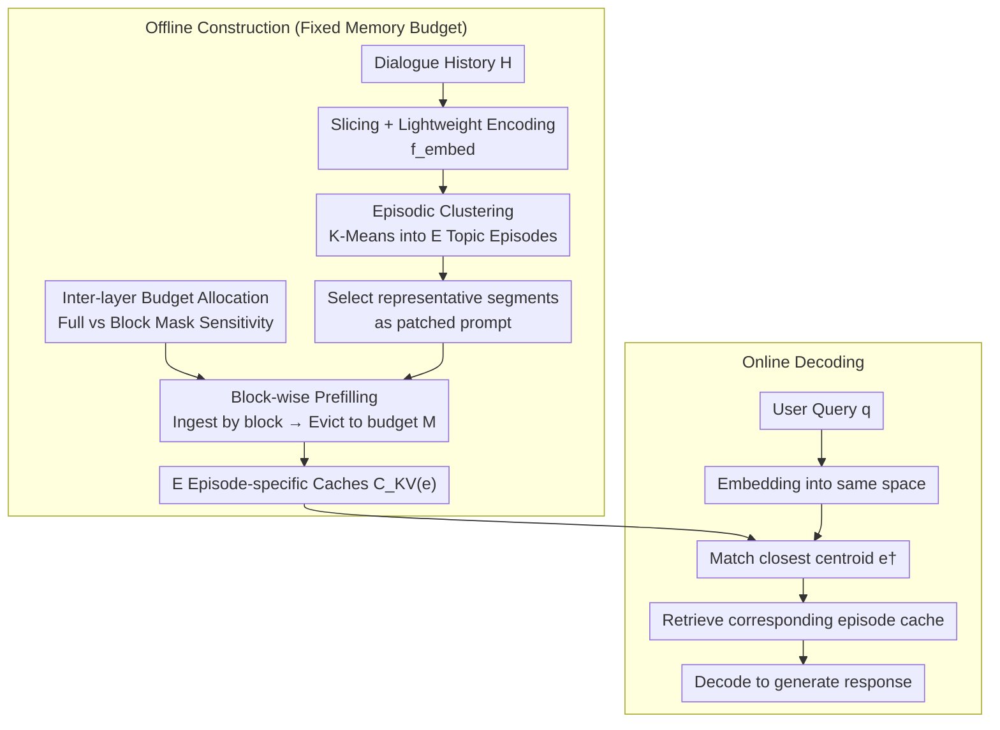

# EpiCache: Episodic KV Cache Management for Long-Term Conversation on Resource-Constrained Environments

**Conference**: ICML 2026  
**arXiv**: [2509.17396](https://arxiv.org/abs/2509.17396)  
**Code**: To be confirmed  
**Area**: Model Compression  
**Keywords**: KV cache compression, long-term conversation, episodic management, block-wise prefilling, memory-constrained inference

## TL;DR
This paper proposes EpiCache, a training-free KV cache management framework. By employing block-wise prefilling to control memory bounds, episodic clustering to preserve topic-relevant context, and sensitivity-aware budget allocation for layer-wise optimization, it achieves near full-cache accuracy with 4-6x compression and reduces peak memory by 3.7x across three long-conversation QA benchmarks.

## Background & Motivation

**Background**: Modern LLMs have extended context lengths to the million-token level, enabling conversational AI to utilize long-term dialogue history for generating coherent and personalized responses. Mainstream KV cache compression methods (e.g., H2O, SnapKV, KVzip) typically perform post-prefill eviction, where KV pairs are retained based on attention scores after the full context is prefilled.

**Limitations of Prior Work**: First, post-prefill methods require caching the entire context during the prefilling stage, causing peak memory to grow linearly with input length, which prevents deployment on memory-constrained devices like smartphones. For instance, LLaMA3.2-3B's KV cache exceeds 7GB after only 30 dialogue sessions—larger than the model parameters themselves. Second, query-dependent eviction (e.g., SnapKV) narrows the cache semantics to a single query; in multi-turn dialogues, evidence needed for subsequent questions might have already been evicted.

**Key Challenge**: A severe trade-off exists between bounded memory and answer accuracy. Directly applying post-prefill methods to a block-prefill framework leads to a sharp performance drop because the lack of global context during block-wise processing makes it difficult to determine token importance.

**Goal**: To achieve high-quality Long-term Conversation Question Answering (LongConvQA) under a strictly fixed memory budget while ensuring controllable peak memory.

**Key Insight**: Dialogue history naturally possesses an episodic structure where consecutive utterances revolve around specific topics. By clustering history into multiple topic-based episodes and constructing dedicated KV caches for each, the system can load only the most relevant episodic cache during query time. This saves memory while retaining topic-related context. Furthermore, different Transformer layers exhibit varying sensitivities to block-wise prefilling, allowing for adaptive inter-layer budget allocation.

**Core Idea**: Long dialogue history is clustered into semantically coherent episodes. Compressed KV caches are constructed for each episode, and during inference, the most relevant episodic cache is retrieved via embedding matching for decoding.

## Method

### Overall Architecture
EpiCache aims to enable LLMs to maintain accurate multi-turn dialogue history on memory-constrained devices. It decouples the process into offline and online stages. In the offline stage, dialogue history is clustered into $E$ topic episodes. Each episode's KV cache is compressed independently using block-wise prefilling, with per-layer budgets calibrated based on sensitivity. In the online stage, the user query is embedded into the same space to match the nearest episodic centroid, loading only that specific cache for decoding. This keeps peak memory constant while preserving topic-essential context.

### Key Designs

**1. Episodic KV Cache: Topic-based independent caches without future query knowledge**

Query-dependent eviction (e.g., SnapKV) fails because it optimizes for a "single current query," potentially losing evidence for future questions. Query-agnostic methods often fail to retain specific high-value tokens. EpiCache introduces a **topic-aware** approach: dialogue history $\mathcal{H}$ is sliced into $w_{\text{embed}}$ segments, encoded by a lightweight model $f_{\text{embed}}$, and clustered via K-Means into $E$ episodes $\{\mathcal{E}_1, \ldots, \mathcal{E}_E\}$. For each episode, the segment closest to the centroid ($S_{\text{centroid-closest}}$) is used as a "patched prompt" to guide eviction—retaining tokens with high attention scores to form an episode-specific cache $C_{\text{KV}}^{(e)}$. This is effective because representative segments are semantically similar to future queries within the same topic. During decoding, the query $q_i$ is matched to the nearest centroid $e^\dagger = \arg\max_e \cos(\mathbf{q}_i, \mathbf{c}_e)$.

**2. Block-wise Prefilling: Fixing peak memory to a constant bound**

Post-prefill methods (H2O, SnapKV) require caching the full context before eviction, causing peak memory to scale linearly. LLaMA3.2-3B requires over 7GB for 30 sessions, exceeding mobile device capacity. EpiCache processes input in blocks of size $M_{\text{block}}$: after each block is processed, low-importance tokens are immediately evicted to return the cache to budget $M$, keeping peak memory constant at $M + M_{\text{block}}$. Token importance is determined by the patched prompt: $s_i^{\max} = \max_{t \in [n+1, n+p]} \text{Attn}(x_t \to x_i)$. The patched prompt provides a stable "topic anchor" that aligns local eviction with global topic semantics.

**3. Sensitivity-aware Inter-layer Budget Allocation: Allocating cache to sensitive layers**

The authors observed that Transformer layers exhibit significantly different sensitivities to block-wise prefilling, and this sensitivity is model-inherent. Uniformly distributing the budget is inefficient. The method performs two forward passes—one with a full causal mask $\mathcal{M}$ and one with a block mask $\mathcal{M}'$—to calculate the cosine similarity of Key states: $\sigma_\ell = \frac{1}{HN}\sum_{h,i} \cos(k_{\text{full},i}^{(\ell,h)}, k_{\text{block},i}^{(\ell,h)})$. Lower similarity indicates higher sensitivity $s_\ell = 1 - \sigma_\ell$. The budget is then allocated as:

$$M_\ell^{\text{alloc}} = \frac{s_\ell^\alpha}{\sum_j s_j^\alpha} \cdot (L \cdot M)$$

The total budget $L \cdot M$ is tilted toward sensitive layers. $\alpha$ controls the sharpness of allocation (optimally $\alpha=2\text{-}4$). Since sensitivity is model-specific, this calibration requires only one forward pass on a single sample.

### A Walkthrough Example
Consider a 90K token dialogue history covering "Travel Planning," "Healthy Eating," and "Work Projects." In the offline stage, the history is encoded and clustered into $E=3$ episodes. Representative segments guide the block-wise prefilling for each episode, ensuring peak memory stays below $M + M_{\text{block}}$. When a user asks "Which restaurant did I mention last time?", the query matches the "Healthy Eating" centroid, and only that 8K budget cache is loaded for decoding. This avoids loading the massive 36GB full cache while preserving global thematic evidence.

## Key Experimental Results

### Main Results (Qwen3-4B, RealTalk)

| Method | Budget | Multi-hop | Temporal | Common | Avg |
|------|------|-----------|----------|--------|-----|
| Full KV | — | 53.6 | 61.7 | 52.2 | 56.9 |
| RAG-Episodic | 8K | 42.3 | 22.4 | 41.0 | 33.4 |
| KVzip | 8K | 34.4 | 35.0 | 43.3 | 36.0 |
| EpiCache (Ours) | 8K | **51.7** | **55.7** | **54.7** | **53.9** |

### Ablation Study (Qwen3-4B, RealTalk, 8K Budget)

| Configuration | Avg | Description |
|------|-----|------|
| Utterance Slicing + Qwen3-Emb-0.6B | 49.8 | Baseline (No budget allocation) |
| Word Slicing | 47.5 | Breaks natural boundaries, drops accuracy |
| LLM-embedding Alternative | 43.0 | Using internal LLM embeddings is less effective |
| E=2 (Fewer episodes) | 47.9 | Lack of granularity |
| E=8 (More episodes) | 51.3 | Slight improvement |
| + Inter-layer Allocation α=2 | **53.9** | Sensitivity allocation contributes +4.1 |
| + Inter-layer Allocation α=8 | 49.8 | Over-concentration is detrimental |

### Efficiency Analysis (LLaMA3.2-3B, 90K token history, 300 turn dialogue)

| Method | Peak Memory (GB) | Total Latency (s) | Latency per round (s) | Accuracy |
|------|-------------|-----------|-------------|------|
| Full KV (No cache) | 36.3 | 9339.0 | 31.1 | 46.2 |
| Full KV (Prefix caching) | 36.3 | 1062.8 | 3.5 | 46.2 |
| EpiCache (8K) | **9.6** | **545.4** | **1.8** | 45.6 |

### Key Findings
- EpiCache consistently outperforms all baselines (KVzip, OracleKV, SnapKV, StreamingLLM, InfiniPot, KeyDiff) across all budget levels, showing up to a 30-point improvement at low budgets (2-4K) on the Qwen3 series.
- It achieves near Full KV accuracy at 4-6x compression while reducing peak memory by 3.5x and accelerating decoding by 2.4x.
- Inter-layer sensitivity is model-dependent rather than input-dependent; single-sample calibration yields stable weights.
- Episodic caching is robust for cross-episode queries because each episode is built with global context via block-wise prefilling.

## Highlights & Insights
- Integrating episodic structures into KV cache management is an elegant abstraction; it approximates future query semantics using topic centroids without needing the queries in advance.
- Sensitivity-aware budget allocation is a high-yield, low-cost design, providing significant accuracy gains (+4.1) with minimal calibration overhead.
- The framework is entirely training-free and can be applied directly to any off-the-shelf LLM.

## Limitations & Future Work
- The number of episodes $E$ currently requires manual setting; adaptive determination of $E$ is a future direction.
- Reconstruction of caches is needed when budgets are exceeded; incremental update methods for compressed caches are not yet implemented.
- The method has only been validated on dialogue and document QA; more complex long-term memory scenarios (e.g., implicit preference tracking) remain untested.
- Dependence on an external lightweight encoder (Qwen3-Emb-0.6B) might affect cross-domain generalization.

## Related Work & Insights
This work intersects with KV cache compression, retrieval-based dialogue memory, and cache retrieval methods. The key insight is that KV cache management should be **topic-aware** rather than just query-agnostic or query-dependent—organizing the cache by topic and retrieving relevant episodes balances generality and relevance. This logic could extend to multimodal long-context scenarios.

<!-- RELATED:START -->

## Related Papers

- [\[NeurIPS 2025\] KeyDiff: Key Similarity-Based KV Cache Eviction for Long-Context LLM Inference in Resource-Constrained Environments](../../NeurIPS2025/model_compression/keydiff_key_similarity-based_kv_cache_eviction_for_long-context_llm_inference_in.md)
- [\[ICML 2026\] Semantic Integrity Matters: Benchmarking and Preserving High-Density Reasoning in KV Cache Compression](semantic_integrity_matters_benchmarking_and_preserving_high-density_reasoning_in.md)
- [\[ICML 2026\] Memory-Efficient Partitioned DNN Inference on Resource-Constrained Android Crowds](memory-efficient_partitioned_dnn_inference_on_resource-constrained_android_crowd.md)
- [\[ICML 2026\] xKV: Cross-Layer KV-Cache Compression via Aligned Singular Vector Extraction](xkv_cross-layer_kv-cache_compression_via_aligned_singular_vector_extraction.md)
- [\[ACL 2026\] The Pitfalls of KV Cache Compression](../../ACL2026/model_compression/the_pitfalls_of_kv_cache_compression.md)

<!-- RELATED:END -->
