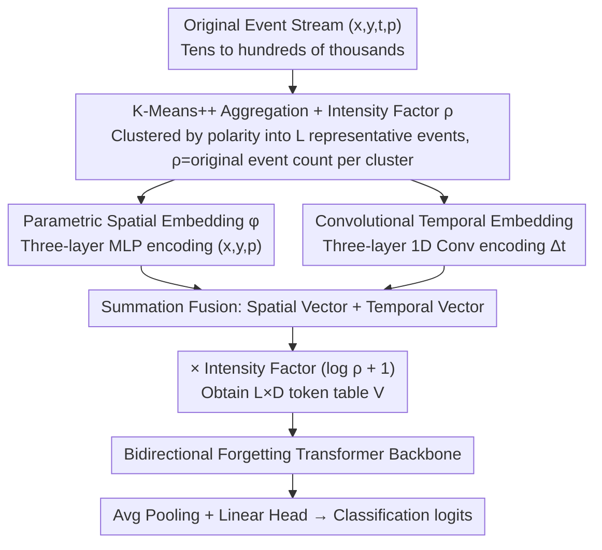

# Event2Vec: Processing Neuromorphic Events Directly by Representations in Vector Space

**Conference**: ICML 2026  
**arXiv**: [2504.15371](https://arxiv.org/abs/2504.15371)  
**Code**: https://github.com/Intelligent-Computing-Lab-Panda/event2vec  
**Area**: Neuromorphic Computing / Event Camera / Representation Learning  
**Keywords**: event camera, event2vec, Transformer, spatial embedding, K-Means aggregation  

## TL;DR
Following the word2vec philosophy, sparse asynchronous events $(x,y,t,p)$ generated by event cameras are embedded directly into a vector space. By employing Parametric Spatial Embedding + Convolutional Temporal Embedding + K-Means++ aggregation, standard Transformers can preserve the sparse asynchronous nature of events while achieving high throughput on GPUs. The parameter count is reduced to $\tfrac{1}{2.8} \sim \tfrac{1}{816}$ of previous SOTAs.

## Background & Motivation

**Background**: Event cameras (such as DVS and ATIS) output $(x,y,t,p)$ tuples in AER format—spatial coordinates + microsecond-level timestamps + binary polarity—offering ultra-high temporal resolution, low power consumption, and high dynamic range. Currently, mainstream processing follows two paths: one accumulates events into dense voxels/frames for CNNs/SNNs, while the other uses irregular models like GNNs, Sparse CNNs, or PointNet to process event streams directly.

**Limitations of Prior Work**: The densification approach discards the sparsity and microsecond temporal resolution of events, with a large number of zero pixels wasting computational resources. Irregular approaches are often incompatible with GPU parallel architectures—SNNs require synchronous simulation on GPUs, leading to slow training and an inference-training gap; Sparse CNNs struggle to fully utilize GPUs; GNNs require careful hyperparameter tuning and suffer from over-smoothing; and PointNet-style methods assume permutation invariance, downgrading timestamps to coordinates and erasing the causal order of events.

**Key Challenge**: The fundamental incompatibility between sparse-asynchrony and GPU-sync-dense architectures. One must either sacrifice data characteristics to accommodate hardware or sacrifice hardware efficiency to accommodate data.

**Goal**: To find a representation that allows event streams to retain their sparse asynchronous essence while being directly compatible with fast-running Transformers on GPUs.

**Key Insight**: The authors observe a strong analogy between events and words in NLP—(1) both consist of "index + position" (events use $(x,y,p)$ as an index and $t$ as a position; words use vocab id + sequence index); (2) index sets are finite (DVS128 has $2\times128\times128$ addresses); (3) both have a natural order (words by sentence order, events by timestamps); (4) individual elements require context for complete semantics. Since NLP accelerated after word2vec embedded discrete words into a continuous vector space, events should be treatable with a similar strategy.

**Core Idea**: Use event2vec to embed each event into a $D$-dimensional vector $\mathbf{v} = \text{Embed}_s(x,y,p) + \text{Embed}_t(\Delta t)$. The event stream is thus transformed into an $L \times D$ token sequence, which can be processed as an NLP sequence by any standard Transformer.

## Method

### Overall Architecture
Original event streams, often containing tens to hundreds of thousands of events, are first sampled or compressed to a fixed length $L$ via K-Means++ aggregation (recording the intensity factor $\rho$ for each cluster). This results in an event sequence $\{(x_i, y_i, t_i, p_i)\}$ of length $L$. These $L$ events are encoded through parallel branches of Parametric Spatial Embedding and Convolutional Temporal Embedding, summed, and multiplied by the intensity factor $(\log\rho+1)$ to form an $L\times D$ token table $\mathbf{V}$. The remaining workload is handled by a standard bidirectional Forgetting Transformer backbone (average pooling + linear head for classification logits). In other essence, event2vec "translates" sparse asynchronous events into sequences understandable by Transformers, leveraging the mature NLP backbone ecosystem.

### Key Designs

**1. Parametric Spatial Embedding $\phi$: Replacing lookup tables with continuous functions to inject "spatial proximity" priors**

Standard NLP uses a lookup table $\mathbf{W}_s \in \mathbb{R}^{(PHW)\times D}$, where indices $i$ and $i+1$ have no prior relationship. This holds for words (vocab id is non-semantic) but is awkward for events: pixels $(x,y)$ and $(x+1,y)$ are highly correlated physically, yet a lookup table forces the model to learn this from scratch. The authors replace the table with a continuous function: coordinates are normalized to $[-1,1]$ as $(\bar x, \bar y, \bar p)$ and passed through a three-layer MLP $\phi$ (dimensions $3 \to D/4 \to D/2 \to D$, with LayerNorm + ReLU). Since $\phi$ is continuously differentiable, a first-order Taylor expansion gives $\phi(x+\Delta x, y+\Delta y, p) - \phi(x,y,p) = J_\phi^{x,y} \cdot [\Delta x, \Delta y]^\top + o(\|\cdot\|)$—where closer coordinates result in embedding differences approaching zero. "Spatial proximity $\to$ embedding similarity" becomes a property of the function itself. This inductive bias is later proven critical for accuracy.

**2. 1D Convolutional Temporal Embedding based on $\Delta t$: Converting continuous non-uniform timestamps into "local density" signals**

Event timestamps are continuous and non-uniform, making RoPE/ALiBi (which assume discrete equidistant indices) unsuitable. The authors use time differences as input: normalized $\tilde t = t/\max(t)$ is first-order differenced as $\Delta t_i = \tilde t_i - \tilde t_{i-1}$, then fed into three 1D convolutions (kernel size 3, stride 1, channels $1 \to D/4 \to D/2 \to D$, with depthwise layers). Using $\Delta t$ instead of $t$ acts as "temporal pre-conditioning" (similar to residual learning), showing the network instantaneous event density. Three-point convolutions provide time-shift invariance, neighborhood context consistency, and local smoothing for noise events—the sum of $\Delta t$ within a convolution window equals the duration of a local time window, representing "local event density."

**3. Batch K-Means++ Aggregation + Intensity Factor $\rho$: Compressing events to fixed length $L$ while retaining density info**

Original event streams must be compressed to a fixed length $L$ for Transformer processing. While random sampling is a baseline, it causes significant information loss in tasks like DVS-Lip. The proposed approach performs K-Means clustering independently by polarity to obtain $L$ representative events. Each cluster's original event count is recorded as intensity factor $\rho_i$, and tokens are formed as $\mathbf{V}[i] = (\log(\rho_i)+1)\cdot(\text{Embed}_s + \text{Embed}_t)$. This preserves spatial distribution while explicitly feeding the "activity level" to the Transformer; $\log$ compression prevents high-density clusters from dominating. To avoid preprocessing bottlenecks, a batch version of K-Means++ is implemented using multi-step batch calculations to approximate sequential sampling on the GPU.

### Loss & Training
Standard cross-entropy is used for classification. On DVS-Lip, self-supervised pre-training is performed on clustered events before fine-tuning (see Appendix A.5). The backbone uses a bidirectional parameter-sharing version of the Forgetting Transformer.

## Key Experimental Results

### Main Results
Evaluated on three neuromorphic classification benchmarks: DVS Gesture, ASL-DVS, and DVS-Lip.

| Dataset | Prev. SOTA (Method / Params / Accuracy) | Event2Vec (Ours) (Params / Accuracy) | Compression Ratio |
|--------|----------------------------------|---------------------------|------------|
| DVS Gesture | Max-Former / 1.45 MB / 98.60% | 0.52 MB / 97.57±1.31% | 2.79× |
| ASL-DVS | GNN+Transformer / 220.30 MB / 99.60% | 0.27 MB / 99.91±0.05% | 815.93× |
| DVS-Lip | Spiking ResNet18+BiGRU / 223.63 MB / 75.30% | 18.30 MB / 75.88% (K-Means) | 12.22× |

Accuracy is comparable or superior across datasets, while parameters are reduced by up to several hundred times.

### Ablation Study
Cross-ablation on DVS Gesture for Spatial Embedding (Lookup vs. Parametric $\phi$) and Temporal Embedding (Sinusoidal on $t$ vs. Conv on $\Delta t$).

| Configuration | DVS Gesture Accuracy | Remarks |
|------|------------------|------|
| Std Lookup + Sinusoidal$(t)$ | Lower | Lack of inductive bias in both dimensions |
| Std Lookup + Conv$(\Delta t)$ | **Lowest** | Lack of spatial bias hinders temporal encoding |
| Parametric $\phi$ + Sinusoidal$(t)$ | Moderate | Spatial resolved but temporal assumes discrete indices |
| Parametric $\phi$ + Conv$(\Delta t)$ (Full) | **Highest** | Synergy between both neighborhood biases |

Throughput and Latency (Table 2 in original paper): Training throughput relative to previous SOTA is 4.21× / 11.96× / 35.36×; inference throughput is 2.69× / 62.67× / 5.70×; end-to-end latency reduced to 68.55% / 11.12% / 14.68% of original; memory usage reduced to 72.18% / 15.08% / 68.35%.

### Key Findings
- Spatial embedding determines the performance ceiling: Replacing standard lookup with parametric $\phi$ is the key to accuracy gains.
- Parameter efficiency: Sparse nature of events + shared spatial structure in the embedding function means the network does not require independent convolution parameters for every pixel position like a CNN.
- K-Means aggregation significantly outperforms random sampling: On DVS-Lip, accuracy improved from 70.62% to 75.88% (+5.26%).
- Robustness: Remains effective at extremely low event counts/spatial resolutions, suitable for real-time neuromorphic vision.

## Highlights & Insights
- Successfully transplants the "paradigm unlocked by word2vec for NLP" to event cameras: embed discrete sparse symbols into a continuous vector space and leverage the existing Transformer ecosystem. This "paradigm shift" is more impactful than incremental improvements to SNN or GNN algorithms.
- Replaces discrete lookup tables with a continuously differentiable MLP and provides a formal proof of neighborhood inductive bias via Taylor expansion. This elegant formulation is generalizable to any scenario with topological structure in index space (e.g., 3D voxels, radar points).
- The intensity factor $\rho \to \log(\rho)+1$ is a small but critical detail: it retains density info while preventing high-density tokens from overwhelming the sequence.
- Batch K-Means++ transforms a traditional iterative algorithm into a GPU-friendly one, pulling the "preprocessing bottleneck" into the GPU pipeline.

## Limitations & Future Work
- The backbone currently relies on the Forgetting Transformer; replacing it with standard linear attention slightly reduces accuracy.
- Sequence length $L$ is pre-fixed, requiring retraining for adaptive event quantities; dynamic length schemes were not demonstrated.
- Validation is limited to classification; performance in killer apps for event cameras (optical flow, HDR reconstruction, SLAM, tracking) remains unknown.
- The intensity factor $\rho$ uses simple $\log$ compression; learnable density encodings and systematic sweeps for the optimal $L$ were not explored.

## Related Work & Insights
- **vs EventNet (Sekikawa 2019)**: Both decouple events into "spatial-polarity address + relative time." EventNet uses lookup tables $h(\mathbf{e})$ + handcrafted temporal functions with PointNet-style max aggregation for asynchronous CPU inference. Event2Vec uses learnable continuous $\phi$ + Conv for $\Delta t$ for synchronous GPU Transformer training/inference.
- **vs Sparse CNN / GNN / PointNet-style**: These process irregular data directly but suffer from low GPU utilization; Event2Vec maps irregular data to a regular $L\times D$ tensor space to exploit GPU parallelism.
- **vs Event-Frame (Max-Former, SNN+Frame, etc.)**: Densification methods have high accuracy but large parameter counts and sacrifice temporal resolution; Event2Vec retains microsecond timestamps with 1~3 orders of magnitude higher parameter efficiency.

## Rating
- Novelty: ⭐⭐⭐⭐ Innovative analogy to word2vec with matching parametric and convolutional embeddings.
- Experimental Thoroughness: ⭐⭐⭐⭐ Multiple benchmarks + full dimension comparison of throughput/latency/memory + ablation of embedding combinations.
- Writing Quality: ⭐⭐⭐⭐ Clear narrative using the word↔event analogy, well-coordinated formulas and figures.
- Value: ⭐⭐⭐⭐ Opens a path for the Event-Transformer ecosystem with significant parameter compression (2~800x).

<!-- RELATED:START -->

## Related Papers

- [\[ICML 2026\] MIC: Maximizing Informational Capacity in Adaptive Representations via Isotropic Subspace Alignment](mic_maximizing_informational_capacity_in_adaptive_representations_via_isotropic_.md)
- [\[ICML 2026\] Exploiting Weight-Space Symmetries for Approximating Curvature](exploiting_weight-space_symmetries_for_approximating_curvature.md)
- [\[ICML 2026\] ArcVQ-VAE: A Spherical Vector Quantization Framework with ArcCosine Additive Margin](arcvq-vae_a_spherical_vector_quantization_framework_with_arccosine_additive_marg.md)
- [\[ICLR 2026\] LLM DNA: Tracing Model Evolution via Functional Representations](../../ICLR2026/model_compression/llm_dna_tracing_model_evolution_via_functional_representations.md)
- [\[ICML 2026\] xKV: Cross-Layer KV-Cache Compression via Aligned Singular Vector Extraction](xkv_cross-layer_kv-cache_compression_via_aligned_singular_vector_extraction.md)

<!-- RELATED:END -->
