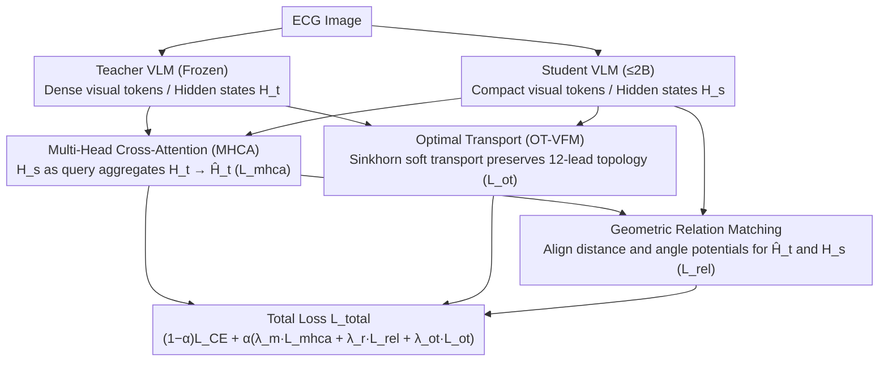

# EVL-ECG: Efficient ECG Interpretation With Multi-Aspect Heterogeneous Knowledge Distillation

**Conference**: ICML 2026  
**arXiv**: [2605.29977](https://arxiv.org/abs/2605.29977)  
**Code**: To be confirmed  
**Area**: Medical Imaging / VLM Distillation / ECG Interpretation  
**Keywords**: ECG Foundation Models, Cross-Architecture Knowledge Distillation, Multi-Head Cross-Attention, Optimal Transport, Geometric Relation Matching

## TL;DR
Addressing the VLM distillation problem for ECG interpretation—where teacher and student models are heterogeneous in visual token count, tokenizers, and sequence lengths—EVL-ECG introduces a cross-architecture distillation framework combining "Multi-Head Cross-Attention Alignment + Optimal Transport Visual Feature Matching + Geometric Intra-Architecture Matching." This pushes a 2B student model to SOTA, achieving a 2.4% higher AUC and 1.1% higher clinical accuracy than existing KD methods.

## Background & Motivation

**Background**: VLM-based ECG interpretation has evolved from simple classification to generative clinical reporting (Khunte 2024, Liu 2024b, etc.). However, frontier VLMs are large and slow, making bedside or edge deployment impractical. Knowledge Distillation (KD) is a standard compression solution, with existing work exploring cross-tokenizer and cross-modal KD (Boizard 2025, Feng 2025).

**Limitations of Prior Work**: Distilling a giant VLM teacher into a small LM student faces two independent yet entangled obstacles:
- **Heterogeneous Tokenizers**: Teacher and student use different vocabularies, meaning output probabilities cannot be directly aligned.
- **Unbalanced Visual Token Counts**: The teacher's visual encoder produces dense tokens (e.g., 256 tokens from ViT-L), while the student's lightweight encoder produces only 64 tokens, leading to sequence length mismatch.
- Existing KD methods treat these issues **in isolation**, limiting the potential of using modern, efficient SLMs as backbones.

**Key Challenge**: ECG interpretation relies heavily on fine-grained morphology (P-QRS-T intervals, ST shifts, electrical axis direction). Rigid point-to-point alignment between dense and sparse visual tokens is both impossible (length mismatch) and incorrect (semantic mismatch). Furthermore, the global spatial topology of the ECG (12-lead layout) must be preserved; pointwise alignment risks confusing V1-V6 chest leads with I-III limb leads.

**Goal**: (1) Solve the dual heterogeneity of tokenizers and visual tokens; (2) Preserve global spatial structure (lead layout, waveform topology); (3) Achieve SOTA performance with $\le$ 2B parameters.

**Key Insight**: Distillation is decomposed into three levels—pointwise (feature-level, using multi-head cross-attention for adaptive aggregation), distributional (visual feature-level, using optimal transport for soft alignment), and relational (structural-level, matching geometric distances and angular relationships). These three levels are complementary, targeting different diagnostic dimensions of the ECG.

**Core Idea**: Use MHCA to let the student adaptively aggregate teacher dense representations via its own queries; use entropic OT to perform soft alignment on visual tokens to preserve global topology; use distance/angle relational matching to preserve the teacher's inherent diagnostic "geometric manifold."

## Method

### Overall Architecture

EVL-ECG aims to compress a massive frontier VLM teacher into a small $\le$ 2B student. The difficulty lies in the inherently unaligned visual representations—the teacher produces $L_t$ dense tokens while the student has $L_s$ compact tokens. With heterogeneous tokenizers and sequence lengths, direct alignment is impossible. The solution is a distillation framework with three complementary signals: a feature level where the student adaptively aggregates teacher context (MHCA), a distribution level using optimal transport for soft alignment of visual tokens (OT-VFM), and a relational level matching geometric structures between hidden states (Geometric Relation). Combined with standard cross-entropy, the total loss is defined as:

$$\mathcal{L}_{\text{total}} = (1-\alpha)\mathcal{L}_{\text{CE}} + \alpha\big(\lambda_m \mathcal{L}_{\text{mhca}} + \lambda_r \mathcal{L}_{\text{rel}} + \lambda_{\text{ot}}\mathcal{L}_{\text{ot}}\big),$$

Each of the three KD terms targets a specific diagnostic granularity; removing any one leads to performance degradation.

### Key Designs

**1. Multi-Head Cross-Attention Alignment (MHCA): Enabling the student to extract teacher information under length mismatch**

The primary pain point is $L_s \neq L_t$, making rigid pointwise alignment infeasible and truncation/padding lossy. MHCA uses the student hidden states $H_s$ as queries and teacher hidden states $H_t$ as keys/values to "project" the teacher's dense representation into a version equal in length to the student: $\hat H_t = \text{Concat}(\text{head}_1, \dots, \text{head}_h) W^O$, where each head computes $\text{Softmax}\big((H_s W_i^Q)(H_t W_i^K)^\top/\sqrt{d_k}\big)(H_t W_i^V)$. The student is then pulled toward this aggregated context via $\mathcal{L}_{\text{mhca}} = \frac{1}{B \cdot L_s}\sum \|H_s - \hat H_t\|_2^2$. This allows the student to dynamically "extract" the most useful teacher information (e.g., local ectopic beats, subtle ST shifts) rather than passively accepting a fixed mapping. The paper notes that this aggregation is mathematically equivalent to the barycentric projection of entropy-regularized OT—making it the foundational feature-level distilled component.

**2. Optimal Transport Visual Feature Matching (OT-VFM): Preserving global 12-lead topology via soft transport**

In ECG images, location itself encodes diagnostic information—V1 is near the right atrium, while V5/V6 reflect the left ventricle. Pointwise matching is dangerous as length mismatch can cause chest leads to be incorrectly aligned with limb leads, disrupting spatial topology. OT-VFM treats teacher/student visual tokens as uniform empirical distributions $\mu, \nu$ and solves an entropic OT problem to find the optimal transport plan $\mathbf{P}^\star_\varepsilon = \arg\min_\mathbf{P} \langle \mathbf{P}, C\rangle - \varepsilon \mathcal{H}(\mathbf{P})$ (via Sinkhorn iterations). Distillation is then performed using $\mathcal{L}_{\text{ot}} = \sum_{i,j} P^\star_{\varepsilon, ij} \|t_i - s_j\|_2^2$. The soft transport plan naturally handles different token counts and implicitly encodes which student tokens should inherit which teacher regions, preserving the global spatial structure.

**3. Geometric Intra-Architecture Relation: Preserving the diagnostic manifold by aligning structures**

ECG diagnosis inherently relies on structural topology and temporal relationships (e.g., P→QRS interval, ST orientation, segment ratios). Simple token reconstruction ignores these global geometries. This module does not directly align hidden states but calculates pairwise relationship potentials within each architecture and aligns the two sets of relations. Two potentials are defined for hidden state sequence $H$: distance potential $\psi_D$ (mean-normalized pairwise Euclidean distance) and angle potential $\psi_A$ (pairwise cosine similarity). Matching is done via $\mathcal{L}_k = \frac{1}{B \cdot L_s^2} \sum \|\psi_k(\hat H_t^{(i)}, \hat H_t^{(j)}) - \psi_k(H_s^{(i)}, H_s^{(j)})\|^2$ for $k \in \{D, A\}$, resulting in $\mathcal{L}_{\text{rel}} = \tfrac{1}{2}(\mathcal{L}_D + \mathcal{L}_A)$. These potentials correspond to "interval duration" and "electrical axis orientation," ensuring that the teacher's latent clustering of arrhythmias is transferred to the student, significantly benefiting the detection of complex arrhythmias like AFib with LBBB.

## Key Experimental Results

### Main Results: Across ECG Benchmarks

| Dataset | Metric | Random | GPT-4o | Claude 3.5 | LLaVA-Med | **EVL-ECG (2B)** |
|------|------|-------|--------|----------|----------|--------------|
| PTB-XL-Super | AUC | 50.3 | 55.6 | 54.0 | 67.3 | **75.4** |
| PTB-XL-Super | F1 | 33.2 | 28.3 | 27.5 | 45.6 | **51.2** |
| CODE-15% | AUC | 48.8 | 59.9 | 58.3 | 70.1 | **78.6** |
| ECG-QA | Accuracy | 16.2 | 35.2 | 34.2 | 47.5 | **51.8** |
| MMMU-ECG | Accuracy | 24.2 | 43.5 | 42.0 | 51.3 | **55.8** |

EVL-ECG with 2B parameters outperforms general frontier VLMs like GPT-4o/Claude 3.5 and open-source medical VLMs like LLaVA-Med across all benchmarks.

### Ablation Study (PTB-XL-Super AUC)

| Configuration | AUC | Δ |
|------|------|---|
| Full EVL-ECG | 75.4 | – |
| − MHCA | 71.8 | −3.6 |
| − OT-VFM | 73.2 | −2.2 |
| − Geometric Relation | 73.6 | −1.8 |
| CE Only (Baseline Student) | 68.3 | −7.1 |

All three modules are indispensable; MHCA provides the largest contribution as the feature-level foundation, while OT and geometric matching provide essential refinements.

### Comparison with KD Methods

| KD Method | AUC | Clinical Accuracy |
|---------|------|----------|
| Vanilla KL | 71.0 | 64.1 |
| TinyBERT | 72.2 | 64.7 |
| Cross-tokenizer KD (Boizard 2025) | 73.0 | 65.4 |
| **EVL-ECG** | **75.4** | **66.5** |

Ours achieves a +2.4 AUC and +1.1 clinical accuracy improvement over the strongest baseline.

### Key Findings
- **Complementary Three-Tier KD**: Feature-level MHCA, distributional OT, and relational Geometric modules each handle a different granularity; removing any leads to performance drops.
- **2B Student Outperforms Frontier VLMs**: In specialized tasks like ECG, a small model with effective KD can surpass general-purpose large models.
- **OT Preserves Global Topology**: Ablating OT leads to lead-position confusion (supported by qualitative cases).
- **Relational Matching Captures Diagnostic Reasoning**: Removing it results in a marked decline in identifying complex multi-segment arrhythmias (e.g., AFib + LBBB).

## Highlights & Insights
- **Generalizable Three-Tier KD Paradigm**: The combination of MHCA (pointwise) + OT (distributional) + Relation (structural) serves as a template for any scenario involving heterogeneous architectures where multi-granular structure must be preserved.
- **Elegance of OT for Token Mismatch**: Unlike truncation or padding which lose information, OT’s soft transport allows full alignment even when sequence lengths differ.
- **Clinical Significance of Relational Matching**: Distance and angle potentials directly map to "interval duration" and "electrical axis," aligning theoretical design with clinical reality.
- **Insight into MHCA as Barycentric Projection**: Reinterpreting attention as an OT projection provides a unified mathematical perspective for KD design.

## Limitations & Future Work
- Only validated on 2D image representations of ECG; it remains to be seen if this is effective for raw 1D signals and time-series backbones.
- The three loss weights $\lambda$ were determined via grid search; adaptive balancing methods (like GradNorm) might reduce hyperparameter tuning.
- The teacher model is a closed-source frontier VLM; using an open-source ECG-specific model as a teacher might lead to different optimal design choices.
- While the student is 2B, failure modes of more aggressive compression (< 1B) have not been studied.
- Integration tests on other physiological signals (e.g., EEG) are missing, leaving method universality to be verified.

## Related Work & Insights
- **vs. Traditional KD (Vanilla KL / TinyBERT)**: These work on homogeneous architectures and fail when tokenizers or visual token counts differ.
- **vs. Cross-tokenizer KD (Boizard 2025)**: Previous work only addressed tokenizer heterogeneity; EVL-ECG addresses dual heterogeneity.
- **vs. RKD (Relational KD, Park 2019)**: The proposed geometric matching is an instantiation of RKD for ECG, specifically adding an angle potential for electrical axis characteristics.
- **Insight**: Deployment of medical VLMs is often limited by frontier model size; the three-tier KD paradigm presented here can be extended to other medical imaging VLMs such as radiology, pathology, and dermoscopy.

## Rating
- Novelty: ⭐⭐⭐⭐ The combination of MHCA, OT, and Geometric Relation is novel, though individual modules have precedents.
- Experimental Thoroughness: ⭐⭐⭐⭐⭐ Comprehensive coverage across 7 benchmarks, comparisons with frontier VLMs, ablation studies, and comparisons with existing KD methods.
- Writing Quality: ⭐⭐⭐⭐ Clear framework diagrams, well-defined formulas, and insightful theoretical connections (MHCA = barycentric projection).
- Value: ⭐⭐⭐⭐⭐ Bedside ECG interpretation is a high-value clinical scenario; a 2B SOTA model is directly deployable on edge devices.

<!-- RELATED:START -->

## Related Papers

- [\[ICCV 2025\] Fuse Before Transfer: Knowledge Fusion for Heterogeneous Distillation](../../ICCV2025/model_compression/fuse_before_transfer_knowledge_fusion_for_heterogeneous_distillation.md)
- [\[ICLR 2026\] Exploring Knowledge Purification in Multi-Teacher Knowledge Distillation for LLMs](../../ICLR2026/model_compression/exploring_knowledge_purification_in_multi-teacher_knowledge_distillation_for_llm.md)
- [\[ICCV 2025\] Perspective-Aware Teaching: Adapting Knowledge for Heterogeneous Distillation](../../ICCV2025/model_compression/perspective-aware_teaching_adapting_knowledge_for_heterogeneous_distillation.md)
- [\[AAAI 2026\] Error Correction in Radiology Reports: A Knowledge Distillation-Based Multi-Stage Framework](../../AAAI2026/model_compression/error_correction_in_radiology_reports_a_knowledge_distillation-based_multi-stage.md)
- [\[ICML 2026\] Unifying Dataset Pruning and Distillation for Efficient Large-scale Compression](unifying_dataset_pruning_and_distillation_for_efficient_large-scale_compression.md)

<!-- RELATED:END -->
