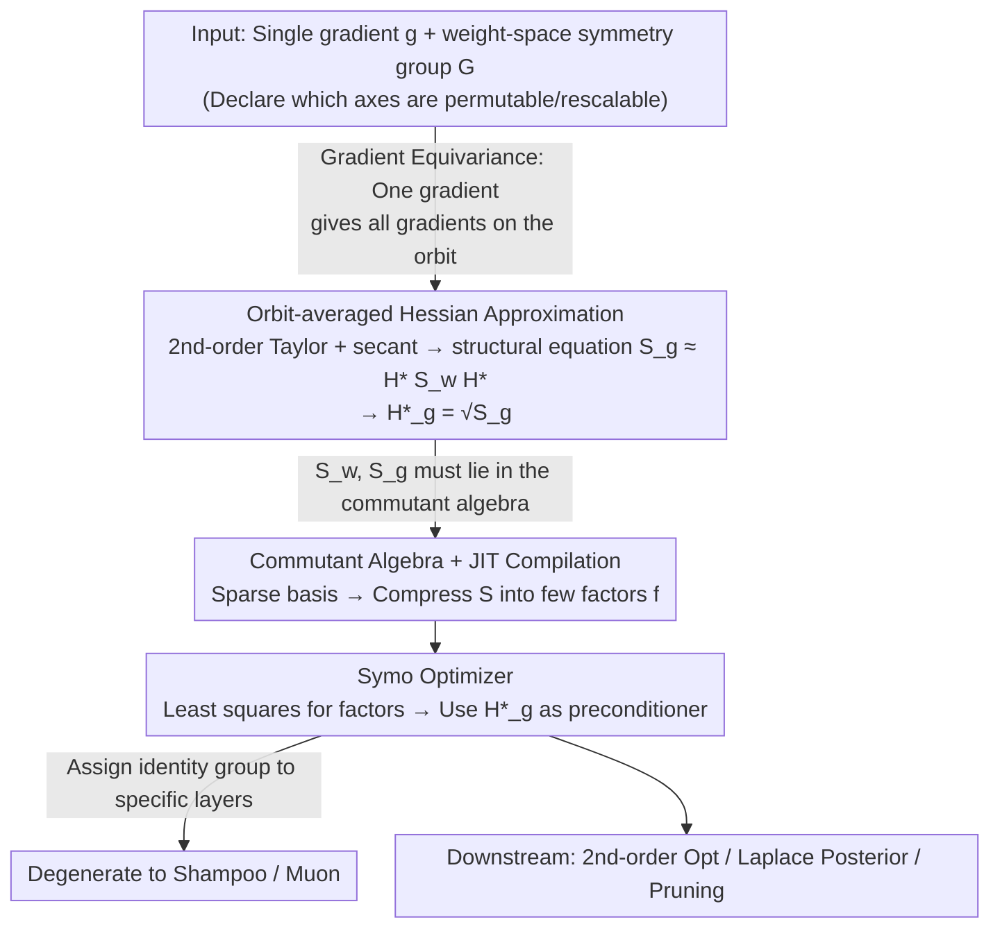

# Exploiting Weight-Space Symmetries for Approximating Curvature

**Conference**: ICML 2026  
**arXiv**: [2606.00442](https://arxiv.org/abs/2606.00442)  
**Code**: https://github.com/mtkresearch/symm_opt  
**Area**: Optimization / Second-order Optimizers / Geometry & Algebra  
**Keywords**: Hessian Approximation, Weight-Space Symmetry, Orbit Averaging, Shampoo, Muon  

## TL;DR
This paper proves that by exploiting the invariance of neural network loss to "weight-space symmetry groups" (such as parameter rearrangement/rescaling) and performing orbit averaging on a single gradient, a highly structured Hessian approximation—cheap to store and invert—can be analytically derived. Furthermore, Shampoo and Muon are shown to be special cases where an "identity group" is assigned to specific layers, thereby integrating these empirical optimizers into a unified symmetry-curvature framework.

## Background & Motivation
**Background**: From second-order optimization (gradient preconditioning to accelerate convergence), Bayesian deep learning (Laplace posterior), and continual learning (protecting important directions) to pruning/compression (scoring via curvature), many subfields of machine learning treat the "efficient estimation of the (inverse) curvature of the loss" as a core component. In engineering, "block-diagonal + Kronecker decomposition" approximations like KFAC, Shampoo, and Soap are the mainstream to keep storage/inversion costs feasible.

**Limitations of Prior Work**: The reasons behind the effectiveness of these methods have been patched together post-hoc—some claim Shampoo is a Gauss-Newton approximation, while others view it as equivalent to spectral descent. However, there is no unified principle that dictates which structures should appear in Hessian approximations, how many parameters can be saved, or why such savings are justified.

**Key Challenge**: The loss of a neural network is explicitly invariant to many weight transformations (e.g., arbitrary permutations of hidden neurons, sign permutations in tanh networks, synchronized permutations of autoencoder inputs/outputs). This "seemingly obvious" invariance is almost never utilized in curvature estimation. While Kunin (2020) and Ziyin (2023) proved that the Hessian at critical points inherits these symmetries, no one has applied this structure to "Hessian approximations at arbitrary points during training."

**Goal**: Starting from the weight-space symmetry group, construct a Hessian approximator that can be computed from a single gradient, is cheap to store/invert, and allows for a continuous trade-off between accuracy and cost based on the size of the symmetry group, while explaining Shampoo/Muon as special cases within this framework.

**Key Insight**: Loss invariance $\mathcal{L}(\bm w)=\mathcal{L}(A\bm w)$ directly implies gradient equivariance $\nabla\mathcal{L}(A\bm w)=A\nabla\mathcal{L}(\bm w)$. Thus, a single gradient along a group orbit "automatically informs" us of all gradients along that entire orbit. Curvature information is naturally embedded within the orbit and only needs to be "analytically extracted."

**Core Idea**: Combine the secant condition with second-order Taylor expansion to perform averaging over the group orbit, yielding the structural equation $S_{\bm g}\approx H^\star S_{\bm w}H^\star$. Since the solution is proved to be a linear combination of a low-dimensional basis within the commutant algebra, it is possible to store only "factors" rather than full matrices.

## Method

### Overall Architecture
The problem addressed is how to obtain a Hessian approximation that is both accurate and economical using only a single gradient calculation, without empirically assuming specific Kronecker structures as in KFAC/Shampoo. The logic chain is: "Loss symmetry group $\implies$ gradient equivariance $\implies$ orbit averaging to yield structural equation $\implies$ commutant algebra provides a sparse basis $\implies$ least squares solving for factors $\implies$ applying secant conditions to get PSD approximation $\implies$ changing the group recovers Symo / Shampoo / Muon." Schur-Weyl duality is used throughout to link "groups" and "algebras."

Specifically, let the network parameters be $\bm w=[\text{vec}(B);\text{vec}(C);\dots]$, where each tensor undergoes group action along its axes: $\bm v\to(\bigotimes_k A_{i(k)})\bm v$. The authors define the first-order orbit average $\mathcal{R}_1(\bm v,\mathcal{G})\equiv\mathbb{E}_{\mathcal{G}}[(\bigotimes_k A_{i(k)})\bm v]$ and the second-order orbit average $\mathcal{R}_2(\bm v,\bm v',\mathcal{G})\equiv\mathbb{E}_{\mathcal{G}}[(\bigotimes_k A_{i(k)})\bm v{\bm v'}^\top(\bigotimes_k A_{i'(k)})^\top]$. The former converges to the orbit "center" $\bm w^\star\equiv\mathcal{R}_1(\bm w,\mathcal{G})$, while the latter lies in the commutant algebra and is weighted by a small set of sparse basis tensors. Expanding the second-order Taylor series around $\bm w^\star$ and averaging over the orbit upgrades the secant condition $\bm g-\bm g^\star\approx H^\star(\bm w-\bm w^\star)$ into the structural equation $S_{\bm g}\approx H^\star S_{\bm w}H^\star$. This is solved for the unique PSD solution or simplified to $H^\star_{\bm g}=S_{\bm g}^{1/2}$ under $S_{\bm w}\propto I$. Ultimately, the trade-off between accuracy and cost is controlled by the "larger group, longer orbit, lower commutant dimension" principle.

### Key Designs

**1. Orbit-averaged Hessian approximation $H^\star_{\bm g}=S_{\bm g}^{1/2}$ (Function/Novelty): Extracting curvature analytically from a single gradient**

Methods like KFAC require specific estimation of block-diagonal terms $A$ and $G$ to assemble the curvature. This paper takes a different approach: Taylor expansion is performed around the orbit center $\bm w^\star\equiv\mathcal{R}_1(\bm w,\mathcal{G})$, writing $A(\bm g-\bm g^\star)\approx H^\star A(\bm w-\bm w^\star)$ for all $A\in\mathcal{G}$. Averaging the outer product over the orbit yields the structural equation $S_{\bm g}\approx H^\star S_{\bm w}H^\star$, whose positive-definite solution is $H^\star_{\text{PD}}=S_{\bm w}^{-1/2}(S_{\bm w}^{1/2}S_{\bm g}S_{\bm w}^{1/2})^{1/2}S_{\bm w}^{-1/2}$. Since $S_{\bm w}$ is often rank-deficient, the authors found that simplifying to $H^\star_{\bm g}=S_{\bm g}^{1/2}$ (assuming $S_{\bm w}\approx cI$) maintains accuracy while only requiring the estimation of $S_{\bm g}$. This works because loss invariance implies gradient equivariance; a single gradient naturally encodes curvature within its orbit. Lemma C.1 bounds the secant error by $\tfrac{M}{2}\|\bm w-\bm w^\star\|^2$, where $\|\bm w-\bm w^\star\|$ increases with group size—providing an analytical basis for the accuracy-cost trade-off.

**2. Commutant algebra + JIT compilation for sparse decomposition of $S_{\bm v\bm v'}$ (Design Motivation/Mechanism): Compressing estimation into a few factors**

Storing $S_{\bm w}$ and $S_{\bm g}$ as dense matrices would revert to $O(P^2)$ complexity. The key observation in Lemma 3.1 is that $AS_{\bm v\bm v'}A^\top=S_{\bm v\bm v'}$ holds for all $A\in\mathcal{G}$, forcing $S_{\bm v\bm v'}$ to reside in the group's commutant algebra. This algebra has a natural sparse basis (Kronecker products of identity and all-ones tensors). Thus, $S$ is represented as a linear combination of a few sparse binary tensors, reducing the estimation task to finding the coefficients—the factors $f$. For a toy MLP, the hidden layer permutation group uses 32 factors; sign permutations in a tanh network reduce this to 16; autoencoder input-output synchronized permutations reduce it further to 4. The JIT compiler automates the translation of symbolic symmetry declarations into PyTorch graphs, turning empirical design into a provable algebraic enumeration.

**3. Symo optimizer and its degradation to Shampoo / Muon (Novelty): A unified derivation for empirical optimizers**

With structured curvature, the Symo update is defined as $\bm w_{t+1}=\bm w_t-\eta (H^\star_{\bm g})^{-1}\bm g_t$. Factors are obtained via the least-squares solution $\bm f^\star=\arg\min_{\bm f}\|S(\bm f)-\bm v{\bm v'}^\top\|_F^2$ (Lemma 3.2). Lemma 3.3 further demonstrates that if a block's curvature follows $I\otimes F$ or $F\otimes I$, Symo simplifies to whitened Shampoo or Muon. This degradation is triggered by "assigning identity groups to certain layers" (e.g., embedding dimensions). This provides a third explanation for Shampoo/Muon: they are neither mere "Gauss-Newton approximations" nor "polar decompositions," but rather "sweet spots" that sacrifice certain symmetries for computational efficiency.

### Loss & Training
No additional training objectives are introduced. The Hessian approximation is simply integrated into existing second-order preconditioners. Experiments utilize Symo for second-order optimization in MLPs/Transformers and comparative analysis on a small language model.

## Key Experimental Results

### Main Results: Hessian Approximation Accuracy (Secant Cosine Similarity)
The experiment measures the cosine similarity (ideal = 1.0) between $\hat H(\bm w'-\bm w)$ and the true difference $\bm g'-\bm g$ along training trajectories. Fig. 4 in the paper reports that "$H^\star_{\bm g}(\text{BD})$ aligns perfectly with Shampoo in the gradient direction," validating Lemma 3.3.

| Approximator | Analytical Form | Storage/Inversion Complexity | Random Direction Cosine | Gradient Direction Cosine |
|--------------|-----------------|-----------------------------|-------------------------|--------------------------|
| True Hessian $H$ | $\nabla^2\mathcal{L}(\bm w)$ | $O(P^2)$ | 1.0 (Ref) | 1.0 (Ref) |
| Centered Hessian $H^\star$ | $\nabla^2\mathcal{L}(\bm w^\star)$ | $O(P^2)$ | Close to $H$ | Close to $H$ |
| $H^\star_{\text{PD}}$ (Eq. 10) | PSD Solution | $O$(\# factors) | Similar to $H^\star_{\bm g}$ | Better than BD |
| $H^\star_{\bm g}$ (Eq. 11) | $S_{\bm g}^{1/2}$ | $O$(\# factors) | Strong | Strong |
| $H^\star_{\bm g}(\text{BD})$ | Block-diagonal | $O(\sum \text{blocks})$ | Moderate | Matches Shampoo perfectly |
| Shampoo | $L^{1/4}_t G_t R^{1/4}_t$ | $O(n^2+m^2)$ per block | Moderate | Matches $H^\star_{\bm g}(\text{BD})$ perfectly |

### Ablation Study: Group Size vs. Factor Count (Toy MLP $C\in\mathbb{R}^{3\times 4}$)
The authors demonstrate the "larger group, fewer factors" trade-off using commutant dimensions of $S_{\bm{cc}}$.

| Structure / Symmetry Group | $S_{\bm{cc}}$ Analytical Form | Basis Terms | Total Factors |
|----------------------------|-------------------------------|-------------|---------------|
| ReLU MLP, Hidden Permutation $\mathcal{G}_1$ | $S_{mnop}=\delta_{mo}f^{(1)}_{np}+\bm{1}_{mo}f^{(2)}_{np}$ | 2 | 32 |
| tanh MLP, Sign Permutation | $S_{mnop}=\delta_{mo}f_{np}$ | 1 | 16 |
| Autoencoder Sync Permutation | $\mathbb{E}_{A_1,A_2}[(A_1\otimes A_2)\bm c\bm c^\top(A_1\otimes A_2)^\top]$ | Sparse Multi-basis | 4 |

### Key Findings
- **Continuous Trade-off**: The shift from 32 $\to$ 16 $\to$ 4 factors matches symmetry enhancements. Lemma C.1 confirms that $\|\bm w-\bm w^\star\|$ increases monotonically, providing principled guidance for selecting groups based on computational budgets.
- **Unified Shampoo/Muon Explanation**: The perfect alignment of $H^\star_{\bm g}(\text{BD})$ and Shampoo in gradient directions proves that these optimizers succeed by targeting the "sweet spot" of symmetric structures.
- **Efficiency of $H^\star_{\bm g}$**: $H^\star_{\bm g}$ is cheaper than $H^\star_{\text{PD}}$ and exhibits similar accuracy, as simplifying $S_{\bm w}\approx cI$ avoids numerical instability from rank deficiency.
- **Structural Visualization**: In Transformer examples, the normalized $\mathcal{R}_2(\bm g,\bm g,\mathcal{G})$ exhibits visual patterns consisting of a few colors, confirming that curvatures remain highly structured and can be described by minimal factors.

## Highlights & Insights
- **Geometrization of Engineering**: Choosing Kronecker structures is transformed from intuition-based design into "symmetry group selection," enabling principled enumeration of valid structures via Schur-Weyl duality.
- **Symmetry Perspective on Shampoo/Muon**: These are not just approximations; they are the exact solutions when identity groups are assigned to specific layers, suggesting unexplored "finer groups" between Shampoo and full KFAC.
- **JIT Engineering**: Automatically mapping symbolic symmetries to PyTorch computational graphs allows arbitrary networks to obtain Hessian approximations with zero manual engineering.
- **Dual-Track Approach**: Presenting both the elegant $H^\star_{\text{PD}}$ and the practical $H^\star_{\bm g}$ provides a clear view of the trade-offs between theoretical completeness and engineering utility.

## Limitations & Future Work
- **Assumed Exact Invariance**: The framework assumes loss is perfectly invariant under the group, but real-world components (biases, LayerNorm, residuals) often break or approximate these symmetries.
- **Empirical Simplification**: The reliance on $S_{\bm w}\propto I$ is mostly empirical; the conditions under which $H^\star_{\bm g}$ fails compared to $H^\star_{\text{PD}}$ lack quantitative bounds.
- **Scalability Barriers**: While tested on small LMs, a full comparison of end-to-end time, peak VRAM, and convergence curves on trillion-parameter models is missing.
- **Gradient Noise**: The estimation uses $S_{\bm g}$ from a single (likely noisy) mini-batch gradient; the interaction between mini-batch noise and symmetry-based factor estimation remains unanalyzed.
- **Downstream Validation**: Applications in Laplace approximation, continual learning, and pruning are described as promising but lack extensive empirical proof.

## Related Work & Insights
- **vs. Bernacchia (2025)**: While both use averaging to find curvature, Bernacchia averages over random initializations to find "global curvature," whereas this work operates on a single model at any training point using orbit averaging.
- **vs. KFAC / Shampoo / Soap**: Instead of pre-fixing "block-diagonal + Kronecker" structures, this work derives legitimate structures from loss-invariant groups, turning "empirical design" into "algebraic enumeration."
- **vs. Symmetry-Hessian Theorems (Kunin, Ziyin)**: Previous works only proved symmetry inheritance at critical points; this work extends the structure to arbitrary points during training and provides a computable algorithm.
- **vs. Quasi-Newton (L-BFGS)**: Traditional quasi-Newton methods require historical gradient sequences to build rank; Symo extracts structured curvature from a single gradient via group orbits, making it better suited for online optimization in large models.

## Related Papers

- [\[CVPR 2025\] Tripartite Weight-Space Ensemble for Few-Shot Class-Incremental Learning](../../CVPR2025/model_compression/tripartite_weight-space_ensemble_for_few-shot_class-incremental_learning.md)
- [\[ICML 2026\] Partial Fusion of Neural Networks: Efficient Tradeoffs Between Ensembles and Weight Aggregation](partial_fusion_of_neural_networks_efficient_tradeoffs_between_ensembles_and_weig.md)
- [\[ICML 2026\] Event2Vec: Processing Neuromorphic Events Directly by Representations in Vector Space](event2vec_processing_neuromorphic_events_directly_by_representations_in_vector_s.md)
- [\[NeurIPS 2025\] On the Hardness of Approximating Distributions with Tractable Probabilistic Models](../../NeurIPS2025/model_compression/on_the_hardness_of_approximating_distributions_with_tractable_probabilistic_mode.md)
- [\[ICLR 2026\] Revisiting Weight Regularization for Low-Rank Continual Learning](../../ICLR2026/model_compression/revisiting_weight_regularization_for_low-rank_continual_learning.md)

<!-- RELATED:END -->

<!-- RELATED:START -->

## Related Papers

- [\[CVPR 2025\] Tripartite Weight-Space Ensemble for Few-Shot Class-Incremental Learning](../../CVPR2025/model_compression/tripartite_weight-space_ensemble_for_few-shot_class-incremental_learning.md)
- [\[ICML 2026\] Partial Fusion of Neural Networks: Efficient Tradeoffs Between Ensembles and Weight Aggregation](partial_fusion_of_neural_networks_efficient_tradeoffs_between_ensembles_and_weig.md)
- [\[NeurIPS 2025\] On the Hardness of Approximating Distributions with Tractable Probabilistic Models](../../NeurIPS2025/model_compression/on_the_hardness_of_approximating_distributions_with_tractable_probabilistic_mode.md)
- [\[ICML 2026\] Event2Vec: Processing Neuromorphic Events Directly by Representations in Vector Space](event2vec_processing_neuromorphic_events_directly_by_representations_in_vector_s.md)
- [\[ICLR 2026\] Revisiting Weight Regularization for Low-Rank Continual Learning](../../ICLR2026/model_compression/revisiting_weight_regularization_for_low-rank_continual_learning.md)

<!-- RELATED:END -->
