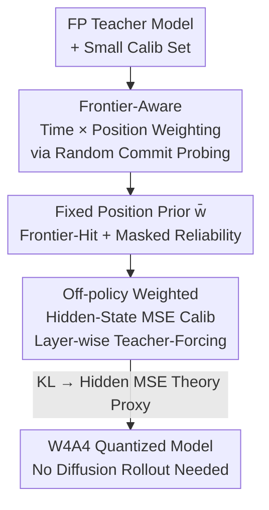

# FAIR-Calib: Frontier-Aware Instability-Reweighted Calibration for Post-Training Quantization of Diffusion Large Language Models

**Conference**: ICML2026  
**arXiv**: [2606.06547](https://arxiv.org/abs/2606.06547)  
**Code**: TBD  
**Area**: Model Compression / Quantization  
**Keywords**: Post-Training Quantization, Diffusion Large Language Models, W4A4, Calibration, KL Proxy Objective

## TL;DR
Addressing the "write-once, no-edit" vulnerability in Diffusion Large Language Models (dLLMs), FAIR-Calib utilizes a full-precision teacher to detect a "frontier-aware position prior." This prior is then applied as weights for layer-wise hidden-state MSE calibration. By specifically protecting boundary tokens that, once flipped by quantization errors, would be permanently locked and amplified, FAIR-Calib consistently outperforms existing quantization baselines under W4A4 on LLaDA and Dream.

## Background & Motivation
**Background**: Diffusion Large Language Models (dLLMs, e.g., LLaDA, Dream) initialize an entire response as `[MASK]` and perform multi-step denoising via bidirectional attention. Each step "unmasks" certain positions into specific tokens. This represents a promising alternative to autoregressive decoding, but the multi-step global refinement incurs heavy computational and memory costs, making Post-Training Quantization (PTQ) crucial for deployment.

**Limitations of Prior Work**: Directly applying classic low-bit PTQ from autoregressive LLMs (such as RTN, QuaRot, or FlatQuant) to dLLMs results in significant performance drops on difficult reasoning tasks. The authors attribute this vulnerability to the unique **irreversible commitment (commit)** mechanism of dLLMs: once a token is written, it serves as conditional context for all subsequent steps and can never be modified—even if the model's posterior belief for that position continues to evolve.

**Key Challenge**: The authors reveal a fundamental mismatch—**"commitment ≠ stabilization"**. They define stabilization lag $\delta_{\text{lag}}$ as the number of steps between a position's first irreversible commitment and when its top-1 prediction aligns with the final decoded token. Even in full precision, this distribution has a heavy tail: many positions continue to fluctuate in their top-1 predictions long after being written. These "fragile commitment states" are extremely sensitive to perturbations. Quantization noise can easily flip a boundary decision at the writing frontier; once locked into the context, this error is **gradually amplified** in subsequent refinement steps, severely degrading generation quality. Worse, standard PTQ calibration tends to exacerbate this fragility and lengthen the tail.

**Goal**: Target and protected these fragile frontier writing positions during low-bit calibration **specifically**, rather than treating all positions equally, without performing expensive end-to-end diffusion rollouts.

**Core Idea**: Estimate a position-dependent prior based on "frontier irreversibility + masked-stage reliability," and integrate it as a weight into layer-wise hidden-state MSE calibration. Essentially, this probes the teacher model to determine "which positions incur the highest cost if quantized incorrectly" and transfers this information to the calibration objective.

## Method

### Overall Architecture
FAIR-Calib decouples "where errors are amplified" from "how to calibrate" into two stages. **Stage 1 (Teacher Probing)**: Run a small number of full-precision teacher rollouts under a random commit strategy to statistically determine the fragility of each generation position, accumulating this into a fixed position prior $\bar{w}$. **Stage 2 (Static Weighted Calibration)**: Use $\bar{w}$ as weights to perform standard layer-wise teacher-forcing calibration on the quantized model—feeding in full, unmasked ground-truth tokens to align the quantized model's hidden states with the teacher's, minimizing weighted MSE. This process does not require repeated diffusion chain rollouts during calibration, making it efficient while prioritizing the protection of high-impact frontier commitments.

The reason Stage 1 uses **random commit** instead of the actual inference strategy is that random masking aligns better with the corruption methods used during dLLM pre-training/SFT. This provides a policy-agnostic probe with broader coverage of partial mask states, allowing $\bar{w}$ to reflect the model's intrinsic structural sensitivity and enabling cross-corpus transferability.

### Key Designs

**1. Frontier-Aware Time × Position Weighting: Quantifying Importance as a Transferable Prior**

This design directly addresses the "commitment ≠ stabilization" pain point. Since only committed positions lock in errors, and earlier commits affect more subsequent steps, calibration should prioritize these positions. The authors accumulate two additive components for each generation position across teacher rollout steps:

$$w_i \leftarrow w_i + \lambda_0(t)\,\mathbf{1}\{i \in \widehat{C}_t\} + \lambda_1\,\tilde{c}_{t,i}\,\mathbf{1}\{i \in \mathcal{M}(S_t)\}$$

Where $\widehat{C}_t$ is the frontier sampled at step $t$. The first term $\mathbf{1}\{i\in\widehat{C}_t\}$ is the "frontier-hit" indicator—marking when position $i$ is irreversibly committed. $\lambda_0(t)$ uses an **early-boost** time schedule to emphasize positions committed early (as they influence more refinement steps). In the second term, $\tilde{c}_{t,i}$ is the "masked-stage reliability/sharpness" score (e.g., token probability, negative entropy, or margin, normalized per row) calculated by the teacher while the position is still masked. This acts as a reliability gate: when aggregating a static prior for off-policy reuse, it down-weights positions where the teacher was frequently ambiguous during masking, thus reducing estimation noise from limited samples. Weights are **additively accumulated** over steps, aligned to a generation window of size $K$ (e.g., $K=256$), and normalized. A small floor weight is applied outside the window to ensure numerical stability during layer-wise calibration.

**2. Off-policy Static Teacher-Forcing Weighted Hidden-State MSE Calibration: Replacing Expensive Rollouts with Cheap Proxies**

Directly optimizing calibration parameters end-to-end on diffusion trajectories would require full rollouts of the quantized model for every update, which is computationally prohibitive and incompatible with standard layer-wise PTQ. The authors use an off-policy proxy: instead of calibrating on online masked states induced by a commit policy, they **feed in fully observed ground-truth tokens (no masks)** and align quantized vs. teacher hidden representations layer-by-layer. For each layer/block $\ell$, they calibrate $\theta_\ell$ while freezing others:

$$\arg\min_{\theta_\ell}\ \mathbb{E}_{(x,y)\sim\mathcal{D}}\Big[\sum_{i=1}^{N}\bar_w_i\,\big\|h_{\ell,i}^{q}(x,y;\theta_{\leq\ell}) - h_{\ell,i}^{\star}(x,y)\big\|_2^2\Big]$$

Where $\theta_{\leq \ell}$ denotes previously calibrated and frozen layers. Here, $\bar{w}_i$ is the fixed prior from Stage 1, concentrating calibration "attention" on fragile frontier positions. The use of a mask-derived prior in a full-text calibration setting is justified by the author's claim that "positional fragility is an intrinsic structural property determined by model weights and decoding dynamics," making the correlation transferable across settings.

**3. Theoretical Proxy from Output KL to Weighted Hidden-State MSE: Why the Weighted Objective is Correct**

To show that the weighted MSE in Stage 2 is not arbitrary, the authors prove it is a principled upper bound proxy for the output KL divergence $\mathrm{KL}(\mu^\star\|\mu^q)$ (the difference between teacher and quantized decoding distributions). The derivation involves three steps: first, using the data processing inequality to bound output KL by the KL of the entire decoding **trajectory**; second, decomposing the trajectory KL into a sum of step-wise kernel divergences using the chain rule for Markov chains (Lemma 4.1–4.2); third, proving that under policy-agnostic random commitment, the kernel divergence at each step **contributes only at committed positions** (Proposition 4.4). This yields a "sum over time, then sum over positions" structure, validating the additive time-position design. Finally, they use the $1/2$-smoothness of log-sum-exp to bound token-level KL by squared logit error ($\mathrm{KL}(p\|q)\le\tfrac14\|z'-z\|_2^2$) and connect it to hidden-state MSE via the Lipschitz property of the suffix network:

$$\mathrm{KL}(\mu^\star\|\mu^q)\ \le\ \frac{L_\ell^2}{4}\sum_{t=1}^{T}\mathbb{E}_{S_t\sim d_t^\star}\mathbb{E}_{C_t}\Big[\sum_{i\in C_t}\big\|h_{\ell,i}^{q}(S_t)-h_{\ell,i}^{\star}(S_t)\big\|_2^2\Big]$$

This chain also explains why applying softmax-KL directly to hidden features is unnecessary—weighted hidden-state MSE is itself a KL-consistent proxy. (⚠️ Full proofs and analysis of policy shift between inference-time policies and random commit are in Appendix B of the original paper.)

### Loss & Training
Quantization follows the learnable affine flattening transformation of FlatQuant: introducing reversible reparameterization $\tilde W = UWV^{-1},\ \tilde x = Vx$ for each linear layer $y=Wx$ to flatten weight/activation distributions before uniform symmetric quantization ($z=0$). Stage 2 instantiates the reconstruction loss as the $\bar w$-weighted hidden-state MSE described above. A calibration sequence length of 1024 is used, and a probing budget of $N_{\text{probe}}=512$ is sufficient to saturate the $\bar w$ estimate.

## Key Experimental Results

### Main Results
Under W4A4 (4-bit weights and activations), comparison was conducted on LLaDA and Dream families across 10 benchmarks (PIQA, BoolQ, WinoGrande, ARC-E/C, HellaSwag, TruthfulQA-MC2, MMLU, HumanEval, GSM8K). FAIR-Calib consistently outperforms RTN, QuaRot, and FlatQuant, remaining closest to full precision (FP).

| Model | FP | FlatQuant | FAIR-Calib | Gap to FP |
|------|----|-----------|-----------|-----------|
| LLaDA-Base | 62.12 | 59.37 | **61.09** | −1.03 |
| LLaDA-Instruct | 73.81 | 71.38 | **72.40** | −1.41 |
| LLaDA-1.5 | 73.53 | 71.94 | **72.75** | −0.78 |
| Dream-Base | 70.01 | 62.08 | **64.64** | −5.37 |
| Dream-Instruct | 71.01 | 63.98 | **66.66** | −4.35 |

(Values are average accuracy % across 10 benchmarks. The Dream family is harder to quantize; FAIR-Calib shows the largest gains there, e.g., increasing Dream-Base from 62.08 to 64.64.)

### Ablation Study
On the Dream-Base 10-benchmark average, decoupling the two signals:

| Configuration | Avg Accuracy | Description |
|------|-----------|------|
| Baseline (Uniform PTQ) | 61.76 | No position prior |
| Frontier-hit only | 63.12 | Only the $\lambda_0(t)$ term |
| Masked-stage only | 62.89 | Only the $\lambda_1$ term |
| FAIR-Calib (Both) | **64.64** | Full model |

### Key Findings
- **Complementary Signals**: Frontier-hit identifies irreversible positions with maximum downstream impact; masked reliability down-weights ambiguous teacher states to reduce noise. Both improve over the uniform baseline, and their combination is optimal.
- **Timing is Crucial**: Early-boost scheduling for $\lambda_0(t)$ (emphasizing early commits) is superior to late-boost, confirming the intuition that early-written positions influence more steps and require better protection/correction to suppress error amplification.
- **Modest Probing Budget**: $N_{\text{probe}}$ saturates around 512–1024, indicating that $\bar w$ can be accurately estimated with minimal overhead.
- **Mechanism Validation**: FAIR-Calib significantly reduces flips during teacher-forced commits, lowers post-commit mismatch (including "mean-disagree" and "never-agree" subsets), and suppresses the step-wise probability-MSE amplification triggered by false commits.

## Highlights & Insights
- **Translating Irreversibility into Fragility**: The stabilization lag $\delta_{\text{lag}}$ and "commitment ≠ stabilization" framework provide a clean diagnostic tool, identifying the core difficulty of dLLM quantization: errors are locked and amplified rather than diluted.
- **Probing-Calibration Decoupling**: Using random commit to probe policy-agnostic structural priors and reusing them for teacher-forcing calibration bypasses expensive rollouts, offering a practical combination of theory and engineering.
- **KL Consistency Guarantee**: Deriving the method from output KL down to "weighted hidden-state MSE only on committed positions" provide a principled explanation for the weighting scheme, applicable to other generative compression scenarios involving irreversible decisions.

## Limitations & Future Work
- The exact sparse decomposition in the theory relies on the **policy-agnostic random commit** assumption. Real inference uses model-dependent policies (entropy-driven in Dream, confidence-driven in LLaDA), creating a policy shift between teacher and quantized model commit sets (addressed in Appendix B.1).
- Evaluations are focused on W4A4 and the LLaDA/Dream families. Performance under more aggressive bit-widths (W2/W3), additional dLLM families, or extremely long generation windows requires further validation.
- The position prior defaults to a $K=256$ window with floor weights; alignment strategies for ultra-long contexts or answers may need redesigning.

## Related Work & Insights
- **vs. FlatQuant / QuaRot / RTN**: These were designed for AR LLMs (affine flattening, Hadamard rotation, activation smoothing) and treat all positions equally. FAIR-Calib uses FlatQuant's transformation as a base but adds "frontier-aware weighting" to address the specific defect of irreversible commits in dLLMs.
- **vs. Direct Transfer of AR PTQ** (Lin et al. 2025): Prior research found that naive transfer fails on reasoning tasks but lacked a mechanistic explanation. This paper identifies the root cause as fragile commitment states + irreversible locking.
- **vs. End-to-End Diffusion Calibration**: Direct optimization on trajectories is too expensive; this paper uses teacher-forcing proxies and static priors to keep costs at standard layer-wise PTQ levels.

## Rating
- Novelty: ⭐⭐⭐⭐⭐ First to systematically translate "diffusion decoding irreversibility" into a quantization calibration prior; both diagnosis and method are novel.
- Experimental Thoroughness: ⭐⭐⭐⭐ Covers major dLLM families and 10 benchmarks with extensive ablations, though limited to W4A4.
- Writing Quality: ⭐⭐⭐⭐⭐ The logic chain from diagnosis to method to theoretical proxy is complete and self-consistent.
- Value: ⭐⭐⭐⭐ Provides a plug-and-play, theoretically supported calibration paradigm for dLLM deployment.

<!-- RELATED:START -->

## Related Papers

- [\[ICLR 2026\] Gradient-Aligned Calibration for Post-Training Quantization of Diffusion Models](../../ICLR2026/model_compression/gradient-aligned_calibration_for_post-training_quantization_of_diffusion_models.md)
- [\[ICLR 2026\] Quant-dLLM: Post-Training Extreme Low-Bit Quantization for Diffusion Large Language Models](../../ICLR2026/model_compression/quant-dllm_post-training_extreme_low-bit_quantization_for_diffusion_large_langua.md)
- [\[ICML 2026\] WinQ: Accelerating Quantization-Aware Training of Language Models Around Saddle Points](winq_accelerating_quantization-aware_training_of_language_models_around_saddle_p.md)
- [\[ICLR 2026\] Beyond Uniformity: Sample and Frequency Meta Weighting for Post-Training Quantization of Diffusion Models](../../ICLR2026/model_compression/beyond_uniformity_sample_and_frequency_meta_weighting_for_post-training_quantiza.md)
- [\[ICML 2026\] NanoQuant: Efficient Sub-1-Bit Quantization of Large Language Models](nanoquant_efficient_sub-1-bit_quantization_of_large_language_models.md)

<!-- RELATED:END -->
