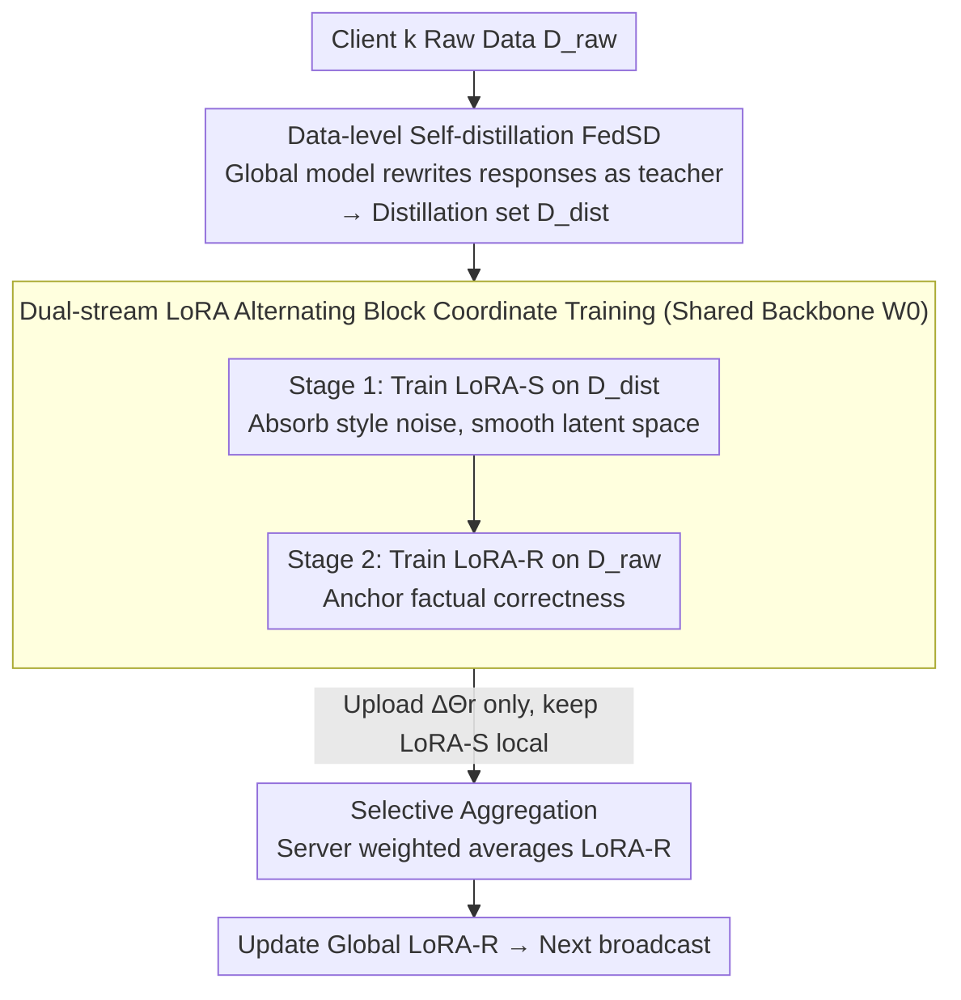

# FedSDR: Federated Self-Distillation with Rectification

**Conference**: ICML 2026  
**arXiv**: [2605.18028](https://arxiv.org/abs/2605.18028)  
**Code**: To be confirmed  
**Area**: Model Compression / Federated Fine-tuning / Self-Distillation  
**Keywords**: Federated Learning, LLM Instruction Tuning, Self-Distillation, Dual-Stream LoRA, Selective Aggregation  

## TL;DR
To address "weight drift" caused by heterogeneous client data distributions in federated LLM fine-tuning, this work first uses the model itself to rewrite original instructions into a "model-understandable space" for data-level alignment (FedSD). It then employs a LoRA-S/LoRA-R dual-stream structure to absorb style noise and anchor factual correctness, respectively, while aggregating only LoRA-R. This decouples alignment from faithfulness, achieving SOTA results under various Non-IID settings.

## Background & Motivation
**Background**: Under privacy constraints, Federated Learning (FL) has become the standard paradigm for LLM instruction fine-tuning, with parameter-efficient LoRA widely adopted due to low communication costs. To mitigate "client drift" caused by Non-IID data, mainstream approaches either add regularization to local updates (FedProx, SCAFFOLD) or use dual LoRA to separate "global sharing" from "client personalization" (FedDPA, etc.).

**Limitations of Prior Work**: These methods treat heterogeneity as a "weight divergence" phenomenon. Consequently, symptoms (gradient conflicts, performance drops after aggregation) are suppressed locally, but the underlying data distribution mismatch remains untouched. When client data consists of diverse semantic domains like finance, medicine, and code, weight-side constraints are insufficient, leading to severe degradation of the aggregated model on multi-task averages.

**Key Challenge**: The root of heterogeneity lies at the data side rather than the model side. The broadcasted global model must simultaneously fit several "almost disjoint" client manifolds; constraints that are too strong stifle personalization, while those that are too weak fail to suppress drift. This is a trade-off where neither side can be satisfied at the model level alone.

**Goal**: Directly reduce the distribution distance between clients from a data perspective while ensuring the aggregated global model is both "aligned" and "faithful to facts."

**Key Insight**: The authors observe that LLMs already possess a coherent "innate knowledge distribution." Letting the model rewrite every client's response in its own tone is equivalent to projecting all client data onto the same generative manifold. This manifold flattening effect is validated via t-SNE, JS divergence, TF-IDF cosine similarity, and cross-task gradient directions.

**Core Idea**: Assign "alignment" to LoRA-S trained on self-distilled data (kept locally to absorb style and heterogeneity noise) and assign "faithfulness" to LoRA-R trained on original data (only uploaded for aggregation). Use structural decoupling to achieve both alignment and fidelity.

## Method

### Overall Architecture
FedSDR aims to solve the problem where the semantic span of client data (finance, medicine, code) in federated LLM fine-tuning is too large, causing severe degradation of the aggregated model due to data distribution mismatch rather than weight divergence. Its strategy is a "Generate – Align – Rectify" pipeline: before joining federated training, each client $k$ uses the current global model as a teacher to rewrite local raw data $D_{raw}=\{(c_i,x_i,y_i)\}$, generating $\tilde y_i\sim f_{\Theta_{teacher}}(\cdot\mid c_i,x_i,y_i)$ to obtain a style-consistent distillation set $D_{dist}$. During local training, the backbone $W_0$ is attached to two sets of LoRA modules in parallel: $h_{out}=W_0 h+\tfrac{\alpha}{r}B_rA_r h+\tfrac{\alpha}{r}B_sA_s h$. The noise-absorbing LoRA-S provides "smoothed" latent representations to the rectification LoRA-R during every forward pass. During the upload phase, only the LoRA-R increments $\Delta\Theta_{r,k}$ are sent to the server for weighted averaging, while LoRA-S remains permanently local. This keeps noise locally and sends facts to the cloud, avoiding "hallucination aggregation" without increasing communication bits. Note that self-distillation is performed only once before training, and $D_{dist}$ is reused thereafter.

### Key Designs

**1. Data Refinery (FedSD): Projecting heterogeneous data onto the same generative manifold**

Mainstream federated methods treat heterogeneity at the weight level, but the root cause—data distribution mismatch—remains. FedSDR intervenes at the data level: clients use the global model as a teacher to rewrite responses for each sample in the model's own voice, effectively projecting all client data onto the same "innate knowledge distribution" of the LLM. Standard aggregation algorithms (FedAvg/Prox/Yogi, etc.) are executed as usual, but the supervision signal changes from $y$ to $\tilde y$, with the local objective becoming $\mathcal{L}^k_{\text{FedSD}}(\Theta)=\tfrac{1}{n_k}\sum_i -\log f_\Theta(\tilde y_i\mid c_i,x_i)$. This "manifold flattening" is quantifiable: text-side JS divergence drops from $0.4074$ to $0.3611$, and TF-IDF cosine similarity rises from $0.6362$ to $0.7064$. On the optimization side, the average gradient cosine similarity between five tasks increases by $+8\sim+41$ pp. Since this modification only changes the supervision signal and not the aggregation protocol, it is orthogonal to any aggregation algorithm.

**2. Dual-Stream LoRA + Alternating Block Coordinate Training (Dual-Stream Rectification): Decoupling "alignment" and "faithfulness" into separate parameters**

Self-distillation is not free—it suffers from the "rewriting paradox": approximately $47\%$ of distilled samples do not strictly entail the ground truth, responses are more verbose, and filler word frequency doubles. If a model attempts to learn both "alignment" and "factual correctness" simultaneously, it settles for a compromise. FedSDR splits the objectives using two sets of LoRA modules sharing a forward pass: $h_{out}=W_0h+\tfrac{\alpha}{r}(B_rA_r+B_sA_s)h$. Training alternates in two stages: Stage 1 freezes $\Theta_r$ to let the noise-absorbing stream learn smoothness on the distilled set, $\mathcal{L}_{smooth}(\Theta_s\mid\Theta_r)=\mathbb{E}_{D_{dist}}[-\log p_{\Theta_r,\Theta_s}(\tilde y\mid c,x)]$; Stage 2 freezes $\Theta_s$ to let the rectification stream anchor facts on original data, $\mathcal{L}_{rect}(\Theta_r\mid\Theta_s)=\mathbb{E}_{D_{raw}}[-\log p_{\Theta_r,\Theta_s}(y\mid c,x)]$. Because Stage 1 has already smoothed the representation space, the optimization difficulty of $\Theta_r$ in Stage 2 is reduced (acting as a "shock absorber"), allowing style noise and factual rectification to be handled without interference.

**3. Selective Aggregation: Permitting only "rectified facts" into global consensus**

In FL, the rewriting paradox is more dangerous than in centralized training: slight local hallucinations, once aggregated, are broadcast to all clients, creating a positive feedback loop of cumulative bias. FedSDR cuts this path at the protocol level—during upload, each client keeps $\Theta_s$ locally and only pushes $\Delta\Theta_{r,k}$. The server performs weighted averaging: $\Theta_{r,global}\leftarrow\Theta_{r,global}+\sum_{k=1}^{K}\tfrac{n_k}{n}\Delta\Theta_{r,k}$. Since Stage 1 forced $\Theta_s$ to absorb local style noise and verbosity, sequestering it locally prevents these noises from forming a "pseudo-consensus" through aggregation. The global model inherits only the factual knowledge rectified by LoRA-R.

### Loss & Training
Local training follows alternating block coordinate updates: $\Theta_s\leftarrow\arg\min_{\Theta_s}\mathcal{L}_{smooth}(\Theta_s\mid\Theta_r)$ and $\Theta_r\leftarrow\arg\min_{\Theta_r}\mathcal{L}_{rect}(\Theta_r\mid\Theta_s)$. Both stages share the same forward pass, but only one stream is trainable at any given time. The server aggregates only $\Theta_r$, maintaining communication costs identical to the single LoRA baseline. Self-distillation is performed only once.

## Key Experimental Results

### Main Results
FedSD, applied as a general enhancer to 6 classic aggregation algorithms, improved overall scores and all four sub-benchmarks (MMLU, BBH, CRASS, DROP). The Head-to-Head Win Rate against base models exceeded 55% in all cases.

| Algorithm | Overall (Base → Ours) | MMLU (Base → Ours) | BBH (Base → Ours) | CRASS (Base → Ours) | DROP (Base → Ours) | Win Rate |
|------|------------------------|--------------------|-------------------|---------------------|--------------------|------|
| FedAvg | 71.21 → 74.54 | 40.71 → 43.69 | 30.79 → 31.88 | 47.81 → 56.57 | 36.04 → 36.41 | 56.14% |
| FedAvgM | 68.18 → 73.34 | 8.72 → 11.81 | 6.71 → 8.18 | 12.77 → 20.07 | 15.64 → 15.75 | 60.30% |
| FedProx | 70.93 → 74.96 | 40.54 → 42.94 | 30.82 → 31.35 | 45.62 → 50.73 | 37.50 → 36.68 | 56.12% |
| FedYogi | 69.17 → 73.56 | 29.92 → 39.32 | 29.12 → 30.50 | 42.34 → 45.26 | 24.53 → 29.28 | 60.37% |
| FedAdam | 71.03 → 74.93 | 30.49 → 39.36 | 28.51 → 30.69 | 36.50 → 51.46 | 27.32 → 30.54 | 57.82% |
| FedAdagrad | 71.87 → 75.13 | 40.69 → 43.21 | 31.43 → 32.56 | 43.07 → 51.09 | 35.80 → 36.21 | 56.78% |

### Ablation Study
The "rewriting paradox" and "distribution alignment" mechanisms were quantitatively supported: JS divergence decrease and TF-IDF cosine increase validate text-level alignment, while cross-task gradient cosine gains validate optimization-level alignment.

| Dimension | Metric | Raw Data | Distilled | Change |
|----------|------|---------------|----------------------|------|
| Text Distribution Alignment | JS↑ | 0.4074 | 0.3611 | $-0.0463$ |
| Text Distribution Alignment | TF-IDF Cosine ↑ | 0.6362 | 0.7064 | $+0.0702$ |
| Cross-task Gradient (FinGPT) | Cosine Sim ↑ | — | — | $+41.5$ pp |
| Cross-task Gradient (MathInstruct) | Cosine Sim ↑ | — | — | $+13.8$ pp |
| Cross-task Loss Transfer (MedAlpaca) | Loss Change ↓ | — | — | $-5.4$ pp |
| Rewriting Paradox | Non-entailment Distilled Samples ↓ | — | $\approx 47\%$ | — |

### Key Findings
- The argument of "FedSD as a general enhancer" is directly supported: improvements are nearly comprehensive across 6 algorithms and 4 test sets, with the largest gain in FedAvg+CRASS ($+8.76$). This implies the benefit of data-level alignment outweighs any single aggregation improvement.
- The "rewriting paradox" is real and particularly dangerous in FL: ~47% of samples do not strictly entail the ground truth, and responses are longer with more filler words. Without LoRA-R to anchor original data, these flaws are broadcast by the server.
- Dual-stream is not a simple stacking of "two models": LoRA-S provides a smoothed latent representation during forward passes, which experimentally smoothens the optimization curve of LoRA-R on raw data ("implicit smoothing eases raw-data learning").
- FedAvgM's initial baseline was significantly lower than other algorithms (MMLU 8.72), but FedSD boosted its overall score to 73.34, suggesting that data-level alignment has a more pronounced rescue effect for inherently unstable aggregators.

## Highlights & Insights
- Redefining the heterogeneity problem from "weight divergence" to "data manifold misalignment" is a clean shift in perspective. The "manifold flattening" phenomenon is rigorously validated using t-SNE, JS divergence, and gradient cosines.
- The Dual-Stream LoRA design is elegant: parallel streams share a backbone in a "forward coupling, backward decoupling" structure. This avoids target conflicts from multi-task averaging and is applicable to other alignment vs. fidelity scenarios like RLHF.
- The insight into selective aggregation is key: in FL, any noise that enters aggregation is amplified by broadcasting. Rather than post-hoc cleaning, sequestering noise locally via the communication protocol incorporates "entropy management" into the system design.

## Limitations & Future Work
- The cost of generating $D_{dist}$ once is non-negligible for ultra-large models and was not fully discussed; this could be a bottleneck for edge devices.
- Keeping LoRA-S permanently local creates structural differences between client and global models, requiring further validation for long-term deployment, client churn, and cold-start scenarios.
- The "rewriting paradox" is mostly characterized by qualitative case studies and a few statistics; future work could introduce finer-grained factual consistency metrics to quantify if LoRA-R repairs all flaws introduced by LoRA-S.
- Experiments focused on LLM instruction tuning; whether "self-distillation = alignment" holds for more complex output spaces like multimodal or tool-use tasks remains unproven.

## Related Work & Insights
- **vs FedProx / SCAFFOLD**: These use regularization to address client drift at the weight level, treating symptoms but not the data cause; FedSDR works at the data level and is orthogonal to these.
- **vs FedDPA (Dual LoRA)**: FedDPA uses dual LoRA for "global share + client personalization," a model-centric view. FedSDR decouples "distribution smoothing vs. factual rectification," a higher-level objective targeting hallucination aggregation.
- **vs FedGen / FedDistill (Federated KD)**: These rely on public proxy datasets or extra generators which are impractical for LLMs; FedSDR uses the model itself as a teacher.
- **vs Centralized Self-Distillation (WizardLM / Alpaca series)**: Centralized methods focus on instruction quality and accept the "rewriting paradox" as a cost. This work argues that in FL, the paradox must be explicitly managed due to aggregation broadcasting.
- **vs Personalized FL (pFedMe / Per-FedAvg)**: These allow personalized models but sacrifice global consensus. FedSDR produces a unified global LoRA-R while absorbing heterogeneity into local LoRA-S, suiting "unified deployment + local adaptation" scenarios.

<!-- RELATED:START -->

## Related Papers

- [\[ICML 2026\] FedRot-LoRA: Mitigating Rotational Misalignment in Federated LoRA](fedrot-lora_mitigating_rotational_misalignment_in_federated_lora.md)
- [\[ICML 2026\] PRISM: Synergizing Vision Foundation Models via Self-Organized Expert Specialization](prism_synergizing_vision_foundation_models_via_self-organized_expert_specializat.md)
- [\[ICML 2026\] OSAQ: Outlier Self-Absorption for Accurate Low-bit LLM Quantization](osaq_outlier_self-absorption_for_accurate_low-bit_llm_quantization.md)
- [\[ICCV 2025\] Soft Separation and Distillation: Toward Global Uniformity in Federated Unsupervised Learning](../../ICCV2025/model_compression/soft_separation_and_distillation_toward_global_uniformity_in_federated_unsupervi.md)
- [\[ICML 2026\] UB-SMoE: Universally Balanced Sparse Mixture-of-Experts for Resource-Adaptive Federated Fine-tuning of Foundation Models](ub-smoe_universally_balanced_sparse_mixture-of-experts_for_resource-adaptive_fed.md)

<!-- RELATED:END -->
