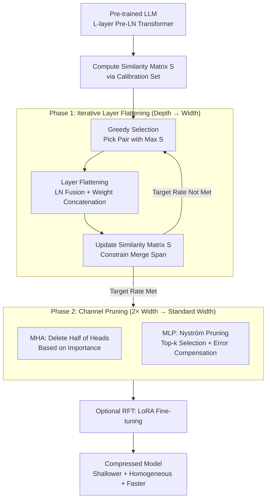

# FlattenGPT: Depth Compression for Transformer with Layer Flattening

**Conference**: ICML 2026  
**arXiv**: [2602.08858](https://arxiv.org/abs/2602.08858)  
**Code**: Not disclosed  
**Area**: Model Compression / LLM Acceleration / Depth Pruning  
**Keywords**: LLM Pruning, Depth Compression, Layer Merging, Channel Pruning, Nyström Approximation

## TL;DR
This paper proposes FlattenGPT, which first "flattens" adjacent Transformer layers with high input similarity into a single layer of $2\times$ width (preserving all parameter knowledge) and then applies channel pruning to restore the width to its original scale. This approach achieves the inference speedup of depth compression while avoiding the performance collapse caused by knowledge loss in traditional layer pruning.

## Background & Motivation

**Background**: The high inference cost of LLMs has given rise to two pruning paradigms. Depth pruning (SLEB, ShortGPT, LaCo) directly removes entire Transformer blocks, offering high speedup but significant performance degradation. Channel pruning (LLM-Pruner, SliceGPT) retains every layer but reduces width, yielding better performance but negligible speedup, while inconsistent pruning rates across layers disrupt architectural homogeneity.

**Limitations of Prior Work**: The fundamental issue with depth pruning is "coarse-grained deletion"—even if specific heads or channels within a block represent critical knowledge, they are discarded if the entire block is deemed "redundant." Conversely, channel pruning suffers from "architectural inconsistency," as downstream applications like LoRA, custom CUDA kernels, and inference engines require a uniform architecture for efficient execution. A clear gap exists between these two paths.

**Key Challenge**: Depth redundancy is inherent (the authors prove via Lemma 2.1/2.2 that hidden state variance grows by $\Theta(\ell^2)$ and gradients become dominated by residuals, degenerating into identity mappings). However, no middle ground exists between "deleting the whole block" and "keeping all blocks." Theoretically, "merging two layers" is possible, but the difficulty lies in merging them such that parameters are reduced without sacrificing performance.

**Goal**: (a) Identify a "merging" operation for adjacent layers that allows knowledge from both layers to be preserved and collaborative; (b) Compress the width back to the original size after merging to maintain architectural homogeneity.

**Key Insight**: In Pre-LN Transformers, the cosine similarity between hidden states $\mathbf{H}^\ell$ and $\mathbf{H}^{\ell+1}$ of adjacent layers typically exceeds 0.9. If inputs are nearly identical, rewriting the MHA and MLP of two layers to "execute in parallel and sum" is mathematically close to the original "sequential execution." This transforms the depth problem into a width problem, which can then be refined via channel pruning.

**Core Idea**: Sequential execution of layer flattening (depth $\to$ width) followed by channel pruning (width restoration) to achieve "knowledge preservation + architectural homogeneity + inference speedup."

## Method

### Overall Architecture
FlattenGPT seeks a middle path between "direct layer deletion" and "width-only pruning." It first **merges** adjacent redundant layers into a single $2\times$ wide layer (depth $\to$ width) and then **prunes** this "fat" layer back to standard width (width $\to$ depth), resulting in a shallower network with standard-sized layers. The pipeline consists of two training-free stages: first, estimating the cosine similarity matrix $\mathbf{S}\in\mathbb{R}^{L\times L}$ of adjacent layers on a calibration set and greedily merging the most similar pairs; then, applying channel pruning to each merged fat layer—halving MHA heads based on importance and using Nyström approximation for MLP channel selection and error compensation.

### Key Designs

**1. Layer Flattening: Rewriting "Two Sequential Layers" as "One Parallel Layer"**

The primary pain point of depth pruning is that "deleting whole blocks" is too coarse. Flattening merges adjacent layers $B_{\ell-1}, B_\ell$ into a single layer $B_{\ell-1,\ell}$ without losing parameters. First, the LayerNorm affine parameters $\boldsymbol{\alpha}^{\ell-1}, \boldsymbol{\alpha}^\ell$ are absorbed into linear projections like $\mathbf{W}_Q/\mathbf{W}_K/\mathbf{W}_V$ (pure algebraic transformation). Then, weights are concatenated: $\mathbf{W}_Q^{\ell-1}, \mathbf{W}_Q^\ell$ are concatenated horizontally into $\mathbf{W}_Q^{\ell-1,\ell}\in\mathbb{R}^{d\times 2dh}$ (similarly for $\mathbf{W}_K,\mathbf{W}_V$), while $\mathbf{W}_O$ is concatenated vertically. For the MLP, $\mathbf{W}_u,\mathbf{W}_g$ are concatenated horizontally and $\mathbf{W}_D$ vertically. The resulting merged MHA computes $2H$ heads in parallel, and the MLP operates with a doubled intermediate dimension $2d_{int}$.

This step is valid due to a geometric premise: since input similarity is $>0.9$, the original sequential form $\mathbf{H}_\ell=\mathbf{H}_{\ell-1}+B_\ell(\mathbf{H}_{\ell-1}+B_{\ell-1}(\mathbf{H}_{\ell-1}))$ can be approximated as parallel addition $\mathbf{H}_\ell\approx \mathbf{H}_{\ell-1}+B_{\ell-1}(\mathbf{H}_{\ell-1})+B_\ell(\mathbf{H}_{\ell-1})$ with minimal error. This "additive equivalence" translates depth into width.

**2. Greedy Selection via Similarity Matrix: Merging Decisions and Span Constraints**

Deciding which layers to merge is a combinatorial optimization problem. To handle this, a greedy approach maintains an upper triangular similarity matrix $\mathbf{S}$. In each round, the pair $(\ell-1, \ell)$ with the maximum $\mathbf{S}_{\ell-1,\ell}$ is merged. Crucially, after merging, the $(\ell-1)$-th column and $\ell$-th row of $\mathbf{S}$ are deleted. The similarity of the new merged layer $B^{\ell-1,\ell}$ to others is represented indirectly through $\mathbf{S}_{\ell-1,i}$ and $\mathbf{S}_{j,\ell}$.

This "row-column deletion" serves as a constraint, preventing the continuous merging of layers that are too far apart. If distant layers are merged, their semantic representations will have diverged, violating the "input similarity $\to$ additive equivalence" premise and disrupting the information flow.

**3. MLP Nyström Channel Pruning + Error Compensation: Reducing Width without Information Loss**

Merged layers must be compressed to restore architectural homogeneity. Simply selecting top-k channels would discard 50% of the information. FlattenGPT uses a two-step MLP process: first, calculating importance via ridge leverage scores $s_i=[\mathbf{C}_\psi(\mathbf{C}_\psi+\lambda\mathbf{I})]_{ii}^{-1}$ (where $\mathbf{C}_\psi$ is the channel covariance on the calibration set) to select top-k channels; second, using Nyström approximation to "fold" the covariance of discarded channels back into the down-projection matrix:

$$\mathbf{W}_D \leftarrow \mathbf{W}_D + (\mathbf{S}_k^\top\mathbf{C}_\psi \mathbf{S}_k+\lambda\mathbf{I})^{-1}\mathbf{S}_k^\top\mathbf{C}_\psi(\mathbf{I}-\mathbf{S}_k\mathbf{S}_k^\top)\mathbf{W}_D$$

Lemma 3.1 proves this is the optimal compensation for least squares under L2 regularization. MHA heads are pruned based on head importance $f_i=\mathbb{E}[\text{Softmax}(\cdots)\mathbf{X}\mathbf{W}_{V,i}\,\text{diag}(\mathbf{W}_{O,i}\mathbf{W}_{O,i}^\top)^{1/2}]$.

### Loss & Training
The method is entirely training-free, requiring only 128 WikiText-2 sequences for calibration. An optional Recover Fine-Tuning (RFT) can be applied: 50K refined Alpaca samples using LoRA (2 epochs, lr=1e-4, lora_r=8).

## Key Experimental Results

### Main Results
Evaluated on LLaMA-2/3, Qwen-1.5, and Baichuan-2 against five SOTA depth pruning methods.

| Model / Method | Sparsity | PPL ↓ | Avg Zero-shot Acc |
|:---|:---:|:---:|:---:|
| LLaMA-2 7B Dense | 0% | 5.47 | 69.00 |
| ShortGPT | 21% | 18.45 | 58.18 |
| BlockPruner | 22% | 11.51 | 60.17 |
| **FlattenGPT** | 21% | **8.68** | **62.49** |
| LLaMA-2 13B Dense | 0% | 4.88 | 71.76 |
| BlockPruner | 25% | 8.16 | 64.53 |
| **FlattenGPT** | 24% | **6.68** | **67.50** |
| Qwen-1.5 7B Dense | 0% | 7.95 | 65.48 |
| **FlattenGPT** | 21% | **16.05** | **57.00** |

On LLaMA-2 70B, FlattenGPT at 20% sparsity achieves $1.27\times$ throughput and $1.26\times$ latency speedup, matching SLEB's speed while exceeding its accuracy by 5 points.

### Ablation Study

| Configuration | LLaMA-2 7B Avg Acc |
|:---|:---:|
| Dense | 69.00 |
| FlattenGPT (w/o RFT) | 63.83 |
| FlattenGPT + RFT | **66.24** |
| LLM-Pruner + RFT | 62.15 |
| Shortened LLaMA + RFT | 61.91 |

### Key Findings
- At the same sparsity, FlattenGPT outperforms ShortGPT by 5% and the strongest baseline BlockPruner by 2-3%. This confirms that "merging then compressing" preserves info better than "direct deletion."
- Despite having the same final architecture as SLEB, FlattenGPT's accuracy is 5 points higher, proving that the gains stem from the flattening/Nyström process rather than inference optimization.
- LLaMA-2 7B retains 90-96% of zero-shot performance after 20% compression and RFT.

## Highlights & Insights
- **The "Depth $\to$ Width $\to$ Depth" bridge is ingenious**: By reframing depth compression as a width problem, the authors unify two disparate pruning paths. This "reframe" is highly instructive and applicable to other hard problems.
- **Nyström Compensation is a hidden gem for MLPs**: Rather than just selecting top-k channels, Nyström compensation uses a closed-form solution to fold discarded info back into the projection, which is theoretically optimal and can be used independently.
- **Training-free + Architectural Homogeneity**: These are critical for industrial deployment. Pruned models can use original CUDA kernels, inference engines, and LoRA hyperparameters with zero migration cost.

## Limitations & Future Work
- The additive equivalence relies on "high input similarity," which holds for deep Pre-LN networks but may fail in shallow models (<20 layers) or Post-LN architectures.
- The greedy selection does not guarantee a global optimum; no comparison against brute-force or dynamic programming was provided.
- The ridge intensity $\lambda$ is set empirically (10 $\times$ mean singular value), which might require grid searching for different models.
- Limited experimentation on GQA/MoE architectures beyond LLaMA-3.

## Related Work & Insights
- **vs SLEB/ShortGPT**: These methods delete whole blocks. FlattenGPT achieves the same final architecture (and speed) but preserves more knowledge through merging, proving the info-loss in block-level deletion.
- **vs SliceGPT/LLM-Pruner**: These use channel pruning but keep all layers, resulting in lower throughput. FlattenGPT utilizes channel pruning techniques on merged layers to gain the benefits of depth reduction.
- **vs LaCo**: LaCo simply adds parameters of two layers without considering LN fusion or parallel equivalence. FlattenGPT's attention to these details results in significantly higher accuracy (62.49 vs 54.82).
- **Insight**: Viewing Transformer "layers" as "width slices" could inspire future work in model expansion or dynamic depth where layers are skipped based on input.

## Rating
- Novelty: ⭐⭐⭐⭐⭐ The depth-to-width-to-depth reframe is highly novel.
- Experimental Thoroughness: ⭐⭐⭐⭐ Broad testing across models and sizes; however, GQA-specific evaluation is relatively thin.
- Writing Quality: ⭐⭐⭐⭐ Clear comparisons in Figure 1; Lemmas 2.1/2.2 provide a solid theoretical foundation; Algorithms 1-3 are well-documented.
- Value: ⭐⭐⭐⭐⭐ A training-free, speed-up-oriented method with higher accuracy is highly attractive for industrial LLM deployment.

<!-- RELATED:START -->

## Related Papers

- [\[ICML 2026\] xKV: Cross-Layer KV-Cache Compression via Aligned Singular Vector Extraction](xkv_cross-layer_kv-cache_compression_via_aligned_singular_vector_extraction.md)
- [\[NeurIPS 2025\] ReplaceMe: Network Simplification via Depth Pruning and Transformer Block Linearization](../../NeurIPS2025/model_compression/replaceme_network_simplification_via_depth_pruning_and_transformer_block_lineari.md)
- [\[ACL 2026\] LEAP: Layer-wise Exit-Aware Pretraining for Efficient Transformer Inference](../../ACL2026/model_compression/leap_layer-wise_exit-aware_pretraining_for_efficient_transformer_inference.md)
- [\[ICML 2026\] ReSpinQuant: Efficient Layer-Wise LLM Quantization via Subspace Residual Rotation Approximation](respinquant_efficient_layer-wise_llm_quantization_via_subspace_residual_rotation.md)
- [\[ICML 2025\] Strategic Fusion Optimizes Transformer Compression](../../ICML2025/model_compression/strategic_fusion_optimizes_transformer_compression.md)

<!-- RELATED:END -->
