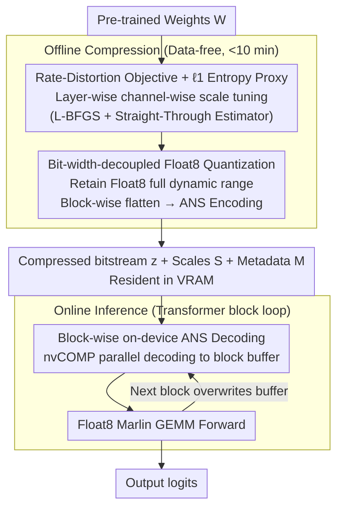

# Float8@2bits: Entropy Coding Enables Data-Free Model Compression

**Conference**: ICML 2026  
**arXiv**: [2601.22787](https://arxiv.org/abs/2601.22787)  
**Code**: https://github.com/merantix-momentum/entquant  
**Area**: Model Compression  
**Keywords**: Post-Training Quantization, Entropy Coding, ANS, Data-free Compression, Extreme Low-bit  

## TL;DR
EntQuant preserves weights with Float8/Int8 precision but adds an additional $\ell_1$ regularization during the quantization phase to "align" weights toward a low-entropy distribution. These are then losslessly compressed to approximately 2 bits using parallelized ANS entropy coding on the GPU. This achieves over 8× compression for 70B LLMs in under 10 minutes without requiring calibration data or recovery training, while inference is only 1.5–2× slower.

## Background & Motivation
**Background**: Current Post-Training Quantization (PTQ) for LLMs roughly follows two paths according to Nagel's four-level classification. One is the "data-heavy" route: Level 2 uses calibration sets for GPTQ/OmniQuant; Levels 3-4 involve recovery training or QAT, such as QuIP#, EfficientQAT, or AQLM, which can reach 2 bits but require 40-50 hours on 8×A100 GPUs. The other is the "data-light" route: Level 1 includes entirely data-free methods like RTN/NF4/HQQ, which can compress any model in minutes but suffer from functional collapse below 4 bits.

**Limitations of Prior Work**: The extreme low-bit realm (<4 bit), which holds the highest commercial value, is currently only stabilized by data-heavy methods. However, these come with three hidden costs: (1) Training data for many high-quality instruction-tuned/reasoning models (e.g., LLaMA-3.3 Instruct, Mistral Large) is not public, forcing the use of generic proxies like C4 during calibration; (2) Scenarios subject to GDPR, such as healthcare or finance, prohibit the reuse of sensitive data; (3) Calibration itself can damage safety-tuning and reasoning alignment, causing models to drop performance on IFEval/GSM8K far more than suggested by perplexity alone.

**Key Challenge**: Existing quantization paradigms rigidly couple "compression rate" with "bit-width"—reaching 8× compression necessitates using only 4 discrete values to represent all weights. This "bit-width = expressivity" coupling is tolerable above 4 bits, but at 2 bits, it means complex Gaussian-long-tail weight distributions must be squeezed into 4 bins, making high-frequency outliers irrecoverable. Data-heavy methods essentially use numerous "patches" (codebooks, grouping, outlier separation, recovery FT) to compensate for this loss of expressivity.

**Goal**: Can 2-bit extreme compression be achieved under Level 1 data-free constraints while preserving the reasoning and alignment capabilities of instruction-tuned models? This requires solving two sub-problems simultaneously: how to compress to 2 bits without sacrificing expressivity, and how to prevent decompression from becoming an inference bottleneck.

**Key Insight**: The authors note that the signal processing field separated "quantization" from "efficient representation" decades ago—JPEG quantizes DCT coefficients before applying Huffman/arithmetic coding. The compression rate of the entire pipeline is determined by entropy coding rather than quantization bit-width. Recent works like DFloat11 have also proven that the overhead of running ANS decoding on GPUs can be minimized. Combining these facts suggests a new design space: maintain high expressivity with Float8/Int8 weights, but actively reduce the entropy of the weight distribution during quantization, then use entropy coding to compress the storage.

**Core Idea**: Use the $\ell_1$ norm as a differentiable proxy for discrete entropy to optimize channel-wise scaling factors, clustering Float8 weights toward low-entropy states. Then, use the nvCOMP ANS encoder to losslessly compress these low-entropy 8-bit symbols to any target bpw. During inference, weights are decoded on-the-fly at the granularity of transformer blocks.

## Method

### Overall Architecture
EntQuant takes pre-trained weights $\mathbf{W}\in\mathbb{R}^{M\times N}$ as input and outputs a triplet (compressed bitstream $\mathbf{z}$, channel scaling vector $S$, ANS metadata $\mathcal{M}$). The pipeline consists of two stages: **Offline Compression** performs layer-independent entropy-constrained quantization, followed by flattening Float8 weights of an entire transformer block into a symbol stream for ANS; **Online Inference** maintains a block-sized decompression buffer on the GPU. Before the forward pass of a block, nvCOMP decodes the weights in parallel into the buffer, performs the forward pass using Float8 Marlin GEMM, and then overwrites the buffer with the next block's weights. The key is decoupling "weight numerical precision" from "weight storage cost"—the former is determined by Float8 (retaining full dynamic range), while the latter is determined by the bitstream length after entropy coding (which can reach below 2 bpw).

### Key Designs

**1. Rate-Distortion Objective + $\ell_1$ Entropy Proxy: Turning "Entropy Reduction + Error Control" into a differentiable scaling problem under data-free constraints**

To achieve extreme compression under Level 1 (data-free) constraints, one must abandon metrics dependent on forward activations (like GPTQ's Hessian) and focus on the weight distribution itself. The ideal goal is to minimize the empirical entropy of quantized weights $\min_{\mathbf{W}_q} \hat{H}(\mathbf{W}_q)$ s.t. $d(\mathbf{W},\hat{\mathbf{W}})<\epsilon$, where $\hat{H}=-\frac{1}{MN}\sum \log_2 \hat p(\mathbf{W}_q^{(i,j)})$. However, discrete entropy is non-differentiable. The authors use Lagrangian relaxation: $\min_{\mathbf{W}_q} d(\mathbf{W},\hat{\mathbf{W}})+\lambda R(\mathbf{W}_q)$. For reconstruction loss, an outlier-robust relative $\ell_1$ is used: $d=\|\mathbf{W}-\hat{\mathbf{W}}\|_1/\|\mathbf{W}\|_1$. The entropy proxy is also $\ell_1$: $R(\mathbf{X})=\|\mathbf{X}\|_1$. The choice of $\ell_1$ as an entropy proxy is supported by a max-entropy bound proof in Appendix B.2—under a fixed $\ell_1$ budget, the maximum entropy distribution has finite support; thus, minimizing $\ell_1$ shrinks the support and increases peak density, lowering $\hat H$. Practically, gradients are computed only for channel-wise scaling factors $S$ (using a straight-through estimator), converging in seconds per layer. Furthermore, the relationship between $\lambda$ and final bpw is empirically log-linear across models, allowing users to specify a target bpw without tuning entropy hyperparameters. This makes the entire optimization a lightweight "scale tuning" process, enabling 70B models to be compressed in 10 minutes.

**2. Bit-width-decoupled Float8 Quantization: Letting storage cost be determined by entropy coding rather than bit-width**

This represents the core paradigm shift of the paper. Traditional methods use $\mathbf{W}_q = \text{clamp}(\lfloor\mathbf{W}/s\rceil, -Q_{\max}, Q_{\max})$ and store weights at a fixed bit-width. EntQuant instead uses $\gamma\in\{$ Float8, Int8 $\}$ to retain the full range of $\sim 2^8$ representable values, but uses $\ell_1$ optimization to reduce the number of unique values actually used (Table 1: 2-bit equivalent EntQuant still uses 34.61 unique values on average, far more than the 4 values in fixed 2-bit quantization). The weights are then flattened and fed to the ANS encoder. The ANS code length follows the Shannon bound $\sim \hat H(\mathbf{W}_q)$, meaning the final bpw is determined by optimized empirical entropy and can be continuously adjusted. Channel-wise scaling naturally allocates precision to necessary channels, removing the need for explicit outlier separation or complex grouping. Retaining Float8 expressivity also means inference can leverage existing Float8 Marlin GEMM kernels.

**3. Block-wise on-device ANS Decoding: Promoting entropy coding from offline storage to an online inference component**

If extreme compression results in 5-10× slower inference, it is impractical. EntQuant keeps the compressed bitstream $\mathbf{z}$ in VRAM and allocates a decompression buffer sized for one transformer block. Before entering a block's forward pass, nvCOMP decodes the weights (q/k/v/o/MLP) into the buffer. This block-level granularity is ~50% faster than layer-level decoding due to higher GPU utilization on larger chunks. The decoding cost scales with total weights and is independent of sequence length, making the overhead marginal for long contexts. This allows memory peaks to stay at the compressed level (Table 2: A 70B model at 2.1 bpw uses 18.8 GiB for weights + 0.8 GiB buffer + 1.25 GiB KV cache, fitting into a single 32 GiB 5090 GPU), while inference is only 1.5-2× slower than BFloat16—on par with NF4 and faster than HQQ.

### Loss & Training
No training data is used. Each layer is independently optimized using L-BFGS for $\min_S d(\mathbf{W},\hat{\mathbf{W}})+\lambda R(\mathbf{W}_q)$ with a straight-through estimator for gradients. Scales are stored in BFloat16. The relationship between $\lambda$ and target bpw is looked up via an empirical log-linear table. Total compression for a 70B model takes less than 10 minutes on an H100.

## Key Experimental Results

### Main Results
Evaluated on 16 open-source LLMs (LLaMA-1/2/3.1/3.3, Qwen3, OLMo 3.1, Mistral Large 24.11) with over 480 experiments across C4, WikiText-2 perplexity, and 8 zero-shot tasks (LM Eval).

| Model | Method | bpw | C4 PPL ↓ | LM Eval Avg ↑ |
|------|------|-----|---------|---------------|
| LLaMA-2 70B | Base (BF16) | 16 | 5.52 | 72.3 |
| LLaMA-2 70B | HQQ g64 | 3 | 6.02 | 70.4 |
| LLaMA-2 70B | EntQuant | 3 | 5.74 | 71.1 |
| LLaMA-2 70B | HQQ g64 | 2 | 2.8e3 (Collapse) | 30.4 |
| LLaMA-2 70B | EntQuant | 2.1 | **6.47** | **67.9** |
| LLaMA-3.1 70B | HQQ g64 | 2 | 1.3e4 (Collapse) | 29.9 |
| LLaMA-3.1 70B | EntQuant | 2.1 | **9.92** | **68.6** |

The 2.1 bpw range highlights Ours' performance—while all data-free baselines collapse, EntQuant retains 92-94% of BF16 accuracy. Compared to data-heavy methods (Table 4 (b)): on LLaMA-2 70B at 2 bit, GPTQ drops 52.8% and OmniQuant drops 24.6%, whereas EntQuant at 2.1 bit only drops 5.8%.

### Ablation Study

| Configuration | Key Observation | Description |
|------|---------|------|
| Float8 Base (Default) | C4 PPL 6.47 at 2.1 bpw | Recommended configuration |
| Int8 Base | Poorer PPL on some models | Sensitive to super weights |
| Int8 + Super weight exclusion | Near Float8 performance | Excludes <10 outliers |
| Float8 + Long prefill (8192) | <10% gap vs. Float8 Marlin | Decoding overhead decoupled from seq len |
| W8A8 (Quanto) | Slight drop on 70B | Lack of fused kernels |

### Key Findings
- After $\ell_1$ optimization, 2-bit EntQuant still utilizes 34.61 unique values on average (Table 1), double that of 4-bit fixed bit-width (16 values). This is the fundamental reason it retains expressivity at lower bpw.
- The log-linear relationship between $\lambda$ and bpw is consistent across models (Figure A.1).
- Block-wise decoding is ~50% faster than layer-wise; decoding cost doesn't increase with prefill length.
- LLaMA-2 70B at 2.1 bpw can run on a single 32 GiB 5090 GPU (Table 2).
- On "hard" benchmarks (IFEval/GSM8K), EntQuant 3-bit is lossless and 2-bit remains usable, whereas calibration methods often lose instruction-following capability.

## Highlights & Insights
- **Paradigm Redefinition**: Bringing the "quantization + entropy coding" architecture used in JPEG to LLM quantization, proving "bit-width = compression rate" is a design choice, not a constraint.
- **$\ell_1$ as Entropy Proxy**: Using a classic norm to solve the non-differentiability of discrete entropy.
- **GPU ANS as Infrastructure**: Validating nvCOMP as a first-class citizen for LLM inference.
- **Transferability**: The approach is applicable to KV cache compression, gradient quantization, and other model types (Vision/Diffusion).

## Limitations & Future Work
- Inference is 1.5-2× slower than BF16; the bottleneck is the ANS decoding kernel.
- The $\lambda \rightarrow$ bpw relationship is empirical and may require re-tuning for extreme distributions.
- Currently limited to weight-only quantization.
- Memory gains for weights decrease relative to KV cache at large batch sizes.

## Related Work & Insights
- **vs HQQ / NF4 (Level 1)**: EntQuant dominates the sub-4 bit range by decoupling bit-width from compression.
- **vs GPTQ / OmniQuant (Level 2)**: EntQuant is faster (<10 mins) and outperforms them at 2 bits without data.
- **vs QuIP# / EfficientQAT (Level 3-4)**: EntQuant is near-competitive while being 200× faster to compress and maintaining instruction-tuning alignment.
- **vs DFloat11**: While DFloat11 is lossless (~30% compression), EntQuant is lossy but targets ~80% compression.

## Rating
- Novelty: ⭐⭐⭐⭐⭐ 
- Experimental Thoroughness: ⭐⭐⭐⭐⭐ 
- Writing Quality: ⭐⭐⭐⭐⭐ 
- Value: ⭐⭐⭐⭐⭐ 

<!-- RELATED:START -->

## Related Papers

- [\[ICML 2026\] Efficient Learned Image Compression without Entropy Coding](efficient_learned_image_compression_without_entropy_coding.md)
- [\[ICML 2026\] Decouple Searching from Training: Scaling Data Mixing via Model Merging for Large Language Model Pre-training](decouple_searching_from_training_scaling_data_mixing_via_model_merging_for_large.md)
- [\[ICML 2026\] Selective Coupling of Decoupled Informative Regions: Masked Attention Alignment for Data-Free Quantization of Vision Transformers](selective_coupling_of_decoupled_informative_regions_masked_attention_alignment_f.md)
- [\[ICML 2026\] Entropy-Aware On-Policy Distillation of Language Models](entropy-aware_on-policy_distillation_of_language_models.md)
- [\[CVPR 2025\] Learned Image Compression with Dictionary-based Entropy Model](../../CVPR2025/model_compression/learned_image_compression_with_dictionary-based_entropy_model.md)

<!-- RELATED:END -->
