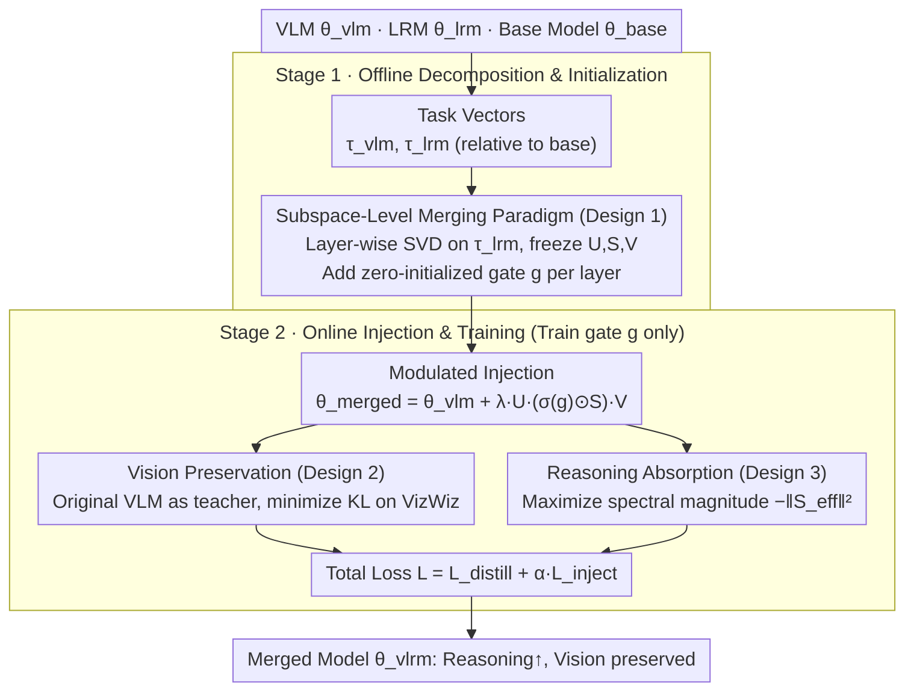

# FRISM: Fine-Grained Reasoning Injection via Subspace-Level Model Merging for Vision–Language Models

**Conference**: ICML 2026  
**arXiv**: [2601.21187](https://arxiv.org/abs/2601.21187)  
**Code**: None  
**Area**: Multimodal VLM / Model Merging / Reasoning Injection  
**Keywords**: Model Merging, SVD Subspace, Reasoning Injection, Vision Preservation, Unlabeled Self-Distillation  

## TL;DR
FRISM refines "VLM × LRM merging" from layer-wise granularity to SVD subspace granularity. It uses the SVD subspaces of LRM task vectors as reasoning priors and employs unlabeled self-distillation (KL for vision preservation + spectral magnitude maximization for reasoning absorption) with a learnable gate to find the optimal injection intensity. This significantly enhances VL reasoning performance without substantial vision degradation.

## Background & Motivation
**Background**: VLMs (Qwen2.5-VL, LLaVA, InternVL, etc.) possess strong general capabilities but exhibit obvious reasoning shortcomings. Conversely, LRMs (DeepSeek-R1, OpenAI-o1) excel in mathematical, logical, and programming tasks. There are two paths to transfer LRM reasoning capabilities to VLMs: ① Large-scale retraining based on RL/SFT; ② Model Merging. The latter has near-zero training costs and requires no labeled data, leading to widespread attempts (e.g., BR2V, FRANK, IP-Merging).

**Limitations of Prior Work**: Existing merging methods primarily operate at a "layer-wise" granularity—merging each layer in the form of $\lambda_{\text{vlm}}\tau_{\text{vlm}}+\lambda_{\text{lrm}}\tau_{\text{lrm}}$, where one mixing coefficient is used per layer. Experiments in Figure 2 show that whether using Task Arithmetic or IP-Merging, tuning a single coefficient always results in a "vision drop or weak reasoning" scenario, falling onto a distinct vision–reasoning trade-off curve.

**Key Challenge**: By performing SVD on the task vectors of DeepSeek-R1-Distill-Qwen-7B and injecting them into Qwen2.5-VL rank-by-rank, the authors discovered that "optimal scaling coefficients vary greatly across different rank subspaces" (Figure 3). Some subspaces peak at $\lambda=0.1$, while others require much higher values. A single layer-wise $\lambda$ inevitably conflates these heterogeneities, simultaneously introducing useful reasoning and harmful visual noise. In other words, **layers are not the atomic units of capability**; subspaces are.

**Goal**: Refine the merging granularity to the SVD subspace level, allowing the model to automatically determine which subspaces should be strongly injected and which should be suppressed, without relying on any VL reasoning annotations.

**Key Insight**: Treat the SVD decomposition of the LRM task vector directly as a "reasoning prior subspace." Freeze $\mathbf{U}, \mathbf{S}, \mathbf{V}$ and learn only a per-rank gating vector $\mathbf{g}^l$. Then, use "unlabeled self-distillation + spectral magnitude maximization" to allow the gates to automatically find the equilibrium between "maximum injection and minimum vision loss."

**Core Idea**: Open the gates individually for each SVD subspace in every layer. The "dual-objective + subspace gating" automatically filters out subspaces that are highly destructive to vision while retaining reasoning subspaces orthogonal to vision.

## Method

### Overall Architecture
FRISM aims to inject LRM reasoning capabilities into a VLM without degrading visual perception. This is achieved by reducing the "merging" granularity from entire layers to SVD subspaces and allowing the model to learn the injection intensity for each subspace. It consists of two steps: an offline phase where task vectors from the LRM and VLM are calculated relative to a base model, and SVD is performed layer-wise on the LRM task vector to obtain a set of frozen bases with zero-initialized learnable gates per layer; and an online phase where the modulated LRM subspaces are added back to the VLM. Only these gates are trained using unlabeled self-distillation (using the original VLM as a teacher to constrain vision + spectral magnitude maximization to absorb reasoning), which is extremely small-scale and converges quickly.

### Key Designs

**1. Subspace-Level Merging Paradigm: Independent scaling coefficient for each SVD subspace**

The deadlock of layer-wise merging lies in assigning a single $\lambda$ to an entire layer, even though Figure 3 shows vast differences in optimal scaling coefficients across different rank subspaces. FRISM breaks this via "frozen bases, learned spectrum": the LRM task vector $\tau_{\text{lrm}}^l$ is decomposed via SVD into $\mathbf{U}^{(l)}, \mathbf{S}^{(l)}, \mathbf{V}^{(l)\top}$, which are frozen. A gate vector $\mathbf{g}^l\in\mathbb{R}^r$ is learned for each layer. The gate, processed by a Sigmoid $\sigma(\mathbf{g}^l)\in(0,1)^r$, is element-wise multiplied by the original singular values to form "effective singular values" $\mathbf{S}_{\text{eff}}=\sigma(\mathbf{g}^l)\odot\mathbf{S}$. The merged weights are:

$$\theta_{\text{merged}}^l=\theta_{\text{vlm}}^l+\lambda_{\text{lrm}}\,\mathbf{U}^{(l)}\mathbf{S}_{\text{eff}}^{(l)}\mathbf{V}^{(l)\top}.$$

Task vectors are defined as $\tau_{\text{vlm}}=\theta_{\text{vlm}}-\theta_{\text{base}}$ and $\tau_{\text{lrm}}=\theta_{\text{lrm}}-\theta_{\text{base}}$. By fixing the bases and only modifying the intensity, the reasoning semantic direction is preserved while allowing intensities to be finely adjusted per subspace. This aligns with low-rank empirical observations (Cai 2025, Ping 2024, Sharma 2024) that reasoning is concentrated in a few directions. Consequently, the $r$ subspaces per layer operate their own gates, completely decoupling from a monolithic $\lambda$.

**2. Vision Preservation Goal via Unlabeled Self-Distillation: Anchoring to original VLM to prevent output drift**

Injecting reasoning often risks collapsing visual perception, and VL reasoning labels are scarce and unevenly distributed. FRISM bypasses reasoning labels altogether, using self-distillation to turn "vision preservation" into a data-cheap, clean constraint: the teacher is the frozen original VLM $\theta_{\text{vlm}}$, and the student is the current merged model $\theta_{\text{vlrm}}(\mathbf{g})$. The KL distance between their output distributions is minimized on a pure visual perception calibration set $\mathcal{D}$ (VizWiz VQA):

$$\mathcal{L}_{\text{distill}}=\mathbb{E}_{x\sim\mathcal{D}}\,\mathrm{KL}\!\left(P(\cdot|x;\theta_{\text{vlm}})\,\|\,P(\cdot|x;\theta_{\text{vlrm}})\right).$$

Using the original VLM as a reference point ensures that as long as the gate adjustments do not disrupt vision outputs, the KL remains small. This reformulates merging as "finding the strongest reasoning injection within a KL radius of vision output," bypassing label shortages and providing a safety boundary.

**3. Reasoning Absorption via Spectral Magnitude Maximization and Total Objective: Using spectral magnitude as a reasoning proxy to prevent zero-injection collapse**

With only vision constraints, the gates might "cheat" by closing all subspaces, resulting in zero KL but no reasoning injection. Thus, FRISM adds a loss term $\mathcal{L}_{\text{inject}}=-\sum_l\|\mathbf{S}_{\text{eff}}^{(l)}\|^2=-\sum_l\|\sigma(\mathbf{g}^{(l)})\odot\mathbf{S}^{(l)}\|^2$ to actively encourage $\mathbf{S}_{\text{eff}}$ to be as large as possible (stronger injection yields lower loss). The total loss is:

$$\mathcal{L}=\mathcal{L}_{\text{distill}}+\alpha\mathcal{L}_{\text{inject}}.$$

This push-and-pull mechanism acts as an automatic filter. The paper provides a second-order expansion: under the assumption of Hessian $\mathbf{H}=\nabla^2\mathcal{L}_{\text{vis}}$ and "approximate decoupling of SVD subspaces," $\partial\mathcal{L}/\partial\lambda_i\approx(h_i-2\alpha\|B_i\|_F^2)\lambda_i$. If the vision curvature term $h_i$ is greater than the injection gain $2\alpha\|B_i\|_F^2$, the gate suppresses the subspace; otherwise, it opens it. Directions orthogonal to visual perception (low $h_i$) are permitted, while those destructive to vision (high curvature) are closed. This vision–reasoning trade-off is solved automatically using data priors and spectral structure without reasoning supervision.

### Loss & Training
Only the gates $\mathbf{g}^l$ are updated, resulting in negligible parameters compared to the original model. In the total loss $\mathcal{L}=\mathcal{L}_{\text{distill}}+\alpha\mathcal{L}_{\text{inject}}$, $\alpha$ controls injection intensity. Since $\mathcal{L}_{\text{inject}}$ varies in magnitude across model scales, it is normalized before training (Appendix H). Merging is applied only to the LLM component; the vision tower and projector remain unchanged.

## Key Experimental Results

### Main Results: Average scores across benchmarks for Qwen2.5-VL × LRM merging (Tab. 1)

| Method | Average VL Reasoning | Average VL Perception |
|------|-------------|-------------|
| **3B Merge: SmallThinker-3B** | | |
| Base | 33.2 | 79.7 |
| Task Arithmetic (Best $\lambda$) | 33.0 | 79.8 |
| Ties-Merging | 31.6 | 77.0 |
| IP-Merging (Best $T$) | 32.2 | 77.0 |
| **FRISM** | **35.0 (+1.8)** | 79.7 |
| **7B Merge: DeepSeek-R1-Distill-Qwen-7B** | | |
| Base | 47.4 | 82.9 |
| Task Arithmetic (Best $\lambda$) | 47.8 (Collapsed at high $\lambda$) | 82.4 |
| Ties-Merging | 45.3 | 78.9 |
| IP-Merging (Best $T$) | 47.7 | 82.3 |
| **FRISM** | **49.4 (+2.0)** | **83.0** |

### Subspace-Level Diagnosis (Fig. 3)

| Experiment | Key Observation | Explanation |
|------|----------|------|
| Individual injection of different rank subspaces | Different ranks peak at different $\lambda$ | Proves subspace heterogeneity; layer-wise $\lambda$ is suboptimal. |
| Standard layer-wise merging | Significant gap compared to subspace-level optimum | Layer granularity cannot accommodate multiple varying optimal $\lambda$ values. |

### vision–reasoning trade-off (Fig. 2)
- In the 2D space of "VL Reasoning vs. VL Perception," Task Arithmetic and IP-Merging form a clear trade-off curve (improving reasoning often sacrifices perception).
- FRISM jumps to the top-right corner of the curve, proving that gating successfully filters out subspaces that "destroy vision with little contribution to reasoning."

### Key Findings
- In 7B merging, Task Arithmetic shows a "vision cliff" (POPE drops 86.4 → 73.9) starting at $\lambda=0.15$, while FRISM maintains vision performance on par with the Base while increasing average reasoning by 2pt—direct evidence of the success of subspace refinement.
- Removing $\mathcal{L}_{\text{inject}}$ causes the gates to shrink toward negative infinity (zero injection), proving "active amplification" is necessary—acting as an observable proxy spectral magnitude in the absence of reasoning labels.
- The second-order expansion $\partial\mathcal{L}/\partial\lambda_i\approx(h_i-2\alpha\|B_i\|_F^2)\lambda_i$ provides interpretable filtering rules: high vision curvature directions are suppressed, while low curvature directions are released, corroborating the subspace heterogeneity observed in Figure 3.

## Highlights & Insights
- The reframing that "layers are not atomic units of capability, SVD subspaces are" is very sharp. Once this is accepted, current "single $\lambda$" merging methods become suboptimal special cases, and FRISM emerges as a general solution.
- The minimalist gating structure of "frozen bases, learned spectrum" keeps training costs near zero and is universally applicable to any VLM, making it friendly to small and medium-sized teams.
- The combination of "vision preservation + spectral magnitude maximization" is equivalent to an implicit subspace filter that distinguishes "vision-neutral" from "vision-destructive" directions without reasoning labels. This mechanism can be extended to other capabilities (e.g., safety alignment, coding) as long as they can be represented as task vectors.
- The analytical derivation of $\partial\mathcal{L}/\partial\lambda_i$ provides mechanism-level interpretability, which is more convincing than empirical comparisons alone.

## Limitations & Future Work
- Vision preservation relies on "KL on VizWiz"; the protection of other visual tasks (grounding, OCR, video) depends on the calibration data distribution. Narrow calibration data might lead to "silent drift" in other visual capabilities.
- The assumption that "different SVD subspaces are approximately decoupled regarding vision loss" is critical for theoretical analysis, but the Hessian may not be perfectly diagonal in practice, potentially reducing gate interpretability.
- SVD is currently performed independently on each linear layer without joint consideration across layers. Layer-wise subspaces may exhibit synergies or conflicts; future work could explore "layer-subspace joint sparse" merging.
- Only the LRM reasoning → VLM direction was evaluated; the reverse (VLM vision → LRM) or multi-way merging (multiple domain models into one base) remains unverified.

## Related Work & Insights
- **vs Task Arithmetic / Ties-Merging / DARE**: Traditional multi-task merging emphasizes interference reduction but uses single-layer scalar coefficients, failing to resolve "intra-layer capability aliasing." FRISM pushes the trade-off curve outward via gating vectors.
- **vs IP-Merging (Layer-wise similarity threshold) / FRANK (Closed-form Taylor weights)**: These fundamentally still operate at the "layer" granularity. FRISM is a natural extension, descending to the subspace level with learning capabilities.
- **vs LoRA / PiSSA (SVD-based PEFT)**: PEFT learns a set of low-rank deltas on top of a base. FRISM does the opposite—decomposing a pre-trained delta into SVD subspaces to decide which should be integrated. It is closer to "subspace pruning" + "subspace weighting."
- **vs SVDiff / SVD Distillation in Model Compression**: While compressed models often fix the spectrum and change the basis, FRISM fixes the basis and learns the spectrum. This "frozen basis, learned spectrum" approach can be applied to compression, alignment, security, etc.

## Rating
- Novelty: ⭐⭐⭐⭐⭐ Refines model merging from layer granularity to SVD subspaces with a self-consistent, unlabeled distillation framework.
- Experimental Thoroughness: ⭐⭐⭐⭐ Covers 3B/7B/32B scales, multiple benchmarks, and baselines with subspace-level ablation.
- Writing Quality: ⭐⭐⭐⭐ Motivations (Figs 2-3) are clear; theoretical analysis and experiments are mutually reinforcing; some derivations rely on the appendix.
- Value: ⭐⭐⭐⭐⭐ Provides a low-cost, plug-and-play, highly interpretable capability injection framework, significantly pushing the reasoning-vision integration field forward.

<!-- RELATED:START -->

## Related Papers

- [\[ICML 2026\] Model Merging Scaling Laws in Large Language Models](model_merging_scaling_laws_in_large_language_models.md)
- [\[CVPR 2026\] Bridging Domains through Subspace-Aware Model Merging](../../CVPR2026/model_compression/bridging_domains_through_subspace-aware_model_merging.md)
- [\[ICML 2026\] Decouple Searching from Training: Scaling Data Mixing via Model Merging for Large Language Model Pre-training](decouple_searching_from_training_scaling_data_mixing_via_model_merging_for_large.md)
- [\[ICML 2026\] Saliency-Aware Model Merging](saliency-aware_model_merging.md)
- [\[ACL 2025\] BlockPruner: Fine-grained Pruning for Large Language Models](../../ACL2025/model_compression/blockpruner_fine-grained_pruning_for_large_language_models.md)

<!-- RELATED:END -->
