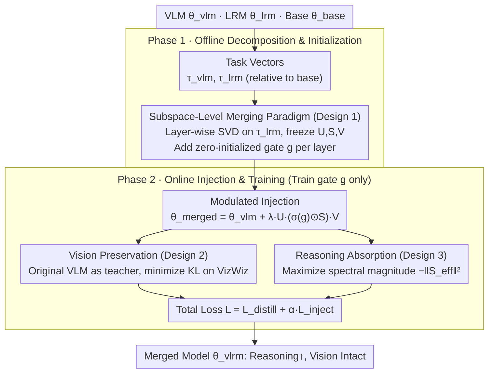

# FRISM: Fine-Grained Reasoning Injection via Subspace-Level Model Merging for Vision–Language Models

**Conference**: ICML 2026  
**arXiv**: [2601.21187](https://arxiv.org/abs/2601.21187)  
**Code**: None  
**Area**: Multimodal VLM / Model Merging / Reasoning Injection  
**Keywords**: Model Merging, SVD Subspace, Reasoning Injection, Vision Preservation, Unlabeled Self-Distillation

## TL;DR
FRISM refines "VLM × LRM merging" from layer-wise granularity to SVD subspace granularity. It utilizes the SVD subspaces of LRM task vectors as reasoning priors and employs an unlabeled self-distillation process (using KL divergence to preserve vision and spectral magnitude maximization to absorb reasoning) with learnable gates to find the optimal injection intensity. This significantly enhances VL reasoning performance without a substantial drop in vision capabilities.

## Background & Motivation
**Background**: VLMs (Qwen2.5-VL, LLaVA, InternVL, etc.) possess strong general capabilities but exhibit clear weaknesses in reasoning. Conversely, LRMs (DeepSeek-R1, OpenAI-o1) excel in math, logic, and programming tasks. Transferring reasoning from LRMs to VLMs follows two paths: 1) Large-scale retraining based on RL/SFT; 2) Model Merging. The latter requires almost zero training cost and no labeled data, leading to widespread exploration (e.g., BR2V, FRANK, IP-Merging).

**Limitations of Prior Work**: Existing merging methods primarily operate at a "layer-wise" granularity—merging each layer using a single mixing coefficient per layer, such as $\lambda_{\text{vlm}}\tau_{\text{vlm}}+\lambda_{\text{lrm}}\tau_{\text{lrm}}$. Experiments in Figure 2 demonstrate that whether using Task Arithmetic or IP-Merging, tuning a single coefficient always results in a trade-off: "either vision drops or reasoning remains weak," falling along a distinct vision–reasoning trade-off curve.

**Key Challenge**: By performing SVD on the task vectors of DeepSeek-R1-Distill-Qwen-7B and injecting them into Qwen2.5-VL rank-by-rank, the authors discovered that "optimal scaling coefficients for different rank subspaces vary drastically" (Figure 3). Some subspaces peak at $\lambda=0.1$, while others require much higher values. A single layer-wise $\lambda$ inevitably entangles these heterogeneities, introducing useful reasoning and harmful vision noise simultaneously. In other words, **layers are not the atomic units of capability**; subspaces are.

**Goal**: To refine the merging granularity to the SVD subspace level, allowing the model to automatically determine which subspaces should be strongly injected and which should be suppressed, all without relying on VL reasoning annotations.

**Key Insight**: Treat the SVD decomposition of the LRM task vector directly as the "reasoning prior subspace." Freeze $\mathbf{U}, \mathbf{S}, \mathbf{V}$ and learn only a per-rank gate vector $\mathbf{g}^l$. Leverage "unlabeled self-distillation + spectral magnitude maximization" to let the gates automatically find the equilibrium point of "maximum injection + minimum vision loss."

**Core Idea**: Open the "gates" for each SVD subspace at every layer—the "dual-objective + subspace gating" automatically filters out subspaces highly destructive to vision while retaining reasoning subspaces orthogonal to vision.

## Method

### Overall Architecture
FRISM aims to inject LRM reasoning into VLMs without degrading vision perception. It reduces merging granularity from the whole layer to SVD subspaces and learns the injection strength for each. It consists of two phases: an offline phase to compute task vectors for LRM and VLM against a base model, performing SVD on LRM task vectors to obtain frozen bases with zero-initialized learnable gates per layer; and an online phase to stack modulated LRM subspaces back into the VLM. Training uses unlabeled self-distillation (original VLM as teacher to constrain vision + spectral maximization to absorb reasoning) to optimize only these gates, ensuring minimal parameters and rapid convergence.

### Key Designs

**1. Subspace-Level Merging Paradigm: Independent Scaling for Each SVD Subspace**

The deadlock of layer-wise merging is that "one layer can only have one $\lambda$," even though optimal coefficients for different rank subspaces within the same layer vary greatly (Figure 3). FRISM solves this by "freezing bases and learning the spectrum": first, $SVD$ is applied to the LRM task vector $\tau_{\text{lrm}}^l$ to obtain $\mathbf{U}^{(l)}, \mathbf{S}^{(l)}, \mathbf{V}^{(l)\top}$, which are frozen. A gate vector $\mathbf{g}^l \in \mathbb{R}^r$ is learned for each layer. The gates are passed through a Sigmoid to get $\sigma(\mathbf{g}^l) \in (0,1)^r$, multiplied element-wise with raw singular values to form "effective singular values" $\mathbf{S}_{\text{eff}} = \sigma(\mathbf{g}^l) \odot \mathbf{S}$. The merged weight is:

$$\theta_{\text{merged}}^l = \theta_{\text{vlm}}^l + \lambda_{\text{lrm}} \, \mathbf{U}^{(l)} \mathbf{S}_{\text{eff}}^{(l)} \mathbf{V}^{(l)\top}.$$

Task vectors are defined as $\tau_{\text{vlm}} = \theta_{\text{vlm}} - \theta_{\text{base}}$ and $\tau_{\text{lrm}} = \theta_{\text{lrm}} - \theta_{\text{base}}$. Keeping bases fixed while adjusting intensity preserves reasoning semantic directions while allowing fine-grained control—consistent with low-rank observations (Cai 2025, Ping 2024, Sharma 2024) that reasoning is concentrated in few directions. This decouples the heterogeneous subspaces within a layer.

**2. Vision Preservation via Unlabeled Self-Distillation: VLM as Anchor**

Injecting reasoning risks destroying vision perception, yet VL reasoning labels are scarce. FRISM avoids reasoning labels by using self-distillation to turn "vision preservation" into a data-cheap constraint. The teacher is the frozen original VLM $\theta_{\text{vlm}}$, and the student is the merged model $\theta_{\text{vlrm}}(\mathbf{g})$. The KL divergence between their output distributions is minimized on a pure vision calibration set $\mathcal{D}$ (VizWiz VQA):

$$\mathcal{L}_{\text{distill}} = \mathbb{E}_{x \sim \mathcal{D}} \, \mathrm{KL} \! \left( P(\cdot|x;\theta_{\text{vlm}}) \, \| \, P(\cdot|x;\theta_{\text{vlrm}}) \right).$$

Using the original VLM as a reference point means as long as gate adjustments do not disrupt vision outputs, the KL remains small. This reformulates merging as "finding the strongest reasoning injection within a vision-safe KL radius."

**3. Reasoning Absorption via Spectral Maximization and Total Objective**

With only vision constraints, the gates would collapse to zero to minimize KL. Thus, FRISM adds a term to actively encourage $\mathbf{S}_{\text{eff}}$ to be as large as possible: $\mathcal{L}_{\text{inject}} = -\sum_l \|\mathbf{S}_{\text{eff}}^{(l)}\|^2 = -\sum_l \|\sigma(\mathbf{g}^{(l)}) \odot \mathbf{S}^{(l)}\|^2$. The total loss is:

$$\mathcal{L} = \mathcal{L}_{\text{distill}} + \alpha \mathcal{L}_{\text{inject}}.$$

This acts as an automatic filter. The paper provides a second-order expansion: under the Hessian $\mathbf{H} = \nabla^2 \mathcal{L}_{\text{vis}}$ and decoupling assumptions, $\partial \mathcal{L} / \partial \lambda_i \approx (h_i - 2\alpha \|B_i\|_F^2) \lambda_i$. If the vision curvature $h_i$ is greater than the injection gain $2\alpha \|B_i\|_F^2$, the gate suppresses the subspace. Otherwise, it allows injection. Directions orthogonal to vision are permitted, while destructive directions are blocked.

### Loss & Training
Only gates $\mathbf{g}^l$ are updated, involving negligible parameters. In $\mathcal{L} = \mathcal{L}_{\text{distill}} + \alpha \mathcal{L}_{\text{inject}}$, $\alpha$ controls injection strength. Since $\mathcal{L}_{\text{inject}}$ varies across model scales, it is normalized before training (Appendix H). Merging applies only to the LLM backbone; the vision tower and projector remain unchanged.

## Key Experimental Results

### Main Results: Average Scores for Qwen2.5-VL × LRM Merging (Tab. 1)

| Method | VL Reasoning Avg | VL Perception Avg |
| :--- | :--- | :--- |
| **3B Merge: SmallThinker-3B** | | |
| Base | 33.2 | 79.7 |
| Task Arithmetic (Best $\lambda$) | 33.0 | 79.8 |
| Ties-Merging | 31.6 | 77.0 |
| IP-Merging (Best $T$) | 32.2 | 77.0 |
| **FRISM** | **35.0 (+1.8)** | 79.7 |
| **7B Merge: DeepSeek-R1-Distill-Qwen-7B** | | |
| Base | 47.4 | 82.9 |
| Task Arithmetic (Best $\lambda$) | 47.8 (High $\lambda$ Collapsed) | 82.4 |
| Ties-Merging | 45.3 | 78.9 |
| IP-Merging (Best $T$) | 47.7 | 82.3 |
| **FRISM** | **49.4 (+2.0)** | **83.0** |

### Subspace-Level Diagnostics (Fig. 3)

| Experiment | Key Finding | Description |
| :--- | :--- | :--- |
| Injecting individual rank subspaces | Different ranks peak at different $\lambda$ | Proves subspace heterogeneity; layer-wise single $\lambda$ is suboptimal. |
| Standard layer-wise merging | Significant gap from subspace-level optimal | Layer granularity cannot accommodate multiple distinct optimal $\lambda$ values. |

### Vision–Reasoning Trade-off (Fig. 2)
- In the "VL Reasoning vs. VL Perception" space, Task Arithmetic and IP-Merging form a clear trade-off curve (hard to improve both).
- FRISM jumps to the top-right of the curve, proving gates successfully filter out subspaces that destroy vision with little reasoning contribution.

### Key Findings
- In the 7B merge, Task Arithmetic causes a "vision cliff" at $\lambda=0.15$ (POPE drops from 86.4 to 73.9), while FRISM maintains vision performance while improving reasoning by ~2pt.
- Removing $\mathcal{L}_{\text{inject}}$ causes gates to shrink to zero, proving the "active amplification" is necessary as an observable proxy for reasoning in the absence of labels.
- The second-order expansion $\partial \mathcal{L} / \partial \lambda_i \approx (h_i - 2\alpha \|B_i\|_F^2) \lambda_i$ provides interpretable filtering: low-curvature directions are allowed, high-curvature directions are blocked.

## Highlights & Insights
- The reframing that "layers are not atomic units of capability, SVD subspaces are" is very sharp. This makes existing single-$\lambda$ methods suboptimal special cases and FRISM the general solution.
- The minimalistic gate structure ("freeze base, learn spectrum") reduces training cost to nearly zero and is universal for any VLM.
- The combination of vision preservation and spectral maximization acts as an implicit subspace filter. This mechanism can be extended to other capabilities (e.g., safety alignment, coding) as long as they can be represented as task vectors.
- Analytical derivation provides mechanism-level interpretability, which is more convincing than empirical comparison alone.

## Limitations & Future Work
- Vision preservation relies on KL divergence on VizWiz; the protection for other vision tasks (grounding, OCR, video) depends on calibration data distribution.
- The assumption that "different SVD subspaces are approximately decoupled in vision loss" is key for theoretical analysis, but the Hessian may not be perfectly diagonal in practice.
- SVD is currently performed on each linear layer independently. Future work could explore joint layer-subspace sparse merging.
- Only LLM Reasoning → VLM direction was evaluated; the reverse or multi-way merging remains unverified.

## Related Work & Insights
- **vs Task Arithmetic / Ties-Merging / DARE**: Traditional multi-task merging uses layer-wise scalars, failing to resolve intra-layer capability aliasing. FRISM pushes the trade-off curve outward.
- **vs IP-Merging / FRANK**: These select at the "layer" granularity. FRISM is a natural extension that descends to the subspace level with learning capabilities.
- **vs LoRA / PiSSA (SVD-based PEFT)**: PEFT learns low-rank deltas on bases. FRISM decomposes existing deltas into SVD subspaces and decides which to include—more akin to "subspace pruning/weighting."
- **vs SVDiff / SVD Distillation**: While some modify bases and freeze singular values, FRISM freezes bases and modifies the spectrum. This "frozen base, learnable spectrum" approach is applicable to compression and alignment.

## Rating
- Novelty: ⭐⭐⭐⭐⭐ Refines model merging to SVD subspace granularity with a self-distillation framework.
- Experimental Thoroughness: ⭐⭐⭐⭐ Covers various scales (3B/7B/32B), benchmarks, and baselines with subspace-level ablation.
- Writing Quality: ⭐⭐⭐⭐ Motivational derivations are clear; theoretical analysis and experiments support each other well.
- Value: ⭐⭐⭐⭐⭐ Provides a low-cost, plug-and-play, interpretable framework for capability injection.

<!-- RELATED:START -->

## Related Papers

- [\[ICML 2026\] Model Merging Scaling Laws in Large Language Models](model_merging_scaling_laws_in_large_language_models.md)
- [\[ICML 2026\] Geo-Expert: Fine-Tuning an 8B Model into an Expert-Level Geological Reasoning LLM via LoRA](geo-expert_towards_expert-level_geological_reasoning_via_parameter-efficient_fin.md)
- [\[ICML 2026\] Saliency-Aware Model Merging](saliency-aware_model_merging.md)
- [\[ICML 2026\] Decouple Searching from Training: Scaling Data Mixing via Model Merging for Large Language Model Pre-training](decouple_searching_from_training_scaling_data_mixing_via_model_merging_for_large.md)
- [\[CVPR 2026\] Bridging Domains through Subspace-Aware Model Merging](../../CVPR2026/model_compression/bridging_domains_through_subspace-aware_model_merging.md)

<!-- RELATED:END -->
