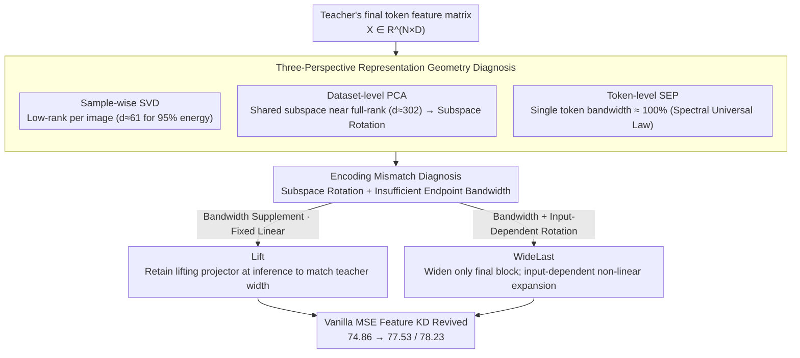

# From Per-Image Low-Rank to Encoding Mismatch: Rethinking Feature Distillation in Vision Transformers

**Conference**: ICML 2026  
**arXiv**: [2511.15572](https://arxiv.org/abs/2511.15572)  
**Code**: Yes (paper supplementary)  
**Area**: Model Compression / Knowledge Distillation / Vision Transformer  
**Keywords**: Feature Distillation, ViT Compression, Subspace Rotation, Spectral Energy Pattern, Latent Capacity Bottleneck

## TL;DR
The authors utilize a three-perspective diagnostic—sample-wise SVD, dataset-level PCA, and token-level Spectral Energy Pattern (SEP)—to reveal a seemingly paradoxical ViT representation geometry: "while per-image feature matrices are low-rank, the shared subspace across the dataset is nearly full-rank, and single-token spectral bandwidth approaches 100%." Based on this, they propose two minimalist patches, Lift (retaining a lifting projector at inference) and WideLast (widening only the final block to the teacher's width), which boost vanilla MSE feature distillation from 74.86% to 78.23% for DeiT-Tiny $\leftarrow$ CaiT-S24.

## Background & Motivation

**Background**: In Knowledge Distillation (KD), "matching intermediate features" is a classic paradigm from the CNN era (FitNet/AT/KR). "Same-size representation transfer" between ViTs (e.g., CLIP distillation) is also generally effective. However, when following the "wide teacher $\to$ narrow student" compression route, direct feature alignment becomes surprisingly fragile, often yielding negligible gains or even performance degradation—a phenomenon reported by prior works such as ViTKD, SpectralKD, and VkD.

**Limitations of Prior Work**: Existing solutions either switch to distillation tokens (DeiT route), use contrastive/attention/manifold losses, or insert complex translator modules. While effective, these approaches bypass the fundamental question of "why naive feature KD fails," leaving ViT distillation without a concise, interpretable narrative.

**Key Challenge**: The authors observe a puzzling paradox. **Sample-wise SVD shows that ViT features for each image are highly compressible**—for CaiT-S24, the last-layer token matrix ($196 \times 384$) requires only 61 singular directions to retain 95% energy for 99% of images. According to the Eckart-Young-Mirsky theorem, this implies that "a narrow student + a linear projector" should theoretically match the teacher. **However, practice proves otherwise.**

**Goal**: To understand why "theoretically feasible" translates to "practically infeasible" and provide a minimal-cost fix.

**Key Insight**: The authors suspect that the sample-wise perspective ignores a critical point: the low-dimensional subspaces of different images are **different**, and each token utilizes **very high bandwidth** within its own subspace. Two complementary diagnostics are introduced: dataset-level PCA (how wide the shared subspace must be) and token-level SEP (how many spectral channels a single token occupies).

**Core Idea**: The failure mechanism is **Encoding Mismatch**, involving two coupled aspects: "subspace rotation" (fixed projectors cannot adapt to input-dependent subspace directions) and "insufficient bandwidth capacity" (narrow students cannot accommodate high-spectral-occupancy token encodings). The solution is to provide students with "near-teacher endpoint capacity + input-dependent subspace adjustment capability."

## Method

### Overall Architecture
The paper follows a "diagnosis first, remedy second" logic: the first half (§2) uses three complementary spectral/geometric probes to characterize the true structure of the ViT final-layer token feature matrix $\mathbf{X} \in \mathbb{R}^{N \times D}$. The paradox of "per-image low-rank yet non-distillable" is decomposed into quantifiable encoding mismatch. The second half (§3) prescribes two minimalist patches based on these diagnostic conclusions: Lift, which retains a fixed linear projector during inference to boost student width to teacher width, and WideLast, which natively widens only the final Transformer block of the student.

### Key Designs

**1. Three-Perspective Representation Geometry Diagnosis: Decomposing "Redundancy" into Three Non-overlapping Layers**

If observing only single images, ViT features are indeed highly compressible, which is the source of the false intuition that "a narrow student + linear projector is sufficient." The authors observe the same $\mathbf{X}$ from three perspectives. **Sample-wise SVD** performs $\mathbf{X}_i = \mathbf{U}_i \boldsymbol{\Sigma}_i \mathbf{V}_i^\top$ for each image, counting the minimum rank $d_i^\text{SVD}$ needed for 95%/99% energy; for CaiT-S24, the 99th percentile is only 61/121 dimensions—confirming per-image low-rankness. **Dataset-level PCA** adopts a global view: decomposing the channel second moment $\mathbf{C} = \frac{1}{T}\sum_i \mathbf{X}_i^\top \mathbf{X}_i$ into a set of **shared** PCA bases $\mathbf{V}_d$ and measuring the energy retention $E_i(d) = \|\mathbf{X}_i \mathbf{V}_d\|_F^2 / \|\mathbf{X}_i\|_F^2$. To retain 95% energy for 99% of images, 302/384 dimensions are required, a nearly 5x gap compared to sample-wise SVD. This indicates that the low-dimensional subspaces rotate with the input. **Token-level SEP** further refines the granularity: performing a 1D DFT along the channel dimension for each token $\mathbf{x}_t \in \mathbb{R}^D$ to calculate cumulative spectral energy $\text{SEP}(d)$ and normalized bandwidth $b_\alpha$. Across 14 backbones (ViT, Swin, MAE, DINOv2, etc.), SEP curves almost align with the 45° diagonal, requiring ~90% of spectral channels for 90% energy. Together, these explain why fixed narrow interfaces inevitably fail.

**2. Lift: A Non-discarded Lifting Projector for "Endpoint Bandwidth"**

Since the SEP diagnosis identifies insufficient endpoint bandwidth, the most direct fix is to supplement capacity at the student's end without modifying the backbone. Given student output $\mathbf{X}_S \in \mathbb{R}^{N \times D_S}$ ($D_S < D_T$), a token-wise linear projector $\mathbf{P} \in \mathbb{R}^{D_S \times D_T}$ lifts it to $\widehat{\mathbf{X}}_S = \mathbf{X}_S \mathbf{P}$. The key difference from traditional KD is: **this projector is retained during inference**, allowing the classification head $\mathbf{W}_\text{head} \in \mathbb{R}^{D_T \times C}$ to act on the lifted representation. This enables vanilla MSE feature alignment to jump from +0.21% to +1.75%, validating the "insufficient bandwidth" diagnosis. However, Lift remains a fixed linear mapping and cannot handle the input-dependent subspace rotation revealed by PCA.

**3. WideLast: Widening the Final Block Natively**

WideLast addresses the gaps of Lift (linearity and input-independence) by replacing the student's final Transformer block with a version of teacher width $D_T$ (while intermediate blocks remain $D_S$). Consequently, the final block's attention and MLP operate in $D_T$ dimensions, outputting $\widetilde{\mathbf{X}}_S \in \mathbb{R}^{N \times D_T}$. Unlike Lift, the widened block is an **input-dependent non-linear mapping** capable of generating different effective subspace directions for different images, matching the subspace rotation observed via PCA. WideLast achieves 78.23%, exceeding Lift's 77.53% by 0.7%, which represents the additional gain from subspace adaptation.

### Loss & Training
The total objective is $\mathcal{L} = (1-\lambda_\text{logit}) \mathcal{L}_\text{CE}(\mathbf{y}, \mathbf{p}_S) + \lambda_\text{logit} \mathcal{L}_\text{KD}(\mathbf{p}_S, \mathbf{p}_T; \tau) + \lambda_\text{feat} \mathcal{L}_\text{feat}$, where $\mathcal{L}_\text{feat}$ can be simple MSE or SpectralKD. The training recipe follows DeiT defaults (AdamW, 5e-4 lr, cosine schedule, 5-epoch warmup, 300 epochs, batch size 2048).

## Key Experimental Results

### Main Results
ImageNet-1K, CaiT-S24 (384-dim) $\to$ DeiT-Tiny (192-dim) distillation:

| Configuration | Distillation Loss | Top-1 (%) | Gain |
|---------------|-------------------|-----------|------|
| DeiT-Tiny baseline | – | 74.86 | – |
| Baseline + SpectralKD (Naive) | – | 75.07 | +0.21 |
| **Lift** + MSE only | MSE | 76.61 | **+1.75** |
| **Lift** + SoftKD + SpecKD | SoftKD+SpecKD | 77.53 | +2.67 |
| **WideLast** + MSE only | MSE | 77.15 | +2.29 |
| **WideLast** + SoftKD + MSE | SoftKD+MSE | **78.23** | **+3.37** |

Naive feature KD is nearly ineffective (+0.21), but with Lift, **MSE alone** yields +1.75; with WideLast, it yields +2.29. This confirms that "endpoint capacity" is the bottleneck. The strongest combination, WideLast + SoftKD + MSE, reaches 78.23% (3.37 points above baseline).

### Ablation Study

| Configuration | Top-1 (%) | Description |
|---------------|-----------|-------------|
| Default baseline (192-dim) | 74.86 | No projector |
| Projector 256 | 75.46 | Slightly wider |
| Projector 320 | 75.53 | Close to teacher |
| **Projector 384 (= teacher)** | 75.41 | Retain at inference, no KD |
| Projector 448 (Exceed teacher) | 75.23 | Performance drops if too wide |
| Lift standalone (No KD) | 75.41 | +0.55 vs baseline |
| WideLast standalone (No KD) | 75.54 | +0.68 vs baseline |
| Teacher $\to$ DeiT-Small | – | WideLast + SpecKD 75.73 |
| Teacher $\to$ DeiT3-Small-21k | – | WideLast + SpecKD 76.50 |

### Key Findings
- **Exceeding teacher width leads to degradation** (448 vs 384): It is not "the wider the better"; rather, the goal is to **precisely align with the teacher's subspace**. Excessive dimensions introduce redundancy that hampers learning.
- **Architectural modification alone boosts performance (without teacher)**: Lift adds +0.55 and WideLast adds +0.68, confirming that encoding mismatch is an architectural bottleneck for models like DeiT-Tiny itself, where insufficient endpoint bandwidth limits representational power even in independent training.
- **Consistency across teacher architectures**: The Lift/WideLast improvements are stable across CaiT-S24, DeiT-Small, and DeiT3-Small-21k, suggesting encoding mismatch is a general property of the ViT family.
- **SEP Architectural Universality**: SEP curves for 14 backbones (spanning SL, SSL, and multi-modal training from Tiny to Huge scales) almost perfectly overlap on the diagonal. This "Spectral Universal Law" of ViTs suggests ~90% energy requires ~90% channels.

## Highlights & Insights
- **The three-perspective diagnostic framework is highly reusable**: It explicitly separates "redundancy" into three non-overlapping geometric concepts, preventing the confusion that "low-rank equals distillable."
- **SEP as a new diagnostic tool**: While prior literature relied on attention map visualization or CKA, 1D DFT along the channel dimension provides a concise "single-token capacity" probe applicable to other transformer compression tasks.
- **Endpoint bandwidth as an architectural bottleneck**: Traditional views see width as a trade-off between parameter efficiency and expressivity. Ours argues that for ViT architectures aggregating information into final tokens, endpoint bandwidth is an independent bottleneck, suggesting that keeping intermediate layers narrow while widening the final layer is a viable design strategy for compact ViTs.
- **Minimalist patch approach**: Compared to ScaleKD's complex translator modules, Lift/WideLast add minimal parameters but yield significant gains, proving that "understanding the problem > stacking modules."

## Limitations & Future Work
- Analysis is restricted to the **final layer** encoding mismatch. Whether intermediate layers exhibit similar phenomena and how to handle them (especially for multi-layer alignment) remains undiscussed.
- **Fixed vs. Input-Dependent Projectors**: While the contrast is clear, "adaptive lifting" (e.g., attention-routed projectors) was not explored.
- Experiments are restricted to ImageNet-1K classification. The behavior of encoding mismatch in dense prediction tasks like detection or segmentation is an open question.
- WideLast introduces non-negligible parameter overhead in the final block, representing a trade-off for edge deployment.

## Related Work & Insights
- **vs FitNet/AT/KR**: Classic CNN feature KD assumes similar dimensions; Ours targets the "wide-to-narrow" interface problem in ViTs.
- **vs ScaleKD**: ScaleKD uses complex alignment modules for heterogeneous teachers; Ours provides a lighter version, though ScaleKD handles more extreme heterogeneity.
- **vs VkD**: VkD uses orthogonal projectors to stabilize distillation. Ours provides a deeper explanation from the perspective of representation geometry.
- **vs SpectralKD**: Both utilize spectral views. While SpectralKD focuses on layer selection and alignment losses, SEP reveals single-token occupancy. Combining them (WideLast + SpecKD) yields superior results.
- **vs Yu & Wu (Low-rank features vs full-rank weights)**: Both observe low-rank ViT features, but while Yu & Wu focus on few-shot compression, Ours explores why this low-rankness makes distillation difficult.

## Rating
- Novelty: ⭐⭐⭐⭐⭐ The three-perspective framework, encoding mismatch concept, and SEP tool are all novel.
- Experimental Thoroughness: ⭐⭐⭐⭐ Solid on ImageNet with 14 backbones for SEP; however, downstream tasks and smaller students are less explored.
- Writing Quality: ⭐⭐⭐⭐⭐ Logical flow from paradox to diagnosis to remedy is excellent.
- Value: ⭐⭐⭐⭐ Provides a clear explanation for a long-standing issue in the community and offers architectural insights for compact ViT design.

<!-- RELATED:START -->

## Related Papers

- [\[AAAI 2026\] Distillation Dynamics: Towards Understanding Feature-Based Distillation in Vision Transformers](../../AAAI2026/model_compression/distillation_dynamics_towards_understanding_feature-based_di.md)
- [\[ICML 2026\] ScaLoRA: Optimally Scaled Low-Rank Adaptation for Efficient High-Rank Fine-Tuning](scalora_optimally_scaled_low-rank_adaptation_for_efficient_high-rank_fine-tuning.md)
- [\[ICML 2026\] Energy-Structured Low-Rank Adaptation for Continual Learning](energy-structured_low-rank_adaptation_for_continual_learning.md)
- [\[ICML 2026\] Selective Coupling of Decoupled Informative Regions: Masked Attention Alignment for Data-Free Quantization of Vision Transformers](selective_coupling_of_decoupled_informative_regions_masked_attention_alignment_f.md)
- [\[ICLR 2026\] Taming Momentum: Rethinking Optimizer States Through Low-Rank Approximation](../../ICLR2026/model_compression/taming_momentum_rethinking_optimizer_states_through_low-rank_approximation.md)

<!-- RELATED:END -->
