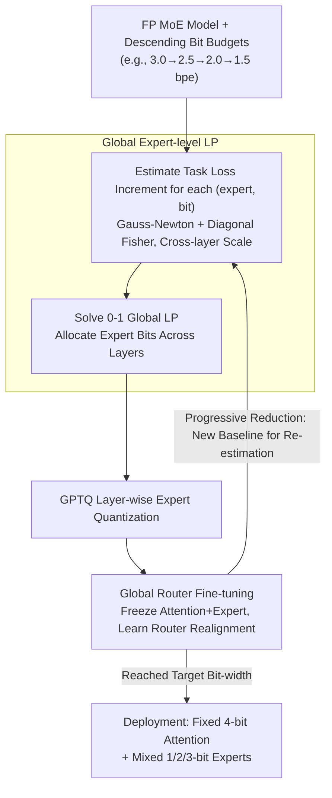

# GEMQ: Global Expert-Level Mixed-Precision Quantization for MoE LLMs

**Conference**: ICML 2026  
**arXiv**: [2605.23078](https://arxiv.org/abs/2605.23078)  
**Code**: https://github.com/jndeng/GEMQ  
**Area**: Model Compression / MoE Quantization / LLM Inference  
**Keywords**: MoE-LLM, Mixed-Precision Quantization, Global Linear Programming, Router Fine-tuning, Progressive Quantization

## TL;DR
GEMQ upgrades expert-level bit allocation for MoE models from intra-layer local Linear Programming (LP) to cross-layer global LP. Combined with "post-quantization router weight fine-tuning" to realign distorted routing distributions and a "progressive bit reduction" iterative framework to refine importance estimation, GEMQ compresses models like Mixtral-8×7B to an average of 2.5 bits per expert with less than a 7% drop in average zero-shot performance across 7 benchmarks. It significantly outperforms PMQ, SpQR, MoEQuant, and EAQuant under the same bit budget.

## Background & Motivation
**Background**: MoE-LLMs (e.g., Mixtral, DeepSeekV2, Qwen-MoE) reduce computational costs through sparse activation, but the total parameter count remains high. All experts must reside in VRAM—Mixtral-8×7B requires 87 GB at full precision, exceeding the capacity of a single H100-80GB. Since expert parameters typically account for over 90% of the total, expert weight quantization is the primary focus for MoE compression.

**Limitations of Prior Work**: (1) Existing expert-level mixed-precision methods (e.g., PMQ) perform LP **within each layer**, forcing identical bit budgets per layer and ignoring importance variations across layers; Fig 1(a) shows the sum of squared gradients (Fisher trace) of experts across layers in Mixtral can differ by a factor of 7. (2) Quantization distorts router input and expert output distributions, leading to **routing drift**—over 40% of tokens are routed to different experts after 1.5-bit quantization, but prior methods either ignore this or force alignment back to FP distributions, which is sub-optimal. (3) Task loss estimation relies on Taylor expansion, which requires small quantization perturbations $\Delta w$; at extremely low bits (1-2 bits), $\Delta w$ is large, making estimation inaccurate.

**Key Challenge**: To perform "global" bit allocation, a shared loss baseline across all experts is needed. However, Taylor estimation requires small perturbations and the assumption of a local minimum, both of which are violated at low bit-widths.

**Goal**: (a) Upgrade local LP to global LP to allow bits to flow freely across layers; (b) explicitly model and repair router drift caused by quantization; (c) provide an importance estimation scheme that approximates true loss at low bit-widths.

**Key Insight**: The authors use Gauss-Newton with a diagonal Fisher matrix to pull the task loss increment $\Delta\tilde L_{ij}\approx \mathbb{E}_\mathcal{D}[\Delta z_{ij}^\top \mathrm{diag}(g^{(z)}g^{(z)\top})\Delta z_{ij}]$ caused by quantizing each expert $i$ to $j$ bits into a "unified task loss" scale, naturally supporting cross-layer comparisons. Furthermore, 1D loss landscape analysis in Fig 3 shows that by adapting the router to the current weights, an intermediate quantized model with a similar bit budget can approximate the true loss near the target low-bit point.

**Core Idea**: A closed-loop system consisting of global LP for expert bit allocation, post-quantization router fine-tuning to repair routing, and progressive bit reduction to re-estimate importance using the previous quantized model as a "neighbor."

## Method

### Overall Architecture
GEMQ treats the assignment of bits to each expert as a global optimization problem across the entire model, refined through a progressive bit-reduction pipeline. Given a sequence of target bit budgets (bits per expert, e.g., $[3.0, 2.5, 2.0, 1.5]$), it starts at the highest budget using the FP model to estimate task loss increments for each (expert, candidate bit) pair. It then solves a 0-1 global LP to determine bit allocation, quantizes experts using GPTQ, and fine-tunes only the router weights while freezing attention and experts to realign the distorted routing distributions. For the next budget, it uses the fine-tuned quantized model from the previous step as the estimation baseline instead of the FP model, repeating the process until the target bit-width is reached. For deployment, attention is fixed at 4 bits, and experts are mixed with 1/2/3 bits as determined by the LP; a 2.5-bit Mixtral achieves 82.5 tokens/s on a single H100.

### Key Designs

**1. Global Expert-level LP: Enabling Cross-layer Bit Flow**

The fundamental issue with methods like PMQ is that they are "comparable within layers but not across layers." They solve LP per layer using local reconstruction error $\|Wx-\hat Wx\|^2$, which lacks a unified scale. GEMQ uses task loss to pull all experts into the same coordinate system. By applying Gauss-Newton, the second-order Taylor term is moved from the weight side $\Delta L\approx \frac{1}{2}\Delta w^\top H(w)\Delta w$ to the MoE block output $\Delta L\approx \frac{1}{2} \Delta z^\top H(z)\Delta z$. Using a diagonal Fisher matrix $H(z)\approx \mathrm{diag}(g^{(z)}g^{(z)\top})$, the expensive Hessian is compressed into a diagnonal matrix, resulting in a scalar cost $\Delta\tilde L_{ij}$ for each (expert $i$, bit $j$) pair. Since $z$ is the aggregated output multiplied by routing scores, the cost is naturally weighted by routing probabilities. This yields a 0-1 linear programming problem:

$$\min\sum_{i,j}\Delta\tilde L_{ij}x_{ij}\quad\text{s.t.}\quad \sum_{i,j}j\cdot x_{ij}\le B,\ \ \sum_j x_{ij}=1,\ \ \text{At least one high-bit expert per layer}$$

The final constraint is a mild regularization to prevent any layer from becoming purely low-bit, which could lead to unstable importance estimation. The formulation is hyperparameter-free and generalizes to new MoE architectures without retuning.

**2. Global Router Fine-tuning: Adapting to Quantized Experts**

After 1.5-bit quantization, over 40% of tokens are routed to different experts than in the FP model. GEMQ addresses this by dequantizing weights to FP for simulation, freezing attention and experts, and fine-tuning only the router parameters (approx. 0.04% of the model). It performs one epoch of fine-tuning on the calibration set using cross-entropy task loss (AdamW, lr=$1\mathrm{e}{-4}$, batch=1). Unlike prior works that force the quantized router to match the FP output, GEMQ allows the router to actively discover new routing paths that better suit the quantized experts. This realigns the router to a new local minimum, smoothing the loss landscape and ensuring the validity of Taylor-based importance estimation.

**3. Progressive Bit Reduction: Controlling Perturbation Scale**

Taylor estimation remains valid only when the perturbation $\Delta w$ is small. If the budget jumps directly from 2.5 to 1.5 bpe, $\Delta w$ becomes so large that importance estimation using the FP model becomes distorted (Fig 3(b)). GEMQ descends through budgets $B_1 > B_2 > \dots > B_K$. At each stage, the fine-tuned model from the previous stage $Q_{B_{k-1}}^\star$ serves as the anchor for LP coefficient estimation. By reducing the distance between the anchor and the target, the Taylor local assumption holds, while the previous router fine-tuning ensures the anchor model is near a local minimum.

### Loss & Training
LP Phase: Cross-entropy task loss is used as the objective via expectation over the calibration set; GPTQ uses its original reconstruction loss $\|Wx-\hat Wx\|^2$. Router Fine-tuning: Cross-entropy, lr=$1\mathrm{e}{-4}$, batch=1, weight decay=$1\mathrm{e}{-4}$, AdamW, 1 epoch. Calibration: 128 segments of 2048 tokens from the WikiText2 training set. Attention is fixed at 4-bit, expert candidate bits are $\{1, 2, 3\}$, using group-wise asymmetric GPTQ (group size 128).

## Key Experimental Results

### Main Results
GEMQ vs. mainstream MoE quantization methods on Mixtral-8×7B (average of 7 zero-shot tasks from EleutherAI LM Harness):

| Method | bpe | WT2 PPL $\downarrow$ | C4 PPL $\downarrow$ | 7-Task Avg $\uparrow$ |
|------|-----|----------|---------|-----------|
| FP Baseline | 16.0 | 3.84 | 7.40 | 70.97 |
| Uniform | 2.5 | 6.10 | 10.35 | 65.49 |
| PMQ | 2.5 | 5.10 | 9.21 | 64.34 |
| **GEMQ** | 2.5 | **5.03** | **9.02** | **65.13** |
| PMQ | 1.5 | 8.47 | 20.77 | 51.78 |
| **GEMQ** | 1.5 | **7.93** | **16.20** | **52.00** |
| SpQR | 1.5 | Inf | Inf | 31.87 |

Across four models (DeepSeekV2-Lite, Qwen1.5-MoE-A2.7B, Qwen3-30B-A3B, Mixtral-8×7B), GEMQ dominates across all bit budgets. The gain is particularly significant at **extreme 1.5-bit quantization** (e.g., Qwen3-30B-A3B at 1.5 bit: PMQ 34.59 C4 PPL vs. GEMQ 20.46). A 2.5-bit Mixtral is reduced from 87 GB to 16 GB (−82%), achieving 82.5 tokens/s on a single H100.

### Ablation Study
Component breakdown based on Mixtral-8×7B (C4 PPL) and LP formula comparison at 2.5 bpe:

| Configuration | 2.5-bit C4 PPL | 1.5-bit C4 PPL | Description |
|------|----------------|----------------|------|
| Uniform Baseline | 10.35 | 25.39 | Same bit per expert |
| + Local LP (PMQ) | 9.21 | 20.77 | Intra-layer allocation |
| + Global LP ($\Delta z^\top H(z)\Delta z$) | 9.10 | 17.80 | Cross-layer allocation |
| + Router Fine-tuning | 9.05 | 16.60 | Align router with quantized experts |
| **+ Progressive (Full GEMQ)** | **9.02** | **16.20** | Closed-loop re-estimation |

Using the $\Delta z^\top H(z)\Delta z$ formula for global LP reduces C4 PPL from ~50 (naive) to ~17 at 1.5 bpe, proving that moving the error to the MoE block output with a diagonal Fisher approximation is the core recipe for effective global LP.

### Key Findings
- **Inter-layer bit variation is the primary driver**: Fig 4(a) shows GEMQ allocates significantly different total bits across Mixtral layers (some high-bit, some 1-bit), whereas PMQ forces a uniform average. This explains GEMQ's superior performance at low bit-widths.
- **Router fine-tuning is extremely efficient**: With $<$ 0.04% parameters and taking only ~1 minute (3.5% of total quantization time), it yields 1–3 PPL improvements at 1.5 bpe.
- **Progressive reduction is vital for extreme low-bits**: While negligible at 3.0 bpe, estimating 1.5-bit coefficients from a 2.5-bit baseline is significantly more accurate than using the FP model.
- Global LP is hyperparameter-free, unlike PMQ which requires manual tuning of activation-frequency and weight-statistic fusion coefficients.

## Highlights & Insights
- Moving the error metric for bit allocation from weight reconstruction to task loss increments while avoiding explicit Hessian storage creates an **elegant balance between theory and computability**.
- Treating the router as a "0.04% PEFT parameter" for independent fine-tuning is a versatile strategy applicable to any "policy + execution" structure (e.g., early-exit or conditional computation).
- Progressive quantization turns PTQ into a multi-stage process akin to self-distillation, maintaining the validity of Taylor approximations by using intermediate "near-ground-truth" anchors.

## Limitations & Future Work
- Calibration data coverage for router fine-tuning may be insufficient for long-context or tool-use scenarios.
- Attention remains fixed at 4 bits; future work could include attention in the global LP.
- The progressive bit sequence (e.g., 2.5 → 1.5) is manually defined; an automated strategy for deciding step sizes is needed.
- "At least one high-bit expert per layer" is a hard constraint that might limit optimal sparsity at extremely low bpe; soft constraints or Lagrangian relaxation could be explored.

## Related Work & Insights
- **vs. PMQ**: GEMQ extends LP to a global scope using task loss and removes manual fusion coefficients, making it a strict superset of PMQ.
- **vs. MoEQuant / EAQuant**: These focus on internal expert quantization (outlier suppression); GEMQ focuses on inter-expert allocation and router alignment, making them complementary.
- **vs. Router Alignment (Chen et al. 2025b)**: While others force alignment to the FP distribution, GEMQ allows the router to "re-learn" paths for quantized experts.

## Rating
- Novelty: ⭐⭐⭐⭐ Global LP + Router fine-tuning + Progressive reduction are well-integrated into a self-consistent framework.
- Experimental Thoroughness: ⭐⭐⭐⭐⭐ Comprehensive evaluation across 4 models, 4 bit-widths, 7 tasks, and multiple baselines.
- Writing Quality: ⭐⭐⭐⭐ Clear motivation and methodology; Fig 3 provides an intuitive explanation of Taylor failure.
- Value: ⭐⭐⭐⭐⭐ Direct engineering benefit for MoE deployment (82.5 tok/s on single H100) with minimal performance loss.

<!-- RELATED:START -->

## Related Papers

- [\[ICML 2026\] Geo-Expert: Fine-Tuning an 8B Model into an Expert-Level Geological Reasoning LLM via LoRA](geo-expert_towards_expert-level_geological_reasoning_via_parameter-efficient_fin.md)
- [\[ICLR 2026\] Steering MoE LLMs via Expert (De)Activation](../../ICLR2026/model_compression/steering_moe_llms_via_expert_deactivation.md)
- [\[ICLR 2026\] STaMP: Sequence Transformation and Mixed Precision for Low-Precision Activation Quantization](../../ICLR2026/model_compression/stamp_sequence_transformation_and_mixed_precision_for_low-precision_activation_q.md)
- [\[ICLR 2026\] Channel-Aware Mixed-Precision Quantization for Efficient Long-Context Inference](../../ICLR2026/model_compression/channel-aware_mixed-precision_quantization_for_efficient_long-context_inference.md)
- [\[ICML 2026\] Breaking the MoE LLM Trilemma: Dynamic Expert Clustering with Structured Compression](breaking_the_moe_llm_trilemma_dynamic_expert_clustering_with_structured_compress.md)

<!-- RELATED:END -->
## Related Papers

- [\[ICLR 2026\] Steering MoE LLMs via Expert (De)Activation](../../ICLR2026/model_compression/steering_moe_llms_via_expert_deactivation.md)
- [\[ICML 2026\] Breaking the MoE LLM Trilemma: Dynamic Expert Clustering with Structured Compression](breaking_the_moe_llm_trilemma_dynamic_expert_clustering_with_structured_compress.md)
- [\[AAAI 2026\] DynaQuant: Dynamic Mixed-Precision Quantization for Learned Image Compression](../../AAAI2026/model_compression/dynaquant_dynamic_mixed-precision_quantization_for_learned_i.md)
- [\[CVPR 2026\] Gradient Knows Best: Mixed-Precision Quantization via Gradient-Guided Bit Allocation for Super-Resolution](../../CVPR2026/model_compression/gradient_knows_best_mixed-precision_quantization_via_gradient-guided_bit_allocat.md)
- [\[AAAI 2026\] KVmix: Gradient-Based Layer Importance-Aware Mixed-Precision Quantization for KV Cache](../../AAAI2026/model_compression/kvmix_gradient-based_layer_importance-aware_mixed-precision_.md)

<!-- RELATED:END -->
