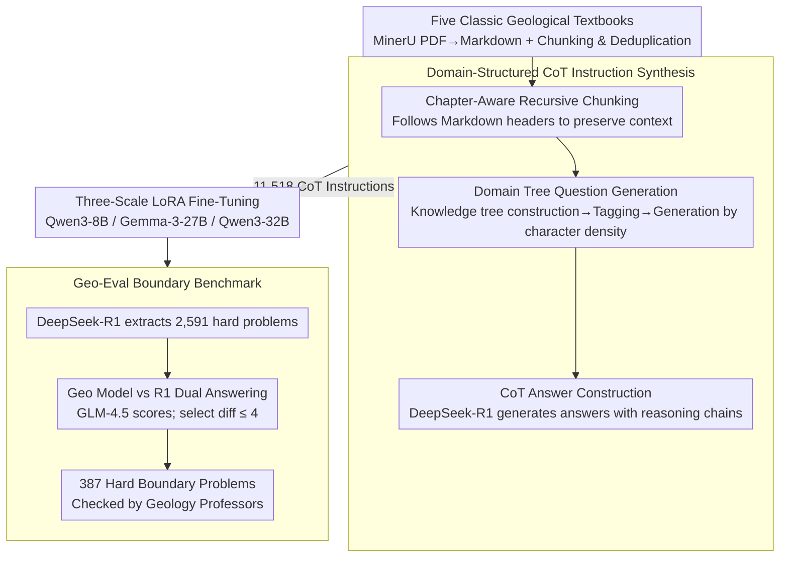

# Geo-Expert: Fine-Tuning an 8B Model into an Expert-Level Geological Reasoning LLM via LoRA

**Conference**: ICML 2026  
**arXiv**: [2605.24844](https://arxiv.org/abs/2605.24844)  
**Code**: Not provided in the paper  
**Area**: Domain Adaptation / Scientific LLM / Geological Reasoning  
**Keywords**: Geological LLM, LoRA, Instruction Synthesis, CoT, AI for Science

## TL;DR
Geo-Expert utilizes 11,518 CoT-enhanced instruction data points distilled from five classic geology textbooks to fine-tune Qwen3-8B/32B and Gemma-3-27B models via LoRA. On Geo-Eval (comprising 387 hard boundary problems), Qwen3-8B-geo achieves an average score of 6.27, surpassing Llama-3.1-70B-Instruct (4.12) and GPT-4o (5.93), while Qwen3-32B-geo reaches 6.82, approaching GPT-5.4 (7.15). This demonstrates that high-quality domain alignment is more critical than scaling.

## Background & Motivation

**Background**: Current Earth Science large models (K2, GeoGalactica, GeoGPT, UnivEARTH) excel at surface tasks but lack deep reasoning capabilities for solid Earth (e.g., subsurface stratigraphic interpretation, tectonic evolution, petrogenesis). Geological reasoning necessitates understanding complex spatio-temporal relationships and vast amounts of specialized data.

**Limitations of Prior Work**: General LLMs frequently exhibit severe hallucinations in geology—for instance, misidentifying a "wedge" in geological structures as a mechanical engineering wedge and suggesting carbon fiber reinforcement for concrete. Existing geoscience foundation models are primarily pre-trained on surface literature, with minimal specialized adaptation for subsurface stratigraphic reasoning.

**Key Challenge**: General LLMs lack domain alignment in geology. Scaling alone cannot resolve this issue, as geological terminology is highly polysemous, reasoning chains are long, and cross-disciplinary interference is significant. Deep domain anchoring, rather than simply increasing parameters, is required.

**Goal**: Establish a reproducible pipeline to transform general LLMs into "expert-level geological reasoners" using PEFT to manage costs, proving that small, aligned models can outperform large generalist models.

**Key Insight**: Extract ground truth from five authoritative textbooks (Catuneanu, Fossen, Gao, Rowland); systematically generate CoT-enhanced instruction data using LLMs; perform LoRA fine-tuning across three backbones to observe scaling effects; and construct the Geo-Eval benchmark for hard boundary problems via adversarial mining and expert verification.

**Core Idea**: A triad consisting of high-quality domain-aligned data, PEFT, and a challenging benchmark. CoT-enhanced data enables the model to learn reasoning chains rather than just term matching; LoRA allows for fine-tuning up to 32B models on an RTX 5090; and Geo-Eval targets true expert reasoning through boundary mining.

## Method

### Overall Architecture

Geo-Expert aims to convert a standard general LLM into an expert capable of deep geological reasoning (subsurface sequence interpretation, tectonic evolution, petrogenesis). It employs an end-to-end data-driven pipeline: first, five classic geological textbooks are digitized and cleaned into clean text (using MinerU for PDF-to-Markdown and Python for paragraph chunking and deduplication). Subsequently, 11,518 CoT-enhanced instruction data points are systematically synthesized from these texts. LoRA is then used to fine-tune three backbones (8B, 27B, and 32B). Finally, a specialized Geo-Eval benchmark, designed to identify "hard problems," is used for validation. This triad—high-quality data, PEFT, and a difficult benchmark—supports the core argument that "small models + aligned data outperform large models + general data."

### Key Designs

**1. Domain-Structured CoT Instruction Synthesis: Teaching "How to Reason" Instead of Just "What to Say"**

Standard fine-tuning on raw text often results in models that merely repeat terminology but fail on geological problems requiring multi-step reasoning. The key to this pipeline is transforming textbook text into instruction-response pairs with reasoning chains. It involves three steps: first, Chapter-Aware Recursive Chunking follows the Markdown header structure to ensure each semantic block maintains context integrity. Second, Domain-Structured Question Generation requires an LLM to build a hierarchical domain tree for the entire corpus, binding each text segment to domain tags and dynamically generating questions based on tags and character density to ensure coverage and avoid redundancy. Finally, CoT Answer Construction uses the reasoning-oriented DeepSeek-R1 to generate answers, mandating the inclusion of intermediate reasoning steps. The resulting 11,518 data points are complete reasoning chains rather than simple fill-in-the-blank pairs. In experiments, the Engineering dimension saw the largest gain (+46%), precisely because the model learned reasoning rather than just terms.

**2. Three-Scale LoRA Fine-Tuning: Establishing a Valid Scaling Comparison**

To determine how domain adaptation varies with model size, this study performs LoRA fine-tuning on three separate backbones: 8B, 27B, and 32B. For Qwen3-8B, parameters were set to rank=32, $\alpha=32$, lr=2e-5, and FP16, allowing for training on a single RTX 5090. For Gemma-3-27B and Qwen3-32B, LoRA was scaled to rank=64, $\alpha=128$, using BF16, gradient checkpointing, and grad accum=4 on 4×RTX 5090, with adapters attached to all linear layers. Testing across three scales allows for a comparable "small model + good data" vs. "large model + general data" framework, leading to the conclusion that 8B is a "sweet spot" with diminishing marginal returns for larger parameters. This recipe remains accessible for research groups with prosumer-grade GPUs.

**3. Geo-Eval: Using Adversarial Mining + Expert Verification for a True Reasoning Benchmark**

Traditional static MCQs are often saturated by modern LLMs and fail to differentiate reasoning ability. Geo-Eval actively mines "boundary problems" where general models struggle: DeepSeek-R1 extracts 2,591 complex questions and answers from textbooks; Qwen3-8B-Geo and DeepSeek-R1 answer them independently; GLM-4.5 acts as the LLM-as-judge to score both on a 10-point scale; the 387 "hard boundary" problems with a score difference $\leq 4$ are selected and verified by geology professors. Questions are categorized into Concept, Process, and Engineering dimensions. This boundary mining methodology provides a sharper capacidad threshold than manual question design, advancing the evaluation methodology for vertical scientific LLMs.

## Key Experimental Results

### Main Results: Geo-Eval Scores Across Three Dimensions

| Model | Size | Concept | Process | Engineering | Average | Gain vs Base |
|-------|-----|---------|---------|-------------|---------|-----------|
| GPT-5.4 | - | 7.35 | 7.10 | 7.00 | 7.15 | - |
| DeepSeek-V3.2 | - | 6.80 | 6.75 | 6.67 | 6.74 | - |
| GPT-4o | - | 6.10 | 5.90 | 5.80 | 5.93 | - |
| Gemma-3-27B-IT | 27B | 5.30 | 5.10 | 5.08 | 5.16 | - |
| Qwen3-32B | 32B | 5.20 | 4.90 | 4.90 | 5.00 | - |
| Qwen3-8B | 8B | 4.80 | 4.68 | 4.41 | 4.63 | - |
| Llama-3.1-70B | 70B | 4.30 | 4.10 | 3.96 | 4.12 | - |
| **Qwen3-32B-geo** | 32B | 6.78 | 6.79 | **6.90** | **6.82** | +1.82 |
| **Gemma-3-27B-geo** | 27B | 6.70 | 6.60 | 6.47 | 6.59 | +1.43 |
| **Qwen3-8B-geo** | **8B** | 6.10 | 6.27 | 6.44 | **6.27** | **+1.64** |

Qwen3-32B-geo ranks second overall with 6.82, following only GPT-5.4 (7.15). Qwen3-8B-geo (6.27) outperforms GPT-4o and all open-source models under 70B, which is statistically significant ($p = 3.7 \times 10^{-106}$).

### Key Findings

- **8B + domain alignment outperforms a 70B generalist**: Qwen3-8B-geo (6.27) vs. Llama-3.1-70B (4.12) represents a +51% improvement, suggesting that the scaling law is less effective in vertical domains.
- **Minimal gains from 8B to 32B**: Increasing from 8B-geo (6.27) to 32B-geo (6.82) yields only a +0.55 gain, indicating marginal utility for extra parameters in geological reasoning.
- **Largest improvement in the Engineering dimension**: Qwen3-8B rose from 4.41 to 6.44 (+46%), demonstrating that the model learned reasoning rather than just terminology.
- **Consistency across architectures**: All three backbones showed gains of 1.5+ points, proving the robustness of the method.
- **Dramatic qualitative differences**: While GPT-4o incorrectly suggested concrete reinforcement for "wedge thickening" (0/10), Qwen3-8B-geo accurately explained geological mechanisms such as thrust fault sliding (9/10).

## Highlights & Insights

- **CoT enhancement is a vital trick for domain adaptation**: Based on the +46% Engineering gain, CoT data's value significantly exceeds that of raw text.
- **Methodological value of 3-backbone scaling analysis**: This work identifies 8B as the sweet spot, providing direct guidance for resource-constrained research groups.
- **Hard Boundary Benchmark as a paradigm for discriminative evaluation**: Automatically mining problems that generalists fail targets expert reasoning directly, a method applicable to all vertical scientific LLM evaluations.
- **Consumer GPU recipe**: Support for fine-tuning a 32B model on 4×RTX 5090 makes replication feasible for academic groups.
- **Textbooks as anchors**: Using five classic, authoritative textbooks ensures data quality and domain rigor.
- **Three-layer selection bias mitigation**: Expert re-writing, GPT-4o judging, and multi-model verification.

## Limitations & Future Work

- **Textbook selection bias**: The textbooks lean toward structural geology, stratigraphy, and tectonics; coverage of mineralogy, geochemistry, and geophysics is insufficient.
- **Small scale of Geo-Eval (387 problems)**: Compared to general benchmarks with tens of thousands of problems, the statistical power is lower.
- **Text-only limitation**: The framework does not currently handle the inherent multimodality of geological data (e.g., cross-sections, well logs, field photos).
- **GPT-4o judge bias**: Reference-guided scoring may still reflect the verbosity or style bias of the LLM judge.
- **Lack of retrieval-augmented baseline**: It remains untested whether RAG + a general LLM could achieve similar results, which might lead to an overestimation of PEFT's benefits.
- **Engineering constraints for 32B**: While titled as consumer-grade, the requirement of BF16 + gradient checkpointing + grad accum=4 on 4×RTX 5090 remains more "prosumer" than "consumer."

## Related Work & Insights

- **vs. K2 / GeoGalactica**: These models utilize continued pre-training on broad geoscience corpora, prioritizing factual recall, whereas Ours uses PEFT + CoT instruction tuning focusing on multi-step reasoning.
- **vs. GeoGPT / UnivEARTH**: These function as geospatial agents for 2D surface tasks, whereas Ours targets subsurface deep reasoning.
- **vs. MedLLM / FinGPT / LawGPT**: These are domain LLMs, but many use raw text fine-tuning; the use of CoT-enhanced data is a primary methodological difference in Ours.
- **vs. LIMA / Alpaca**: These focus on general instruction tuning, while Ours applies vertical instruction tuning with a boundary benchmark.
- **vs. ProcessBench / PRM**: While reasoning evaluation via step-level monitoring is similar, Ours introduces innovation through adversarial mining and boundary problems.
- **Insights**: (1) Vertical scientific LLMs should be evaluated using CoT-enhanced data and boundary benchmarks; (2) The "small + aligned > large + general" thesis should be revisited across all vertical domains; (3) Textbooks are a cost-effective ground truth alternative to paper repositories and RAG.

## Rating

- Novelty: ⭐⭐⭐⭐ The combination of domain-structured CoT instruction synthesis, boundary mining benchmarks, and 3-backbone scaling analysis represents solid methodological innovation.
- Experimental Thoroughness: ⭐⭐⭐⭐ 3 backbones × 3 Geo-Eval dimensions + 11 baselines + paired t-test + qualitative case studies provide complete evidence.
- Writing Quality: ⭐⭐⭐⭐ Clear flowcharts, detailed data tables, and persuasive qualitative cases. The selection bias mitigation reflects a reviewer-conscious approach.
- Value: ⭐⭐⭐⭐⭐ The demonstration that "8B + aligned > 70B" provides direct guidance for vertical AI deployment. The benchmarking methodology is generalizable across STEM domains, offering practical value for democratizing scientific LLMs.

<!-- RELATED:START -->

## Related Papers

- [\[ICML 2026\] GEMQ: Global Expert-Level Mixed-Precision Quantization for MoE LLMs](gemq_global_expert-level_mixed-precision_quantization_for_moe_llms.md)
- [\[ICML 2026\] Breaking the MoE LLM Trilemma: Dynamic Expert Clustering with Structured Compression](breaking_the_moe_llm_trilemma_dynamic_expert_clustering_with_structured_compress.md)
- [\[ICML 2026\] FRISM: Fine-Grained Reasoning Injection via Subspace-Level Model Merging for Vision–Language Models](frism_fine-grained_reasoning_injection_via_subspace-level_model_merging_for_visi.md)
- [\[CVPR 2025\] Expert Pyramid Tuning: Efficient Parameter Fine-Tuning for Expertise-Driven Task Allocation](../../CVPR2025/model_compression/expert_pyramid_tuning_efficient_parameter_fine-tuning_for_expertise-driven_task_.md)
- [\[ICLR 2026\] Expert Merging: Model Merging with Unsupervised Expert Alignment and Importance-Guided Layer Chunking](../../ICLR2026/model_compression/expert_merging_model_merging_with_unsupervised_expert_alignment_and_importance-g.md)

<!-- RELATED:END -->
